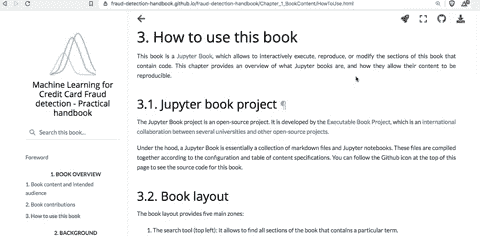
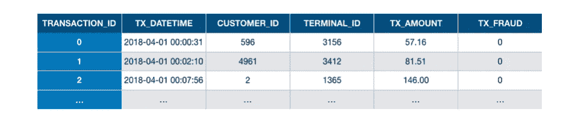
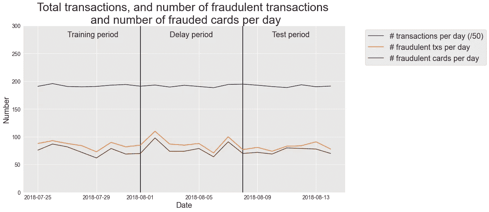
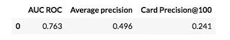
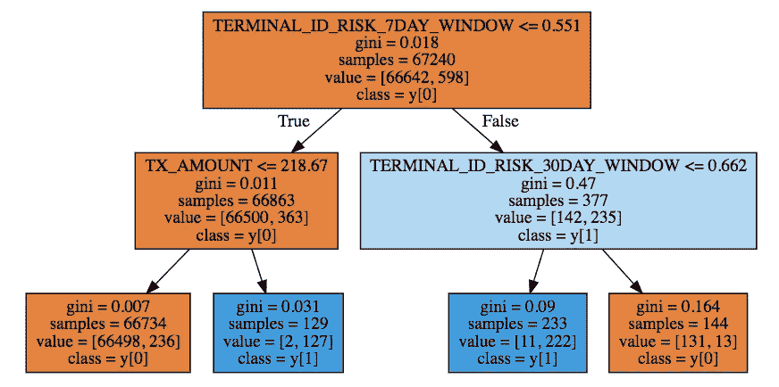

# 用于信用卡欺诈检测的机器学习

> 原文：<https://towardsdatascience.com/machine-learning-for-credit-card-fraud-detection-a-jupyter-book-for-reproducible-research-8ca5edad7b5d?source=collection_archive---------12----------------------->

## [实践教程](https://towardsdatascience.com/tagged/hands-on-tutorials)

## 朱庇特可复制研究书籍。

在 [Unsplash](https://unsplash.com/s/photos/credit-card?utm_source=unsplash&utm_medium=referral&utm_content=creditCopyText) 上 [CardMapr.nl](https://unsplash.com/@cardmapr?utm_source=unsplash&utm_medium=referral&utm_content=creditCopyText) 拍摄的照片。

不幸的是，用于信用卡欺诈检测的 ML 是大多数已发表的研究不可复制的领域之一。出于保密原因，真实世界的交易数据不能共享，但我们也认为作者没有做出足够的努力来提供他们的代码并使他们的结果可重复。

我们刚刚发布了关于该主题的一本书的前五章，旨在朝着提高该领域研究的可重复性迈出第一步:[https://fraud-detection-handbook . github . io/fraud-detection-handbook](https://fraud-detection-handbook.github.io/fraud-detection-handbook)。这本书是比利时布鲁塞尔大学[机器学习小组](http://mlg.ulb.ac.be/)和 [Worldline](https://worldline.com/) 十年合作的成果。即将到来的章节将解决更高级的主题，如类不平衡，特征工程，深度学习和可解释性。

这个初步版本是 Jupyter 图书格式，在开源许可下，所有的实验和结果都是可复制的。包含代码的部分是 Jupyter 笔记本，可以在本地执行，也可以使用 Google Colab 或 Binder 在云上执行。这本书的源代码(包括文本、图片和代码)可以在 GitHub 上找到:

<https://github.com/Fraud-Detection-Handbook/fraud-detection-handbook>  

目标受众是学生或专业人士，从实用的角度对信用卡欺诈检测的具体问题感兴趣。更一般地说，我们认为这本书对于处理涉及顺序数据和/或不平衡分类问题的机器学习问题的数据从业者和数据科学家来说也是有兴趣的。

在这篇博客文章中，我们希望总结当前发布的内容以及对数据科学社区的附加值。前五章的主要贡献如下:

*   **合成交易数据模拟器**:这本书提出了一个交易数据模拟器，允许创建不同复杂性的合成交易数据集。特别是，模拟器允许改变类别不平衡的程度(欺诈交易的低比例)，包含数字和分类变量(分类特征具有非常多的可能值)，并以时间相关的欺诈场景为特征。
*   **再现性**:这本书是一本 [Jupyter 书](https://jupyterbook.org/intro.html)，它允许交互式地执行或修改这本书包含代码的章节。与合成数据发生器一起，在这本书里提出的所有实验和结果是可重复的。
*   **最新综述**:这本书综合了最近关于信用卡欺诈检测的机器学习主题的调查(CCFD 的 ML)。它强调了这些调查中提出的核心原则，并总结了欺诈检测系统面临的主要挑战。
*   **评估方法**:本书的主要贡献在于详细介绍和讨论了可用于评估欺诈检测系统效率的性能指标和验证方法。

我们在下面强调了这本书是如何允许容易地复制实验，并设计新的实验。

# Jupyter 图书格式

实验的可重复性是这本书的关键驱动力，选择 [Jupyter Book](https://fraud-detection-handbook.github.io/fraud-detection-handbook/Chapter_1_BookContent/HowToUse.html) 格式似乎比传统的印刷书籍格式更合适。

首先，这本书包含代码的所有章节都是 Jupyter 笔记本，由于外部链接中的穿梭图标，可以使用 Binder 或 Google Colab 在云上执行。通过克隆图书存储库，笔记本也可以脱机运行。

书中包含代码的任何部分都可以使用 shuttle 图标用 Binder 或 Google Colab 打开和运行。Github 图标可用于打开问题或建议编辑。

第二，这本书的开源性质——完全可以在公共 GitHub 知识库上获得——允许读者就 GitHub 问题展开讨论，或者提出修改或改进请求。

# 交易数据模拟器

过去， [MLG](https://mlg.ulb.ac.be/wordpress/) 通过在 Kaggle 上发布[信用卡欺诈检测数据集，促成了这种可重复性差距，这要归功于它与](https://www.kaggle.com/mlg-ulb/creditcardfraud) [Worldline](https://www.worldline.com/) 的合作。该数据集已被广泛用于[研究文献](https://scholar.google.com/scholar?hl=en&as_sdt=0,5&q=kaggle+credit+card+fraud+detection)、关于[走向数据科学](/search?q=credit%20card%20fraud%20detection)，并且是 [Kaggle](https://www.kaggle.com/mlg-ulb/creditcardfraud) 上投票和下载最多的数据集之一(自 2016 年以来超过 800 万次浏览和 30 万次下载)。

然而，这个数据集有一些限制，特别是在模糊特征和有限的时间跨度方面。为了解决这些限制，这本书提出了一个简单的交易数据模拟器，以最简单的形式生成交易数据。本质上，支付卡交易由顾客在特定时间支付给商家的任何金额组成。因此，总结交易的六个主要特征是:

1.  事务 ID:事务的唯一标识符
2.  日期和时间:事务处理发生的日期和时间
3.  客户 ID:客户的标识符。每个客户都有一个唯一的标识符
4.  终端 ID:商家(或者更准确地说是终端)的标识符。每个终端都有唯一的标识符
5.  交易金额:交易的金额。
6.  欺诈标签:一个二进制变量，值 0 表示合法交易，值 1 表示欺诈交易。

这些特征被称为`TRANSACTION_ID`、`TX_DATETIME`、`CUSTOMER_ID`、`TERMINAL_ID`、`TX_AMOUNT`和`TX_FRAUD`。模拟器生成*交易表*，如下图所示。

带标签的事务表示例。每笔交易都表示为表中的一行，
连同其标签(TX_FRAUD 变量，0 表示合法交易，1 表示欺诈交易)。

模拟器的详细信息在第 3 章[第 2 节](https://fraud-detection-handbook.github.io/fraud-detection-handbook/Chapter_3_GettingStarted/SimulatedDataset.html)中描述。

# 基线模拟数据集

使用模拟器生成的基线模拟数据集在整本书中用于实验性地评估机器学习技术和方法。它强调了欺诈检测从业者在使用真实世界数据时面临的大多数问题。特别是，它包括类别不平衡(不到 1%的欺诈交易)、数字和分类特征的混合(分类特征涉及非常大量的值)、特征之间的重要关系以及时间相关的欺诈场景。这个基准数据集包含大约 180 万笔交易，涉及 5000 个客户和 10000 个终端，时间跨度为 183 天(6 个月的交易)。

鉴于非数字和分类特征通常不能用作预测模型的输入，特征工程被用于[将基线特征转换为数字特征](https://fraud-detection-handbook.github.io/fraud-detection-handbook/Chapter_3_GettingStarted/BaselineFeatureTransformation.html)，使用的方法包括二进制编码、聚合和频率编码。预处理后，数据集包含 15 个输入变量。值得注意的是，这种预处理在性质上类似于应用于 [Kaggle 数据集](https://medium.com/r?url=https%3A%2F%2Fwww.kaggle.com%2Fmlg-ulb%2Fcreditcardfraud)的预处理。这个模拟数据集的一个主要附加价值是，用户现在可以从包含客户和终端 ID 的原始交易数据开始，并探索其他特征工程方法的使用。

基线数据集可以在 GitHub 上获得，只需克隆相应的存储库就可以重用。

*   原始交易数据:[https://github . com/Fraud-Detection-Handbook/simulated-data-raw](https://github.com/Fraud-Detection-Handbook/simulated-data-raw)
*   转换后的数据:[https://github . com/Fraud-Detection-Handbook/simulated-data-transformed](https://github.com/Fraud-Detection-Handbook/simulated-data-transformed)

# 实验的标准模板

书中反复使用的函数，如加载数据、拟合和评估预测模型或绘制结果，都集中在参考资料部分的[单个笔记本中(称为 shared_functions)。](https://fraud-detection-handbook.github.io/fraud-detection-handbook/Chapter_References/shared_functions.html)

设置运行实验的环境非常简单:

1.  下载并包含共享功能，
2.  克隆包含模拟数据的存储库。

这是通过以下代码行实现的:

# 设计基线欺诈检测系统

基线欺诈检测系统的设计通常包括三个主要步骤:

1.  定义训练集(历史数据)和测试集(新数据)。定型集是用于定型预测模型的事务的子集。测试集是用于评估预测模型性能的事务子集。
2.  训练预测模型:该步骤包括使用训练集来找到能够预测交易是真实的还是欺诈的预测模型。我们将依靠 Python `sklearn`库来完成这项任务，该库提供了易于使用的函数来训练预测模型。
3.  评估预测模型的性能:使用测试集(新数据)评估预测模型的性能。

## 数据加载和拆分

让我们首先从数据的加载以及将它们分成训练和测试集开始。这可以通过以下方式实现:

上面的代码加载了三周的数据。第一周用作训练集，最后一周用作测试集。第二周，称为延迟期，被搁置。下图显示了每天的交易数量、每天的欺诈交易数量和每天的欺诈卡数量。请注意，每天的交易数量约为 10000 笔(数据按 50 的系数缩放，以使欺诈的数量更加明显)。该数据集平均包含 0.7%的欺诈交易。

## 模型培训和评估

预测模型的训练和评估可通过以下方式实现:(1)定义输入和输出特征，(2)使用 Python sklearn 库提供的任何分类器训练模型，以及(3)评估性能。

使用共享函数，实现只需几行代码，如下所示:

深度为 2 的决策树分类器的性能使用一周的数据进行训练，并使用一周的数据进行测试。我们会根据 ROC 曲线下的面积、平均精度和卡精度来评估性能。这些绩效指标的动机详见[第 4 章](https://fraud-detection-handbook.github.io/fraud-detection-handbook/Chapter_4_PerformanceMetrics/Introduction.html)。

生成的诊断树为:

上面的例子在[这本笔记本](https://fraud-detection-handbook.github.io/fraud-detection-handbook/Chapter_3_GettingStarted/BaselineModeling.html)中有更详细的介绍，它还提供了使用 logistic 回归、随机森林和梯度提升预测模型的欺诈检测系统的实现。Binder 或 Google Colab 可能会用于重现结果并探索您自己的建模策略。

# 结论

我们希望这一初步发布将会引起从事欺诈检测主题工作的从业者的兴趣，并欢迎反馈和改进建议。

[雅恩艾勒博格纳](https://yannael.github.io/)和[吉安卢卡邦坦皮](https://mlg.ulb.ac.be/wordpress/members-2/gianluca-bontempi/)

# 感谢

本书是[机器学习集团、比利时布鲁塞尔大学](http://mlg.ulb.ac.be/)和 [Worldline](https://worldline.com/) 十年合作的成果。这一合作之所以成为可能，要归功于布鲁塞尔地区研究与创新学院 Innoviris，该学院自 2012 年开始提供一系列资助，并于 2021 年结束。

# 链接

*   GitHub 存储库:https://GitHub . com/欺诈检测-手册/欺诈检测-手册
*   在线版本:https://欺诈检测-手册. github . io/欺诈检测-手册/前言. html
*   MLG 利用机器学习进行欺诈检测研究:[https://www . research gate . net/project/利用机器学习进行欺诈检测](https://www.researchgate.net/project/Fraud-detection-with-machine-learning)