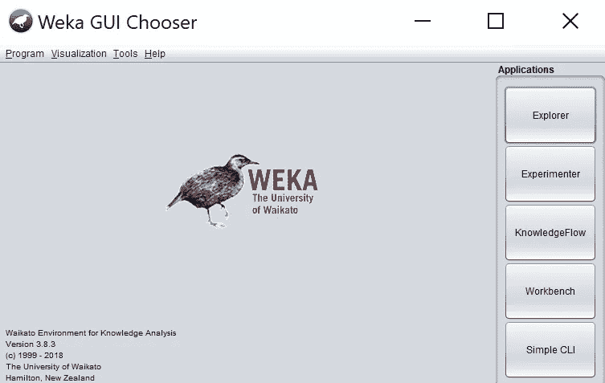

# 使用 Weka 的机器学习

> 原文：<https://towardsdatascience.com/machine-learning-for-newbies-7dd33dd6b764?source=collection_archive---------31----------------------->

## 为什么 *Weka* 为没有编码经验的新手 AI 爱好者提供最好的机器学习体验

由 [Clarisse Croset](https://unsplash.com/@herfrenchness?utm_source=medium&utm_medium=referral) 在 [Unsplash](https://unsplash.com?utm_source=medium&utm_medium=referral) 上拍摄的照片

在使用*谷歌云平台*上的 *Python* 库和 *TensorFlow* 开始我的机器学习之旅后，所有这些都需要一定程度的编码知识，我想知道是否有一种方法可以应用相同的方法，以便可以使用 *Python* 、 *R* 或其他面向数据科学和分析的编程语言完成数据分类等任务，而无需进行任何重大的开发工作。这个探索始于我的朋友和同事找到我，想知道他们可以从哪里开始在自己的工作中使用机器学习。以下是一些出现的问题:

*我如何使用机器学习来定位我的新产品？*

*我有没有可能用 AI 来预测客户行为？*

我可以使用机器学习来评估交易中欺诈的可能性吗？

在波士顿大学攻读硕士学位期间，我被介绍给了 *Weka* ，它最终成为非技术人工智能(AI)爱好者的完美工具，允许他们在不编写一行代码的情况下构建和测试机器学习模型。它是一个具有图形用户界面(GUI)的强大工具，用户可以在其中加载数据集，运行统计实验，应用多种类型的机器学习算法，并验证其模型的准确性达到很高的精确度。因此，我向初学者推荐 *Weka* ，因为他们可以专注于机器学习的过程，而不是底层的理论、深厚的数学基础或编程方面，这些都可以在事后学习。Weka 是一个方便的工具，当正确应用时，可以用来开发能够回答上述问题的模型。

机器学习是人工智能的一个子集，其中计算机被训练成在有限的人工干预下，根据提供的数据集做出决策。这个想法是让计算机以自主的方式随着时间的推移不断改进这个过程。随着越来越多的数据输入到机器学习模型中，以及基于测试结果的迭代改进，得出的结论就越准确。输入数据可以从几种不同类型的来源提供给模型，例如 CSV 文件、音频、图像、关系数据库、视频和文本格式。一个精确的机器学习算法可以区分狗和猫，识别自动驾驶车辆的障碍物，根据客户的购买历史为客户识别潜在的新产品，在视频流媒体平台上推荐电影，或者决定 *judge* 一词是指司法成员做出关键的法律决定，还是指做出评估(判断)的行为。

机器学习的学科可以分为两类:**监督**和**非监督**。

在监督学习的训练阶段，大量的标记数据被新兴的模型消耗。监督模型可以执行评估，如识别手写的字母(区分草书和正楷)或决定书面文本的潜在情绪是积极还是消极。

另一方面，无监督学习不依赖于标记的数据，而是在数据中寻找相似性，然后将其分成不同的类别。例如，*谷歌*可以使用无监督学习来根据各个页面之间的相似性将搜索结果分组，而像 *Airbnb* 这样的房产租赁应用程序可以使用无监督学习来根据价格、评级或可用性对其服务上列出的租赁单位进行分类。

在这篇文章中，我将把用于分类目的的表格数据集加载到 Weka 中，并运行高级机器学习算法，所有这些都将在不到 15 分钟的时间内完成。一旦掌握了窍门，就很容易开始为许多不同的目的(超出数据分类)应用不同的算法和数据集。

*Weka* 是新西兰汉密尔顿怀卡托大学开发的一款用于数据分析的开源应用。

**步骤 1:检查 *Java* 是否安装在您的电脑**上

在运行 *Weka* 之前，你需要在你的电脑上安装 *Java* 。

您可以通过打开*窗口*中的命令提示符并输入命令“java -version”来检查您是否安装了 *Java* ，这将返回您机器上安装的 *Java* 版本(如果有)。在 *Mac* 电脑上，你可以打开一个终端窗口，运行“java -version”命令，这将返回安装的 *Java* 版本。如果你没有安装 *Java* ，那么你可以选择一个包含 *Java* 的 *Weka* 包，安装 *Weka* 也会在你的电脑上安装 *Java* 。

验证计算机上的 Java 安装

**第二步:下载并安装*Weka***

导航到 *Weka* 的下载页面，选择最适合您系统的版本。我会推荐下载最新的稳定版本。遵循 Weka 网站上提供的安装步骤。

 [## 下载和安装 Weka - Weka Wiki

### Weka 有两个版本:Weka 3.8 是最新的稳定版，Weka 3.9 是开发版。新…

怀卡托. github.io](https://waikato.github.io/weka-wiki/downloading_weka/) 

**第三步:发射*Weka***

安装完成后，在你的电脑上找到 *Weka* 并运行应用程序。这可以通过从搜索栏启动 GUI 或者双击下载的 jar 文件来完成。一旦启动， *Weka* 将呈现一系列视图，包括*浏览器*、*实验者*、*知识流*、*工作台*和*简单 CLI* 。点击 *Explorer* ，这将启动 *Weka Explorer* GUI，并让您使用内置的机器学习算法加载数据进行分类。

其他 GUI 提供诸如数据过滤、特征选择、关联规则提取和可视化之类的特征。我们只看*探索者*。

从主屏幕选择浏览器

**第四步:将输入数据集加载到*Weka***

在这个例子中，我正在加载超声心动图数据，这是一个查看心脏病发作受害者和字段(如他们在心脏病发作时的年龄)的数据集。这些数据可以从下面的 Git 存储库链接下载:

[https://github . com/VSI pra/medium/blob/main/超声心动图-description.txt](https://github.com/vsipra/medium/blob/main/echocardiogram-description.txt)

[https://github . com/VSI pra/medium/blob/main/超声心动图-预测. arff](https://github.com/vsipra/medium/blob/main/echocardiogram-prediction.arff)

[https://github . com/VSI pra/medium/blob/main/超声心动图. arff](https://github.com/vsipra/medium/blob/main/echocardiogram.arff)

点击打开文件并选择*。待评估的飞机救援消防文件([超声心动图.飞机救援消防](https://github.com/vsipra/medium/blob/main/echocardiogram.arff))

出现如上所示的浏览器窗口

您将看到这个数据集包括 64 个实例(行)和 8 个属性(列)，最后一个属性 M 是 class 属性。

**第五步:预处理加载的数据**

导航到*过滤器*，然后选择*选择*。从这里的下拉选择中，您可以对数据集应用任何预处理，例如考虑缺失值、移除属性、改变格式(例如更改日期格式)、数据重新排序、值交换和应用过滤器。

**第六步:选择你的分类算法，建立你的机器学习模型**

点击*分类*标签，然后选择选择。出现分类器选择窗口。在*分类器—贝叶斯*下选择*朴素贝叶斯*。

以下截图显示选择了*naive Bayes*模型。现在，接受默认的测试选项，即*交叉验证*，点击*开始*。

一旦完成，分类的输出将被返回，如下所示。

到目前为止，我们所做的是使用我们的数据集建立一个朴素贝叶斯模型，并使用 10 重交叉验证测试该模型的性能。接下来，我们将研究如何预测类标签未知的实例的类标签。本练习中使用的数据集有 10 个元组，其中类标签未知，我们希望根据我们刚刚构建的模型对它们进行分类。

**第七步:使用你的新机器学习模型对记录进行分类**

从*分类*选项卡，导航选择*提供的测试集*并设置您的测试偏好，然后点击*设置*，这将打开一个新的对话框。从这里选择*打开文件*，然后选择*超声心动图-预测. arff* 。

点击*关闭*，将返回 *Weka 浏览器*。点击*更多选项*并为*输出预测*选择*明文*并点击*确定*。现在，点击*开始*开始对未分类的元组进行分类。此步骤的输出将返回未分类的 10 个实例的预测。在下面的截图中，您可以看到所有 10 个实例的预测。

**第八步:使用其他分类器建立分类模型，例如 *J48 和 RandomForest* ，比较各种模型对测试数据的准确性，观察哪一个表现最好**

构建实体模型的过程通常需要迭代增强和理解底层数据集。要使用其他分类器构建模型，遵循与之前相同的步骤，但这次在步骤 6 选择树下的 *J48* (确保选择*交叉验证*作为测试选项)。

一旦完成，您可以使用分类器运行测试，例如 *RandomForest* 和 *Bagging* 。比较和对比所有模型的精度，看看哪个模型最适合。对其他数据集运行最适合的模型，以更好地了解模型的表现以及是否需要更改。

希望这对你的机器学习之旅有所帮助！