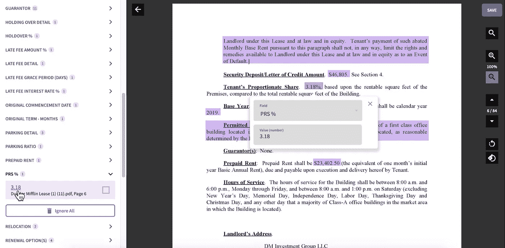
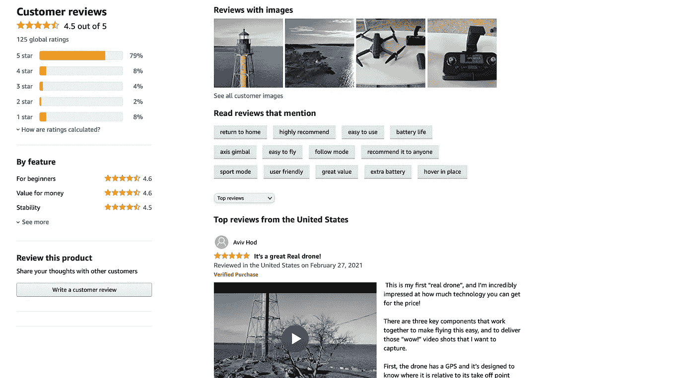
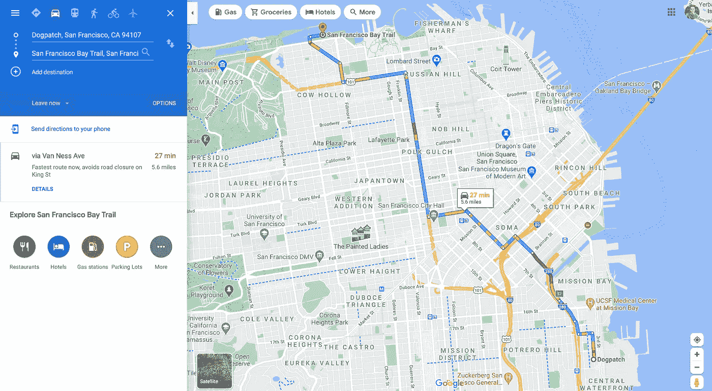

# 产品经理的机器学习:界定智能特性的范围

> 原文：<https://towardsdatascience.com/machine-learning-for-product-managers-scoping-a-smart-feature-1ce55437c9d6?source=collection_archive---------43----------------------->

## 项目的成败从第一天就开始了，确保你注意到了坑坑洼洼。

原始图片来自[克里斯蒂娜·莫里路](https://www.pexels.com/@divinetechygirl)

*这篇文章来自于我给我们的产品组织做的关于定义和构建 ML 特性的报告。这是我解开产品团队应该考虑的问题的系列文章中的第一篇，因为他们希望了解机器学习在哪里可以增强他们的用户旅程，在哪里可能会失败。*

当谈到机器学习时，企业领导、产品经理和研究人员经常说不同的语言。

我很幸运地在产品开发和机器学习的交汇处度过了过去的四年。我管理过产品团队和机器学习研究小组。我还就采用有用的机器学习系统的企业战略向企业领导层提供建议。在帮助沟通世界的过程中，我亲眼目睹了这些不同的观点。

构建 ML 特性时的大部分困惑发生在项目的开始。目标是模糊的，数据不是预期的格式，或者度量是不明确的。这是产品经理以机器学习研究人员可以转化为明确定义的研究问题的方式表达用户需求的关键之处。今天，我们将着眼于构建您的团队可以投入执行的健壮的产品范围。

# 获得所有人对用户影响的认同

利益相关者对 ML 有不同的看法。营销组织可能想利用机器人自动化的最新媒体浪潮。工程可能会将其视为新技术堆栈的机会。公司领导层可能希望它能满足投资者的期望。

这些影响往往很强。但是不要把它们作为优先考虑的理由。相反，优先考虑什么会对你的产品的用户体验产生积极的影响。这一口号允许组织的不同成员在 ML 时就项目优先级达成一致。

一个好的功能必须让用户受益。好的产品设计源于对用户的同情和理解他们的需求。机器学习只是你工具箱中实现这一优势的一个工具。

除非你正在与 Deepmind、脸书研究或谷歌人工智能等理论人工智能研究小组合作，否则鼓励机器学习工程师也用这些术语说话。他们的研究努力将推动什么样的产品特征？用户如何受益？

我从三个主要角度来看智能特性。

## 节省时间

AbstractCRE 的接口向分析师建议租赁抽象。图片作者。

现在的用户有哪些花费大量时间的事情？你要求用户在平台的什么地方输入内容？有没有一种方法可以自动化输入或部分输入？简化输入的最常见方法之一是显示建议，而不是让用户从头开始写内容。

在 Gmail 中，花在撰写新邮件上的时间。这导致谷歌开发了提示性的句子补全。如果你开始写一个通常以某种方式结尾的句子，Gmail 会推荐那个结尾。点击 tab，它会为你完成。

在 AbstractCRE(我是一家公司的投资者)中，时间投资是手动阅读财产租约并提取业务指标:现金流、平方英尺等。这导致他们开发出暗示性的亮点。他们预测这些业务指标的候选，并要求分析师确认建议，而不是搜索整个文档。

这些方法为用户节省了时间和金钱，尤其是在数百或数千次交互中重复使用时。

## 在噪音中找到信号

亚马逊在无人机评论中对关键主题的突出强调:回归家园、易于使用等。图片作者。

你的软件是否有很多难以一一分析的内容？是否需要阅读段落才能获得整体印象？在数千张照片中搜索？ML 可以显示主题或精确定位用户正在寻找的东西，这比他们自己做要快得多。

在亚马逊上，一些产品有成千上万的评论，这些评论详细描述了他们的体验。用户在评估新购买的产品时，很难找到主要的决策标准。亚马逊通过对这些帖子的情绪进行积极或消极的评级，并根据他们讨论的主题进行分组，解决了这一需求。用户不会费力地浏览评论并失去上下文，而是会对贯穿多个评论的主题有所了解。

在苹果照片中，用户经常试图寻找埋藏在数万张过去照片中的记忆。人们通常记得一张照片的内容，但不记得它是什么时候拍的。作为回应，苹果公司最近推出了一个搜索栏，你可以描述照片的内容，并返回匹配的结果。尝试在相册中搜索“圣诞树”、“假期”或“日落”。

这些方法允许用户更容易地在噪声中找到信号。

## 做出更好的决定

谷歌地图交通预测。图片作者。

用户做决定有困难吗？他们会在用户旅程中停留在一个地方吗？他们缺少哪些信息来做出正确的决定？智能系统可以预测或量化人类自己难以识别的信息。

在谷歌地图上，用户会得到一些不同的路线建议和估计的旅行时间。然而，这个时间是静态的路线，不会考虑高峰时间或最近的事故。谷歌通过记录交通模式和训练模型来预测交通在整个旅行中的变化，从而解决了这一问题。一旦用户决定了一条路线，他们就不必考虑条件会如何变化。

在我工作的 Globality，我们提供了一个市场，业务用户可以在其中购买营销、咨询、法律、IT 和人力资源方面的高价值服务。这通常是采购组织的角色，当用户试图在多家供应商之间做出决定时，通常会陷入困境。该平台通过展示相关的过去工作经验、同事的评价等，帮助他们对这些公司进行评估。系统的观点导致在决策过程中有更高的转化率。

这些方法推动用户朝着正确答案前进。

# 定义合同范本

所有的机器学习都可以被认为是一个函数，就像高中代数中的 f(x)=y。你有一些输入，你期待一些输出。这反映了在更广泛的编程和计算机科学中使用的函数；除了它不是一个工程师填写函数行为，而是一个优化算法。这就是所谓的模型，输入数据和输出预测之间的关系构成了模型契约。

当做产品工作来确定 ML 特性的范围时，你需要非常清楚预期的输入和输出应该是什么样子。这决定了下游的一切:如何收集数据，如何进行数据建模，以及如何衡量成功。

你打算接受文本作为输入并预测情绪吗？超声波报告的照片和是否有肿瘤的报告？接受用户资料并估计他们将购买什么产品？我认为一份好的合同范本的晴雨表是，在同样的投入下，一个人能否得出好的结论。机器学习不是魔术，训练有素的人通常是伟大的模式识别者。我们可以读一段话，感悟感悟；放射科医师可以阅读检查结果并生成报告；我可以阅读用户简历以及他们过去的购买记录，并预测他们将购买的其他产品。

请注意，这个契约没有*而不是*包括将实际解决问题的算法。这是件好事。算法选择——无论是无监督学习、有监督学习还是强化学习——都可以被视为实现细节。你的机器学习伙伴会在研究过程中发现这一点。

# 想想人类是如何做到的，然后进一步打破这个契约

机器学习应该只用于你可以清楚地定义系统的输入和输出契约，但你不能清楚地表达机器如何做同样的事情。

让我们以自动驾驶汽车为例。当我驾驶我自己的汽车时，我扫描道路。然后我倾斜方向盘，踩油门，或者踩刹车。一旦你开了几个月或几年的车，这是很直观的。

如果我们使用与机器学习合同相同的框架:我们获得场景作为输入，我们向汽车的转向控制输出命令。机器学习模型计算出如何做中间的所有事情。

这在理论上很好，但在实践中会遇到一些问题。也就是说，我们如何评估系统的性能？它可以在高速公路上运行良好，但不能在城市街道上运行。这在旧金山可能行得通，但在奥斯汀却行不通。我可能会决定从左侧并入，而我的乘客可能会决定从右侧并入。在某些情况下，它可能会过度扭转车轮，而在其他情况下又会扭转不足。很难说模型在幕后做什么，因此也很难确信它会正确地将世界的复杂性转化为对轮子的指令。

在可能的情况下，你应该通过思考一个人实际上是如何解决问题的来将你的问题分解得更细。我们开车的时候到底在做什么？

1.  确定我们视野中的障碍物，无论是道路上的还是我们旁边行驶的汽车。根据与前方车辆的距离，踩下油门和刹车。
2.  看看路上有没有白色或黄色的车道标志。控制好方向盘，沿着道路的弯道行驶，保持在我们的车道内。线条的颜色和粗细代表不同的允许通过手数。
3.  识别停车标志、限速标志或交通灯。然后，我们根据手势表达的意图调整速度或操纵。
4.  祈求晴天。一旦你加上一点小雨，加利福尼亚的司机就太可怕了。

既然我们已经完成了 DMV 101，这如何转化为 ML 系统呢？

这些驱动阶段中的每一个都有两个步骤。第一步，你用你的感知来获得上下文的感觉。然后，你将上下文映射到一系列定义良好的规则上，这些规则是关于在你所看到的情况下你应该如何表现的。人类含蓄地建立这种关系，但机器可以明确地这样做。这正是 Waymo、Cruise、特斯拉和其他公司在自己的自动驾驶汽车系统中所做的事情。他们有预测周围环境的机器学习系统。然后，一个确定性的控制系统将环境转化为汽车的导航和物理运动。你把感知留给了机器学习，而把行动留给了确定性代码。

更好的示范合同导致更好的基准。假设您的车道检测工作正常，但您的障碍物检测需要改进。这有助于优先考虑您需要进一步研究和投资以改进这些子模型的地方。这也使得系统更容易解释，这对于确定错误模式和什么时候会失败有很大的帮助。

把你的机器学习模型分解成你能分解的最小的问题。否则，一旦你发货，你会对一些不可避免的边缘情况感到惊讶。

# 你如何在产品体验中创造良性循环？

在启动任何 ML 特性之前，您可能需要花时间来标记数据。这项工作提供了输入/输出契约的例子，您将需要训练和基准测试您的模型。一旦发布，你就有机会将大部分数据生成工作外包给你的用户。

最好的机器学习系统履行与用户反馈相同的模型契约，就像内部标记一样。用户与系统互动越多，你收集的有效数据就越多，模型就越好。这在产品特性中形成了良性循环。

创建这种反馈循环的一般方法是允许用户确认或否认预测。Spotify 为电台播放的每首歌曲提供拇指向上或拇指向下功能。这些分级会更改播放列表中稍后播放的歌曲。如果模型预测歌曲，它有理由相信你会喜欢它们。反对票是对模型的一个强烈信号，表明它的预测是错误的，因此应该在未来改变它们。一个向上的投票可能会鼓励它进一步倾向于这种类型。

另一种方法是标记不正确的结果，然后提交给后勤部门进行进一步的数据标记。在特斯拉的自动驾驶系统中，他们会记录用户被迫干预和接管方向盘的任何情况。它记录干预周围所有传感器的 30 秒剪辑；是什么导致了这个问题，汽车所犯的错误，以及人类的解决方案。这个实例被添加到一个队列中，Telsa 的员工标记周围的环境，并分析控制系统，以确定为什么它在路上出错。系统根据这些数据点进行训练，希望在类似的未来情况下做出更好的判断。

你应该将任何明确的反馈请求建立在今天和未来能够提供最佳用户体验的基础上。

系统会记住他们的反馈吗？它以某种方式投入使用了吗？据我所见，用户喜欢参与机器预测。看到一台机器正确地完成一项复杂的任务有一种神奇的感觉，当它失败时，他们会相对高兴地纠正它。但必须保证这样做会以某种方式立即影响他们的用户体验:接下来播放一首更相关的歌曲，提供正确的照片分组，或者阻止来自该发件人的所有垃圾邮件地址。如果它专门用于模糊的未来目的，他们会很快失去纠正它的胃口。

# 关闭

此时，您对您的产品功能和机器学习合同有了一个好主意。你可以让你的模型更容易解释，并创造一个良性循环。

请记住，您不需要在第一天就烘焙整个解决方案。产品在勾画功能和研究方向方面与机器学习研究人员有平等的伙伴关系。它将是迭代的；随着时间的推移，随着你了解的越来越多，合同范本可能会发生变化。但是一个基于专业知识的坚实的起点对于加速你的研究和开发工作是至关重要的。

在第二篇文章中，我们将看看如何定义机器学习项目的成功标准。请在 Medium 上关注我，了解更多关于人工智能和产品的文章。同时，看看这些其他的帖子:

</we-need-a-better-definition-of-ai-and-we-need-it-now-81fb8102a9b6> 