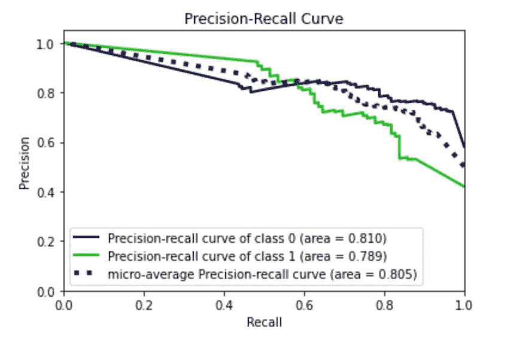
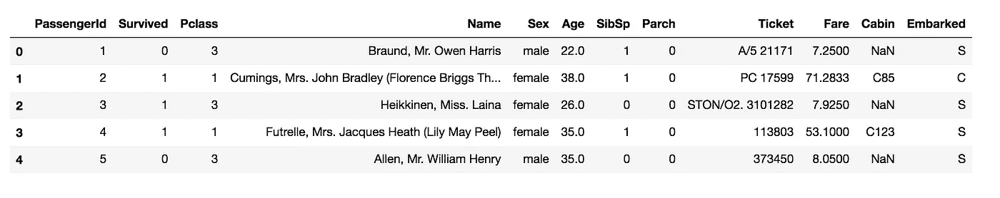
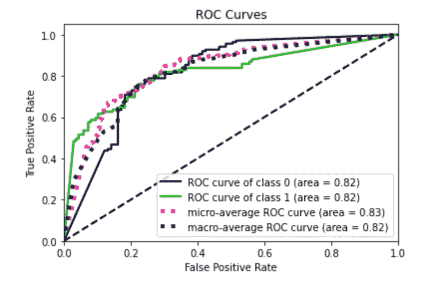

# 机器学习:K 近邻分类器入门

> 原文：<https://towardsdatascience.com/machine-learning-getting-started-with-the-k-neighbours-classifier-d7e6b25f2b09?source=collection_archive---------16----------------------->

## 机器学习

## 一个 Python 的现成代码，它实现了 scikit-learn 中的 K-neighbors 分类器，从数据预处理到生产。



作者图片

在本教程中，我将演示如何实现一个利用 K-neighbors 分类器的分类模型。完整的代码实现为一个 Jupyter 笔记本，可以从我的 [Github 库](https://github.com/alod83/data-science/tree/master/DataAnalysis/KNN)下载。

作为一个示例数据集，我利用了 Kaggle Challenge 中提供的 Titanic 数据集:[Titanic-机器从灾难中学习](https://www.kaggle.com/c/titanic/overview)。这项挑战的目标是建立一个模型，根据乘客的一些特征，预测乘客在泰坦尼克号灾难中是否幸存。

# 加载数据集

数据集由三个文件组成:

*   **train.csv** —包含用于训练模型的数据集
*   **test . CSV**——包含执行新预测的未知样本
*   **gender _ submission . CSV**-输出数据集的示例。

在本教程中，我们只考虑 train.csv 文件。train.csv 文件由 891 行和 12 列组成:



作者图片

为每位乘客提供不同的功能。test.csv 文件与前一个文件类似，只是没有提供幸存列。

我们利用`pandas`库来加载数据集:

```
import pandas as pddf = pd.read_csv('data/train.csv')
```

查看这些列，可以将下列列用作输入要素:

*   Pclass
*   性
*   年龄
*   SibSp
*   烤
*   票价
*   上船了。

柱舱也可以作为输入特征插入。但是，在 test.csv 文件中，Cabin 列的几乎所有值都丢失了。为此，我们决定不插入作为输入特征。

# 预处理

首先，我们删除分析中不使用的列:

```
df = df.drop(['Cabin', 'Ticket'], axis=1)
```

然后，我们需要将所有分类特征转换为数字，并将范围[0，1]中的所有数字特征转换为数字。

对于每个特性，我们利用`unique()`函数列出该特性可能采用的所有可能值。例如，对于性特征，我们可以写:

```
df['Sex'].unique()
```

它给出了以下输出:

```
array(['male', 'female'], dtype=object)
```

这意味着:

*   该特征只能采用两个值
*   性别列中没有缺失值
*   该特征是分类特征。

我们可以使用`scikit-learn` `LabelEncoder`将分类特征转换为数字，或者我们可以定义自己的函数，如下面的代码片段所示:

```
def get_gender(x):
    if x == 'male':
        return 0
    return 1
```

然后我们可以将我们的函数应用到性别列:

```
df['Sex'] = df['Sex'].apply(lambda x : get_gender(x))
```

一旦所有的分类特征都被转换成数字，我们需要映射[0，1]区间中的所有特征。这可以通过`scikit-learn` `MinMaxScaler()`类来实现。为此，我们定义了一个函数，所有功能都可以利用它:

```
from sklearn.preprocessing import MinMaxScalerdef scale_column(column, df):
    values = df[column].values

    scaler = MinMaxScaler()
    scaler.fit(values.reshape(-1, 1))
    return scaler.transform(values.reshape(-1, 1))
```

前面的函数将列名和数据集作为输入，对该列的值构建一个`MinMaxScaler()`，拟合缩放器并返回转换后的值。

`scaler_column()`功能可以如下调用:

```
df['Parch'] = scale_column('Parch', df)
```

但是，我们已经注意到，在 test.csv 文件的一些列中有一些丢失的值，这些值在 train.csv 文件中不存在。我们可以用一个虚构值替换缺失值，如下所示:

```
df['Age'] = df['Age'].fillna(value=0)
```

我们可以修改`scale_column()`函数来处理缺失值，如下所示:

```
def scale_column(column, df, nan=False):
    values = df[column].values

    scaler = MinMaxScaler()
    if nan:
        # also consider missing values in the test set
        new_values = np.append(values,0)
        scaler.fit(new_values.reshape(-1, 1))
    else:
        scaler.fit(values.reshape(-1, 1))
    return scaler.transform(values.reshape(-1, 1))
```

如果该列包含缺失值，则将`nan`变量设置为`True`，否则将其设置为`False`。

预处理的完整代码如下:

```
df['Embarked'] = df['Embarked'].fillna(value='N')
df['Age'] = df['Age'].fillna(value=0)
df['Fare'] = df['Fare'].fillna(value=0)df['Sex'] = df['Sex'].apply(lambda x : get_gender(x))
df['Embarked'] = df['Embarked'].apply(lambda x : get_embarked(x))for i in ['Age', 'Parch', 'Fare', 'Pclass', 'SibSp']:
    df[i] = scale_column(i, df)
```

最后，我们可以删除所有剩余的 NaN 值:

```
df = df.dropna()
```

# 在训练集和测试集中拆分数据集

预处理之后，我们可以从数据集中提取输入(X)和输出(y ):

```
features = ['Pclass','Sex','Age','SibSp','Parch','Fare','Embarked']
X = df[features]
y = df['Survived']
```

我们可以将获得的数据集分为训练集和测试集，保留 33%的样本进行测试:

```
from sklearn.model_selection import train_test_splitX_train, X_test, y_train, y_test = train_test_split(X, y, test_size=0.33, random_state=42)
```

# 训练模型

现在我们准备训练模型。我们利用交叉验证的网格搜索来调整 K-neighbors 分类器。

我们定义要调整的参数网格:

```
from sklearn.neighbors import KNeighborsClassifier
from sklearn.model_selection import GridSearchCV
import numpy as npparameters = {  'n_neighbors'   : np.arange(3, 8),
                'weights'       : ['uniform', 'distance'],
                'metric'        : ['euclidean', 'manhattan', 'chebyshev', 'minkowski'],
                'algorithm'     : ['auto', 'ball_tree', 'kd_tree'],
            }
```

然后我们调整分类器:

```
classifier = KNeighborsClassifier()
clf = GridSearchCV(classifier, parameters, cv = 5)
clf.fit(X_train, y_train.values.ravel())
```

我们可以检索最佳模型:

```
model = clf.best_estimator_
```

# 测试模型

现在，我们可以在测试集上测试模型:

```
y_score = model.predict_proba(X_test)
```

并绘制 ROC 和预测/回忆曲线:

```
import matplotlib.pyplot as plt
from sklearn.metrics import roc_curve
from scikitplot.metrics import plot_roc,auc
from scikitplot.metrics import plot_precision_recall# Plot metrics 
plot_roc(y_test.values.ravel(), y_score)
plt.savefig('roc.png')
plt.show()

plot_precision_recall(y_test.values.ravel(), y_score)
plt.savefig('pr.png')
plt.show()
```


作者图片



作者图片

我们还可以计算精确度、召回率和准确度:

```
from sklearn.metrics import precision_score, recall_score, accuracy_scorey_pred = model.predict(X_test)precision = precision_score(y_test.values.ravel(),y_pred)recall = recall_score(y_test.values.ravel(),y_pred)accuracy = accuracy_score(y_test.values.ravel(),y_pred)print('Precision: ' , precision)
print('Recall: ' , recall)
print('Accuracy: ' , accuracy)
```

它给出了以下输出:

```
Precision:  0.7536200639348735
Recall:     0.7542372881355932
Accuracy:   0.7542372881355932
```

# 最终确定模型

我们可以通过在整个 X 数据集上再次训练来最终确定模型:

```
model.fit(X, y.values.ravel())
```

我们保存模型以备将来使用:

```
import pickle
pickle.dump(model, open("knn.sav", 'wb'))
```

# 摘要

在这篇初学者教程中，我已经演示了如何使用`scikit-learn`库建立、训练和完成 K-neighbors 分类器。应遵循以下步骤:

*   数据预处理
*   模特培训
*   模型检验
*   模型最终确定

如果你想了解我的研究和其他活动的最新情况，你可以在 [Twitter](https://twitter.com/alod83) 、 [Youtube](https://www.youtube.com/channel/UC4O8-FtQqGIsgDW_ytXIWOg?view_as=subscriber) 和 [Github](https://github.com/alod83) 上关注我。

# 相关文章

[](/data-normalization-with-python-scikit-learn-e9c5640fed58) [## 使用 Python scikit 进行数据规范化-学习

### 继关于数据预处理的系列文章之后，在本教程中，我将讨论 Python 中的数据规范化…

towardsdatascience.com](/data-normalization-with-python-scikit-learn-e9c5640fed58) [](/a-complete-data-analysis-workflow-in-python-pycaret-9a13c0fa51d4) [## Python PyCaret 中的完整数据分析工作流

### 这是一个现成的教程，利用了我用过的最好的机器学习库。

towardsdatascience.com](/a-complete-data-analysis-workflow-in-python-pycaret-9a13c0fa51d4) [](/automl-in-python-a-comparison-between-hyperopt-sklearn-and-tpot-8c12aaf7e829) [## Python 中的 AutoML:Hyperopt sk learn 和 TPOT 的比较

### 两种流行的 Python AutoML 库的优缺点

towardsdatascience.com](/automl-in-python-a-comparison-between-hyperopt-sklearn-and-tpot-8c12aaf7e829) [](/a-complete-data-analysis-workflow-in-python-and-scikit-learn-9a77f7c283d3) [## Python 和 scikit 中的完整数据分析工作流程-学习

towardsdatascience.com](/a-complete-data-analysis-workflow-in-python-and-scikit-learn-9a77f7c283d3) 

# 新到中？您可以每月订阅几美元，并解锁无限的文章— [点击此处](https://alod83.medium.com/membership)。