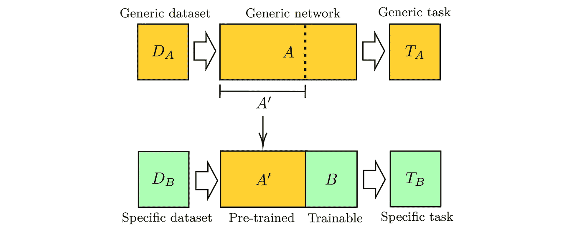

# 机器学习走向量子化:令人兴奋的范式转变一瞥

> 原文：<https://towardsdatascience.com/machine-learning-goes-quantum-a-glance-at-an-exciting-paradigm-shift-a80253cc577?source=collection_archive---------20----------------------->

[来源](https://unsplash.com/photos/qDG7XKJLKbs)。

## 革命性的传统迁移学习，*k*-手段，和 CNN

量子计算是一个已经被广泛使用的时髦词汇。不幸的是，尽管它在流行文化和准科学的互联网社区中传播，它的能力仍然非常有限。

作为一个非常新的领域，量子计算向传统的经典计算模型提出了一个完全的范式转变。经典比特——可以是 0 或 1——在量子计算中被*量子比特*所取代，后者保存概率值。

依靠物理学在非常非常小的水平上的怪癖，一个量子位在每次被测量时，都以一定的概率被强制进入 0 或 1 的状态。例如，如果一个量子位处于`0.85:0.15`状态，我们会期望它在大约 85%的时间里测量为零，而在 15%的时间里测量为零。

虽然量子计算还有很长的路要走，但是机器学习是一个特别有前途的潜在途径。为了简单了解量子计算能够提供的计算能力，请考虑以下情况:

*   一个量子位可以同时包含 0 和 1。因此，两个量子位可以一起保存四个值——状态 00、01、10 和 11 的值——而三个量子位可以保存八个，以此类推。
*   因此——至少在理论上——需要 2 个 *ⁿ* 位来代表存储在 *n* 个量子位中的信息。

除此之外，量子电路的流体概率性质可能为深度学习提供独特的优势，深度学习通过网络从信息的概率流动和转换中获得力量。

量子机器学习正在流行。谷歌广受欢迎的深度学习框架 TensorFlow 最近推出了 [TensorFlow Quantum](https://www.tensorflow.org/quantum) 。

本文将介绍量子变异的三种机器学习方法和算法:迁移学习、 *k* 均值和卷积神经网络。它将试图用尽可能少的量子知识来做到这一点，并展示在设计机器学习的量子应用时的一些重要考虑。

# 量子迁移学习

迁移学习可能是深度学习最大的成功之一。鉴于深度学习模型需要大量的时间来训练，迁移学习提供了一种加快训练时间的宝贵方法。此外，与从头开始训练相比，使用转移解决方案的模型通常会得到更好的解决方案。

作为一个想法，迁移学习是相对简单的——一个“基础模型”,将被表示为 *A* ,在一个*通用任务*上被训练。然后，将表示为 *B* 的附加层块附加到 *A* 上。通常情况下，在添加 *B* 之前， *A* 的最后几层会被砍掉。然后，在特定数据集上“微调”该模型，其中*A’*(修改后的 *A* )为 *B* 提供了各种过滤器，以提取与手头特定任务相关的有意义的信息。

我们可以将为迁移学习构建“混合神经网络”的想法形式化如下:

1.  在通用数据集上训练通用网络 *A* 以执行通用任务(预测某个标签)。
2.  取通用网络 *A* 的一段*A’*，在*A’*上附加一个新块 *B* 。 *A'* 是预训练的，因此应该被冻结(使其不可训练)，而 *B* 是可训练的。
3.  在特定数据集上训练这个*A’b*混合模型来执行特定任务。

[来源](https://arxiv.org/pdf/1912.08278.pdf)。

假设有两个组件，*A’*和 *B* ，并且每个组件都可以是经典或量子网络，那么混合神经网络就有四种可能的类型。

*   *古典到古典* (CC)。传统的迁移学习观。
*   *经典到量子* (CQ)。经典的预训练网络充当量子网络使用的过滤器。这种方法的实用性特别吸引人。
*   *量子到经典* (QC)。量子预训练网络充当过滤器供经典网络使用。或许这在未来量子计算发展更多的时候会更有可能。
*   *量子对量子* (QQ)。一个完全量子混合网络。在可行的层面上，现在可能不太可能，但以后可能会有希望。

经典到量子网络特别有趣和实用，因为大量的输入样本被预处理和细化到只有最重要的特征。这些信息特征可以由量子电路进行后处理，在目前的发展阶段，量子电路可以吸收比经典网络少得多的特征。

另一方面，量子转经典网络将*量子*系统作为特征提取器，一个*经典*网络用于进一步后处理这些提取的特征。QC 网络有两种使用情况。

*   数据集由量子态组成。例如，如果需要预测量子态的某些信息，量子特征提取器似乎是处理输入的正确工具。或者，像分子和超导体这样的量子力学系统可以从量子特征提取器中受益。
*   一台非常好的量子计算机胜过经典的特征提取器。

在测试中，作者发现这些量子经典混合模型可以获得与标准完全经典网络相似的分数。鉴于量子计算的早期阶段，这确实是一个有希望的消息。

# 量子卷积神经网络

卷积神经网络在图像识别以及信号处理等其他用例中已经变得很常见。然而，这些网络的规模在继续增长，量子计算可以大大加快经典机器学习方法的速度。

QCNN 算法与经典的 CNN 算法非常相似。然而，看到一些其他的考虑和改变被实现来允许量子方法是很有趣的。

首先，注意量子电路需要*量子随机存取存储器*，或 QRAM。这类似于 RAM，但是地址和输出寄存器由量子位组成，而不是位。它被开发成插入、更新或删除存储器中任何条目的时间是`*O*(log²(*n*))`。

考虑设计的卷积“块”的前向传递，它类似于经典 CNN，但略有不同。

1.  *执行量子卷积*。这就是量子操作发生的地方。这是在 QRAM 完成的，并且应用了非线性。
2.  *量子采样*。执行采样，以便在很大概率已知所有位置和值的精确值的情况下，可以获得所有位置和值。因此，概率量子位值被“转换”成经典形式。这就是所谓的量子层析成像。
3.  *QRAM 更新和汇集*。需要更新 QRAM，并且在 QRAM 结构中完成池化(像卷积一样)。

采样步骤是经典向前步骤和量子向前步骤之间的主要区别——在量子算法中，出于性能(因为量子计算容易改变且敏感)和速度的实际目的，通常需要采样。

与经典细胞神经网络相比，量子细胞神经网络前向传递的加速是—

*   内核数量呈指数增长
*   输入维数的二次函数

这是一个很大的加速！

然而，这个采样步骤受到非线性函数必须有界的限制——很难从无限大的可能空间中采样，尤其是在量子世界中。因此，ReLU 函数可能被重新定义为上限为 *y* = 1，这样它看起来更像 sigmoid 函数的平面版本。

这确实是取样的一个缺点，也是使用量子算法时权衡利弊的有趣证明。

# q 均值

首先，未标记的数据正以前所未有的速度充斥着数据空间。标签贵；需要以有效且高效的方式处理未标记的数据。与传统的经典无监督学习算法相比，量子计算可以提供显著的加速，这对于处理这种无监督信息流具有很大的意义。

传统的经典 *k* -means 算法常用于聚类。使用两个步骤之间的重复交替，该算法返回“质心”(每个聚类的中心)的位置:

1.  *标签分配。*每个数据点都被分配了最近质心的标签。(质心位置最初是随机设置的。)
2.  *质心估计。*将每个质心更新为分配给相应聚类的数据点的平均值。

现在，考虑δ- *k* -means，它可以被认为是*k*means 的一个嘈杂但仍然经典的版本。假设δ是预设参数。该算法在相同的两个步骤之间交替进行，但增加了一些噪声:

1.  *标签分配*。每个数据点被分配一个距离小于δ的随机质心。也就是说，任何距数据点的距离小于阈值的质心都有相等的分配机会。
2.  *质心估计*。在计算每个质心的位置期间，添加δ/2 高斯噪声。

最后，考虑一下 *q* -means，它是 *k* -means 的真正量子变体。作为一个快速的先决条件，回想一下量子位包含概率；与 bit 相比，这使得它们特别容易受到测量误差和环境噪声的影响。

1.  *标签分配。*通过量子方法估计每个数据点到质心的距离。因为噪声，这个量子距离估计会有一定程度的噪声。然后，将每个数据点分配给一个质心。
2.  *质心估计*。使用在 QCNN 方法的采样步骤中讨论的相同的量子层析成像思想，可以以高概率正确测量的状态被“转换”成经典形式。同样，这种操作本身也有一定程度的噪声。

*q*-的意思好像和*k*-的意思很像。然而，不同之处在于噪音；引入δ-*k*-意味着作为 *q* 的“经典版本”，意味着捕捉噪声元素。 *q* -means 背后的提议者证明，分析δ- *k* -means 可以揭示关于 *q* -means 算法如何运行的信息。

例如，当δ的(非零)值被适当地选择时，δ-*k*-均值算法通常收敛到达到类似于(如果不是更好的话)T2 k-均值算法的准确度的聚类。因此——尽管在量子变体中选择噪声量的自由度更小——人们可以期望 *q* 均值比 *k* 均值表现得更好。

类似地，δ- *k* -means 算法在其运行时间上是多对数的。那么， *q* -means 算法也是多对数的，是对 *k* -means 算法的加速，允许引入一些误差并放宽更严格和更精确的计算。

目前， *q* -means 太复杂，量子模拟器和量子计算机都无法测试。然而，通过δ-*k*-均值算法，有经验证据表明*q*-均值可以在与*k*-均值相似的水平上执行。

那么，量子集群的目的是什么呢？进一步的研究可能会考虑量子状态或数据的聚类，以及分子和其他非常小的现象的空间聚类——这是一项非常重要的任务。总的来说，在传统任务中，量子方法似乎也有超越经典方法的潜力。

## 感谢阅读！

你可能也会觉得这些文章很有趣。

 [## 2021 年值得关注的 5 项激动人心的深度学习进展

### 正在进行的研究的暗流

towardsdatascience.com](/5-exciting-deep-learning-advancements-to-keep-your-eye-on-in-2021-6f6a9b6d2406)  [## 一个迷人的和最先进的方法来训练神经网络对不诚实的数据

### 从损坏的数据中学习

towardsdatascience.com](/a-fascinating-state-of-the-art-method-to-train-neural-networks-on-dishonest-data-bcbf51dd0b59)  [## Mlearning.ai 提交建议

### 如何成为 Mlearning.ai 上的作家

medium.com](https://medium.com/mlearning-ai/mlearning-ai-submission-suggestions-b51e2b130bfb) 

🟠 [**成为作家**](https://medium.com/mlearning-ai/mlearning-ai-submission-suggestions-b51e2b130bfb)