# 用 PyCaret 在 Alteryx 中进行机器学习

> 原文：<https://towardsdatascience.com/machine-learning-in-alteryx-with-pycaret-fafd52e2d4a?source=collection_archive---------27----------------------->

## 使用 PyCaret 在 Alteryx Designer 中训练和部署机器学习模型的分步教程

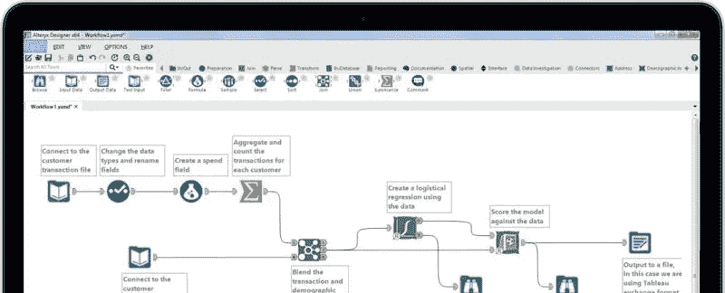

# 介绍

在本教程中，我将向您展示如何在一个非常流行的 ETL 工具 [Alteryx](https://www.alteryx.com) 中使用 [PyCaret](https://www.pycaret.org) 来训练和部署机器学习管道，PyCaret 是一个用 Python 编写的开源、低代码的机器学习库。本教程的学习目标是:

👉PyCaret 是什么，如何入门？

👉什么是 Alteryx Designer，如何设置？

👉在 Alteryx Designer 中训练端到端机器学习管道，包括数据准备，如缺失值插补、一键编码、缩放、转换等。

👉部署经过训练的管道，并在 ETL 期间生成推理。

# PyCaret

[PyCaret](https://www.pycaret.org/) 是一个开源、低代码的机器学习库和端到端的模型管理工具，内置于 Python 中，用于自动化机器学习工作流。PyCaret 以其易用性、简单性以及快速高效地构建和部署端到端机器学习管道的能力而闻名。要了解更多关于 PyCaret 的信息，请查看他们的 [GitHub](https://www.github.com/pycaret/pycaret) 。

# Alteryx 设计器

[Alteryx Designer](https://www.alteryx.com/products/alteryx-platform/alteryx-designer) 是由 [**Alteryx**](https://www.alteryx.com) 开发的专有工具，用于自动化分析的每个步骤，包括数据准备、混合、报告、预测分析和数据科学。您可以访问任何数据源、文件、应用程序或数据类型，并体验包含 260 多个拖放构建块的自助服务平台的简单性和强大功能。你可以从[这里](https://www.alteryx.com/designer-trial/alteryx-free-trial)下载 Alteryx Designer 的一个月免费试用版。

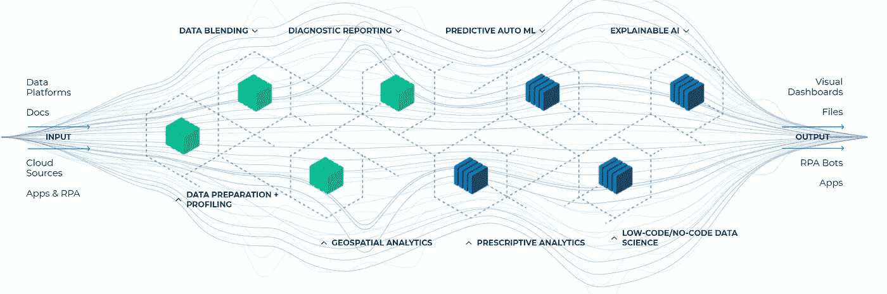

[https://www.alteryx.com](https://www.alteryx.com)

# 教程先决条件:

对于本教程，您将需要两件东西。第一个是 Alteryx 设计器，这是一个桌面软件，你可以从[这里](https://www.alteryx.com/designer-trial/alteryx-free-trial)下载。第二，你需要 Python。获得 Python 最简单的方法是下载 Anaconda 发行版。要下载，点击这里。

# 👉我们现在准备好了

打开 Alteryx Designer，点击文件→新建工作流

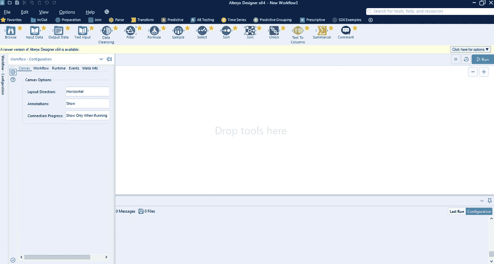

Alteryx 设计器中的新工作流

在顶部，有一些工具，您可以在画布上拖放，并通过将每个组件相互连接来执行工作流。

# 资料组

对于本教程，我使用 PyCaret 的存储库中的一个名为 ***insurance*** 的回归数据集。你可以从[这里](https://github.com/pycaret/pycaret/blob/master/datasets/insurance.csv)下载数据。

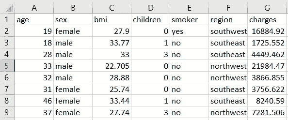

样本数据集

我将创建两个独立的 Alteryx 工作流。第一个用于**模型训练和选择**，第二个用于**使用训练好的管道对新数据**进行评分。

# 👉模型训练和选择

让我们首先从**输入数据**工具读取 CSV 文件，然后是 **Python 脚本。**在 Python 脚本内部执行以下代码:

```
**# install pycaret** from ayx import Package
Package.installPackages('pycaret')**# read data from input data tool**
from ayx import Alteryx
data = Alteryx.read("#1")**# init setup, prepare data**
from pycaret.regression import *
s = setup(data, target = 'charges', silent=True)**# model training and selection** best = compare_models()**# store the results, print and save**
results = pull()
results.to_csv('c:/users/moezs/pycaret-demo-alteryx/results.csv', index = False)
Alteryx.write(results, 1)**# finalize best model and save**
best_final = finalize_model(best)
save_model(best_final, 'c:/users/moezs/pycaret-demo-alteryx/pipeline')
```

该脚本从 pycaret 导入回归模块，然后初始化`setup`函数，该函数自动处理 train_test_split 和所有数据准备任务，如缺失值插补、缩放、特征工程等。`compare_models`使用 kfold 交叉验证训练和评估所有估计器，并返回最佳模型。

`pull`函数以数据帧的形式调用模型性能指标，然后保存为驱动器上的`results.csv`，并写入 Alteryx 中 Python 工具的第一个锚点(以便您可以在屏幕上查看结果)。

最后，`save_model`将包括最佳模型在内的整个转换管道保存为 pickle 文件。

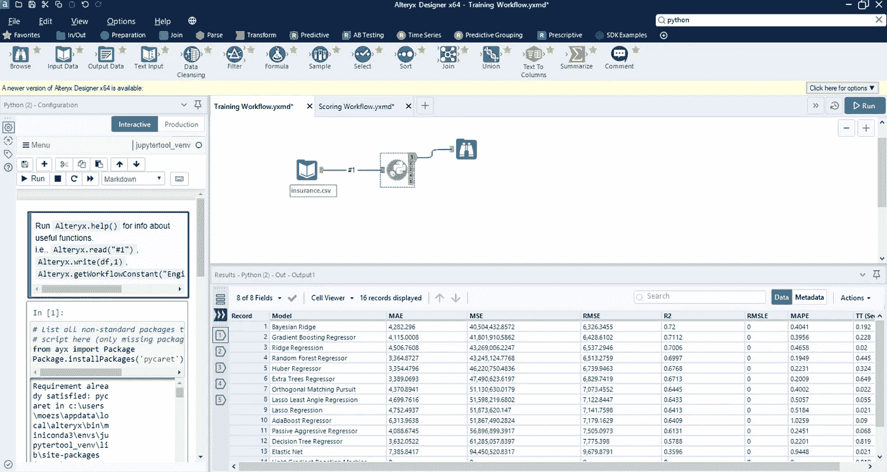

培训工作流程

当您成功执行该工作流时，您将生成`pipeline.pkl`和`results.csv`文件。您还可以在屏幕上看到最佳模型的输出及其交叉验证的指标。

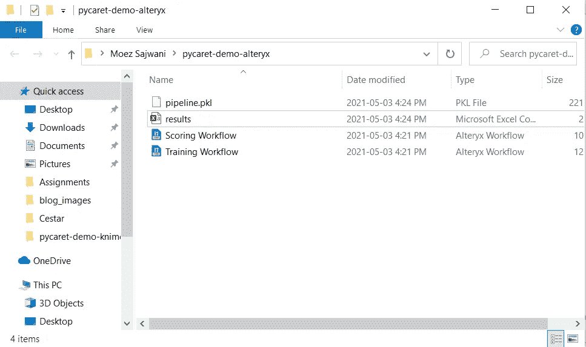

这就是`results.csv`包含的内容:

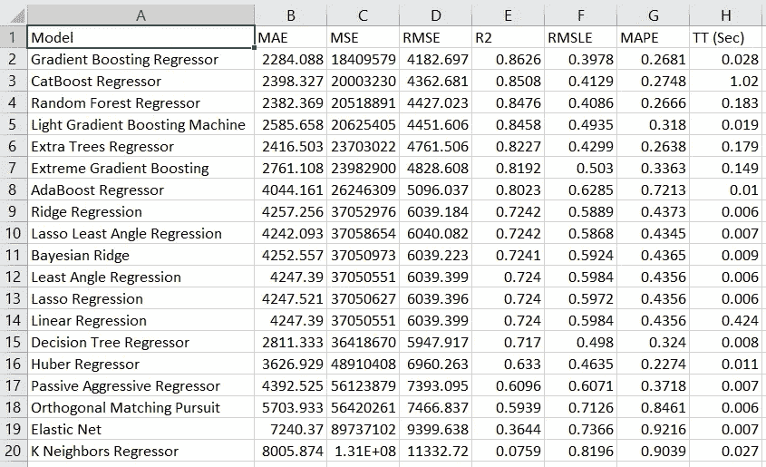

这些是所有模型的交叉验证指标。在这种情况下，最好的模型是 ***梯度推进回归器*** 。

# 👉模型评分

我们现在可以使用我们的`pipeline.pkl`对新数据集进行评分。由于我没有标签为 ***，*** 的 ***insurance.csv*** 的单独数据集，我要做的是删除目标列，即 ***费用*** *，*，然后使用训练好的管道生成预测。

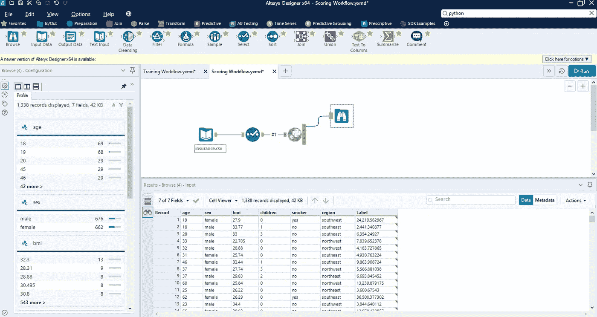

评分工作流程

我已经使用**选择工具**移除目标列，即`charges`。在 Python 脚本中执行以下代码:

```
**# read data from the input tool**
from ayx import Alteryxdata = Alteryx.read("#1")**# load pipeline** from pycaret.regression import load_model, predict_model
pipeline = load_model('c:/users/moezs/pycaret-demo-alteryx/pipeline')**# generate predictions and save to csv** predictions = predict_model(pipeline, data)
predictions.to_csv('c:/users/moezs/pycaret-demo-alteryx/predictions.csv', index=False)**# display in alteryx** Alteryx.write(predictions, 1)
```

当您成功执行该工作流时，它将生成`predictions.csv`。

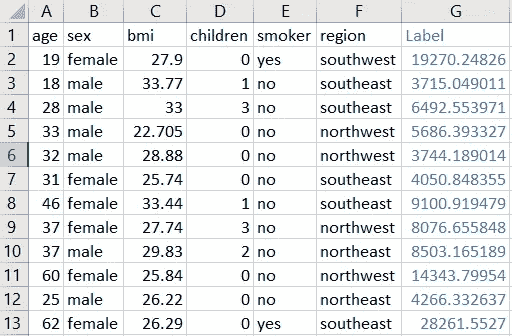

预测. csv

# 即将推出！

下周我将深入探讨 PyCaret 的更多高级功能，您可以在 Alteryx 中使用这些功能来增强您的机器学习工作流。如果你想自动收到通知，你可以在[媒体](https://medium.com/@moez-62905)、 [LinkedIn](https://www.linkedin.com/in/profile-moez/) 和 [Twitter](https://twitter.com/moezpycaretorg1) 上关注我。

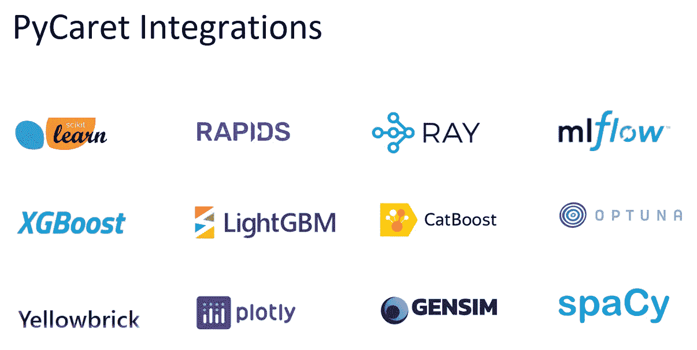

PyCaret —作者图片

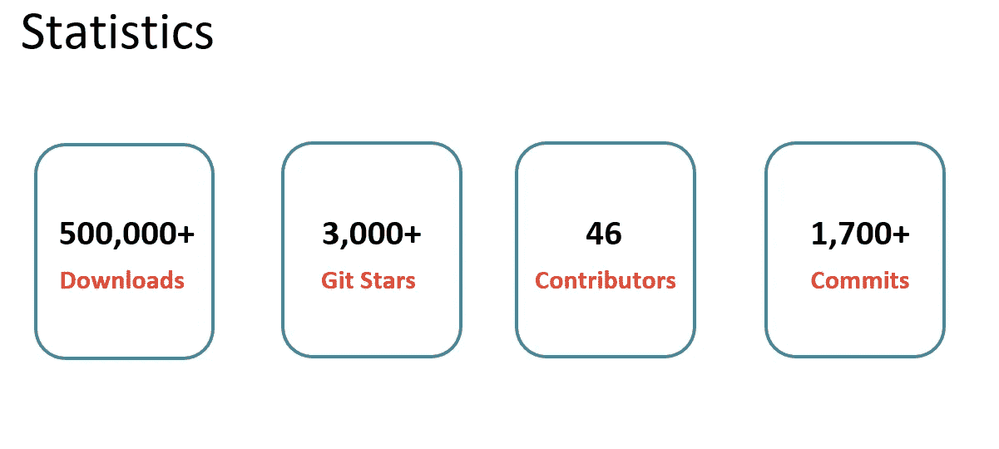

PyCaret —作者图片

使用 Python 中的这个轻量级工作流自动化库，您可以实现的目标是无限的。如果你觉得这很有用，请不要忘记给我们 GitHub 库上的⭐️。

想了解更多关于 PyCaret 的信息，请关注我们的 LinkedIn 和 Youtube。

加入我们的休闲频道。此处邀请链接[。](https://join.slack.com/t/pycaret/shared_invite/zt-p7aaexnl-EqdTfZ9U~mF0CwNcltffHg)

# 重要链接

[文档](https://pycaret.readthedocs.io/en/latest/installation.html)
[博客](https://medium.com/@moez_62905)
[GitHub](http://www.github.com/pycaret/pycaret)
[stack overflow](https://stackoverflow.com/questions/tagged/pycaret)
[安装 PyCaret](https://pycaret.readthedocs.io/en/latest/installation.html) [笔记本教程](https://pycaret.readthedocs.io/en/latest/tutorials.html) [贡献于 PyCaret](https://pycaret.readthedocs.io/en/latest/contribute.html)

# 更多 PyCaret 相关教程:

[](/machine-learning-in-knime-with-pycaret-420346e133e2) [## 用 PyCaret 实现 KNIME 中的机器学习

### 使用 PyCaret 在 KNIME 中训练和部署端到端机器学习管道的分步指南

towardsdatascience.com](/machine-learning-in-knime-with-pycaret-420346e133e2) [](/easy-mlops-with-pycaret-mlflow-7fbcbf1e38c6) [## 使用 PyCaret + MLflow 轻松实现 MLOps

### 一个初学者友好的，一步一步的教程，使用 PyCaret 在你的机器学习实验中集成 MLOps

towardsdatascience.com](/easy-mlops-with-pycaret-mlflow-7fbcbf1e38c6) [](/write-and-train-your-own-custom-machine-learning-models-using-pycaret-8fa76237374e) [## 使用 PyCaret 编写和训练您自己的自定义机器学习模型

towardsdatascience.com](/write-and-train-your-own-custom-machine-learning-models-using-pycaret-8fa76237374e) [](/build-with-pycaret-deploy-with-fastapi-333c710dc786) [## 用 PyCaret 构建，用 FastAPI 部署

### 一步一步，初学者友好的教程，如何建立一个端到端的机器学习管道与 PyCaret 和…

towardsdatascience.com](/build-with-pycaret-deploy-with-fastapi-333c710dc786) [](/time-series-anomaly-detection-with-pycaret-706a6e2b2427) [## 基于 PyCaret 的时间序列异常检测

### 使用 PyCaret 对时间序列数据进行无监督异常检测的分步教程

towardsdatascience.com](/time-series-anomaly-detection-with-pycaret-706a6e2b2427) [](/supercharge-your-machine-learning-experiments-with-pycaret-and-gradio-5932c61f80d9) [## 使用 PyCaret 和 Gradio 增强您的机器学习实验

### 快速开发机器学习管道并与之交互的循序渐进教程

towardsdatascience.com](/supercharge-your-machine-learning-experiments-with-pycaret-and-gradio-5932c61f80d9) [](/multiple-time-series-forecasting-with-pycaret-bc0a779a22fe) [## 基于 PyCaret 的多时间序列预测

### 使用 PyCaret 预测多个时间序列的分步教程

towardsdatascience.com](/multiple-time-series-forecasting-with-pycaret-bc0a779a22fe)