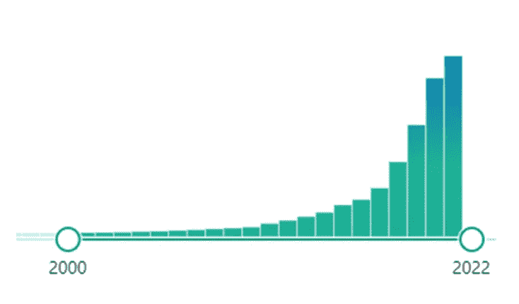
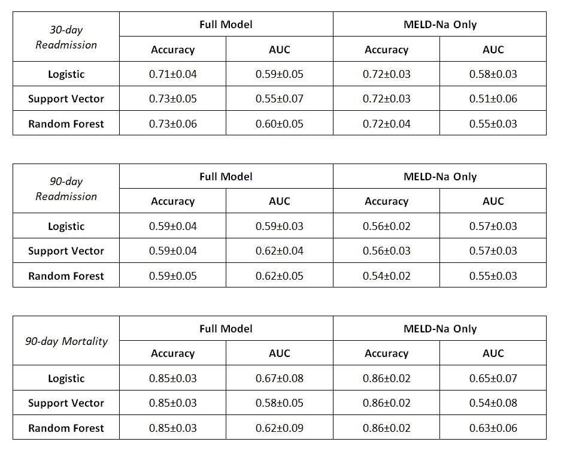
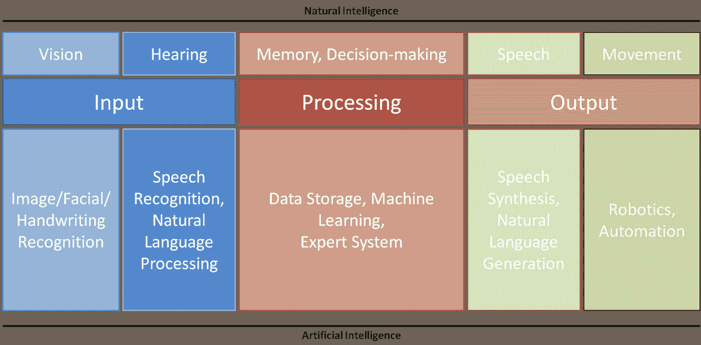
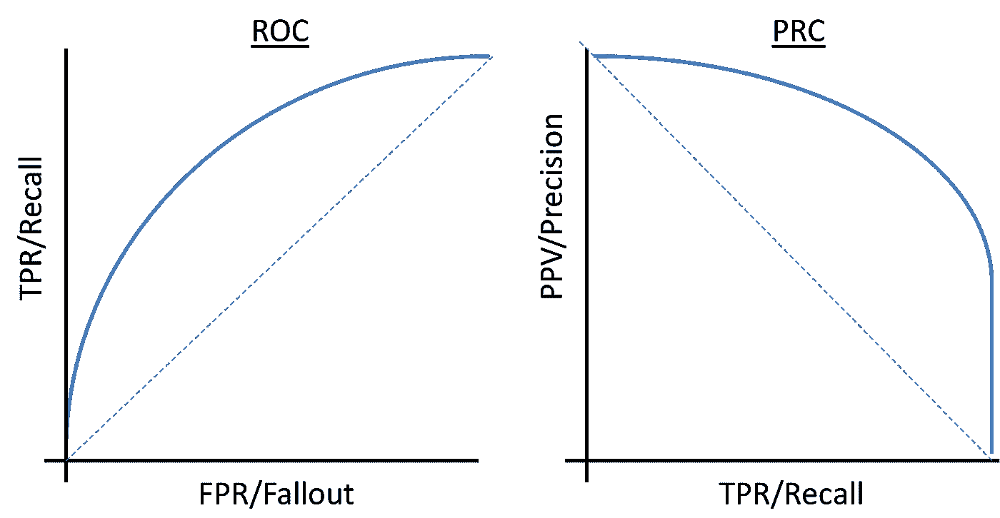

# 医学中的机器学习——期刊俱乐部

> 原文：<https://towardsdatascience.com/machine-learning-in-medicine-journal-club-5696e5b71f3d?source=collection_archive---------13----------------------->

## [思想和理论](https://towardsdatascience.com/tagged/thoughts-and-theory)

## 对临床文献中使用机器学习技术的批判性评价

**呼吁建立科学期刊中报告机器学习模型的文档标准**

照片由[德克·海斯](https://unsplash.com/@dheiss?utm_source=unsplash&utm_medium=referral&utm_content=creditCopyText)在 [Unsplash](https://unsplash.com/s/photos/readmission-death?utm_source=unsplash&utm_medium=referral&utm_content=creditCopyText) 上拍摄

## **简介**

过去几年，机器学习技术在生物医学研究中的使用呈爆炸式增长，PubMed 上以“机器学习”一词为索引的期刊论文数量从 2015 年的 3200 篇激增至 2020 年的 18000 篇。虽然由于机器学习，重大的科学进步已经成为可能，但大多数机器学习算法的内部工作对许多临床医生来说仍然是陌生的，他们中的大多数人非常熟悉传统的统计方法，但几乎没有接受过高级计算机算法的正式培训。不幸的是，期刊审稿人和编辑有时满足于接受机器学习作为一种黑箱操作，并且无法以应用于其他临床和基础科学研究的相同审查水平来分析机器学习模型产生的结果。

pubmed.gov 上被索引为“机器学习”的期刊文章数量。图片作者。

这个期刊俱乐部的目标是帮助读者发展必要的知识和技能，以消化和评论涉及使用机器学习技术的生物医学期刊文章。如果评审者不理解这些算法是如何工作的，他/她很难知道该问什么问题。我们不会关注研究的内容或临床意义，而是关注与机器学习技术相关的方法和技术细节。我们希望强调研究人员在临床研究中结合机器学习时犯的一些陷阱和常见错误，并加强科学研究出版物中批判性评估的重要性。

## **条**

[胡 C、安朱尔 V、萨布 K、雷迪 KR、奥利里 J、坦登 P、王 F、加西亚-曹 G、卡马特 PS、赖 JC、比金斯 SW、法伦 MB、图鲁瓦特 P、苏布拉马尼安 RM、马利亚克卡尔 B、巴尔加斯 H、萨克 LR、伊耶 RK、巴贾杰 JS。**使用机器学习对肝硬化患者再入院和死亡的预测性较低。**胃肠病学杂志。2021 年 2 月 1 日；116(2):336–346.PMID: 33038139。](https://pubmed.ncbi.nlm.nih.gov/33038139/)

我们选择了这篇最近发表在《美国胃肠病学杂志》上的论文作为我们杂志俱乐部的第一篇文章，因为它强调了建立一个正式标准的必要性，或者至少是一个被广泛接受的惯例，以记录机器学习模型，就像大多数系统综述或元分析报告他们的方法和发现一样。

对于那些不熟悉胃肠病学领域的人来说，美国胃肠病学杂志是美国胃肠病学学会的官方杂志，该学会本身就是该领域的顶级专业学会。该期刊被广泛认为是该领域的顶级期刊之一，2018 年的影响因子为 10.241。

## **背景**

与普通人群相比，肝硬化患者出院后再次入院和死亡的风险更高，这可能归因于疾病的复杂性以及该患者群体特有的其他社会心理/社会经济因素。能够客观地评估单个患者的再入院和死亡风险在出院计划和护理过渡方面具有临床意义。

终末期肝病模型(MELD)最初被开发用于预测接受选择性经颈静脉肝内门体分流术的患者的 [3 个月死亡率，现已被广泛研究并](https://pubmed.ncbi.nlm.nih.gov/10733541/)[在外部被验证为肝硬化患者死亡率的预测因子](https://journals.lww.com/md-journal/fulltext/2017/06160/MELD_score_as_a_predictor_of_mortality,_length_of.33.aspx)。

MELD 分数。图片作者。

尽管 MELD 评分是最广泛使用的肝病严重程度的客观指标，但它远非完美。它在低范围内的辨别能力(<15) is very poor, as demonstrated by the nearly flat mortality curve in Figure 5 of [本文](https://pubmed.ncbi.nlm.nih.gov/16697729/))。我们还知道，MELD 评分的区分能力取决于肝病的潜在病因，如[本文](https://pubmed.ncbi.nlm.nih.gov/31394020/)的表 1 所示，以及 MELD 评分未涵盖的其他临床变量。

## **假设和具体目标**

在这篇文章中，作者假设机器学习模型可以用来预测这些风险，并且这些模型将优于“传统的临床数据和生物统计学”。

该论文的具体目的是使用机器学习“预测多中心北美住院肝硬化队列中 30 天和 90 天的再入院和死亡”。

## **方法**

*   研究形式——多中心回顾性观察队列研究。
*   研究人群——北美终末期肝病研究联盟(NASCELD)中的受试者，包括 14 家三级医院。
*   纳入标准——非选择性入院的确诊肝硬化患者。
*   排除标准——HIV 感染和既往器官移植。
*   研究期——出院后 90 天。

## 数据收集

入院变量——人口统计学、肝硬化严重程度、MELD、MELD-Na 和 Child-Pugh 评分、入院时的全身炎症反应综合征、入院时的药物治疗和入院原因。

医院病程变量——继发感染、个体器官衰竭和慢加急性肝衰竭。

出院变量——实验室值和肝硬化严重程度，如 MELD 和药物。

## **模型开发**

本文包括三种不同的机器学习技术，包括逻辑回归、支持向量机和随机森林。

*逻辑回归(LR)*

*   [sklearn.linear_model。使用默认的 L2 正则化和默认的反正则化强度 1.0。](https://scikit-learn.org/stable/modules/generated/sklearn.linear_model.LogisticRegression.html)

*支持向量机(SVM)*

*   [sklearn.svm.SVC](https://scikit-learn.org/stable/modules/generated/sklearn.svm.SVC.html) 使用默认的 RBF 核和默认的逆正则化强度 1.0。

*随机森林(RF)*

*   仅使用 20 个估计器和最大深度 5。所有的超参数都被假定为默认值。

有趣的是，作者使用 10 重交叉验证，仅将显著不同的特征纳入模型(p <0.05) between subjects with positive outcomes and subjects with negative outcomes. The rationale for this decision was not mentioned in the paper.

Model performance was evaluated based on the area under the [受试者工作特征曲线](https://en.wikipedia.org/wiki/Receiver_operating_characteristic) (AUC)。

## **结果**

最终分析包括 2170 名受试者，平均年龄为 57 岁，大多数(61%)为男性，大多数(79%)为白人。平均 MELD-Na 得分为 20.7 分。30 天再入院率为 28%，90 天再入院率为 47%。90 天死亡率为 13%。

尽管论文的很大一部分致力于讨论所获得的各种临床变量，但论文中只有表 4-6 与机器学习相关，这里复制了一部分用于讨论。

表 4–6 的部分内容。图片作者。

作者得出结论，LR 模型和 RF 模型表现最好。他们认为，这两个类别之间的许多临床变量可能有显著的重叠(再入院与非再入院，死亡与非死亡)，使得算法难以定位最佳超平面。他们还提出，LR 模型和 SVM 模型的性能可能受到许多分类特征的影响。最重要的是，作者得出结论，所有三种机器学习技术创建的完整模型仅比仅使用 MELD-Na 分数创建的模型略好，并且“多种人工智能技术通过机器学习的预测能力不是最理想的”。

## **文章评论**

在我们深入研究文章内容之前，值得注意的是，“机器学习”这个术语在文章的正文中只使用了一次，在下面的句子中:“我们需要机器学习和人工智能(AI)技术等其他方法来预测这些结果”。在整篇文章中，作者将机器学习模型称为“AI 模型”。虽然“人工智能”和“机器学习”之间的区别纯粹是语义上的，但它在一篇发表在顶级 GI 期刊上的文章中的误用引起了人们的怀疑，即作者和编辑可能对该主题不是非常熟悉。想象一下，如果我们正在阅读一篇关于氩等离子体凝固术在动静脉畸形治疗中的应用的文章，但作者一直将其称为电外科手术。根据记录，人工智能是一个总括术语，用于描述使用技术模仿自然智能。机器学习是人工智能的应用之一。其他应用包括机器人、计算机视觉、语音识别和自然语言处理。

人工智能领域。图片作者。

*绩效指标*

让我们从文章的主要结论开始分析，即机器学习模型对肝硬化患者的再入院或死亡的可预测性较低。如果我们仔细查看表 4、5 和 6 中报告的数字数据，我们可以看到，在所有三种结果(30 天、90 天再入院和 90 天死亡率)、所有三种机器学习技术(LR、SVM 和 RF)以及两种性能指标(准确性和 AUC)方面，完整模型和仅 MELD-Na 模型之间没有统计学上的显著差异。事实上，所有三种机器学习技术的性能指标彼此非常接近，尽管这些模型都是使用默认的超参数构建的，没有经过优化。我们怀疑这种奇怪的观察结果可能是由于性能指标选择不当造成的。

这里一个重要的学习点是，准确性和 AUC 不应该在结果不平衡的数据集中用作性能指标。使用准确性更容易证明这个缺陷。想象一下，我们正在建立一个模型来预测一种患病率为 99%的罕见疾病，尽管在实践中完全没有用。事实上，我们可以看到 30 天再入院模型和 90 天死亡率模型的准确性非常接近 30 天未再入院率(100%-28% = 72%)和 90 天生存率(100%-13%=87%)。如本文所述，AUC 在面对高度不平衡的数据集时也会遇到同样的问题。从本质上讲，表 4、5 和 6 中的结果并没有告诉我们这些模型的性能，只是基础数据集非常不平衡。作者应该做的是使用一条[精确回忆曲线](https://en.wikipedia.org/wiki/Precision_and_recall)和 [F-1 分数](https://en.wikipedia.org/wiki/F-score)，它们不受班级不平衡的影响。

ROC 曲线和 PR 曲线。图片作者。

文章中使用这两个性能指标的方式还有另一个问题。请记住，机器学习模型的输出是一个数值，代表某个主题属于某个类别的概率。ROC 曲线和 PR 曲线本质上是各种性能指标(ROC 的 TPR 和 FPR，PRC 的精度和召回)随着概率从 0 增加到 1 的变化的图形表示。因此，这些曲线下的面积对应于模型的内在鉴别能力。在我们可以在临床实践中实际应用该模型之前，我们必须首先确定一个适当的概率阈值，该阈值取决于不同错误分类的相对成本(例如，结肠镜检查中遗漏癌症诊断的成本与进行不必要的活检的成本)。包括准确度和 F-1 分数在内的某些性能指标特定于特定的概率阈值(即，它们代表曲线上的单个点)。它们不应该用于比较不同机器学习模型的性能。在这篇文章中，作者没有披露与准确性相关的概率阈值是如何确定的(假设他们只是使用默认值 0.5)，他们似乎也使用准确性作为模型区分能力的替代措施。

*超参数调谐*

这篇文章最奇怪的部分是，所有三个机器学习模型本质上都是使用默认的超参数(除了随机森林模型的树计数和树深度)构建的。这些默认超参数不太可能产生最佳模型，尤其是考虑到特征的复杂性。没有解释为什么作者为随机森林模型选择如此低的树数 20 和相对浅的树深 5。这个缺陷是为什么应该有一个正式标准来记录机器学习模型开发过程的明显例子。作者评估的超参数范围应明确记录。理想情况下，补充材料中应有图表显示与每个超参数相关的模型性能变化。应该清楚地解释选择异常高或异常低的超参数的理由。对于 LR 模型，应该使用[逐步特征选择](https://en.wikipedia.org/wiki/Stepwise_regression)进行特征选择，并且应该清楚地报告过程中每一步的相关统计测量。对于 RF 模型，应报告[基于杂质的特征重要性](/understanding-feature-importance-and-how-to-implement-it-in-python-ff0287b20285)，以确保所包含的特征确实有助于最终模型。底线是，应该向文章的评论者和读者提供足够的信息，以便在必要时复制和验证作者的主张，就像任何其他基础科学和临床研究论文一样。

*数据预处理*

本文的另一个主要问题是缺少关于数据预处理的文档。作者在补充内容中提到“预处理包括两个主要步骤:清理数据集，然后挖掘新特征。清理数据集涉及处理数据中不正确、冗余或缺失的值，而特征挖掘涉及从数据中识别新特征”。在这些数据预处理步骤中进行的详细操作，如发现缺失数据的比例和使用的插补方法，没有披露。因为特征由各种范围和基数的数字和分类特征组成，所以在应用于模型之前，可能需要对数字特征进行归一化，并对分类特征进行编码。如上所述，应该公开准确的标准化参数和编码方案，以便审查者和读者在必要时可以复制模型。

## **总结**

本文试图解决一个临床上重要的问题，即使用机器学习技术预测肝硬化患者的再住院和死亡率。由于该任务本质上是一个简单的分类问题(readmit vs. not，death vs. not)，因此使用简单的机器学习分类模型，包括逻辑回归、支持向量机和随机森林，似乎是合适的。作者能够从一个完善的多中心队列中收集大量高质量的训练数据，这有助于最大限度地提高该研究的外部有效性。

不幸的是，这篇文章被机器学习模型的实现和分析中的几个主要问题所困扰。缺少关于数据预处理和模型开发步骤的重要文档，使得评审者和读者几乎不可能重现/验证研究结果。模型没有完全优化(或者至少没有优化过程的文档)。使用的性能指标，即准确性和 AUC，不适合本文的目的(请记住，准确性是一个取决于概率阈值的点测量，而 AUC 在高度不平衡的数据集中是不准确的)。

尽管发表在顶级 GI 期刊之一，但这篇文章在应用机器学习技术方面包含足够多的缺陷，足以使其发现和结论无效。应该鼓励研究人员尝试建立其他机器学习模型来预测肝硬化患者的再入院和死亡率。

## 学习要点

*   在高度不平衡的数据集中，接收器操作特征曲线下的面积和精确度可能不合适。
*   应清楚记录与机器学习模型开发流程相关的详细信息，包括缺失值插补、标准化、编码和超参数调整。