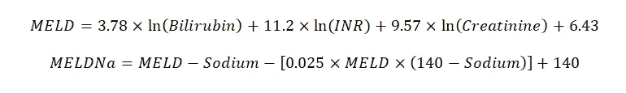
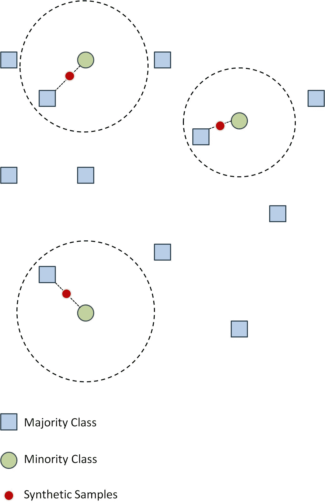
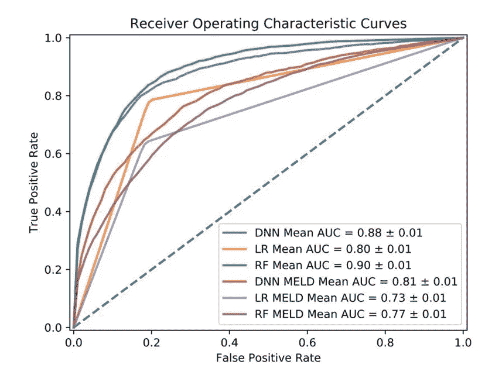
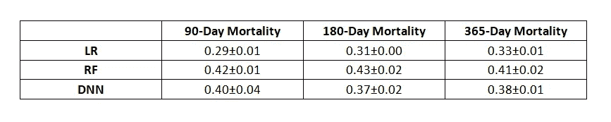
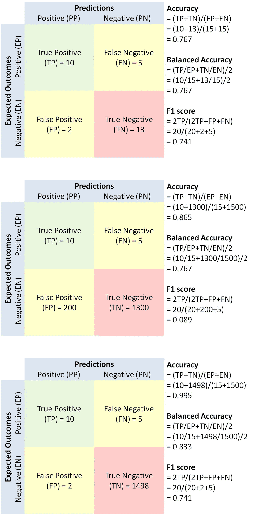

# 医学中的机器学习——期刊俱乐部 II

> 原文：<https://towardsdatascience.com/machine-learning-in-medicine-journal-club-ii-2796d9c1973f?source=collection_archive---------45----------------------->

## 对临床文献中使用机器学习技术的批判性评价

当心那些将苹果比作橙子，或将客机比作汽车的说法。

由[丹尼尔·法齐奥](https://unsplash.com/@danielfazio?utm_source=unsplash&utm_medium=referral&utm_content=creditCopyText)在 [Unsplash](https://unsplash.com/s/photos/apple-orange?utm_source=unsplash&utm_medium=referral&utm_content=creditCopyText) 上拍摄

## 介绍

欢迎来到医学杂志俱乐部的机器学习的另一个入口。让我们提醒大家，这个期刊俱乐部的目标是帮助读者发展必要的知识和技能，以消化和评论涉及使用机器学习技术的生物医学期刊文章。尽管它的一些术语和概念听起来可能很奇怪，但机器学习不是魔法，我们应该像对待任何其他临床研究一样，以同样的怀疑态度评估这些技术的使用所带来的发现。为了这个期刊俱乐部的目的，我们将不会关注研究的内容或临床意义，而是关注与机器学习技术相关的方法和技术细节。一路上，我们希望强调一些陷阱和常见错误，并消除一些与机器学习相关的常见误解。

## **文章**

[郭 A，马祖姆德 NR，DP，福拉克尔 RE。用机器学习预测电子健康记录中肝硬化患者的死亡率。公共科学图书馆一号。2021 年 8 月 31 日；16(8):e0256428。doi:10.1371/journal . pone . 0256428 . PMID:34464403；PMCID: PMC8407576。](https://pubmed.ncbi.nlm.nih.gov/34464403/)

为了继续我们上一篇期刊俱乐部条目中的肝硬化主题，我们选择了 PLoS One 最近发表的这篇论文，因为这篇文章的作者旨在使用类似的技术回答上一篇文章提出的相同问题，但他们的结论完全相反。我们应该试着理解这些作者的不同做法导致了不同的结果。

《公共科学图书馆·综合》是一个同行评审、开放获取的在线期刊，旨在让所有人都能免费获取科学出版物。该杂志发表科学、工程、医学和社会科学所有领域的研究。尽管该杂志没有公布其影响因子，但它被认为是医学领域中声誉卓著且具有合理选择性的杂志。

## **背景**

肝硬化患者在首次诊断时通常具有很少症状的亚临床疾病。这种疾病通常会经历多年缓慢和惰性的过程，但在一小部分患者中，疾病可能会发展，这些患者可能会在没有警告的情况下迅速失代偿。能够预测单个患者的死亡风险在预防失代偿事件和对住院和门诊患者管理进行分类方面具有临床意义。

终末期肝病模型(MELD)最初被开发用于预测接受选择性经颈静脉肝内门体分流术患者的 3 个月死亡率，现已被广泛研究和外部验证为肝硬化患者死亡率的预测因子。

MELD 分数。图片作者。

尽管 MELD 评分是最广泛使用的肝病严重程度的客观指标，但它远非完美。它在低范围内的辨别能力(<15) is very poor, as demonstrated by the nearly flat mortality curve in Figure 5 of [本文](https://pubmed.ncbi.nlm.nih.gov/16697729/))。我们还知道，MELD 评分的区分能力取决于肝病的潜在病因，如[本文](https://pubmed.ncbi.nlm.nih.gov/31394020/)的表 1 所示，以及 MELD 评分未涵盖的其他临床变量。因为最初的模型仅被验证用于预测 90 天的死亡率，所以它在预测长期死亡率方面的表现是不确定的。

## **假设和具体目标**

在这篇文章中，作者假设机器学习模型在预测肝硬化患者的短期和长期死亡率方面优于 MELD 评分

本文的具体目的是使用机器学习来预测一个大型学术肝移植中心肝硬化队列中 90 天、180 天和 365 天的死亡率。

## **方法**

*   研究形式——单一回顾性观察队列研究。
*   研究人群——医院电子病历系统中包含的受试者。
*   纳入标准-在 2021 年 1 月 1 日至 2019 年 12 月 31 日之间添加了初始诊断代码为肝硬化的成年患者。
*   排除标准—无。
*   研究期——任何肝硬化相关诊断代码首次出现后的 365 天。
*   结果——90 天、180 天和 365 天的全因死亡率。
*   特征-人口统计、首次诊断代码时或之前测量的实验室数据，以及与初次诊断相遇相关的信息(例如，相遇类型、确切诊断等。)

## **数据预处理**

与前一篇文章不同，本文作者更详细地描述了数据预处理步骤。缺失值超过 10%的特征不包括在模型中。否则，多重插补(大概是[sk learn . impute . iterative impute r](https://scikit-learn.org/stable/modules/generated/sklearn.impute.IterativeImputer.html))用于数字特征，而模式插补用于分类特征。作者还使用均值插补而不是多重插补建立了单独的模型，并在文章的补充内容中提供了结果。

作者还承认，由于整体死亡率较低，训练数据集非常不平衡。为了解决这种类别不平衡，作者采用了[合成少数过采样技术(SMOTE)](https://en.wikipedia.org/wiki/Oversampling_and_undersampling_in_data_analysis#SMOTE) 来生成在模型训练阶段使用的合成样本。

合成少数过采样技术。图片作者。

## **车型开发**

本文包括三种不同的机器学习技术，包括逻辑回归、随机森林和深度神经网络

*逻辑回归*

*   大概是用 [sklearn.linear_model 实现的。L2 正则化和反正则化强度为 1.0 的逻辑回归](https://scikit-learn.org/stable/modules/generated/sklearn.linear_model.LogisticRegression.html)。
*   正则化优化:L1 和 L2 正则化和 10 个不同的正则化强度之间的 0 和 4。

*随机森林(RF)*

*   假设使用具有 500 个估计器的[sk learn . ensemble . randomforestclassifier](https://scikit-learn.org/stable/modules/generated/sklearn.ensemble.RandomForestClassifier.html)实现，并且每个估计器的特征数量被设置为特征总数的平方根。所有的超参数都被假定设置为默认值
*   树计数优化:200、500 和 700 估计器
*   最大功能数优化:自动、平方根和 log2

*深度神经网络(DNN)*

*   大概是用 [keras.models.Sequential](https://keras.io/guides/sequential_model/) 和 [keras.layers.Dense](https://keras.io/api/layers/core_layers/dense/) 实现的，每层有 4 个隐藏层和 128 个节点。Sigmoid 函数用于输出层，ReLu 函数用于隐藏层。使用二值交叉熵损失作为损失函数。Adam optimizer 用于 512 的小批量。
*   网络深度优化:2 至 8 层
*   层维度优化:128 和 256 个节点
*   批量优化:64、128 和 512。

基于[受试者操作特征(ROC)](https://en.wikipedia.org/wiki/Receiver_operating_characteristic) 曲线下面积(AUC)、总体准确性和使用 5 重交叉验证的 F1 得分，对模型性能进行评估。

## **结果**

最终分析包括 34，575 名受试者，平均年龄为 60.5 岁，性别分布均匀，大多数(77.5%)为白人。入院时平均 MELD-Na 评分为 11.5 分。90 天、180 天和 365 天的死亡率分别为 5.2%、6.4%和 8%。

最终，41 个特征被包含在完整的模型中。作者还创建了仅使用钠、肌酐、总胆红素和 INR(MELD-Na 评分的组成部分)的部分模型。

图片由[郭等人提供。艾尔。PLoS One](https://www.ncbi.nlm.nih.gov/pmc/articles/PMC8407576/) 。根据[知识共享署名许可](https://creativecommons.org/licenses/by/4.0/)转载。

文章的图 2 显示了三个完整模型和三个部分模型在预测 90 天、180 天和 365 天死亡率方面的性能。任何敏锐的读者都会立即注意到图 2a、2b 和 2c 看起来几乎一模一样。在所有三个结果中，每个模型的 AUC 值也非常接近。

作者基于 F1 分数认为，在所有三个结果中，完全 RF 模型和完全 DNN 模型比完全 LR 模型表现更好。

三款车型的 F1 成绩。图片作者。

使用相同的性能指标，作者还认为三个完整模型优于三个部分模型。作者通过计算三个完整模型的特征重要性，进一步研究了每个特征的贡献。作者总结说，虽然 MELD-Na 变量非常重要，但其他特征和实验室值也“在预测中发挥着重要作用”

## **文章批判**

我们将从表扬作者做得对的事情开始我们的评论。与以前的文章不同，这篇文章在方法部分提供了更多的细节，以允许评审者和读者重现模型。作者甚至提供了联系信息，以便索取原始数据集的副本。唯一可以做得更好的是在补充材料中提供生成模型的原始代码。在没有原始代码的情况下，我们必须做出某些假设，例如用于生成这些模型的默认超参数值。

我们还应该赞扬作者描述了对模型所做的优化。这当然表明作者已经做出了合理的努力来最大化他们模型的性能，超参数是基于系统分析选择的，而不是凭空捏造的。这对于 DNN 模型尤其重要，因为人工网络的性能可能会因所使用的超参数而有很大差异。如果我们吹毛求疵，我们可能会要求对 RF 模型的树深度超参数进行额外的优化，这通常会产生额外的性能改进。我们可能还会要求对 Adam 优化器设置进行额外的优化，这在大多数情况下也会影响模型的性能。理想情况下，作者将在文章的补充材料中包括这些优化的结果，以表明最终的超参数值确实与每个模型的峰值性能相关。

最后，我们应该赞扬作者在训练阶段通过使用 SMOTE 技术来解决班级不平衡的努力。SMOTE 和其他[过采样技术](https://imbalanced-learn.org/dev/references/over_sampling.html)，如 AdaSyn、Borderline SMOTE 和 SVM-SMOTE，被广泛认为是处理类别不平衡的最先进技术，而[已被证明可以改善学习](https://sci2s.ugr.es/keel/pdf/algorithm/congreso/2008-He-ieee.pdf)。

*车型对比*

我们对这篇文章的主要批评源于论文结论部分的一句话，即“机器学习和深度学习模型优于肝硬化患者风险预测的当前标准”。作者声称，他们的机器学习模型在预测短期和长期死亡率方面优于 MELD-Na 评分，MELD-Na 评分是肝硬化患者风险预测的当前标准。论文的引言部分也多次提到 MELD-Na 评分的局限性。然而，如果我们花点时间仔细考虑方法部分和结果部分，我们会意识到该研究从未被设计成直接比较机器学习模型的性能和 MELD-Na 分数的性能。作者所做的是将包含 41 个特征的完整模型与仅包含 4 个特征的部分模型进行比较。除非额外的 37 个特征都是由随机生成的值组成的，否则完整模型比部分模型表现得更好就不足为奇了。支持作者声称机器学习模型优于 MELD-Na 评分的唯一方法是将模型应用于一个[原始数据集，该数据集验证了 MELD 评分](https://journals.lww.com/md-journal/fulltext/2017/06160/MELD_score_as_a_predictor_of_mortality,_length_of.33.aspx)作为肝硬化患者的死亡率预测指标。不幸的是，这篇论文没有这样做。作者可能声称他们的完整模型在 F1 分数的基础上表现相当好，但他们不能声称他们优于 MELD-Na 分数，除非他们能够证明他们的部分模型与 MELD-Na 分数相当。

我们也反对作者声称 RF 模型和 DNN 模型基于 F1 分数优于 LR 模型。我们将在后面讨论性能指标的问题，但我们必须首先强调直接比较不同建模技术的性能是徒劳的，这在最近的生物医学文献中不幸地变得相当常见，例如[这个](https://pubmed.ncbi.nlm.nih.gov/30890116/)、[这个](https://pubmed.ncbi.nlm.nih.gov/32744882/)和[这个](https://pubmed.ncbi.nlm.nih.gov/30049182/)。决策树模型，如随机森林和梯度提升机器，受到每个决策点一次只能考虑一个特征的限制。逻辑回归模型受限于特征变量和结果变量的对数优势之间的线性关系。神经网络不受这些限制。给定足够数量的神经元和层，理论上，人工神经网络可以逼近任何连续函数。因此，一个适当调整的神经网络可以胜过其他机器学习技术开发的模型一点也不奇怪。然而，在选择机器学习技术时，除了原始精度之外，我们还必须考虑许多实际因素。例如，逻辑回归模型可以通过数学公式简明地捕获，并在任何生产环境中轻松实现，而随机森林模型或神经网络必须在可编程环境中实现。与决策树模型相比，训练神经网络需要更大的计算能力，并且通常需要大的训练数据集。发表一篇论文称，在同一数据集上进行训练后，神经网络在预测某一临床结果方面的表现优于逻辑回归模型，这与声称客机在地球上两个地方之间的行驶速度比汽车快一样没有意义。作为一个社区，我们需要停止这些毫无意义的比较。

*性能指标*

让我们继续讨论本文中性能指标的使用。正如我们在之前的 journal club 条目中所讨论的，准确度和 F1 分数(以及灵敏度/召回率/真阳性率、特异性/选择性/真阴性率、精确度/阳性预测值、阴性预测值)是分类模型性能的点估计。它们的值取决于用于分类的特定阈值。通常基于做出正确预测的成本与不正确预测的成本之间的平衡来选择适当的阈值。曲线下面积(AUC)衡量模型在分类阈值范围内的表现，因此是对模型内在区分能力的评估。本文作者在图 2 中正确地报告了作为主要性能指标的 AUC，但不幸的是忽略了一个事实，即他们应该使用精确召回曲线下面积(AUPRC)而不是 ROC 曲线下面积(AUROC)。记住 ROC 曲线容易受到类别不平衡的影响，而精确召回曲线则不会。由于 SMOTE 技术仅应用于训练数据集，而不是验证数据集，使用 AUROC 作为性能度量将导致由负面结果主导的扭曲估计。虽然我们已经指出在不同的机器学习技术之间进行性能比较是徒劳的，但我们也应该指出，根据 F1 分数进行这样的比较，而不指定每个模型的最佳 F1 分数是如何确定的，这甚至更糟。请记住，模型的 F1 分数可能会随着精确度-召回曲线的变化而显著变化，默认阈值 0.5 通常不是最佳阈值。

班级失衡与绩效指标。图片作者。

*网络架构*

最后，我们想评论一下本文中使用的神经网络模型。作者使用了一个多层感知器(这可能是一个比深度神经网络更准确、更简单的描述)，它包含 4 个隐藏层，每个隐藏层包含 128 个节点。对于一个简单的二进制分类任务来说，这是一个相当大的网络。作者在方法部分指出，他们在优化过程中测试了两种配置(128 个节点，256 个节点)，但不清楚他们为什么选择 128 个节点作为起点。虽然在神经网络体系结构上没有严格的规则，但一个经验法则是将隐藏层中的神经元数量设置为输入层(本例中为 41)和输出层(本例中为 1)之间的某个值。我们想知道作者是否可以用一个更有效设计的网络获得类似(甚至更好)的结果。作者似乎也没有对 Adam 优化器设置或历元计数执行任何优化，所有这些都会显著影响模型的性能。作者还应在方法部分指定用于预处理数值和分类值的标准化和编码方案，因为它们是评审者和读者重现模型所必需的。

## **总结**

这篇文章试图解决 MELD-Na 评分的缺点，即它在低范围内的辨别能力差，以及它不能使用机器学习技术预测长期死亡率。给定二元分类任务，选择逻辑回归模型、随机森林模型和人工神经网络是合适的。作者在方法部分提供了足够的细节来帮助评论者和读者重现模型。作者通过实现 SMOTE 技术考虑了类不平衡的问题。不幸的是，这篇文章的总体结论，即机器学习模型在预测死亡率方面优于 MELD-Na 评分，实际上并没有得到这项研究结果的支持。这篇文章还根据可能不太理想的 F1 分数，对三种建模技术的性能进行了一些不相关且未经证实的比较。总的来说，这篇文章能够成功地证明使用机器学习模型预测肝硬化患者的短期和长期死亡率，具有合理的区分能力。其他研究人员应该尝试通过将这些模型应用于其他数据集来从外部验证这些模型。

## **学习要点**

*   如果两个模型都进行了适当的优化，完整模型(由所有可用特征构成的模型)的性能将至少与部分模型(仅由特征子集构成的模型)一样好。
*   机器学习建模技术的选择除了结果模型的辨别能力之外，还基于许多因素。比较使用不同技术构建但在相同数据集上训练的不同模型的性能不会增加任何科学价值。
*   某些性能指标，如 ROC 曲线下面积和准确度会受到类别不平衡的不利影响，而其他指标，包括精确度-召回曲线下面积、平衡准确度和 F1 分数，则不受影响。