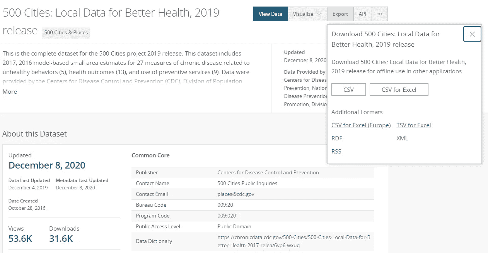
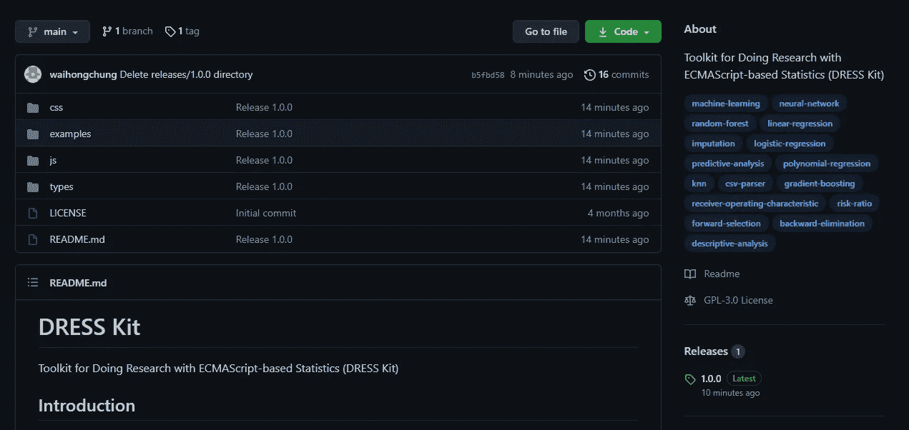
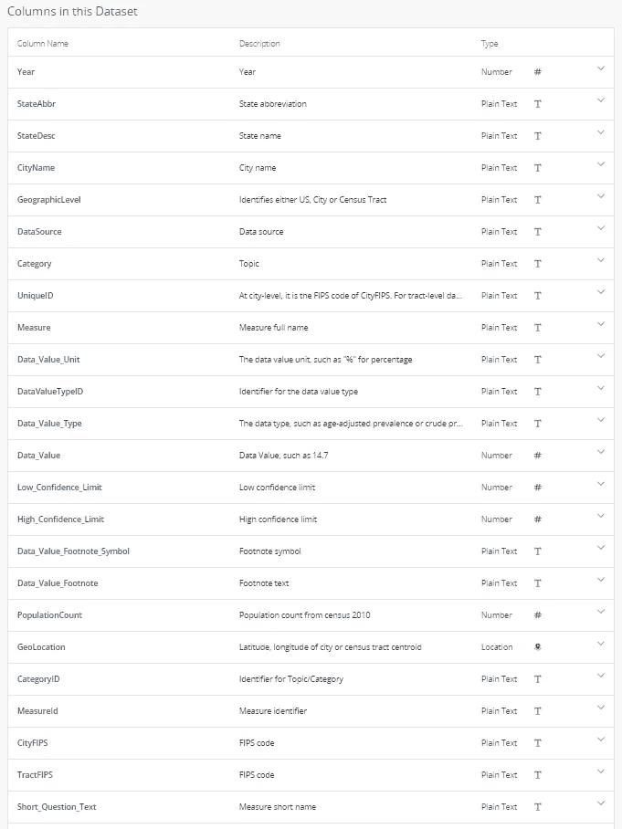

# 医学中的机器学习——第一部分

> 原文：<https://towardsdatascience.com/machine-learning-in-medicine-part-i-90a611025037?source=collection_archive---------23----------------------->

## 针对医生和医疗保健专业人员的机器学习技术实践入门课程。

# 概述/数据准备

国家癌症研究所的图片来自 Unsplash

# 介绍

过去几年，机器学习、深度学习和人工智能已经成为包括医疗保健在内的所有行业的最新流行语。很多人乐观地认为，机器学习可以帮助医生建立更早、更准确的诊断，并为复杂疾病(如癌症)提供更有效、更个性化的治疗。也有希望利用机器学习来提高医疗服务的效率，降低医疗成本。

不幸的是，对于大多数受过传统培训的医疗保健专业人员来说，机器学习仍然是一个相对模糊的概念。只有一小部分人消息灵通，足以批判性地评价关于这个主题的期刊文章，更少的人能够在他们的研究中利用这些技术。这门入门课程的目标是揭开机器学习的黑箱，揭示这些算法的内部工作原理，并介绍实现它们所必需的工具。

虽然网上肯定不缺乏机器学习教程，但预测[花瓣大小](https://archive.ics.uci.edu/ml/datasets/Iris)和[房价](https://www.cs.toronto.edu/~delve/data/boston/bostonDetail.html)与诊断癌症并不完全一样。因此，在本课程中，我们将使用健康结果相关的数据集来解决实际的临床问题。在此过程中，我们将尝试强调在使用机器学习技术设计临床研究时必须考虑的重要决策。

# 先决条件

本课程的目标受众包括医学生、医生和其他医疗保健专业人员。假定读者对常见的统计学概念(例如，平均值、标准偏差、置信区间、相关系数)有基本的了解，并且熟悉制定临床问题的过程。

还假设读者对 JavaScript 编程有操作上的理解(例如变量声明、数组操作、函数调用等)。虽然 JavaScript 编程不是标准医疗培训的一部分，但对于任何初学者来说，它肯定是最简单的编程语言之一(他们向五年级和六年级的学生教授它)。网上有很多免费的 JavaScript 入门课程，包括来自 [Codecademy](https://www.codecademy.com/learn/introduction-to-javascript) 、 [Learn-JS](https://www.learn-js.org/) 和 [Mozilla](https://developer.mozilla.org/en-US/docs/Web/JavaScript) 的课程。

最后，为了跟随实践教程，读者应该能够访问现代 JavaScript 引擎(例如 [Google Chrome](https://www.google.com/chrome/index.html) )和文本编辑器(例如 [Visual Studio 代码](https://code.visualstudio.com)或[括号](http://brackets.io))。

# 课程内容

*   第一部分——概述/数据准备
*   [第二部分—数据探索](https://medium.com/@waihongchung/machine-learning-in-medicine-part-ii-b9dc0098f825)
*   第三部分—线性/逻辑回归
*   第四部分-K-最近邻
*   第五部分——集成决策树
*   第六部分—神经网络
*   第七部分—待定

# 基本术语

在本课程中，我们将试图掩盖机器学习的许多枯燥的理论方面，并专注于机器学习技术的实际应用。然而，回顾一些基本术语是很重要的，这样我们才能理解这些不同的技术是如何相互联系的。

*   人工智能(AI):用计算机算法模拟自然智能。流行的人工智能算法正在模拟的自然智能的一些方面包括视觉感知、自然语言识别和机器学习。
*   机器学习(ML):人工智能领域的一个子域，专注于构建模型来表示现实世界的知识和经验。已经设计了各种机器学习技术，并且它们可以大致分为监督学习、非监督学习和半监督学习。
*   监督学习:一组机器学习技术，通过分析一组训练样本来模拟输入和输出之间的关系。监督学习技术的例子包括线性/逻辑回归、决策树、k-最近邻和神经网络。
*   无监督学习:一组机器学习技术，基于自组织从*未标记*数据中识别模式。无监督学习技术的例子包括主成分分析、聚类分析和神经网络。
*   神经网络(NN):也称为人工神经网络(ANN)，是一种模仿生物神经网络的机器学习技术。神经网络通常由相互连接的节点的集合组成，这些节点松散地模仿生物神经网络中的神经元。
*   深度学习:一组基于神经网络的机器学习技术，使用多层和大量神经元，以达到更高的抽象水平。

# 项目设置

在整个课程中，我们将探索一个公共领域数据集，名为 [500 个城市:改善健康的地方数据，2019 年发布](https://chronicdata.cdc.gov/500-Cities-Places/500-Cities-Local-Data-for-Better-Health-2019-relea/6vp6-wxuq)，由疾病控制和预防中心(CDC)提供。该数据集包括与不健康行为(5)、健康结果(13)和预防服务使用(9)相关的 27 种慢性病指标的估计值，这些指标来自美国 500 个最大的城市以及这些城市中大约 28，000 个人口普查区。

我们还将使用一个名为 [Toolkit 的开源 JavaScript 库，使用基于 ECMAScript 的统计数据进行研究(DRESS Kit)](https://github.com/waihongchung/dress) 来用 JavaScript 实际创建我们的机器学习模型。这个库是用普通的 JavaScript 编写的，可以在任何装有现代浏览器的计算机上运行，不需要任何特殊的软件。与其他流行的机器学习库相比，它的学习曲线要浅得多，例如 [Keras](https://keras.io) 或 [TensorFlow](https://www.tensorflow.org) ，但它相当快速和强大。

为准备本课程的后续部分，读者应完成以下任务:

1 -创建项目文件夹。

2 -从美国疾病预防控制中心网站下载 [500 个城市:改善健康的地方数据，2019 年发布](https://chronicdata.cdc.gov/500-Cities-Places/500-Cities-Local-Data-for-Better-Health-2019-relea/6vp6-wxuq)。点击右上角的**导出**按钮，然后点击 **CSV** 按钮。将文件另存为项目文件夹中的单独文件夹`/data`中的`data.csv`。

3 -从 GitHub 下载[礼服套装](https://github.com/waihongchung/dress)。点击右侧的**版本**部分，然后从版本 **1.0.1** 下载 **dress.zip** 。将 ZIP 文件中的`/js`文件夹和`/css`文件夹复制到项目文件夹中。

作者图片

作者图片

此时，您的项目文件夹中应该有以下文件/文件夹:

# 数据准备

任何研究项目的数据分析过程的第一步，无论是否与机器学习有关，都是数据准备。这意味着清理数据集，移除不必要的或错误的数据，并将数据文件转换为与所使用的数据分析工具兼容的格式。

整个 500 个城市的数据集超过 200MB，包含 810，000 行数据和 24 列，其中许多是冗余的。我们将通过删除不需要的行和列来精简数据集。我们首先检查与数据集相关联的数据字典。我们可以看到，该数据集包含 28，000 个人口普查区域以及美国 500 个最大城市和整个美国的数据点。出于我们研究项目的目的，我们希望将每个人口普查区域视为一个单独的研究主题。我们就忽略那些市级和国家级的数据点。我们还可以看到，数据集包含每个数据点的粗略患病率和年龄调整后的患病率。为了这个项目的目的，我们将使用粗患病率。

作者图片

1 -通过复制以下代码，在项目文件夹中创建一个名为`part1_1.htm`的新 HTML 文件。

这个 HTML 文件只是从 DRESS Kit 中加载必要的 JavaScript 库以及我们自己的 JavaScript 文件。

2 -通过复制以下代码，在项目文件夹中创建一个名为`part1_1.js`的新 JavaScript 文件:

让我们详细地看一下 JavaScript 代码。我们首先使用名为`DRESS.local`的函数加载`data.csv`文件。这个函数实际上并不自动加载文件，但是它在 HTML 文件上显示了一个[文件输入](https://developer.mozilla.org/en-US/docs/Web/HTML/Element/input/file)元素。在用户点击文件输入并选择合适的文件后，回调函数`processCSV`被调用。最后一个参数设置为`false`，这样`DRESS.local`函数就不会试图将内容解析为 [JSON](https://developer.mozilla.org/en-US/docs/Web/JavaScript/Reference/Global_Objects/JSON) 文件。`data.csv`文件的内容(整个 500 个城市的数据集)作为名为`csv`的参数传递给`processCSV`函数。

接下来，我们需要将数据集从 [CSV](https://en.wikipedia.org/wiki/Comma-separated_values) 格式转换成本地 JavaScript 数组。幸运的是，礼服工具包附带了一个专门为此设计的简洁的小功能，它被方便地命名为`DRESS.fromCSV`。我们只需将`csv`变量作为参数传递给函数，瞧，数据集就是一个对象数组。

之后，我们通过只选择包含普查区域级别数据和粗略患病率数据的行来过滤数组。正如我们所见，`DRESS.fromCSV`做的一件好事是将 CSV 文件的每一行转换成一个单独的 JavasScript 对象。我们可以使用相应的头作为属性名，将每个数据点作为对象的属性直接访问，例如`row.GeographicLevel`。

3 -如上所述，我们希望将每个人口普查区域作为研究对象。理想情况下，我们希望每个主题由一个对象来表示。不幸的是，这 27 种慢性病的每一种都记录在数据集中单独的一行中。我们需要一种方法来将每个普查区域的这 27 个度量值合并到一个对象中。如果我们要在其他预建的统计软件中处理数据集，这样的任务会非常困难，但是因为我们是在一个可编程的环境中工作，所以我们可以用几行代码轻松完成。

因为我们知道每个人口普查区域由一个唯一的标识符标识，所以我们可以使用它将相关的数据点分组到一个对象中。我们还利用这个机会丢弃那些不必要的列。此外，根据对数据集描述的阅读，我们知道不为人口数量少于 50 的人口普查区域提供数据，但由于某些原因，这些人口普查区域仍包含在数据集中。我们需要扔掉那些人口普查小册子。接下来，我们想要将数值，比如`PopulationCount`和`Data_Value`转换成数字，这可以在 JavaScript 中通过在变量前加上`+`符号来轻松完成，记住丢失的数据点由空字符串表示。最后，我们希望将新创建的主题数组保存到一个文件中，以备将来使用。这可以通过使用`DRESS.save`函数将内容和文件名作为参数传递来轻松完成。

4 -如果我们按原样运行代码，很可能会导致长时间运行的脚本错误。尽管效率很高，但使用 JavaScript 处理超过 200MB 的数据需要一定的时间。为了防止浏览器窗口冻结，我们将利用另一个名为`DRESS.async`的很酷的小函数，它允许礼服工具包中的任何函数异步执行。该函数返回一个[承诺](https://developer.mozilla.org/en-US/docs/web/javascript/reference/global_objects/promise)，它将最终解析为异步执行函数的输出。我们可以将 Promise 传递给另一个名为`DRESS.print`的函数，它用于在 HTML 上显示文本，以便在数据集被处理时显示一个计时器。

以下是最终代码:

在浏览器中打开`part1_1.htm`，点击文件输入按钮，选择`data.csv`文件，最后将`data.json`从浏览器默认下载文件夹复制到项目文件夹内的`/data`文件夹。

5 -我们选择使用`MeasureId`来确定慢性病的每一个衡量标准，因为它们很短，但有时很难弄清楚神秘的`MeasureId`是什么意思。我们可以构建另一个列表，按照`Category`对这些度量进行分组，并将每个`MeasureId`映射到度量的详细描述。只需创建另一个名为`part1_2.js`的 JavaScript 文件，并将其加载到另一个类似于`part1_1.htm`的 HTML 文件中。运行脚本并将`measures.json`复制到项目文件夹中以备将来参考。

# 包裹

让我们回顾一下我们在第一部分学到的内容。我们复习了一些与机器学习相关的基本术语。特别是，我们介绍了几种常见的机器学习算法的名称，如决策树、k-最近邻和神经网络，并讨论了它们如何相互适应。我们通过下载 500 个城市的数据集和设置着装套件来着手设置我们的项目。我们经历了数据准备过程，从数据集中提取有用的数据点。在这个过程中，我们从 DRESS Kit 中学习了几个基本函数，包括`DRESS.local`(加载本地文件)、`DRESS.save`(将文件保存到本地机器)、`DRESS.fromCSV`(将 CSV 文件转换为本地 JavaScript 对象)、`DRESS.print`(将文本打印到 HTML 上)和`DRESS.async`(异步执行函数)。

我们还没有真正做任何与机器学习有关的事情，但这将在本课程的后续部分中出现。敬请关注。

# 锻炼

作为练习，读者可以尝试准备另一个 JSON 文件，其中包含城市级别的数据，而不是人口普查区域级别的数据。