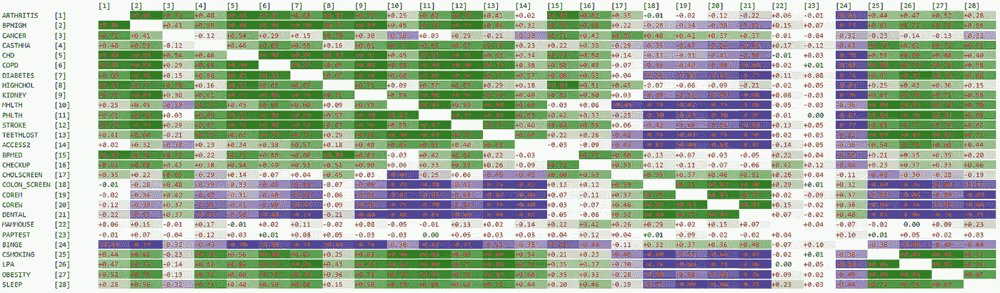

# 医学中的机器学习——第二部分

> 原文：<https://towardsdatascience.com/machine-learning-in-medicine-part-ii-b9dc0098f825?source=collection_archive---------25----------------------->

## 针对医生和医疗保健专业人员的机器学习技术实践入门课程。

# 数据探索

图片由粘土银行从 [Unsplash](https://unsplash.com/photos/_Jb1TF3kvsA/info)

# 概述

在本课程的 [第一部分](/machine-learning-in-medicine-part-i-90a611025037)中，我们介绍了几种常见的机器学习算法的名称，如决策树、k-最近邻和神经网络，并讨论了它们如何相互融合。我们通过下载一个公共领域数据集 [500 个城市数据集](https://chronicdata.cdc.gov/500-Cities-Places/500-Cities-Local-Data-for-Better-Health-2019-relea/6vp6-wxuq)并建立一个名为[着装套件](https://github.com/waihongchung/dress)的 JavaScript 机器学习库来建立我们的项目。接下来，我们完成了数据准备过程，使用 DRESS Kit 中的几个基本函数从数据集中提取有用的数据点，这些函数包括`DRESS.local`(加载本地文件)、`DRESS.save`(将文件保存到本地机器)、`DRESS.fromCSV`(将 CSV 文件转换为本地 JavaScript 对象)、`DRESS.print`(将文本打印到 HTML 上)，以及`DRESS.async`(异步执行函数)。在第一部分的最后，我们创建了一个 JSON 文件`data.json`，其中仅包含来自 500 个城市数据集的普查区域级别的粗略患病率数据，这些数据来自那些人口计数至少为 50 的普查轨道。我们还创建了一个 JSON 文件`measures.json`，它将`MeasureId`按`Category`分组，并将每个`MeasureId`从原始数据集映射到它的定义。

只是作为一个参考点，这里是`measures.json`的内容。

# 礼服套件更新

在继续本课程的其余部分之前，请花点时间更新[着装套件](https://github.com/waihongchung/dress)以发布 **1.1.0** 。该版本包含几项性能改进和一些新功能，包括生成直方图和热图，我们将在课程的这一部分探讨这些内容。

# 柱状图

我们通过对数据集进行基本的描述性分析来开始数据探索过程，这样我们就可以大致了解可用数据的质量。特别是，我们要注意是否存在任何缺失或错误的数据点，数字特征的相对范围(我们需要标准化/规范化这些特征吗？)、分类特征的维度(对这些特征进行[一键编码](https://en.wikipedia.org/wiki/One-hot)是否可行？)，以及这些特征的分布(正态、均匀、偏斜等。)

我们再次创建一个名为`part2_1.htm`的样板 HTML 文件，它加载了 DRESS Kit 以及我们的定制 JavaScript 文件`part2_1.js`。

我们使用`DRESS.local`函数加载在课程第一部分创建的数据集。请注意，第三个参数不再设置为`FALSE`，因为数据集现在存储为 [JSON](https://developer.mozilla.org/en-US/docs/Web/JavaScript/Reference/Global_Objects/JSON) 格式，JavaScript 可以对其进行本地解析。我们将慢性病的所有 27 项指标分配到一个数组中，这样我们就不必一遍又一遍地输入它们。数据科学家使用的最流行和最直接的数据探索技术之一是[直方图](https://en.wikipedia.org/wiki/Histogram#Cumulative_histogram)。它以简洁直观的方式描述了数据集中值的分布。虽然有大量的统计软件包可以生成高质量的多色直方图，但实际上并没有必要，因为直方图的整体思想是它代表了底层数据集的近似。我们可以从直方图的粗略轮廓中收集我们需要的所有信息，直方图可以使用`DRESS.histograms`函数生成。

在浏览器中打开`part2_1.htm`，点击文件输入按钮，选择`data.json`文件，生成基于文本的直方图列表。下面是该函数生成的三个直方图。

每个直方图都提供了几条关键信息。首先，它显示包含非空值的数据点的数量(和百分比)。我们可以看到，`CANCER`和`BPMED`度量没有空值，但是`COREW`度量缺少一小部分(0.4%)数据点。接下来，它计算值的范围(第一个条形代表最小值，条形之间的差异代表间隔，最后一个条形代表最大间隔)。例如，我们可以看到`CANCER`度量的范围在 0.7 到 22.9 之间。最重要的是，我们可以从条形图中看到值的粗略分布。我们可以看到`CANCER`指标严重向左倾斜，而`BPMED`指标严重向右倾斜。相比之下，`COREW`测量值几乎均匀分布在平均值周围。

`DRESS.histograms`函数也可以从分类特征生成直方图。只需将分类特性的名称作为第三个参数传递，如下所示:

我们可以看到，来自加利福尼亚州、纽约州和德克萨斯州的数据点构成了数据集的大部分，考虑到美国的人口分布，这并不完全出人意料。重要的是要记住，这个数据集中的每个`subject`指的是人口普查区域，而不是个人。还值得注意的是，某些州，如特拉华州、缅因州、佛蒙特州、西弗吉尼亚州和怀俄明州，人口普查区非常少，当我们实际使用数据集来构建我们的机器学习模型时，可能会产生一些问题。我们需要记住这一点。

# 归罪

请注意，数据集中的某些特征(如`COREW`度量)包含缺失的数据点。在临床研究中，缺失数据是一个相当普遍的问题；参与者可能在研究中途退出，数据可能输入错误，或者数据收集表可能放错了地方。这是大部分统计教材中提出随机缺失(MAR)、完全随机缺失(MCAR)、非随机缺失(MNAR)概念的地方。我们不会浪费时间讨论这些定义背后的无聊理论。可以说，MCAR 不会影响数据分析，但在现实中，几乎不可能证明数据是完全随机缺失的。MNAR 是完全相反的情况，其中数据丢失的原因与丢失数据的值有关。可靠地恢复丢失数据的唯一方法是通过修改数据收集步骤或数据分析步骤来解决根本原因。例如，在一项询问使用电脑时间的在线调查中，那些无法使用电脑(或至少无法访问互联网)的人可能不会出现在数据集中。研究者应尝试亲自收集数据，或者在分析过程中承认研究仅限于那些可以在线访问调查的人。没有一种通用的统计操作可以解决 MNAR。在大多数设计良好的临床研究中，我们处理的是 MAR，它可以通过某种统计方法来解决。一种策略是忽略那些缺失的数据点。我们可以丢弃整个主题，也可以只丢弃缺失的数据点，这取决于我们想要如何分析数据。第二种策略是用合理的估计值代替缺失的数据，这一过程称为插补。可以通过从其他非缺失数据点中随机选择一个数据点(例如，结转的最后观察或结转的基础观察)，通过计算算术平均值或模式，或通过某种统计回归分析来计算这种估计。

当我们真正建立我们的机器学习模型时，我们将展示一些基本的插补技术。我们还将了解到，一些机器学习技术可以反过来用作插补技术。

# 平均值、中间值和众数

更具分析性地探索数据的另一种方法是研究数据集的[集中趋势](https://en.wikipedia.org/wiki/Central_tendency)(均值、中值和众数)和[离差](https://en.wikipedia.org/wiki/Statistical_dispersion)(方差和四分位间距)。这些特性特别重要，因为许多其他统计方法，如回归分析，都在对它们进行操作，我们经常使用这些特性在两个或更多数据集之间进行比较(即治疗组是否比安慰剂组有更高的平均存活率)。

当然，DRESS Kit 附带了几个内置函数来计算数据集的集中趋势和分散度。

这也是脚本产生的结果的一部分。

`DRESS.means`函数计算平均值、[平均值](https://en.wikipedia.org/wiki/Mean)的 95%置信区间、[偏斜度](https://en.wikipedia.org/wiki/Skewness)(基于第三个[标准化矩](https://en.wikipedia.org/wiki/Standardized_moment))和超额[峰度](https://en.wikipedia.org/wiki/Kurtosis)(基于第四个标准化矩)。`DRESS.medians`函数计算[中值](https://en.wikipedia.org/wiki/Median)、四分位数范围、偏斜度(基于四分位数)和过度峰度(基于百分位数)。最后，`DRESS.frequencies`函数从一个分类特征中枚举出所有可能的值，并按其出现频率排序(第一个是[模式](https://en.wikipedia.org/wiki/Mode_(statistics)))。

一些非常敏锐的读者可能会指出，数据集中大多数特征的值并不是严格的正态分布，直方图的形状以及显著偏度和过度峰度的存在就是证明。然而，重要的是要注意，当我们处理成千上万的样本时，值是否正态分布就不那么重要了。如果我们应用正式的正态性检验算法，例如[夏皮罗-维尔克](https://en.wikipedia.org/wiki/Shapiro%E2%80%93Wilk_test)检验(可以通过使用函数`DRESS.normalities`轻松完成)，我们会发现数据集中的所有特征实际上都不是正态分布的。然而，仅仅因为测试结果在统计上是显著的，并不一定意味着它在实践中是有意义的。这里有一篇出色的[评论文章](https://pubmed.ncbi.nlm.nih.gov/11910059/)解释了这背后的统计数据。可以说，我们可以在这个数据集上安全地应用大多数参数统计操作，而不用担心潜在的正态性假设。

# 相互关系

了解了数据集中每个要素的特征后，我们应该将注意力转移到数据集中各种要素之间的关系上。请记住机器学习的整体思想，即基于数据集建立模型，然后使用该模型进行预测。理想情况下，我们希望看到数据集中的各种要素相互独立。换句话说，如果一个数据集中的所有要素都高度相关，那么该数据集实际上并不包含比另一个仅包含其中一个要素的数据集更多的信息。我们还想检查数据集中*暴露*特征和*结果*特征之间的任何相关性。如果暴露和感兴趣的结果之间存在简单的线性关系，那么就真的没有必要采用一些复杂的机器学习算法。

当然，DRESS KIT 附带了一个名为`DRESS.correlations`的函数，它可以自动计算皮尔逊相关系数(或斯皮尔曼等级相关系数)。不幸的是，该函数输出的文本可能很长，很难解释。幸运的是，我们可以使用`DRESS.heatmap`函数轻松地将文本输出转换成[热图](https://en.wikipedia.org/wiki/Heat_map)。

作者图片

绿色代表正相关，蓝色代表负相关。颜色的深浅表示相关性的强度。红色文字代表统计意义。我们可以看到，乳房 x 线摄影或巴氏涂片与其他特征之间几乎没有相关性，而代谢综合征的大多数组成部分，包括高血压、高胆固醇和糖尿病，彼此高度相关。这里有一个关于[多重共线性](https://online.stat.psu.edu/stat501/lesson/12/12.1)的精彩在线章节。当我们实际上试图建立和解释我们的机器学习模型时，我们需要记住这一点。

# 包裹

让我们复习一下第二部分所学的内容。我们经历了数据探索过程的基本步骤。我们首先使用`DRESS.histograms`函数创建一系列直方图，允许我们识别数据集中值的范围和分布。我们简要讨论了处理缺失数据的不同方法。接下来，我们通过使用`DRESS.means`、`DRESS.medians`和`DRESS.frequencies`计算平均值、中值和众数，重点关注数据集中每个特征的集中趋势和分散度。我们谈到了偏度和峰度的概念，并讨论了在处理大型数据集时，通常不必担心正态分布。最后，我们展示了一种使用`DRESS.correlations`和`DRESS.heatmap`函数来评估数据集中各种特征之间相关程度的方法。

现在，我们已经对数据集中的各种特征有了大致的了解，我们准备好继续使用该数据集构建我们的机器学习模型。