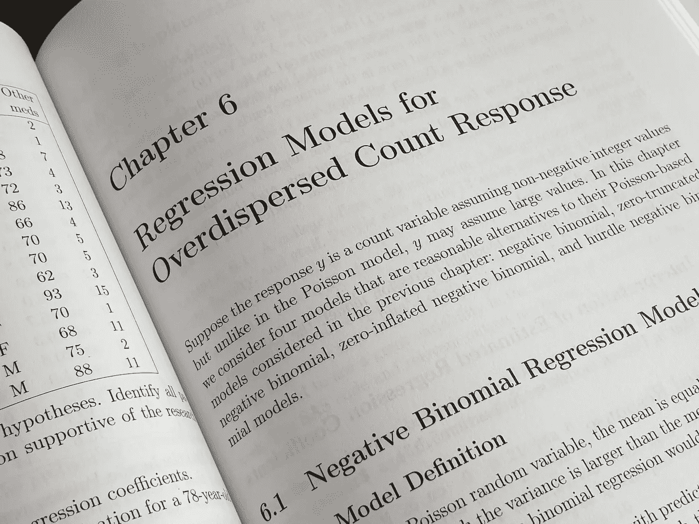
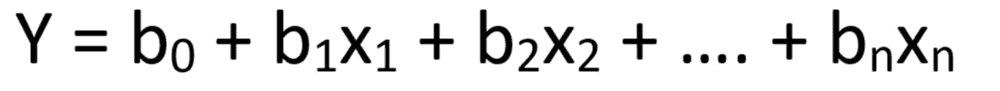
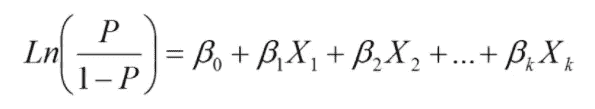
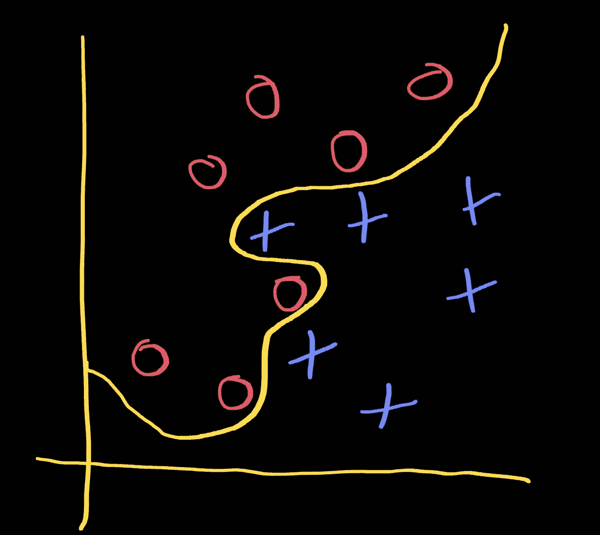

# 医学中的机器学习——第三部分

> 原文：<https://towardsdatascience.com/machine-learning-in-medicine-part-iii-8f3742e17c34?source=collection_archive---------33----------------------->

## 针对医生和医疗保健专业人员的机器学习技术实践入门课程。

# 线性/逻辑回归



[照片由来自 Unsplash 的 Eanyet Raheem 拍摄](https://unsplash.com/photos/3RQnQyyzA9c)

# 概述

在本课程的第二部分中，我们讲述了数据探索的基本步骤。我们首先通过使用`DRESS.histograms`生成直方图来调查数据集的分布。然后，我们使用`DRESS.means`、`DRESS.medians`和`DRESS.frequencies`研究了数据集中各种特征的集中趋势和分散程度。我们演示了使用`DRESS.heatmap`和`DRESS.correlations`来可视化数据集中各种特征之间的相关程度。同时，我们还引入了缺失值插补的概念。

需要强调的是，正确的数据探索过程涉及大量特定于数据集的分析，并且高度依赖于相关的领域知识。例如，基于这些检测的潜在生物化学，我们预期随机血糖测量值与血红蛋白 A1C 相比有显著更高的差异。类似地，当在普通人群中分析某些实验室值，如 INR 和肌酐时，我们也可以预期有严重的偏态分布。当我们探索一个数据集时，我们必须考虑这些特定于数据集的特征。

# 礼服套件更新

在继续本课程的其余部分之前，请花点时间更新[着装套件](https://github.com/waihongchung/dress)以发布 **1.2.0** 。这个版本包含几个重要的错误修复，包括几个线性/逻辑回归算法。

# 均值/众数插补

还记得我们的数据集中有一些缺失值吗？让我们从使用最简单的算法来估算这些缺失值开始:均值/众数估算法。该算法背后的基本原理源于[大数定律](https://en.wikipedia.org/wiki/Law_of_large_numbers)，该定律指出，对于足够大的样本，样本平均值向期望值收敛。如果样本很大，缺失值的数量很少，那么简单地用期望值替换那些缺失值是合理的，因为这不会对大多数参数统计操作的结果产生不利影响。

我们再次创建一个名为`part3_1.htm`的样板 HTML 文件，它加载了 DRESS Kit 以及我们的定制 JavaScript 文件`part3_1.js`。

`DRESS.meanMode`函数有三个参数，第一个是主题数组，第二个是数字特征数组，第三个是分类特征数组。因为在我们的数据集中，所有 27 个慢性病指标都是数字，我们可以忽略第三个参数。值得注意的是，`DRESS.meanMode`函数只认为`null`值缺失。数据集中的其他错误或缺失值应在被该函数处理之前转换成`null`。记住函数通过直接改变输入主题来填充缺失的值也很重要。

```
ARTHRITIS : 0 (0.00%) = 21.43
BPHIGH : 0 (0.00%) = 30.65
CANCER : 0 (0.00%) = 5.65
CASTHMA : 0 (0.00%) = 9.74
CHD : 0 (0.00%) = 5.60
COPD : 0 (0.00%) = 6.31
DIABETES : 0 (0.00%) = 10.81
HIGHCHOL : 0 (0.00%) = 31.36
KIDNEY : 0 (0.00%) = 3.10
MHLTH : 0 (0.00%) = 13.92
PHLTH : 0 (0.00%) = 12.88
STROKE : 0 (0.00%) = 3.21
TEETHLOST : 60 (0.22%) = 16.11
ACCESS2 : 1 (0.00%) = 16.99
BPMED : 0 (0.00%) = 70.74
CHECKUP : 0 (0.00%) = 69.01
CHOLSCREEN : 0 (0.00%) = 78.74
COLON_SCREEN: 19 (0.07%) = 61.79
COREM : 103 (0.38%) = 31.66
COREW : 109 (0.40%) = 29.83
DENTAL : 0 (0.00%) = 61.23
MAMMOUSE : 37 (0.14%) = 79.19
PAPTEST : 7 (0.03%) = 76.38
BINGE : 0 (0.00%) = 18.07
CSMOKING : 0 (0.00%) = 17.97
LPA : 0 (0.00%) = 27.59
OBESITY : 0 (0.00%) = 30.47
SLEEP : 0 (0.00%) = 36.72
```

我们可以从打印输出中看到每个特征中缺失值的数量以及用作替换的值。我们将在课程的后面介绍一些更复杂的插补算法。

# 选择建模技术

大多数机器学习建模技术可以用于创建回归模型(其中输出是连续的数值，例如年龄、体重、身高、实验室值)或分类模型(其中输出是几个不同值中的一个，例如性别、血型、种族)，这取决于模型的设置方式。如果调整得当，大多数建模技术都可以提供相当的性能。尽管如此，这些技术在各自的优势和局限性方面有很大的不同。当我们进行实际的研究时，我们应该根据每种技术的独特属性选择最适合我们研究问题的建模技术。

由于我们被限制在本课程的每个部分只使用一种机器学习建模技术，然而，我们必须构建我们的研究问题以适应每种技术的特定属性。

# 回归分析与机器学习

一些读者可能会问，为什么我们会考虑将[线性/逻辑回归](https://en.wikipedia.org/wiki/Regression_analysis)作为机器学习模型。毕竟，我们大多数人每天都在研究中使用这些简单的回归技术。让我们花一点时间来讨论这些回归技术的典型使用和它们作为机器学习模型的使用之间的概念差异。在生物医学期刊文章中，线性/逻辑回归几乎总是作为一种工具来证明预测因子和结果之间的联系。例如，在一项关于非酒精性脂肪性肝病(NAFLD)的研究中，作者可能希望表明体重指数(身体质量指数)和血红蛋白 A1C 是 NAFLD 发展的独立预测因子。为了做到这一点，作者将从有/无 NAFLD 的患者中收集各种临床数据，如年龄、性别、医学合并症和实验室值。通过使用逻辑回归，作者可以表明受试者被诊断为 NAFLD 的概率随着他/她的身体质量指数或血红蛋白 A1C 的增加而增加。作者也可以使用相同的模型来表明血清钾水平和 NAFLD 的发展之间没有关联。作者可以更进一步，通过建立一个线性回归模型来证明身体质量指数和 NASH 活动指数之间的线性相关性。这里的关键是，我们使用这些回归技术来证明预测因素和结果之间存在/不存在具有统计意义的*关联。*

*然而，当我们使用线性/逻辑回归构建机器学习模型时，我们的主要目标是最大化模型的预测性能，而我们往往不太关注这些关联的统计意义。我们将讨论如何衡量机器学习模型的预测性能，但暂时假设它与模型的准确性相同。让我们记住[统计显著性](https://en.wikipedia.org/wiki/Statistical_significance)按照惯例被设置为α0.05，这意味着我们只愿意接受小于 5%的 I 型错误(假阳性)的概率。然而，0.05 这个数字并没有什么神奇之处。事实上，开创统计假设检验概念的统计学家罗纳德·费雪建议根据每个特定的用例来设置 alpha。换句话说，仅仅因为一个预测因子与结果没有统计学意义上的联系，并不意味着它不能提高我们模型的整体准确性。我们也不太关心特定预测因素和结果之间的关联强度。事实上，正如我们将在本课程后面看到的，当我们构建机器学习模型时，我们有时会故意忽略某些预测因素，以尽量减少名为[过度拟合](https://en.wikipedia.org/wiki/Overfitting)的问题。*

# *模型概述*

**

*作者图片*

*线性回归通常用作机器学习模型来解决回归问题(即结果是连续的数字变量)。更重要的是，当有理由假设预测值和结果之间存在线性相关性时，它是最合适的，至少对于感兴趣的值范围是如此。例如，假设我们正在构建一个机器学习模型来预测患者的住院时间，以便优化床位利用率。有理由怀疑患有更多共病的患者会住得更久。相比之下，患者的体温可能不会随着停留时间的长短而线性变化，因为高温和低温都可以预测更长的停留时间。在具有多个预测器的典型机器学习中，不同的预测器可以在不同程度上和相反方向上与结果相关，从而实现一种“智能”，但是当所有其他预测器的值保持不变时，每个预测器应该与结果线性相关。*

**

*作者图片*

*多项式回归可以被认为是线性回归的一种变体。预测值和结果之间的关系不是线性相关(即直线)，而是曲线。根据多项式的次数，曲线可能有一个或多个最大值[或最小值](https://en.wikipedia.org/wiki/Maxima_and_minima)。换句话说，线性回归只是多项式回归的一个特例，其中多项式的次数设置为 1。通过在机器学习模型中混合线性和多项式回归，有可能创造出更复杂的“智能”。需要高度的领域知识来确定多项式的适当次数。*

**

*作者图片*

*逻辑回归通常用作机器学习模型来解决分类问题，特别是二元分类问题(即是/否、真/假、肯定/否定)。因为逻辑回归模型的原始输出指的是概率(即范围从 0 到 1 的连续数值)，所以使用逻辑回归来解决多类分类问题在技术上也是可行的。例如，如果最终结果属于四个可能值(A、B、C 和 D)之一，我们可以创建四个[一对其余](https://en.wikipedia.org/wiki/Multiclass_classification#One-vs.-rest)逻辑回归模型(即 A 对 B/C/D、B 对 A/C/D、C 对 A/B/D、D 对 A/B/D、D 对 A/B/C)，将数据集应用于所有四个模型，并选择返回最高概率值的模型。*

# *优势和局限性*

*线性/逻辑回归作为机器学习模型的优势之一是该技术基于成熟的数学算法。这意味着该算法被大多数统计分析软件包广泛支持。此外，回归公式中的常数清楚地定义了每个预测因子和结果之间的关系，从而使我们能够容易地确定每个预测因子的相对重要性。并且因为最终的模型用一个简单的数学公式简洁地表示，所以它可以很容易地部署到最终的应用程序环境中。*

**

*作者图片*

*线性/逻辑回归作为机器学习模型的局限性之一是，该模型只能支持平滑和连续的[决策边界](https://en.wikipedia.org/wiki/Decision_boundary)。想象一下，如果我们试图建立一个机器学习模型，将测试对象分类为红圈或蓝叉。很明显，使用简单的数学公式来表示黄线(即决策边界)几乎是不可能的(拥有如此复杂的决策边界是否有益是另一回事；提示:过拟合)。一般来说，如果我们有理由怀疑预测因子随结果线性变化，那么线性/逻辑回归可能是一个合理的选择。*

*同样需要注意的是，由于潜在的数学运算，线性/逻辑回归只能接受数值预测值。尽管在技术上可以使用[一键编码](https://en.wikipedia.org/wiki/One-hot)将分类预测值转换成数值，但这种方法并不是最有效的，并且倾向于在最终模型中过度表示那些分类预测值。*

# *线性回归*

*让我们开始构建我们的第一个机器学习模型。回想一下，数据集中慢性病的 27 个指标可以分为不健康行为(5)、健康结果(13)和预防服务的使用(9)。为了这个练习，让我们假设每个数据点代表一个城市/城镇。我们希望建立一个模型，使我们能够根据那些不健康的行为和预防服务的使用来预测每个城市/城镇的整体健康结果。*

*构建我们的机器学习模型所需的实际代码相当简单。我们只需将数据集、感兴趣的结果和一组预测值传递给`DRESS.linear`函数。*

```
*[PHLTH] R2: 0.92 aR2: 0.92 AIC: 7545.95 F: 20313.37 p: -0.00
(intercept) : +13.30 (95% CI 12.76 - 13.84) t: +48.21 p: 0.00
ACCESS2 : 0.00 (95% CI -0.01 - 0.00) t: -1.18 p: 0.24
BPMED : +0.08 (95% CI 0.07 - 0.08) t: +35.55 p: 0.00
CHECKUP : -0.04 (95% CI -0.04 - -0.03) t: -13.44 p: 0.00
CHOLSCREEN : +0.06 (95% CI 0.06 - 0.07) t: +24.56 p: 0.00
COLON_SCREEN: +0.05 (95% CI 0.05 - 0.06) t: +20.28 p: 0.00
COREM : -0.04 (95% CI -0.05 - -0.04) t: -22.08 p: 0.00
COREW : -0.06 (95% CI -0.06 - -0.05) t: -23.98 p: 0.00
DENTAL : -0.12 (95% CI -0.12 - -0.11) t: -57.71 p: 0.00
MAMMOUSE : -0.01 (95% CI -0.02 - -0.00) t: -2.85 p: 0.00
PAPTEST : 0.00 (95% CI -0.00 - 0.00) t: -1.37 p: 0.17
BINGE : -0.20 (95% CI -0.20 - -0.19) t: -69.55 p: 0.00
CSMOKING : +0.29 (95% CI 0.29 - 0.30) t: +78.25 p: 0.00
LPA : +0.07 (95% CI 0.06 - 0.07) t: +18.34 p: 0.00
OBESITY : -0.02 (95% CI -0.02 - -0.01) t: -7.75 p: 0.00
SLEEP : -0.09 (95% CI -0.09 - -0.08) t: -32.70 p: 0.00*
```

*从输出中注意到的第一件事是，模型的[决定系数](https://en.wikipedia.org/wiki/Coefficient_of_determination)(不要与[相关系数](https://en.wikipedia.org/wiki/Correlation_coefficient)混淆)为 0.92，考虑到我们没有对模型进行任何优化，这是相当令人印象深刻的。我们还可以看到，除了`PAPTEST`和`ACCESS2`之外，所有的预测因子都与结果有显著的统计学相关性。这很可能是因为数据集中的数据点数量巨大。我们需要问自己的一个问题是，包含所有这些预测因素是否真的提高了模型的预测能力。评估统计模型的相对质量的一种方法是使用一种称为 [Akaike 信息标准](https://en.wikipedia.org/wiki/Akaike_information_criterion) (AIC)的衡量标准，这在本质上是一种平衡衡量模型拟合度和模型简单性的方法。基本上，我们需要使用预测因子的各种排列构建一系列模型，计算每个模型的 AIC，并找到 AIC 最低的模型。当然，手动完成这项工作可能相当繁琐，因此我们将依赖于 DRESS KIT 中一个名为`DRESS.forward`的内置函数，这是一个使用 AIC 作为选择标准的[逐步特征选择](https://en.wikipedia.org/wiki/Stepwise_regression)算法。*

*完成该函数可能需要 30 秒，因为它需要从整个数据集构建多个模型。它证实了我们的怀疑，即`PAPTEST`和`ACCESS2`预测器没有增加模型的预测能力，应该被排除在最终模型之外。值得注意的是，这只是评估我们模型质量的许多不同方法之一。如果我们使用不同的质量度量，例如[调整 R2](https://en.wikipedia.org/wiki/Coefficient_of_determination#Adjusted_R2) 或[贝叶斯信息标准](https://en.wikipedia.org/wiki/Bayesian_information_criterion)，我们可能会得到不同的结果。同样重要的是要注意，这种逐步特征选择算法本质上使用整个数据集进行*训练*和*验证*，并且易于[过拟合](https://en.wikipedia.org/wiki/Overfitting)。在本课程的后续部分，我们将介绍验证模型性能的其他技术。*

*现在我们已经建立了一个机器学习模块的模型，让我们实际上尝试使用它来进行一些预测。同样，这里的概念是，我们是公共卫生专家，我们希望能够根据那些不健康的行为和预防服务的使用来预测一个城市/城镇的整体健康结果。*

*我们的模型预测，在这个假设的城市/城镇中，大约 12.24%的成年人在过去一年中身体健康状况不佳的时间> =14 天。*

# *逻辑回归*

*让我们继续进行逻辑回归。如上所述，这种机器学习技术通常用于解决二元分类问题。我们需要想出一个可以用二元回答来回答的研究问题。假设我们想要确定糖尿病患病率高于平均水平的城市/城镇，以便对资源分配进行优先排序，我们可以构建一个逻辑回归模型来实现这一点。*

*首先，我们需要将数字健康结果`DIABETES`转换成二进制值(1 代表糖尿病患病率高于平均水平的人群，0 代表其他人群)。我们可以参考本课程的第二部分，以获得该数据集中糖尿病的平均患病率。我们将新的二元结果标记为`DM`。与构建线性回归模型的方式类似，我们可以通过将数据集、感兴趣的结果和一组预测值传递给`DRESS.logistic`函数来创建逻辑回归模型。*

```
*[DM] R2: 0.78 AIC: 8221.85 deviance: 28776.42 p: 0.00
(intercept) : -29.38 OR: 0.00 (95% CI 0.00 - 0.00) z: -20.89 p: 0.00
ACCESS2 : +0.06 OR: 1.07 (95% CI 1.05 - 1.09) z: +6.61 p: 0.00
BPMED : +0.54 OR: 1.72 (95% CI 1.66 - 1.77) z: +35.34 p: 0.00
CHECKUP : -0.16 OR: 0.85 (95% CI 0.83 - 0.88) z: -11.41 p: 0.00
CHOLSCREEN : +0.14 OR: 1.15 (95% CI 1.12 - 1.18) z: +10.87 p: 0.00
COLON_SCREEN: +0.02 OR: 1.02 (95% CI 1.00 - 1.05) z: +2.23 p: 0.03
COREM : -0.11 OR: 0.89 (95% CI 0.88 - 0.91) z: -13.49 p: 0.00
COREW : -0.08 OR: 0.92 (95% CI 0.90 - 0.94) z: -8.36 p: 0.00
DENTAL : -0.22 OR: 0.80 (95% CI 0.79 - 0.82) z: -24.09 p: 0.00
MAMMOUSE : +0.01 OR: 1.01 (95% CI 0.98 - 1.04) z: +0.57 p: 0.57
PAPTEST : +0.02 OR: 1.02 (95% CI 1.02 - 1.02) z: +14.94 p: 0.00
BINGE : -0.34 OR: 0.71 (95% CI 0.69 - 0.73) z: -23.05 p: 0.00
CSMOKING : -0.20 OR: 0.82 (95% CI 0.79 - 0.84) z: -12.60 p: 0.00
LPA : +0.07 OR: 1.07 (95% CI 1.04 - 1.10) z: +4.36 p: 0.00
OBESITY : +0.16 OR: 1.17 (95% CI 1.15 - 1.19) z: +17.66 p: 0.00
SLEEP : +0.22 OR: 1.24 (95% CI 1.22 - 1.27) z: +19.09 p: 0.00*
```

*我们可以看到未经优化的原始模型的决定系数为 0.78，这是相当合理的。我们可以使用`DRESS.forward`函数进一步优化我们对预测值的选择，尽管在这种特殊情况下，这样做似乎不会显著提高拟合优度。就像逻辑回归的情况一样，我们可以通过传递一个假设的城市/城镇作为参数来使用模型进行预测。*

*尽管逻辑回归通常用于解决二进制分类问题，但`predict`函数的结果不是二进制值，而是代表结果发生概率的连续数值。为了将范围从 0 到 1 的数值转换成二进制值(即，该城市/城镇的糖尿病患病率是否高于平均水平)，我们需要确定一个合适的截止值，要么根据经验将其设置为 0.5，要么使用测试统计来帮助最大化分类函数的性能。一个这样的测试统计是[尤登指数](https://en.wikipedia.org/wiki/Youden%27s_J_statistic)，它代表了敏感性和特异性之间的权衡。利用模型的`roc`函数，我们可以自动计算出[接收机工作特性曲线](https://en.wikipedia.org/wiki/Receiver_operating_characteristic)以及尤登指数。*

*`roc`函数将一组主题作为参数，这些主题可以是原始数据集，也可以是另一个验证数据集。结果显示曲线下面积(AUC) 或一致性统计(C 统计)为 0.99，这表明该模型能够以近乎完美的准确度区分阳性和阴性结果。结果还表明，最佳截止值为 0.44。*

# *包裹*

*让我们复习一下第三部分所学的内容。我们引入了一种称为均值/众数插补的缺失值插补方法(使用`DRESS.meanMode`)。我们讨论了决策边界的概念，以及使用线性/逻辑回归进行回归分析和使用它进行机器学习之间的重要概念差异。我们经历了构建线性/逻辑回归机器学习模型(使用`DRESS.linear`和`DRESS.logistic`)以及使用该模型进行预测(使用`model.predict`)的实际过程。在这个过程中，我们谈到了一种称为前向选择(`DRESS.forward`)的特征选择技术和一种称为 Youden 指数的测试统计，用于确定逻辑回归模型的最佳临界值。*

# *模型摘要*

**线性/逻辑回归**

*强项*

*   *易于实施(受大多数统计分析软件支持)*
*   *易于优化(只需选择合适的预测值)*
*   *易于解释(预测因素和结果之间的关系已明确定义)*
*   *易于部署(模型可以用一个简单的数学公式来表示)*

*限制*

*   *平滑、连续的决策边界*
*   *仅适用于数值预测值*

# *锻炼*

*作为练习，让我们尝试建立一个模型来预测一个假设城镇/城市的癌症患病率，以及一个模型来识别基于健康结果的结肠癌筛查率< 50%的城市/城镇。注意根据研究问题选择合适的建模技术以及相关的预测因子。*