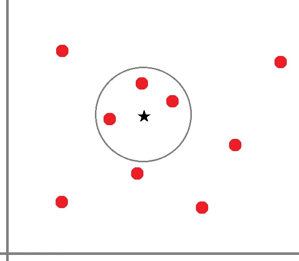
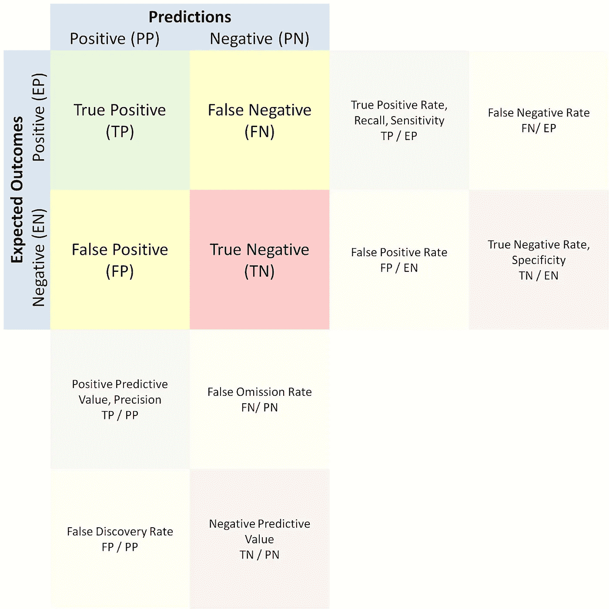
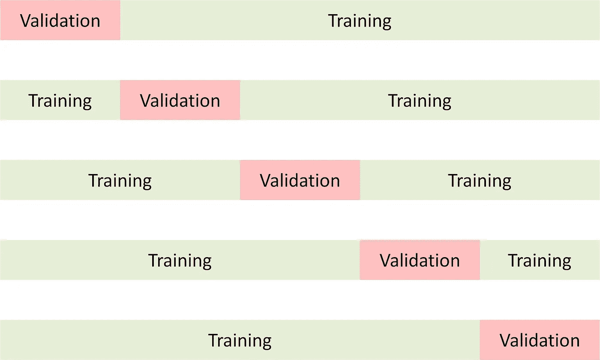
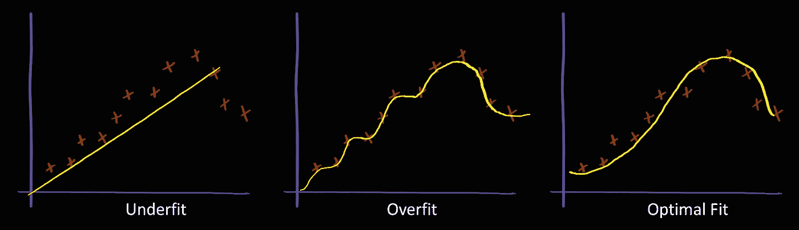
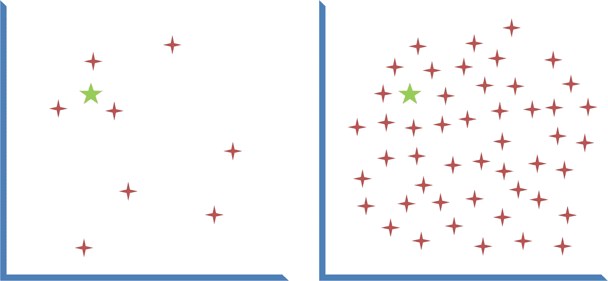

# 医学中的机器学习——第四部分

> 原文：<https://towardsdatascience.com/machine-learning-in-medicine-part-iv-73c848ec8577?source=collection_archive---------31----------------------->

## 针对医生和医疗保健专业人员的机器学习技术实践入门课程。

# k-最近邻


[Avi Waxman 在 Unsplash 上拍摄的照片](https://unsplash.com/photos/pJk4RRS7urs)

# 概述

在本课程的 [第三部分](/machine-learning-in-medicine-part-iii-8f3742e17c34)中，我们探索了我们的第一个机器学习模型——线性/逻辑回归。我们讨论了使用线性/逻辑回归进行回归分析和使用它进行机器学习的概念差异。我们讨论了该技术的优势和局限性，并演示了使用服装工具包构建模型以及使用模型进行预测的步骤。

重要的是要强调，尽管围绕一些更高级的机器学习技术(如随机森林和神经网络)有很多争论，但由于其简单性，线性/逻辑回归仍然是临床研究中非常有用的机器学习技术。许多风险评分系统，如 Framingham Risk Score 和 MELD-Na Score，在功能上与基于线性/逻辑回归的机器学习模型相同，即使这些评分系统可能不是完全由算法得出的。

# 礼服套件更新

在继续本课程的其余部分之前，请花点时间更新[着装套件](https://github.com/waihongchung/dress)以发布 **1.2.5** 。这个版本包含了我们将在这里使用的 kNN 算法的一个特性更新。

# 模型概述

k-最近邻(kNN)的工作基于相似对象行为相似的假设。与大多数其他机器学习技术不同，kNN 模型不试图“学习”预测器和结果之间的关系。事实上，kNN 模型的构建通常不需要太多的训练阶段，只需要以内存高效的格式存储整个训练数据集以供以后检索。当需要进行预测时，模型会确定测试主题与训练数据集中每个主题之间的相似度，根据相似度挑选出顶部的`k`训练主题(邻居),并通过计算这些`k`主题的模式(对于分类问题)或均值(对于回归问题)返回感兴趣的结果。因此，kNN 的判定边界不是一条光滑的直线，而是一个半径为`k`的圆。



作者图片

当我们需要实现 kNN 模型时，有三个超参数需要考虑:模型中要包含的预测值、用于测量相似度的度量(例如，[曼哈顿距离](https://en.wikipedia.org/w/index.php?title=Manhattan_distance)、[欧几里德距离](https://en.wikipedia.org/wiki/Euclidean_distance)或[闵可夫斯基距离](https://en.wikipedia.org/wiki/Minkowski_distance))以及`k`的值。

# 优势和局限性

kNN 技术的优势之一是它的简单性；没有复杂的数学运算。该算法只是在训练数据集中找到与测试对象最相似的对象。该算法可以处理数值和分类预测值(只要实现支持从分类值计算距离度量)。最令人印象深刻的是，同一个模型可以用来预测多种结果，只要它们共享相同的预测因子。这种独特的性质使得 kNN 模型不仅可以用于解决分类或回归问题，还可以用于群组匹配和缺失值插补。

kNN 技术的主要限制之一是在进行预测时计算效率低。每次我们使用模型进行预测时，算法都需要计算训练数据集中每个对象的距离度量，并根据距离度量对整个训练数据集进行排序。在生产环境中部署模型也相当麻烦，因为必须重现整个训练数据集。

kNN 技术也有一些性能限制。因为预测结果是前`k`个邻居的平均值，所以它永远不会超出训练数据集中观察到的值的范围。例如，考虑只有一个预测值(身高)和一个结果(体重)的 kNN 模式。如果最高的训练对象是 6 英尺高，200 磅重，那么这个训练对象将是任何 6 英尺或更高的测试对象的最近邻居，因此预测结果将是 200 磅左右。此外，kNN 模型易于出现异常值，因为该算法在预测阶段考虑整个训练数据集，并且每个训练对象被视为邻居的概率相同。

# 履行

让我们开始建立一个 kNN 模型。类似于我们如何构建线性/逻辑回归模型，我们将考虑使用预防服务和不健康行为作为预测因素，以建立一个机器学习模型，帮助我们预测一个假设的城市/城镇的健康结果。

`kNN`函数最多接受四个参数。第一个是一系列训练科目。第二个是用作预测器的一组数字特征。第三个，如果指定的话，是用作预测器的分类特征的数组。最后一个指定在进行预测之前是否应该对预测值进行归一化。默认情况下，预测值是归一化的，这意味着每个预测值的最大距离为 1，并且每个预测值对距离度量的贡献是相等的。

首先要注意的一点是，在构建 kNN 模型时，我们不必指定感兴趣的结果。并且打印输出不包含任何数字或统计信息，除了用于建立模型的预测器的名称。这是因为除了提取预测值并将其存储在内存中之外，该算法在此阶段实际上并没有做太多工作。

为了使用 kNN 模型进行预测，我们需要提供一个测试主题并指定结果，无论是分类问题还是回归问题，以及可选的`k`的值。

我们可以看到 kNN 模型的优势之一是能够使用相同的模型对不同的感兴趣的结果进行预测(只要我们认为应该使用相同的预测器)。我们还可以看到，使用 kNN 模型解决分类问题非常容易。不需要做任何[一键编码](https://en.wikipedia.org/wiki/One-hot)。

# 模型性能

## 性能指标

使用 DRESS Kit 构建一个功能性的 kNN 模型一点也不困难，但是我们应该问问自己，如果我们优化一些与模型相关的参数(或者更准确地说是 *hyper* 参数),我们是否可以创建一个更好的模型。这些超参数包括`k`的值、特征选择和特征缩放。然而，在我们讨论优化过程之前，我们必须首先定义我们将如何度量一个模型的性能。如果给我们两个模型，我们如何决定哪一个更好？

评估模型性能的基本思想是量化预期结果和预测之间的差异。直观上，我们可以理解，如果预测与预期结果完全相同，则该模型被认为是完美的。如果预测是以平均预期结果为中心的随机值，那么该模型被认为是无用的。关键是找到一个合适的统计方法来量化这种差异。

对于回归问题，最常用的统计度量是[决定系数](https://en.wikipedia.org/wiki/Coefficient_of_determination)(R2)[平均绝对误差](https://en.wikipedia.org/wiki/Mean_absolute_error) (MAE)，或者[均方根误差](https://en.wikipedia.org/wiki/Root-mean-square_deviation) (RMSE)。MAE 和 RMSE 都代表了预期结果和预测之间的平均差异，但 RMSE 对大误差的惩罚比对小误差的惩罚更大(因为平方)，而 MAE 没有考虑每个误差的大小。R2 是一种无单位的度量，范围从负无穷大到 1(完美)。它代表了预期结果与预测的匹配程度(从技术上来说，它衡量的是预测所解释的预期结果中的差异比例)。这不要与[相关系数](https://en.wikipedia.org/wiki/Correlation_coefficient) (R)相混淆，后者仅表示两个变量相互跟随的程度(当一个变量的值上升时，另一个变量也会上升，反之亦然)。

对于分类问题，最常用的统计指标是[准确度](https://en.wikipedia.org/wiki/Accuracy_and_precision)(被正确分类的受试者的比例)[精确度](https://en.wikipedia.org/wiki/Accuracy_and_precision)(被正确分类的受试者在被预测为某一类别的所有受试者中的比例，也称为**阳性预测值**)[召回率](https://en.wikipedia.org/wiki/Precision_and_recall#Recall)(某一类别的受试者被正确分类到该类别的比例，也称为**真阳性率**)和 [F 得分](https://en.wikipedia.org/wiki/F-score)



作者图片

## 交互效度分析

由 DRESS Kit 生成的每个机器学习模型都包含一个`performance`函数，该函数可用于生成适当的性能度量。我们将首先演示一个简单但不幸不正确的方法来使用这个函数。

计算性能指标需要几分钟时间(脚本可能会在完成前超时)，因为算法必须对所有 28，000 名受试者进行预测，并根据所有这些数据点计算决定系数。我们可能会惊喜地发现 R2 的值是 0.98(接近完美)，直到我们意识到自己的错误。请记住，kNN 算法的工作原理是从训练数据集中找到与测试主题相似的主题。如果我们使用来自相同训练数据集的测试主题，那么该算法必然会从训练数据集中找到与测试主题*相同*的主题。因此，它会产生一种模型运行良好的错觉。

计算模型的性能度量的正确方法是使用不与定型数据集重叠的验证数据集。有三种方法可以创建这样的验证数据集。在一项精心设计的研究中，研究者可能会从外部站点招募额外的受试者(以声称该模型经过外部验证)。另一种方法是保留原始数据集的一部分(通常为 20%)作为验证数据集，只使用剩余的 80%作为训练数据集。这种方法的缺点是减少了训练数据集的大小。最流行的方法是进行所谓的 [k 倍交叉验证](https://en.wikipedia.org/wiki/Cross-validation_(statistics)#k-fold_cross-validation)。其思想是，我们将原始数据集分成`k`部分，使用第一部分进行验证，其余部分用于训练。然后，我们再次重复这个过程，第二部分用于验证，其余部分用于训练。重复该过程，直到每个零件都被用于一次验证和`k-1`次训练。最后，我们通过取平均值来报告性能度量。



作者图片

为了使用 DRESS Kit 中的`DRESS.crossValidate`函数执行交叉验证，我们需要指定机器学习模型、数据集以及创建和验证模型所需的超参数。代码有点复杂，因为我们需要将这些超参数作为两个独立的数组传递。可选地，我们可以使用`DRESS.async`异步调用该函数，以防止脚本超时。

# 最佳化

## K 值

大多数人想到的第一个优化，也可能是最不重要的，是`k`的值。直观地，我们可以理解，如果`k`太大(例如，整个训练数据集的大小)，那么模型将不会非常准确，因为它将不会做出更好的类似预测(即，欠拟合)。如果`k`太小(例如 1)，那么该模型在应用于验证数据集时也不会非常准确，因为它容易在训练数据集中产生噪声(即过拟合)。`k`的最佳值高度依赖于训练数据集中的噪声量(或结果值的随机变化)。



作者图片

确定`k`最佳值的唯一方法是对一系列值进行交叉验证。也就是说，在大型数据集(如我们正在处理的数据集)中，训练数据集通常几乎均匀地分布在样本空间中，因此`k`值的微小变化不会显著影响预测。例如，考虑下图，其中红色的星代表训练对象，绿色的星代表测试对象。我们可以看到，与右侧的数据集相比，左侧数据集的`k`值为 3 和`k`值为 4 之间的差异要大得多。此外，DRESS Kit 使用的 kNN 算法实际上是一种加权 kNN 算法，这意味着它考虑了训练对象和测试对象之间的距离度量，并减少了高度不相似的对象的影响，即使它们被包括在内。



作者图片

## 特征选择

对于 kNN 机器学习技术来说，更重要的优化是特征选择，即用于构建模型的预测器。直观地，我们可以理解，如果预测值与结果没有关系(例如，SSN 和身体质量指数的最后 4 位)，那么模型的性能可能会受到包含这种预测值的不利影响。与可以自动最小化无关紧要的预测器的影响的一些其他机器学习技术不同，kNN 模型中包括的每个预测器都对距离度量有贡献。选择最佳的特性集需要大量的领域知识，但是我们也可以使用交叉验证来验证我们的选择。

为了证明正确的特征选择的重要性，我们将引入两个填充了随机值的预测值，以观察它们如何影响模型的性能。

我们可以看到，包含两个随机生成的预测值实际上会降低整体性能并减慢模型的速度。

## 特征缩放

对于 kNN 机器学习技术来说，同样重要的优化是特征缩放。默认情况下，kNN 算法会在构建模型之前对所有预测值进行归一化。这样做是为了使具有更宽范围的特征(例如，血小板计数，其值的范围可以从<50 to > 250)对距离度量具有与具有更窄范围的特征(例如，肌酸酐，其值通常在~1 到< 10 之间)相同的效果。凭直觉，我们可以想象，如果我们要建立一个 kNN 模型来预测接受结肠镜筛查的患者中结肠息肉的数量，息肉综合征家族史将是比抑郁症家族史更强的预测因素。我们可以通过放大或缩小来设置每个预测器的“强度”。不幸的是，没有办法通过算法来确定最佳比例。需要大量的领域知识和反复试验。

# 归罪

kNN 算法最常见的应用之一是缺失值插补。我们之前已经介绍了一种简单的插补技术，用均值或模式替换缺失值。虽然均值/众数插补在缺失值很少的大型数据集中工作得相当好，但每个缺失值都会被相同的替换值替换。kNN 插补本质上是均值/众数插补的更高级版本，它不使用整个数据集的均值/众数，而是使用与缺失值受试者相似的受试者的均值/众数作为替代。

为了实现 kNN 插补算法，我们只需将受试者分为没有缺失值的受试者和有缺失值的受试者。接下来，我们使用前者来构建一个 kNN 模型，并在后者中找到每个主题的顶部`k`邻居。最后，我们将均值/众数插补技术应用于基于那些`k`邻居的缺失值。

```
ACCESS2 : 1 (0.00%) 
BPMED : 0 (0.00%) 
CHECKUP : 0 (0.00%) 
CHOLSCREEN : 0 (0.00%) 
COLON_SCREEN: 19 (0.07%) 
COREM : 103 (0.38%) 
COREW : 109 (0.40%) 
DENTAL : 0 (0.00%) 
MAMMOUSE : 37 (0.14%) 
PAPTEST : 7 (0.03%) 
BINGE : 0 (0.00%) 
CSMOKING : 0 (0.00%) 
LPA : 0 (0.00%) 
OBESITY : 0 (0.00%) 
SLEEP : 0 (0.00%)
```

插补算法足够智能，可以识别那些具有缺失(空)值的受试者，并根据那些没有缺失值的受试者计算适当的替代值。

# 群组匹配

kNN 算法的另一个常见应用是群组匹配。在大多数回顾性研究中，为了计算相关的风险比或优势比，有必要确定一个对照组(一组没有结果或暴露的受试者)。理想情况下，实验组和对照组应该在每个方面都几乎相同，除了结果或兴趣的暴露。因为 kNN 算法被设计为基于相似性来识别主题，所以它非常适合这个目的。

```
ACCESS2 : [93] 27.08 (95% CI 25.33 - 28.84) SD: 8.64 SKW: 1.55 KUR: 2.82 vs [93] 26.82 (95% CI 25.03 - 28.62) SD: 8.81 SKW: 1.31 KUR: 1.60 z: +0.20 p: 0.84 
BPMED : [93] 80.90 (95% CI 79.98 - 81.82) SD: 4.53 SKW: -0.15 KUR: 0.64 vs [93] 78.79 (95% CI 78.00 - 79.59) SD: 3.93 SKW: -0.28 KUR: -0.27 z: +3.38 p: 0.00 
CHECKUP : [93] 76.15 (95% CI 74.93 - 77.36) SD: 5.98 SKW: -0.77 KUR: -0.21 vs [93] 75.72 (95% CI 74.58 - 76.85) SD: 5.59 SKW: -1.07 KUR: 0.23 z: +0.51 p: 0.61 
CHOLSCREEN : [93] 76.13 (95% CI 75.01 - 77.25) SD: 5.50 SKW: -0.27 KUR: 0.18 vs [93] 75.85 (95% CI 74.86 - 76.85) SD: 4.89 SKW: -0.61 KUR: 0.32 z: +0.37 p: 0.71 
COLON_SCREEN: [93] 46.24 (95% CI 44.92 - 47.57) SD: 6.51 SKW: -0.18 KUR: -0.40 vs [93] 47.24 (95% CI 46.05 - 48.42) SD: 5.84 SKW: -0.03 KUR: 0.02 z: -1.10 p: 0.27 
COREM : [93] 18.36 (95% CI 17.40 - 19.31) SD: 4.69 SKW: 0.31 KUR: 2.34 vs [93] 18.80 (95% CI 17.89 - 19.71) SD: 4.49 SKW: 0.14 KUR: 2.93 z: -0.66 p: 0.51 
COREW : [93] 17.26 (95% CI 16.38 - 18.14) SD: 4.32 SKW: 0.90 KUR: 7.91 vs [93] 17.56 (95% CI 16.84 - 18.29) SD: 3.57 SKW: -0.11 KUR: 7.89 z: -0.53 p: 0.60 
DENTAL : [93] 33.08 (95% CI 31.80 - 34.36) SD: 6.30 SKW: 0.79 KUR: 1.38 vs [93] 35.03 (95% CI 33.86 - 36.21) SD: 5.78 SKW: 0.86 KUR: 1.69 z: -2.20 p: 0.03 
MAMMOUSE : [93] 79.43 (95% CI 77.65 - 81.21) SD: 8.76 SKW: -8.00 KUR: 69.73 vs [93] 80.78 (95% CI 80.21 - 81.36) SD: 2.83 SKW: -0.72 KUR: -0.25 z: -1.42 p: 0.16 
PAPTEST : [93] 81.95 (95% CI 80.15 - 83.75) SD: 8.86 SKW: -8.50 KUR: 75.74 vs [93] 82.59 (95% CI 80.79 - 84.40) SD: 8.89 SKW: -8.62 KUR: 77.13 z: -0.49 p: 0.62
```

在上面的例子中，我们将身体健康结果(`PHLTH`)差于 25%的受试者定义为实验组。我们的目标是建立一个对照组，在预防服务的使用方面与实验组相匹配。我们基于其余受试者构建一个 kNN 模型，并使用该模型的`match`函数为每个实验受试者确定一个控制受试者。最后，我们通过计算两组的平均值来评估匹配的质量。我们可以看到，除了使用降压药(`BPMED`)和看牙医(`DENTAL`)之外，两组之间使用预防服务的所有其他措施都相当。

# 概述

让我们复习一下第四部分所学的内容。我们讨论了 kNN 机器学习算法的优势和局限性，并在 DRESS Kit 中演示了实现它的代码(`DRESS.kNN`)。我们继续讨论各种度量，包括回归问题的决定系数、平均绝对误差和均方根误差，以及分类问题的准确度、精确度、召回率和 F 分数，用于评估机器学习模型的性能(`model.performance`)。我们还介绍了交叉验证技术(`DRESS.crossValidate`)，作为一种使用相同数据集进行训练和验证的方法。我们继续讨论 kNN 建模技术的各种超参数的优化，例如`k`的值、特征选择和特征缩放。最后，我们展示了使用 kNN 算法作为缺失值插补技术(`model.impute`)以及群组匹配技术(`DRESS.match`)。

# 模型摘要

*K-最近邻*

强项

*   易于实现(距离度量计算相当简单)
*   易于解释(算法只是寻找相似的主题)
*   使用数字和分类预测器
*   可用于分类、回归、群组匹配和插补

限制

*   预测速度慢(需要为每次预测计算整个训练数据集的距离度量)
*   难以部署(模型由整个训练数据集组成)
*   无法在训练数据集之外进行推断
*   倾向于离群值