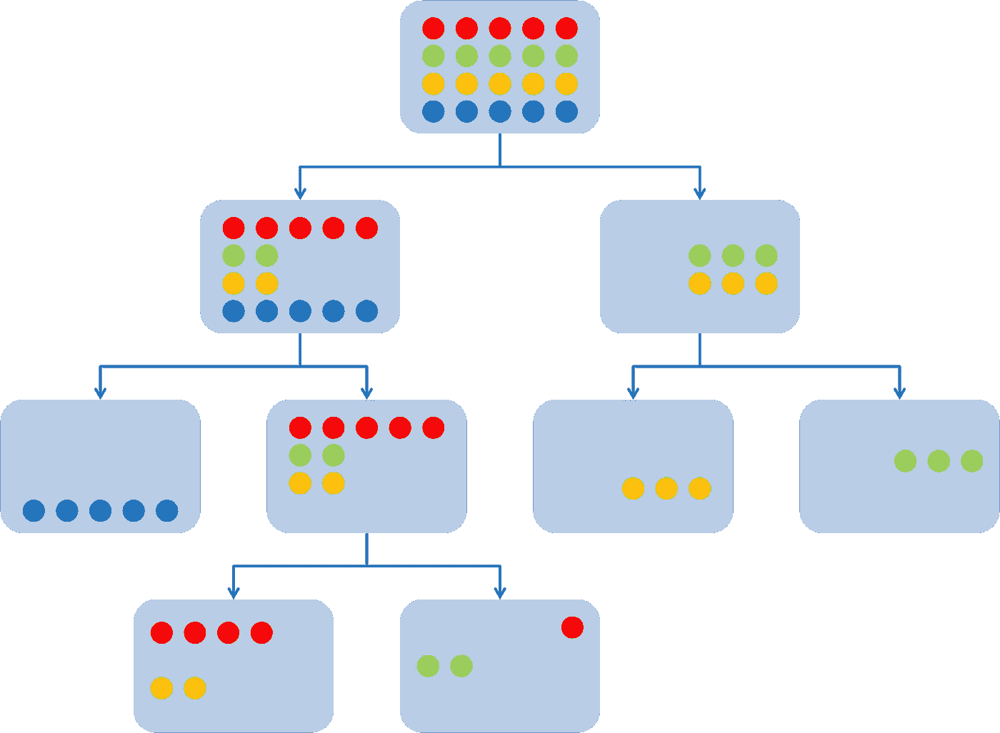
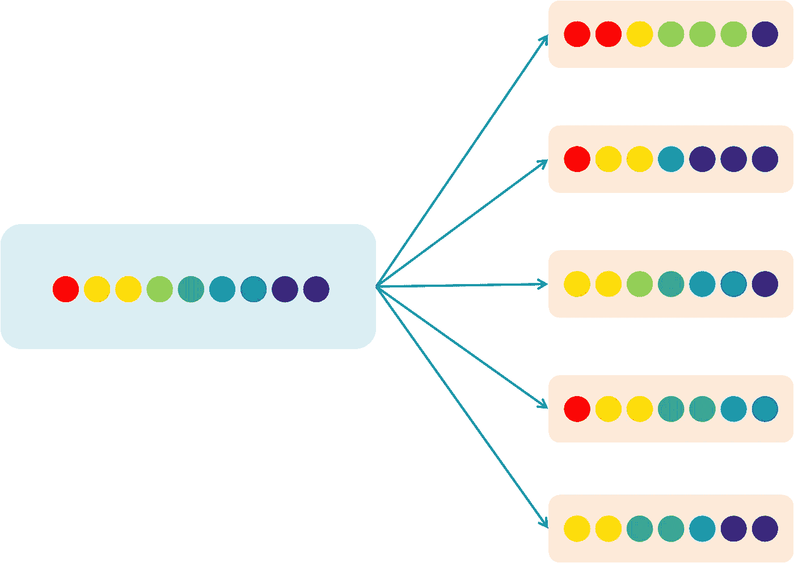
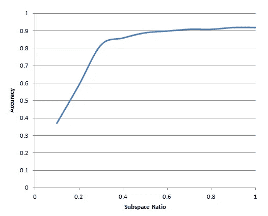
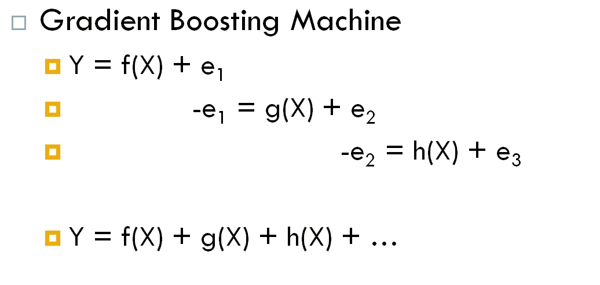
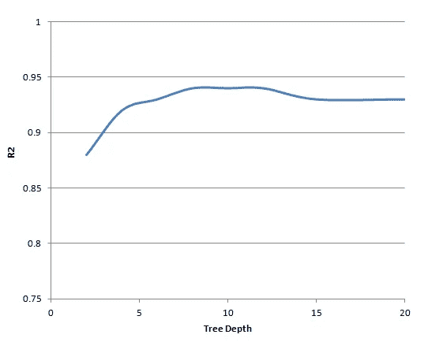
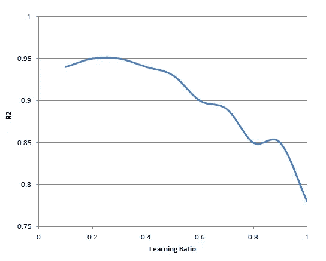

# 医学中的机器学习——第五部分

> 原文：<https://towardsdatascience.com/machine-learning-in-medicine-part-v-10231d5511e5?source=collection_archive---------37----------------------->

## 针对医生和医疗保健专业人员的机器学习技术实践入门课程。

# 集成决策树


[Steven Kamen ar 在 Unsplash](https://unsplash.com/photos/MMJx78V7xS8) 上拍摄的照片

# 概述

在本课程的 [第四部分](/machine-learning-in-medicine-part-iv-73c848ec8577)中，我们探讨了 k 近邻(kNN)。我们演示了使用 DRESS Kit 构建 kNN 模型的步骤，以及使用该模型进行预测的步骤。我们绕道讨论了各种模型性能指标，包括回归问题的决定系数、平均绝对误差和均方根误差，以及分类问题的准确度、精确度、召回率和 F 分数。在讨论 kNN 算法特有的各种优化技术之前，我们还介绍了交叉验证技术。最后，我们展示了使用 kNN 算法作为缺失值插补技术以及队列匹配技术。

回想一下，线性/逻辑回归模型的局限性之一是其平滑和连续的决策边界。与线性/逻辑回归模型相比，kNN 模型的一个主要优势是它能够创建任意大小的循环决策边界(基于`k`的值)。决策树模型通过允许创建任意的决策边界而代表了进一步的改进。

# 礼服套件更新

在继续本课程的其余部分之前，请花点时间更新[服装套件](https://github.com/waihongchung/dress)以发布 **1.2.9** 。该版本包含对随机森林和梯度推进机器算法的显著性能改进。

# 决策图表



决策树。图片作者。

## 模型概述

在讨论集成决策树之前，我们必须首先介绍一个[决策树](https://en.wikipedia.org/wiki/Decision_tree)的概念。决策树通常被描述为流程图。从决策树的顶端(矛盾地称为根)开始，通过特定标准将数据集分成两组(例如，年龄大于 50，血红蛋白小于 7g/dL，性别等于男性，既往病史包括糖尿病等。)，符合标准的主体属于一个群体，不符合标准的主体属于另一个群体。每个组(通常称为节点)根据另一个标准再次分成两个。重复该过程，直到满足一些预定义的停止标准。当我们需要使用决策树模型进行预测时，我们只需从根开始跟随该树，一直行进到末端节点(没有进一步分割的节点)，并通过取属于该末端节点的那些主题的平均值(对于回归问题)或模式(对于分类问题)来计算结果。

直观地，我们可以理解决策树模型的性能如何受到分裂标准的选择的影响。完全无用的决策树模型是简单地将一个节点随机分成两部分的模型，因为这种模型的预测能力不会比随机猜测更好。因此，为了构建一个有用的决策树模型，我们必须在分割后尽量减少随机性的程度。有几种方法可以测量机器学习模型中的随机性。最常用的有分类问题的[基尼杂质](https://en.wikipedia.org/wiki/Decision_tree_learning#Gini_impurity)和[熵/信息增益](https://en.wikipedia.org/wiki/Decision_tree_learning#Information_gain)和回归问题的[方差](https://en.wikipedia.org/wiki/Decision_tree_learning#Variance_reduction)。就本课程而言，了解基尼系数、信息增益或方差背后的数学原理并不重要。可以说，当这些指标下降到零时，与该节点相关的所有主题都具有相同的结果值，进一步分割该节点没有任何好处。为了构建一个最优的决策树模型，该算法只需要找到分裂准则，该准则在其后代节点中产生最低程度的总随机性。

## 优势和局限性

基于上面的描述，我们可以很容易地看到决策树如何能够支持任意的决策边界。层中的每个节点都独立于同一层中的其他节点运行。假设我们根据 60 毫米汞柱的平均动脉压(MAP)将受试者分为两组，然后我们可以根据一个标准(例如，7g/dL 的血红蛋白水平)将那些具有低 MAP 的受试者分为两组，并根据不同的标准(例如，不同的血红蛋白水平或完全不相关的因素，如性别或身体质量指数)将那些具有高 MAP 的受试者分为两组。

我们还可以看到决策树本质上是 if-then-else 语句的级联。这意味着决策树可以对数字特征和分类特征进行操作(只要您可以基于特征构造 if-then-else 语句，它就可以作为决策树中的一个节点)。这也意味着决策树可以在预测阶段以极快的速度运行。不需要复杂的矩阵乘法、求幂或排序。最后，很容易解释决策树模型的结果。为了理解预测是如何做出的，我们只需要手动地从根开始跟踪树。

决策树建模技术的一个小限制是不能在每个节点考虑多个预测器。例如，如果数据集只包含身高和体重作为预测因素，但结果实际上与身体质量指数更相关，决策树模型可能无法有效地捕捉这种关系。然而，决策树模型的主要限制是有过度拟合的倾向。这部分是由于决策树模型创建任意决策边界的能力，部分是由于随着树变得更深，节点数呈指数增长。


曲线拟合。图片作者。

考虑一个有 1000 名受试者的假设数据集。让我们假设每个受试者都可以通过预测因子的组合来唯一识别，这并不是完全不现实的，例如，考虑到两个受试者具有完全相同的身体质量指数、血红蛋白水平、血小板计数、收缩压、心率和总胆固醇水平的几率。我们能否构建一个决策树模型，保证在应用回训练数据集时 100%准确？答案是肯定的。事实上，它只需要一个深度为 10 (2 ⁰ = 1024)的决策树。一个 20 层的树可以唯一识别超过 100 万个主题。集成决策树模型背后的整个思想是克服单个决策树模型容易过度拟合的事实。

# 随机森林/额外树木模型

## 模型概述

随机森林的基本假设是，一些预测值和结果之间的关系可以由一组决策树(许多许多树，因此是一个森林)来表示，每个决策树只对关系的某个方面进行建模。这有点像古代亚洲盲人摸象的寓言。每个人只能根据他与大象有限的互动来欣赏大象的某些特征，但是他们一起对大象的描述相当准确。我们也可以把随机森林/额外的树看作一种民主或多数统治。


[盲人和大象。图片由 CC0 大都会艺术博物馆通过维基共享资源提供。](https://commons.wikimedia.org/wiki/File:Blind_Men_and_the_Elephant,_MET_accession_number_10_211_900_O1_sf.jpg)

用于在随机森林模型中创建决策树集合的技术被称为[打包](https://en.wikipedia.org/wiki/Bootstrap_aggregating)，这是自举和聚合的结合。自举是指用替换采样*的过程。例如，我们有一个 9 个受试者的池，我们想通过引导创建一个 7 个受试者的样本，我们将选择一个受试者(例如受试者 A) *而不从池中删除它*。当我们需要选择下一个科目时，再次选择科目 A 的概率不变。Bootstrapping 允许我们创建彼此之间以及与原始数据集完全不同的样本，但是所有样本加在一起应该类似于原始数据集的分布。假设原始数据集的性别分布是 60:40，通过自举创建的每个样本的性别分布可能不完全是 60:40，但是如果我们生成大量样本，所有这些样本的性别分布作为一个整体将接近 60:40。*



装袋。图片作者。

随机森林模型用来最小化过度拟合的第二种技术被称为[特征子空间](https://en.wikipedia.org/wiki/Random_subspace_method)，它简单地限制了每个决策树所使用的特征的选择。这防止了与结果高度相关的某些预测器被选为每个决策树中的分裂标准。通过使用 bagging 和特征子空间，随机森林算法可以创建大量决策树，每个决策树都在一个样本上训练，该样本来自数据集但不完全相同，并且仅捕获某些预测器和结果之间的关系。在预测阶段，该算法将测试主题应用于森林中的所有树，并基于平均值(对于回归问题)或模式(对于分类问题)计算最终预测。其思想是，预测者和结果之间的关系“重要”将被大多数树捕获，而那些无关紧要的关系将在聚合过程中被抵消或消除，因为它们仅被森林的一小部分捕获。

[额外的树](https://en.wikipedia.org/wiki/Random_forest#ExtraTrees)(或者极度随机化的树)非常类似于随机森林，但是提供了一些计算上的优势。在随机森林模型中，每个决策树仍然充当常规决策树，并基于最佳分裂标准来分裂节点，这可能在计算上是昂贵的，尤其是对于数字特征。相反，额外树算法随机选择分裂标准。只要生成的决策树比一个完全无用的决策树(基于像基尼系数、熵和方差这样的指标)执行*稍好一点*，它就会被森林接受。每棵树也在整个数据集上训练，因此消除了装袋步骤。尽管额外的树具有计算优势，但这两种建模技术的准确性是相当的(示例[在这里](https://www.thekerneltrip.com/statistics/random-forest-vs-extra-tree/)和[在这里](https://mljar.com/machine-learning/extra-trees-vs-random-forest/))。

## 优势和局限性

随机森林/额外树相对于单个决策树的优势是显而易见的——抵抗过度拟合，但它也有一些缺点。因为由这两种技术创建的模型是由数百个决策树组成的，所以在生产环境中部署这些模型可能具有挑战性。解释模型也很困难，因为要分析的决策树数量太多，而且有些树的表现可能很差。

随机森林/额外树的另一个缺点是这些算法的概率性质。我们之前学习的线性/逻辑和 kNN 算法是确定性的，这意味着每次应用相同的训练数据集时都会创建完全相同的模型。相比之下，随机森林/额外树算法使用的装袋、特征子空间和随机分裂技术会引入一定程度的随机性，并在每次应用训练数据集时创建完全不同的模型。一个模型可能比下一个模型表现得更好或更差，这使得模型优化更具挑战性。

## 履行

现在有足够的基本理论，让我们开始建立我们的第一个集合决策树模型。DRESS Kit 确实附带了一个名为`DRESS.randomForest`的函数，但是它实际上在内部实现了额外的树算法以提高计算效率。

因为我们所有的预测值都是数值型的，所以我们将它们作为第三个参数传递给`DRESS.randomForest`函数，并将一个空数组作为第四个参数传递(它接受一个分类预测值数组)。我们还将第五个参数设置为`false`，因为我们正在构建一个回归模型。模型本身的打印输出并不包含很多信息，除了正在建模的结果和一个`seed`值，通过将`DRESS.SEED`全局变量设置为该值，该值可用于在未来重新创建完全相同的模型。

我们可以使用该模型进行预测，就像礼服工具包中的任何其他机器学习模型一样。

为了创建分类模型，我们简单地将`DRESS.randomForest`函数的第五个参数设置为`true`。

## 最佳化

在我们讨论可以在我们的随机森林(实际上是额外的树)模型上完成的各种优化之前，让我们回忆一下如何使用`DRESS.crossValidate`和`DRESS.async`来评估机器学习模型的性能。事实证明，默认的超参数设置远远没有优化我们想要做的事情。

*树木计数*

首先想到的优化是森林中的树木数量。直观上，我们可以看到，如果模型仅由几棵树(例如 5-10 棵树)组成，并且每棵树只对预测因子的子集进行操作，则最终模型可能无法捕捉预测因子和结果之间关系的某些方面。然而，一旦我们达到了足够数量的树，进一步的增加往往不会提高整体性能，相反，会大大降低模型的效率。训练 1000 棵树需要的计算能力是训练 100 棵树的 10 倍，但不太可能将精度提高 10 倍。一般来说，我们可以从 50-100 棵树开始，然后通过增加一倍来逐步增加树的数量，直到模型性能开始稳定。


树木计数。图片作者。

*树深*

在优化中，树的深度比树的数量起着更重要的作用。直观地，我们可以看到，如果树深度设置为 1，那么每棵树将只有 2 个结束节点。即使有大量的树，该模型也不会非常准确，因为正态分布曲线两端的结果值会被接近平均值的结果值超过。这个问题对于具有不均匀类别分布的多类别分类模型尤其重要。因为模型的最终预测是通过从所有树中取模式来计算的，所以如果每个树中的端节点的数量明显小于类的数量，则那些罕见的类几乎永远不会被选为模式。相反，如果树深度设置得太高，过度拟合可能会变得更加明显。


树的深度。图片作者。

*子空间比率*

随机森林/额外树算法的一个同样重要的优化是特征子空间比率，因为它是最终模型随机性的主要来源之一(bagging 比率和随机分割标准分别是随机森林和额外树的另一个来源)。换句话说，子空间比率控制欠拟合和过拟合之间的平衡。考虑由强预测器和弱预测器的组合构成的模型，通过将子空间比率设置为 1，弱预测器可能被包括在一些树中，当应用回训练数据集时，所得模型将非常准确，但是当应用到独立验证数据集时，将表现不佳，即过拟合。如果子空间比率设置为 0，那么该模型是完全无用的，因为它没有考虑任何预测值。需要大量的反复试验来确定特定模型的最佳子空间比。



子空间比率。图片作者。

*功能选择*

像任何其他机器学习模型一样，特征选择是模型性能的基础。与单个决策树的情况一样，集合决策树一次只能基于一个预测因子来分割节点，因此，向算法提供适当的预测因子(例如，身高和体重与身体质量指数)是很重要的。与线性/逻辑回归和 kNN 相比，决策树模型受弱预测器的影响较小(假设子空间比率超参数被适当调整)，并且根本不受特征缩放的影响。

# 梯度推进机

## 模型概述



梯度推进机。图片作者。

虽然它仍然被认为是一个集成决策树模型，但梯度推进机与随机森林/额外树有很大不同。每个决策树都试图减少前一个决策树产生的错误，而不是成为一个多数人统治的民主国家。梯度推进机器中的决策树被排列成链。第一个决策树就像任何其他单个决策树一样，通过模拟预测器和结果之间的关系来运行。第二个决策树对第一个决策树产生的残差进行建模，但方向相反(即正的变为负的，负的变为正的)。然后，将训练集一起应用于第一和第二决策树，并且通过第三决策树对残差进行建模(再次在相反的方向上)。重复该过程，直到剩余误差可以忽略或者已经添加了预定数量的树。

## 优势和局限性

根据 [Kaggle](https://www.kaggle.com) 上许多机器学习竞赛的结果，当调整得当时，梯度增强机器似乎优于随机森林/额外树木模型。然而，这种性能的提高是有代价的。梯度增强机器的训练时间比随机森林/额外树长得多，因为每次创建新树时，必须将整个训练数据集应用于工作模型，以便计算残差。训练阶段不能被并行化，因为每个树都依赖于先前树产生的残差。梯度推进机器也不能很好地处理多类分类问题，因为每个类都需要一个单独的决策树链。解释结果模型也要困难得多，因为除了第一个决策树之外，该模型关注的是预测值和残差之间的关系，而不是结果值。最后，梯度增强机器比随机森林/额外树模型更容易过度拟合。

## 履行

除了调用`DRESS.gradientBoosting`而不是`DRESS.randomForest`之外，创建梯度增强机器几乎不需要修改用于创建随机森林/额外树木模型的代码。请注意，由于每次创建新的决策树时都要应用整个训练数据集，因此完成代码所需的时间要长得多。

## 最佳化

*数树*

根据一般经验，梯度推进机器可以使用更少的决策树实现与随机森林/额外树模型相当的性能水平。这部分是因为这样一个事实，即通过设计，在随机森林/额外树模型中不是所有的决策树都是有用的，而在梯度推进机器中，每个决策树都将残余误差减少一定量。向梯度推进机器添加太多的树会显著增加训练时间(随着残差的减小，创建最优决策树可能会更加困难)，并且最终会导致过拟合。


树木计数。图片作者。

*树深*

就像树计数一样，梯度推进机器通常可以实现与使用较浅决策树的随机森林/额外树模型相当的性能水平。这是由于剩余误差倾向于在几棵树后集中在中心界限周围，结果，需要由每棵树处理的随机性程度(即均方误差)很小。拥有一个过深的树是梯度增强机器中过拟合的一个常见原因。



树的深度。图片作者。

*子空间比率*

子空间比率对于梯度增强机器的工作方式与对于随机森林/额外树模型的工作方式有些不同，至少对于着装套件实现是这样。在训练阶段，子空间比率被应用于训练数据集，而不是特征。因为每个决策树只对来自训练数据集子集的残差建模，所以选择小的子空间比率可以减少训练时间。正如所料，选择一个大的子空间比率会导致过度拟合。


子空间比率。图片作者。

*学习率*

学习率决定了每个决策树对多少残差进行建模。它通常被设置为 0.1 到 0.3 之间的一个小数字，这意味着每个决策树将只试图解释 10-30%的残差，而剩余的 70-90%的残差将由后续的决策树处理，这些决策树对训练数据集的不同子集进行操作(由子空间比率超参数确定)。事实上，这两个超参数是防止梯度推进机器过度拟合的主要保障。然而，将学习率设置得太低会导致欠拟合，或者需要通过高树计数来补偿，这会降低模型的效率。



学习率。图片作者。

# 特征重要性

回想一下我们在本课程的[第三部分](https://github.com/waihongchung/dress/blob/main/tutorials/part3.md)中讨论过的将线性/逻辑回归用作机器学习模型和将其用作传统回归分析技术之间的概念差异。虽然机器学习模型不是设计来评估预测器/特征和结果之间是否存在*统计上显著的*关联，但有时确定特定特征/预测器是否重要仍然是有用的。如果某个特征被认为不重要，那么在没有所述特征的情况下重建模型可能更有效。在线性/逻辑模型中，很容易识别那些不重要的特征。在 kNN 模型中，每个要素都同等重要(除非某些要素的缩放比例不同，并且关闭了归一化标志)。如何客观地度量集成决策树模型中某个特征的重要性？

请记住，决策树的目标是减少数据集中的随机程度。测量特征重要性的一种方法是计算与每个特征相关的随机程度的减少。例如，在分类模型中，我们可以计算整个训练数据集的基尼系数，以及每次分割后的基尼系数。每次分割前后基尼系数的差异反映了被用作分割标准的特征所降低的随机性程度。我们只需要计算与每个特征相关的基尼系数杂质的总减少量，就可以量化它的重要性。在回归模型中，我们可以通过计算每次拆分前后方差的差异来获得相同的结果。

方便的是，由 DRESS Kit 创建的集合决策树模型带有一个内置函数(`model.importance`)，该函数根据基尼不纯度或方差自动计算特征重要性。

```
LPA : 1209.08 
OBESITY : 1038.83 
DENTAL : 1020.85 
CSMOKING : 877.34 
COLON_SCREEN: 605.89 
COREW : 584.14 
BINGE : 573.65 
SLEEP : 464.21 
COREM : 383.77 
BPMED : 380.73 
ACCESS2 : 311.41 
CHECKUP : 149.87 
PAPTEST : 128.30 
CHOLSCREEN : 110.00 
MAMMOUSE : 60.40
```

基于打印输出，我们可以得出结论:`LPA`(年龄> =18 岁的成年人在闲暇时间没有体育活动)是模型中最重要的预测因素，比`MAMMOUSE`重要几个数量级。如果我们建立两个模型，一个有和一个没有`MAMMOUSE`预测器，我们可以看到这两个模型之间没有性能差异。

# 包裹

让我们回顾一下我们在第五部分学到的内容。我们介绍了决策树作为机器学习模型的概念，并讨论了它的优势和局限性，特别是过度拟合的风险。我们讨论了随机森林模型是如何通过使用诸如装袋和特征子空间等技术来降低过度拟合的风险的。我们还介绍了额外树模型，并解释了如何使用它作为随机森林的计算效率更高的替代品。我们继续演示使用`DRESS.randomForest`构建额外树模型的代码，并讨论了各种优化点。然后，我们继续讨论另一个集合决策树模型，梯度推进机，以及它与随机森林/额外树模型的比较。我们再次展示了构建梯度推进机器`DRESS.gradientBoosting`的代码，并讨论了它的优化。最后，我们回顾了使用`model.importance`函数评估特性重要性的步骤。

# 模型摘要

## ***随机森林/多余树木***

*优势*

*   支持任意决策边界
*   使用数字和分类预测器
*   非常快地做出预测
*   不易过度拟合

*限制*

*   难以解释(涉及许多采油树，有些设计表现不佳)
*   难以优化(要考虑许多超参数，算法不确定)

## ***梯度推进机***

*优势*

*   支持任意决策边界
*   使用数字和分类预测器
*   非常快地做出预测
*   性能优于随机森林/额外树

*局限性*

*   仍然倾向于过度拟合
*   训练要慢得多
*   难以解释(大多数树模拟残差而不是结果)
*   难以优化(要考虑许多超参数，算法不确定)

# 锻炼

作为练习，尝试创建一个随机森林模型和一个梯度推进机器来预测一个假设的城市/城镇中的癌症患病率。通过以系统的方式调整各种超参数，专注于优化模型。创建一个表来跟踪超参数值变化时模型性能的变化可能是有用的。