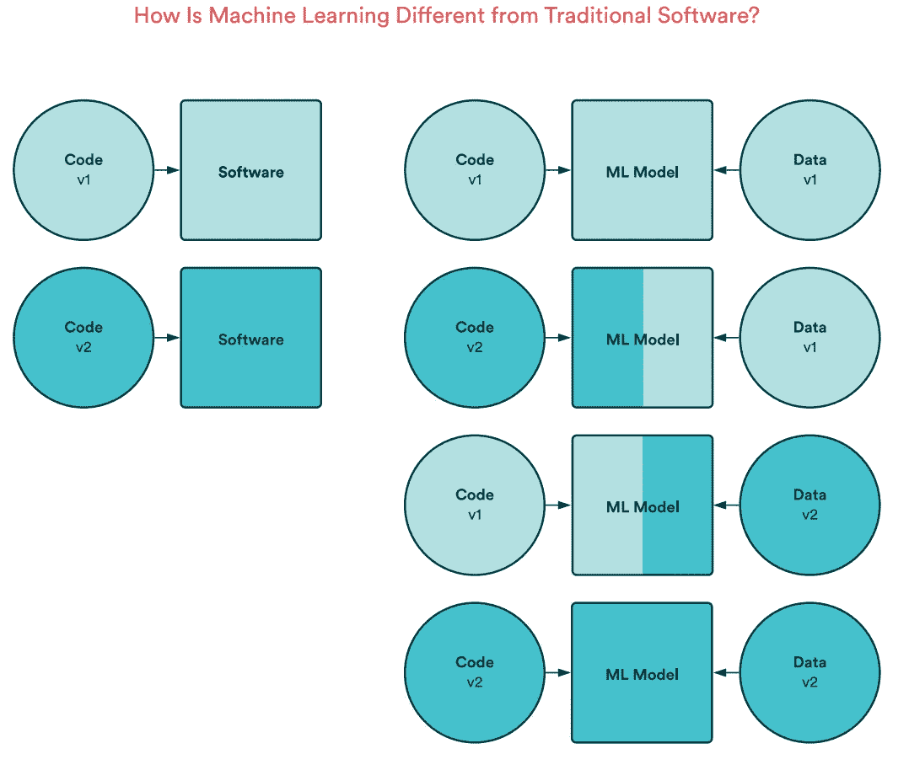

# 生产中的机器学习:为什么这么难，这么多失败？

> 原文：<https://towardsdatascience.com/machine-learning-in-production-why-is-it-so-difficult-28ce74bfc732?source=collection_archive---------7----------------------->

## [行业笔记](https://towardsdatascience.com/tagged/notes-from-industry)

## 您是否努力部署和维护您的模型？大多数公司都这样做，原因如下

Jupyter 笔记本不是生产解决方案([来源](https://www.reddit.com/r/mlops/comments/o8w2e4/you_know_the_deal_if_you_dont_post_content_ill/?utm_source=share&utm_medium=ios_app&utm_name=iossmf)

根据[的一篇集体论文](https://valohai.com/assets/files/practical-mlops-ebook.pdf)分析了 300 多个组织中机器学习的发展，这些项目是公司面临的一些最大挑战。其他[研究](https://www.ibm.com/analytics/au/en/technology/data-science/download/Forrester_Wave_for_Multi-Modal_PAML_Solutions_Sep2018.pdf)也显示，数据科学家经常抱怨他们的模型只是有时或者从来没有投入生产。

困难造成一波失望和遗忘项目的原因是什么？让我们考虑一下发生了什么变化。在传统的 IT 项目中，代码版本决定软件版本。在机器学习项目中，模型的版本是由代码的版本和数据的版本定义的。在等式中引入一些表格是否有可能对项目的复杂性以及成功产生如此巨大的影响？

对代码变更的反应导致了 DevOps 专业化和数百种竞争服务的发展，或多或少地促进了持续集成和持续交付。另一方面，机器学习项目是关于**对代码和数据**的变化做出反应，这至少会增加难度，正如我将在本文中向您证明的那样。

# 因为反馈回路较长

处理数据带来了全新的挑战。而软件通常可以在本地开发，并有一个即时反馈环，反馈一行新代码如何影响最终结果。您编写一个测试，检查只有绿灯亮着，然后继续前进。在机器学习中，反馈循环从同一个地方开始，但可能会在你完成模型训练的几个小时后结束。

即使您正在处理一个不大的数据集，并且您的模型不需要大量的图形卡，您也可能注定要等待几个小时来调优超参数。更重要的是，培训必须循环进行(本文后面会详细介绍)，因此有一个额外的过程要转移到远程环境中。

在本地机器上工作的另一个限制是数据集的大小。要用表格数据填充哪怕是几年前的笔记本电脑的硬盘驱动器(大多数这样的项目都有机器学习)，数据集必须有数十亿行，数百列。然而，我们有项目使用音频，图像和视频。虽然可以在数据集的一部分上试验和开发模型，这是常见的做法，但最终的评估是在整个数据集上进行的。

此外，在 ML 社区中有越来越多的声音不要在本地机器上进行实验，即使这是可能的，因为最终训练过程无论如何都必须在云中进行。越早到达越好。

# 版本代码、数据和型号

没有人能够想象一个没有版本控制系统的商业项目。多亏了它，我们可以方便地协作并回到过去。因为是代码的版本创建了软件的版本，有了版本控制系统，我们可以在任何时候构建应用程序的任何变体。机器学习就不是这样了。

首先，工作的结果不是代码，而是模型。而这一个又是由创建和训练模型的代码版本及其使用的数据产生的。因此，如果您想在使用机器学习开发项目时拥有相同的时间机器，您需要对代码、数据以及理想情况下的模型进行版本化。

一个版本的代码和数据创建一个模型版本([源](https://valohai.com/assets/files/practical-mlops-ebook.pdf))

**嘿，等一下。你读了一段时间，你喜欢这篇文章吗？不要犹豫，鼓掌跟随。只需要 2 秒钟就能帮上忙。完成了吗？谢谢！**

# 为什么我应该版本化模型，而不仅仅是数据？

您已经创建了一个新模型，并将其交付到生产中。一切都很好，但只是暂时的。也许模型在新数据上表现不佳，或者它太复杂，使得它更难处理更多的流量。您需要撤销更改。如果不对模型进行版本化，这会有什么影响？您需要在以前版本的代码和数据上训练新模型吗？这需要多长时间:5 分钟还是 2 天？哪怕不到一刻钟，训练模型的时候出现问题怎么办？

模型版本控制是一份保险单，您以云存储服务账单的形式每月支付一次分期付款。成本取决于您想要存储的版本数量和模型的大小。我们来估算一下它的成本。假设你正在做一个成熟的项目，这个项目有多达 1000 个深度机器学习模型，每个模型重 500 MB。每月供款约 23 美元。

# 测试数据至少和模型一样好

有时浮出水面并发现显而易见的东西是值得的，而不是一直沉溺于细节。你可能会同意阅读的速度就是看的速度。你读书的速度不会比你转动眼球的速度快。在 ML 的上下文中，很明显，模型的好坏取决于用来训练它的数据。虽然这是老生常谈，但不止一次听到这种(看似)陈词滥调时，我注意到和我交谈的人眼中闪烁着光芒。这有什么寓意？**至少和模型一样测试数据。**

我们输入模型的数据已经有了很大的进步。它可能已经访问了生态系统中的许多地方，在这段旅程中，它被照顾得有时更好，有时更差。另一方面，我们从这些疲惫的流浪者身上得出结论。而且，我们也不知道未来会有什么数据来找我们。我们能够并且应该自动化测试它。重要的是，数据测试应该在训练和实时预测中保持一致。它应该显示错误和失败，可能会发生在原来的生产者在未来。

问题是，虽然该模型可以从错误的数据中进行预测，但问题是这种行为何时会被发现。对模型来说，房子是有 3 间卧室还是负 8 间卧室并不重要。然而，并不是所有的测试都如此明显。例如，如果预期的数据是英文文本，测试将确保最常见的单词是“the”、“a”。如果其他词出现的频率更高，可能意味着我们处理的不是预期的语言。

## **测试车型**

虽然大多数种类的模型是确定性的(相同的输入总是产生相同的输出)，但它们也更难测试，因为它们的本质是动态发现不断变化的数据的重要特征。模型需要定期刷新，因为数据总是越来越多，数据的性质也在不断变化。这在实践中意味着什么？未来的房地产估价模型会对同样的房子给出不同的价格。

测量模型的质量时，会检查数据的拟合度。如果太差，我们就只有一个差的模型。然后，它无法从给它学习的数据中得出好的结论，更不用说它从未见过的未来数据了——这被称为欠拟合。相反的情况，就是契合度太强的时候，也不好。该模型在接受训练的数据上表现不错，但它无法对以前没有见过的数据做出良好的推断，这被称为过度拟合。从整个数据集的角度来看，太弱和太强的拟合是融合，并且在训练阶段进行测量。对于模型评估来说，这两个值是最重要的。**问题在于针对具体案例测试和检测扰乱行为。**解决方案是监控。

# 实时反应

生产模因中的意外问题(图片由作者提供)

定义模型中令人烦恼的行为或不稳定性，并编写测试在部署到产品之前检测它们是一个标准包。但检测生产中的异常，尤其是当模型实时响应时，则是另一回事，因为模型会遇到从未见过的数据，必须立即做出响应。同样，问题可能出在数据本身，它是从系统的另一部分流入的，与训练数据相反，它是无人管理的，或者出在模型的本质上，它只是没有为新数据做好准备。此外，异常偏离的单个预测仍然可能是正确的。那么，我们如何监控模型以利用其潜力，同时仍然对其退化行为做出响应呢？

在传统的应用程序中，我们通过测量每秒的请求数来监控硬件(RAM、CPU)的使用情况和应用程序本身。基于这些指标，我们可以实时做出反应，例如通过扩展应用程序或通过阻止给定 IP 地址来检测由系统错误和良好用户引起的可疑行为。

监控模型还包括观察它随时间的行为。将该行为或其返回的预测与基线值进行比较。例如，对于预测房地产价格的模型，训练集中的平均房价为 40 万英镑，而对于昨天返回的最后 100 个预测，平均值为 50 万英镑，这将敲响警钟。换句话说，**模型监控是将输入数据和预测的统计属性与监督学习期间的统计属性进行比较。**

即使预测是正确的(即，平均房价在很长一段时间内保持在正确的水平)，影响特定预测的因素也很重要。回到房地产的话题，假设我们的模型预测房价 40 万。然而，事实证明，这个决定更多地受到车库面积的影响，而不是卧室的数量。训练数据中没有 120 平方英尺的房子。制成车库。毕竟生产中不可能出现那种情况！

解释和说明模型决策的领域本身是一个专业领域，但主要与在模型调整和评估期间证明模型行为有关，而不是作为一个监控实时生产系统的工具。

# 持续交付和持续培训

虽然在真空中工作的代码非常令人满意，但现实是只有交付到生产中的软件才能满足预算。

持续集成和持续交付是一组旨在自动化部署和日常代码工作的实践，以便每一项更改都能够顺利到达远程环境。在教科书应用程序中，构建和部署新版本的唯一原因是代码的变化。这一个可以通过引入新的功能或者修复一个 bug 来触发。我们更改代码，站在生产大门前，展示从 test runner 收集的绿色贴纸，如果没有其他颜色纠缠，应用程序就开始生活在现实世界中。如果它支持的数据库增长两倍，您不必部署相同版本的代码。当在线商店中出现一个新的瓷器收藏时，没有理由编写负责向我们的电子商务提供杯子的代码。

和这次不同。模特老了，过一段时间就没用了。这一次，为了改变，是通过数据。新模式出现、趋势改变、产品出现的数据。推荐电影的模型不会推荐它在训练阶段没有看过的电影(不是在所有推荐系统的实现中)，AI 支持的导航不会为高速公路的新路段建议路线。这个问题的解决方案是循环的、定期的模型训练。正如您所看到的，不仅仅是代码变化导致新模型被训练。这意味着您需要创建和维护一个额外的流程。

# 摘要

如果你想做机器学习，这些真的有必要吗？不，这是为了增加你到达终点的机会和减少你的维修费用。MLOps 的一个新的专业化旨在解决上述问题，以便统计和神经网络专家能够专注于他们的工作。

虽然不是每个 ML 项目都需要解释实时预测，虽然几乎每个项目都比传统应用程序更复杂，但大多数项目都应该对数据进行版本化，并实施持续的培训过程。

在开始项目之前认识到这一点是个好主意。Jupyter 笔记本不是生产解决方案。通过在开始之前回答重要的问题，我们可以避免埋没几个月的工作，或者至少防止错误，为我们节省几天或几周的时间。

# **行动号召**

你的观点是什么？你的 ML 项目进展如何？是在生产吗？请在评论区告诉我。

不要犹豫，鼓掌并跟随。这也是告诉我你以同样的方式看待事物的一种方式。

*波兰文原版发布于*[*https://radekbialowas . pl*](https://radekbialowas.pl/uczenie-maszynowe-na-produkcji-dlaczego-to-takie-trudne/)