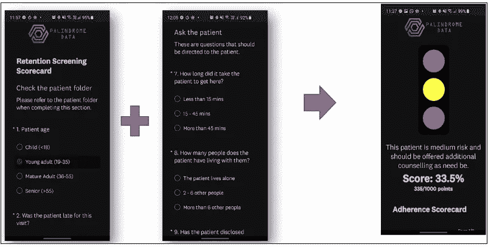
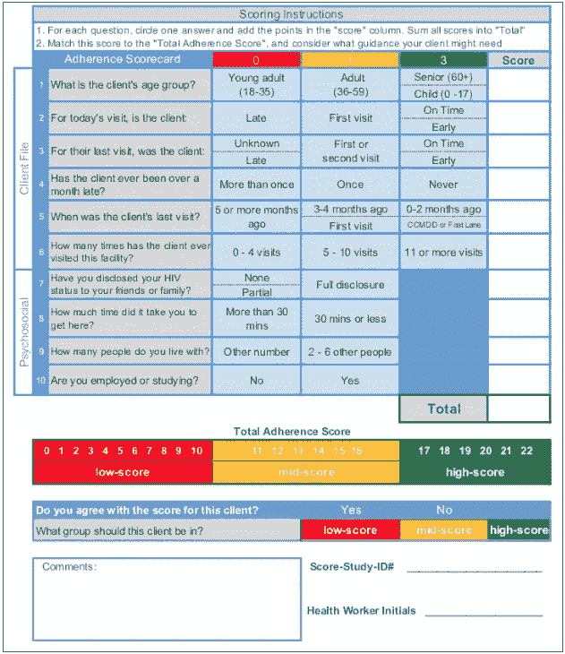

# 公共卫生中的机器学习:一个病人的旅程

> 原文：<https://towardsdatascience.com/machine-learning-in-public-health-a-patients-journey-3bfaab814fde?source=collection_archive---------22----------------------->

## [变更数据](https://towardsdatascience.com/tagged/data-for-change)

## 利用技术和数据科学的进步，显著改善中低收入国家高危人群的公共卫生成果

机器学习是当今健康技术领域最热门的话题之一，几乎在任何领域都是如此。在本帖中，我们将关注 21 世纪数据科学的一个非常规的应用。我们问自己的问题是，“我们如何利用技术和数据科学的进步来显著改善全球中低收入国家(LMICs)高危人群的公共卫生结果？”。

这里是我们在[回文数据](https://www.palindromedata.com/) (PD)使用的一些方法，来解决撒哈拉以南非洲和其他地区的公共卫生问题。我们将使用 PD 的主要关注领域之一的 HIV 治疗来说明这种方法。

**预测与解释模型**

在我们作为数据科学实施者的 R&D 工作中，我们认为我们的项目走两条主要路线之一；预测或解释模型。两者都从专门的数据发现阶段开始，该阶段通常会告知关注哪条路线。同样重要的是要注意，无论哪条主要路线是集体商定的，两者都是被追求的——并且相互促进。

这可能是介绍我们虚构的患者案例研究对象 Thabo 的好时机。塔博是一名 22 岁的男性，刚刚完成了他的本科学位，目前失业，正在寻找一个初级职位，即医学研究助理，然后继续攻读研究生课程。自出生以来，塔博也是 HIV 阳性，他的一生都受到病毒的抑制。

传统的公共卫生理论告诉我们，塔博是一名年轻的失业男子，因此治疗中断的风险明显更高(IIT)——即错过登记预约并停止抗逆转录病毒(ART)药物一段时间，甚至可能很长时间。这对医疗保健方案和艾滋病毒携带者(PLHIV)来说是一个相当大的问题，因为那些脱离护理的人可能会产生耐药性，可能需要对他们的治疗方案进行代价高昂的改变。

塔博前来检查和采集药物的诊所由一名 PD 合作伙伴运营，他们目前正在对 PD 在合作伙伴支持下开发的工具进行用户测试，以优化患者保留率。他同意，在医护人员完成标准访视方案后，他们会向塔博解释预测工具，并在接下来的三分钟内输入必要的信息。

该诊所的**预测工具**要么是平板电脑上的应用程序(如下图 1 所示)，要么是纸质记分卡(如下图 2 所示)，这两种工具都是基于机器学习的工具，输出的分数接近塔博下次就诊迟到超过 28 天(有 IIT)的风险。

图 1:数字应用程序(预测工具)。该评分过程由十个问题组成，前六个来自患者档案，后四个是医务人员向患者提出的问题。“评分”近似于患者下次就诊迟到 28 天以上的风险(评分较低-风险较高)。来源:回文数据(经许可)。

图 2:基于纸张的遵守记分卡(预测工具)。该记分卡由十个问题组成，前六个来自患者文件，后四个是医务人员向患者提出的问题。“总依从性评分”接近患者下次就诊迟到 28 天以上的风险(评分较低-风险较高)。来源:回文数据(经许可)。

预测工具根据塔博的信息输出一个分数，这将他归类为有 IIT 病的中间风险。这名医务人员认识塔博多年，知道中间风险评分是他生活中复杂事件的结果。作为额外的检查，医护人员参考塔博的文件查看他的原型分类，这将我们带到解释性建模。

**解释建模**使用包括预测算法在内的一系列 ML 技术来分析人口，其最终目标是优化我们对人口动态、分组和模式的理解，而非纯预测能力的最终目标。解释性建模的一个主要示例是患者概况，其目的是开发患者原型。患者原型是一种概括的构建，可捕获子人群的关键人口统计和行为特征。医护人员发现，最近将塔博归类为“及时的&忠诚青春期男孩或年轻男性”，这意味着塔博被归类为属于代表年轻男性患者的原型，他们属于最稳定的患者，患 IIT 病的可能性最低，这加强了医护人员对塔博稳定风险特征的理解。

在评估了预测工具和解释工具的输出后，医疗保健工作者做出明智的决定，让 Thabo 继续他的长期治疗计划，并选择填写工具上的简短反馈部分，表明他们不同意预测工具的输出，并概述原因。

这种反馈循环非常宝贵，PD 和合作伙伴会对其进行全面分析，作为持续监控和改进流程的一部分。例如，来自 Thabo 的检查访问的结果和反馈，以及来自这一轮用户测试的所有其他结果和反馈，可能有助于我们提高预测工具的公平性、准确性和可用性。

大规模实施此类工具的广泛影响是深远的:

*   它将个性化医疗保健的元素引入公共卫生系统和服务不足的社区，特别是疾病负担高的农村社区。
*   它利用了不相称的成本节约，这是由于能够根据 IIT 风险对患者进行细分，从而允许急需的资源重新分配。
*   这通常会带来更好的患者体验，将更多的时间花在有更大需求的患者身上，同时减少低风险患者经历的摩擦。
*   它允许医护人员在患者仍在接受治疗时主动提供干预，以减少 IIT 负担(目前大多数干预仅在不良事件已经发生时追溯应用-这开辟了一套全新的干预机会)。

上述每一个好处都创造了一个正反馈循环，减轻了公共卫生保健系统和工作人员的压力，并将关注点重新定位于患者个人。

数据科学和机器学习在公共卫生领域还有许多其他应用和机会，PD 渴望以改善患者结果的方式做出贡献，更多类似内容请关注我们的[媒体、](https://medium.com/palindromedata) [LinkedIn](https://www.linkedin.com/company/palindromedata/) 和 [Twitter](https://twitter.com/palindromedata?lang=en) 。

免责声明:*Thabo*不涉及任何真实的人或实体，在本文中仅用于说明目的。