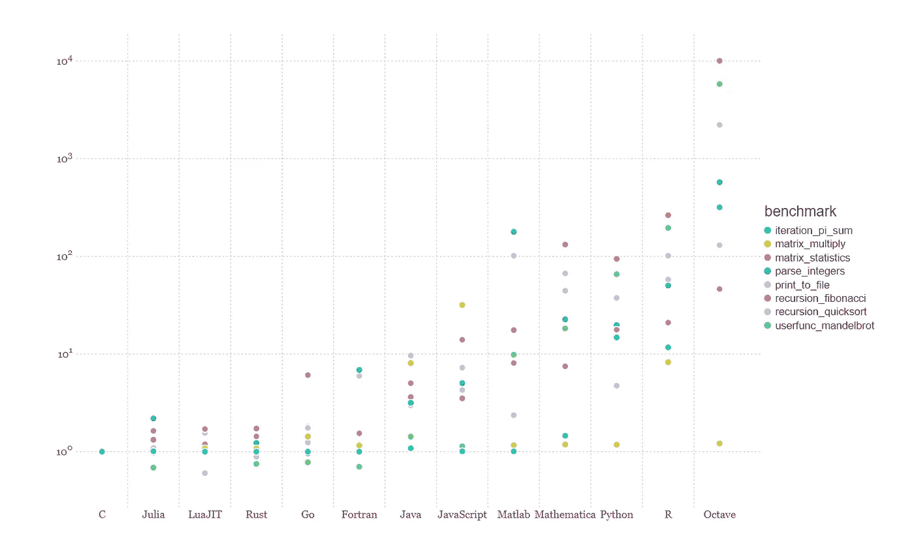

# Python vs. Julia 中的机器学习——Julia 更快吗？

> 原文：<https://towardsdatascience.com/machine-learning-in-python-vs-julia-is-julia-faster-dc4f7e9e74db?source=collection_archive---------9----------------------->

## Python 和 Julia 的简单分类任务的计算速度的分析比较显示了显著的发现

由 [Unsplash](https://unsplash.com?utm_source=medium&utm_medium=referral) 上的[尤利安·瓦加斯](https://unsplash.com/@vargasuillian?utm_source=medium&utm_medium=referral)拍摄的照片

Julia 编程语言在麻省理工学院从一开始就被设计用于科学计算的高性能，但是领域专家在日常工作中仍然更喜欢较慢的语言，例如 Python。Julia 的官方网站提供了一组实验来比较 Julia 和其他编程语言中的计算速度。其中一个练习展示了使用 Julia、SciLua、Rust、Go、Fortran、Java、Javascript、Matlab、Mathematica、Anaconda Python、R 和 Octave 的当前版本计算斐波那契数列:

来源:[朱莉娅 1.6.1。文档。](https://julialang.org/benchmarks/)

这个练习表明，只有 C 能够比 Julia 更快地计算斐波那契数列。这样的竞争优势应该会让 Julia 在机器学习方面拥有超强的能力，使迭代更快，并为工程师节省时间。

真的是这样吗？本文深入研究了 Julia 和 Python 的性能，并比较了两种语言中手写数字的 MNIST 模型的训练时间。

# 实验设计

为了比较 Julia 和 Python 的性能，我用这个设置运行了一个实验

*   使用 MNIST 数据对手写数字任务(0-9)进行分类
*   标准成熟的编程解决方案
*   其他条件相同的方法，尽最大努力使两种解决方案具有可比性
*   仅比较模型训练时间。

我在 JupyterLab 的一台笔记本电脑上运行了这两个代码，该笔记本电脑配有英特尔酷睿 i7–5500 u、2.40 GHz CPU 和 16 GB RAM。

# 数据

我使用 ML 教程中常用的手写数字的经典 [MNIST 数据](http://yann.lecun.com/exdb/mnist/)。该数据集具有 60，000 个预处理的训练集和 10，000 个示例的测试集。数字已经过大小标准化，并在固定大小的图像中居中。 **TensorFlow** 包含 MNIST 数据作为 [TensorFlow 数据集](https://www.tensorflow.org/datasets)的一部分，而 **Julia** 包含 [MLDatasets](https://juliaml.github.io/MLDatasets.jl/stable/) 中相同的预处理数据。

# **朱丽亚实现**

[Flux](https://fluxml.ai/Flux.jl/stable/) 是 Julia 最喜欢的机器学习库之一。导入必要的 Flux 模块后，*统计*库，*ml 数据集:*

数据经过整形、编码、展平，最后加载到训练集中:

接下来，我创建一个具有两个密集层和标准激活函数的模型编译函数，然后对其进行实例化:

接下来，我定义一个损失函数、学习率、ADAM 优化器和包含从模型中获得的参数的 *ps* 对象:

然后用 10 个时期训练该模型。`@time`是衡量培训绩效的有用宏:

# **Python 实现**

在 TensorFlow 中，代码非常基础，类似于 Julia 实现。在他们的[网站](https://www.tensorflow.org/overview)上查看更多详情。我使用*时间*库来测量模型训练时间:

伊恩·施耐德在 [Unsplash](https://unsplash.com?utm_source=medium&utm_medium=referral) 上拍摄的照片

# 瞧，结果出来了！

由于 Julia 比 Python 晚了几十年才被开发出来用于对大量数据进行快速计算，所以人们会期望它能决定性地超越 Python。所以，结果在这里:

**Python:** 训练时间:33.1 秒

朱莉娅: 92.4 秒

我对内存分配或其他指标不感兴趣，但这些数字令人兴奋。为了更好地理解它们，让我们检查一下 TensorFlow 中的 API 层次结构。

> TensorFlow 的核心不是用 Python 写的。它是用 C++编写的，使用 Python 作为包装器。虽然 C++是一个低级 API，但 Python 为构建模型和应用程序提供了一个方便的前端 API。

这个事实清楚地解释了这个结果。TensorFlow API 层次结构在本教程中有很好的解释。

# **结论**

Julia 是一种伟大的语言，它的创造者理所当然地获得了 J. H. Wilkinson 奖，以表彰他们在数字软件领域的杰出贡献。它一直在扩大用户群体，并且是 2021 年[堆栈溢出开发者调查](https://insights.stackoverflow.com/survey/2021#technology-most-loved-dreaded-and-wanted)中“喜爱与恐惧”类别中排名第五的编程语言。

它将在科学计算、时间序列和风险分析、宏观经济预测、气候建模等领域找到大量的用例。

*   在宏观建模中，MATLAB 是一个流行的工具，Julia 将加速模型估计
*   在天气建模中，Julia 可能会在处理大量数据时做同样的事情。

另一方面，本文表明 TensorFlow 仍然可以使模型迭代更快，因为它依赖于 C++后端。在许多情况下，它仍然是训练 ML 模型的优选选择。

*PS:你可以订阅我的* [*邮件列表*](https://medium.com/subscribe/@petrkorab) *每次我写新文章都会收到通知。如果你还不是中等会员，你可以在这里加入*<https://medium.com/@petrkorab/membership>**。**