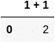
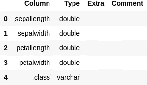
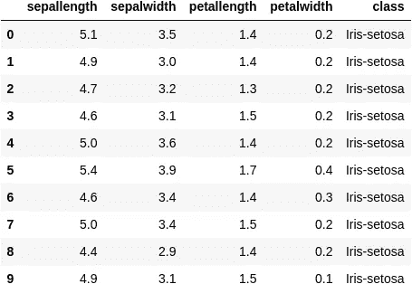
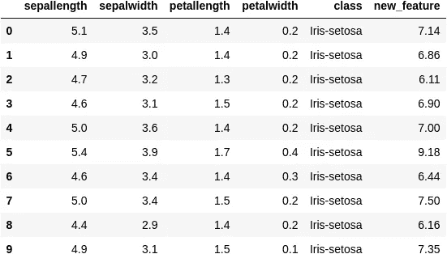
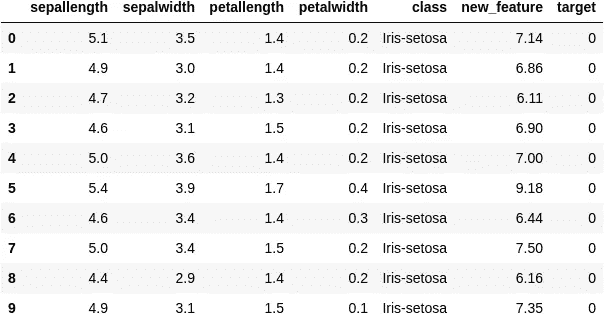
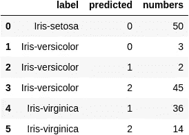
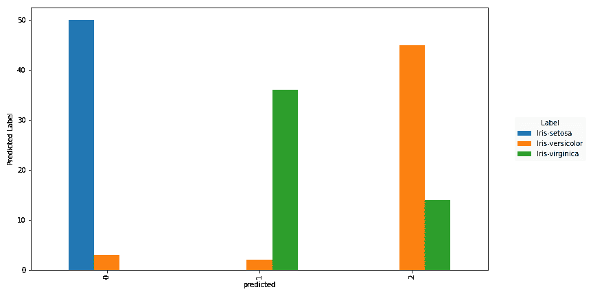

# SQL 中的机器学习——它确实有效！

> 原文：<https://towardsdatascience.com/machine-learning-in-sql-it-actually-works-56e8d91fc273?source=collection_archive---------5----------------------->

## 有了 dask-sql 的最新版本，就有可能在 sql 中使用巨大的 Python ML 生态系统


照片由[克里斯多佛·伯恩斯](https://unsplash.com/@christopher__burns?utm_source=unsplash&utm_medium=referral&utm_content=creditCopyText)在 [Unsplash](https://unsplash.com/s/photos/abstract?utm_source=unsplash&utm_medium=referral&utm_content=creditCopyText) 拍摄

有时很难相信在曼梯·里之前有一个世界存在。如此多的现代数据分析建立在 ML 技术之上，并且在可预见的将来还会继续这样。然而，并不是每个人都能从这些巨大的进步中受益，因为使用 ML 技术主要涉及使用 Python、开发代码和理解许多新技术。特别是当大数据和分布式系统进入游戏时，事情变得一团糟。

这是 SQL 查询引擎试图解决的问题。它们使得用简单而强大的 SQL 命令来使用复杂的分布式系统成为可能。`dask-sql`是一个新的 SQL 查询引擎(免责声明:我是作者),构建在纯 python 的 [Dask](https://dask.org/) 分布式库之上。这个新的库允许您将 Python 与 SQL 和分布式可伸缩计算结合起来！(在我的[其他帖子](/query-your-big-data-with-the-power-of-python-dask-and-sql-f1c5bb7dcdbe)中阅读更多信息)。

`dask-sql`的最新版本 0.3.0 对机器学习有实验支持，所以今天我们就来看看我们能用它做什么。当然，我们将为此使用众所周知的[虹膜数据集](https://en.wikipedia.org/wiki/Iris_flower_data_set)——数据科学的 hello world。尽管这个特定的数据样本非常小，但是本文中展示的所有内容都可以通过在集群中添加更多的计算节点轻松扩展到大量数据。

边注:带`dask-sql`T13 的 ML 是还在实验中:-)可以随意试用，但要谨慎使用。

# **先决条件和准备工作**

在这篇文章中，我假设你(或你的数据工程师)已经设置并运行了`dask-sql`。参考[文档](https://dask-sql.readthedocs.io/en/latest/index.html)或[这篇博文](/deploying-a-python-sql-engine-to-your-cluster-76a590940977)了解更多信息。我还假设你通过 SQL server 接口连接到`dask-sql`——例如通过一个 BI 工具，像 [Apache Hue](https://gethue.com) ,它甚至在最新版本中带有对`dask-sql`的[本地支持](https://docs.gethue.com/administrator/configuration/connectors/#dask-sql)。

如果您使用 Python 接口来`dask-sql`，您仍然可以跟随。只需用以下单元格初始化您的 Jupyter 笔记本

```
**from** IPython.core.magic **import** register_line_cell_magic
**from** dask_sql **import** Context# Create a context to store the tables and models
c = Context()# Small helper function to make our life easier
@register_line_cell_magic
**def** sql(line, cell=**None**):
    ifcell **is** **None**:
        cell = line
        line = **None**

    if **not** line:
        line = {}
    **return** c.sql(cell, return_futures=**False**, **line)
```

在下面的代码示例中，在每个 SQL 命令前面加上`%%sql`，例如

```
%%sql
**SELECT** 1 + 1
```



# 加载和准备数据

这些事情解决之后，让我们从导入数据开始。由于`dask-sql`利用了大型 Python 和 Dask 生态系统，您可以从许多不同的位置读入许多不同格式的数据样本。在本例中，我们将以相当标准的 CSV 格式从互联网获取数据:

```
**CREATE OR REPLACE TABLE** iris **WITH** (
    location = 'https://datahub.io/machine-learning/iris/r/iris.csv',
    persist = True
)
```

数据集以名为“iris”的表格形式加载和存储。`persist = True`使`dask-sql`在内存中缓存数据。

现在，检查数据加载是否正确

```
**DESCRIBE** iris
```



如您所见，数据类型是自动分配的。我们可以用这个标准的 SQL 命令显示前十行数据:

```
**SELECT** * **FROM** iris **LIMIT** 10
```



Iris 数据集的简短介绍:如上面的输出所示，数据集描述了鸢尾花及其物种的测量结果。它是机器学习中的标准数据集之一，可以用作许多类型的 ML 方法的示例。在这个例子中，我们将应用无监督聚类算法。

在我们开始培训之前，让我们首先做每一个 ML 管道中的另一个重要步骤:特征提取。因为我不是生物学家，所以我在这里只介绍一个非常简单和天真的新特性作为例子:用萼片长度乘以萼片宽度。还可以使用 SQL 语句和函数生成更复杂的功能。如果这还不够，`dask-sql`允许注册用 Python 编写的[用户自定义函数](https://dask-sql.readthedocs.io/en/latest/pages/custom.html) (UDF)。

```
**SELECT** 
    *, 
    sepallength * petallength **AS** new_feature 
**FROM** iris
**LIMIT** 10
```



为了让我们的生活变得简单一点，让我们为这个增强的表引入一个别名

```
**CREATE OR REPLACE TABLE** transformed_data **AS** (
    **SELECT** 
        *, 
        sepallength * petallength **AS** new_feature
    **FROM** iris
)
```

我们现在准备应用机器学习！

# 训练机器学习模型

存在大量可能的机器学习模型——从线性回归这样的简单模型到健壮的增强决策树，再到变形金刚这样的尖端研究模型。它们中的许多是在著名的 [scikit-learn](https://scikit-learn.org/stable/) Python 包中实现的，因此(和许多其他库一样)可以在`dask-sql`中使用。

在这个例子中，我们应用了 [k-Means](https://en.wikipedia.org/wiki/K-means_clustering) 聚类算法。简而言之，它将数据集分组为具有相似特征的行簇。如果一切顺利，我们希望它将同一物种的花朵聚集在一起——而不需要我们告诉算法。我们来看看算法表现如何(剧透:不太好)。如果你想了解更多关于兼容`dask-sql`的型号及其设置，我鼓励你看一下[文档](https://dask-sql.readthedocs.io/en/latest/pages/sql/ml.html#ml)。

那么，让我们将我们的聚类算法应用于数据！

```
**CREATE OR REPLACE MODEL** clustering **WITH** (
    model_class = 'sklearn.cluster.KMeans',
    wrap_predict = True,
    n_clusters = 3
) **AS** (
    **SELECT** sepallength, sepalwidth, petallength, petalwidth, new_feature
    **FROM** transformed_data
)
```

正如你所看到的，我们为训练使用了一个新的 SQL 结构`**CREATE MODEL**`，它得到一些参数来指定训练哪个模型。在我们的例子中，我们从 scikit-learn 中选择 k-Means 算法，并将我们期望的组或簇的数量设置为三(因为我们有三个物种)。scikit-learn 包中的算法在中等大小的数据上工作得非常好，如果您需要超越这一点，可以查看一下 [dask-ml](https://ml.dask.org/) 。

训练应该很快就能完成(因为总数据集相当小)，所以我们可以继续检查预测。

# 检查性能

```
**SELECT** * **FROM** **PREDICT** (
    **MODEL** clustering,
    **SELECT** * **FROM** transformed_data
    **LIMIT** 10
)
```



该 SQL 语句将对给定数据应用一个训练模型，并添加一个新列“target ”,其中包含模型的预测目标。从前十行来看，它看起来相当不错(所有的“setosa”都有相同的预测目标)。所以让我们再次引入一个别名来做更多的计算

```
**CREATE OR REPLACE TABLE** iris_results **AS** (
    **SELECT** class **AS** label, target **AS** predicted **FROM PREDICT** (
        **MODEL** clustering,
        **SELECT** * **FROM** transformed_data
    )
)
```

长话短说，我们只快速浏览一下结果，并检查物种的分布和预测的集群。

```
**SELECT** 
    label, predicted, **COUNT**(*) AS numbers
**FROM** iris_results
**GROUP** **BY** label, predicted
```



一点也不完美，不过好在这不是 ML 上的帖子，所以我就跳过优化这一步:-)。您的 BI 工具可能能够自动绘制这些数字，作为 python 用户，您可以使用

```
df = c.sql("""
**SELECT** 
    label, predicted, **COUNT**(*) **AS** numbers
**FROM** iris_results
**GROUP** **BY** label, predicted
""", return_futures=**False**)df = df.set_index(["label", "predicted"])
df.numbers.unstack(0).plot.bar(ax=plt.gca())
```



# 摘要

谢谢你一直关注这个帖子！我们已经介绍了相当多的材料，所以这里快速回顾一下:

*   SQL 查询引擎很酷，因为您可以使用它们来查询复杂的数据，使用复杂的分布式系统，使用简单的 SQL 语法(和许多魔法)。
*   `dask-sql`就是其中之一，它与 Python 生态系统的交互特别简单(因为它是建立在 Dask 之上的，Dask 是一个用于扩展 Python 应用程序的库)。
*   一个好处是可以轻松集成各种各样的 Python ML 库，例如 scikit-learn 包中的 k-Means 算法，如本文中所示。另一件好事是，只要使用 SQL，一切都可以正常工作！

如果你想了解更多，去看看[文档](https://dask-sql.readthedocs.io/)，开始用 SQL 整理你的数据。