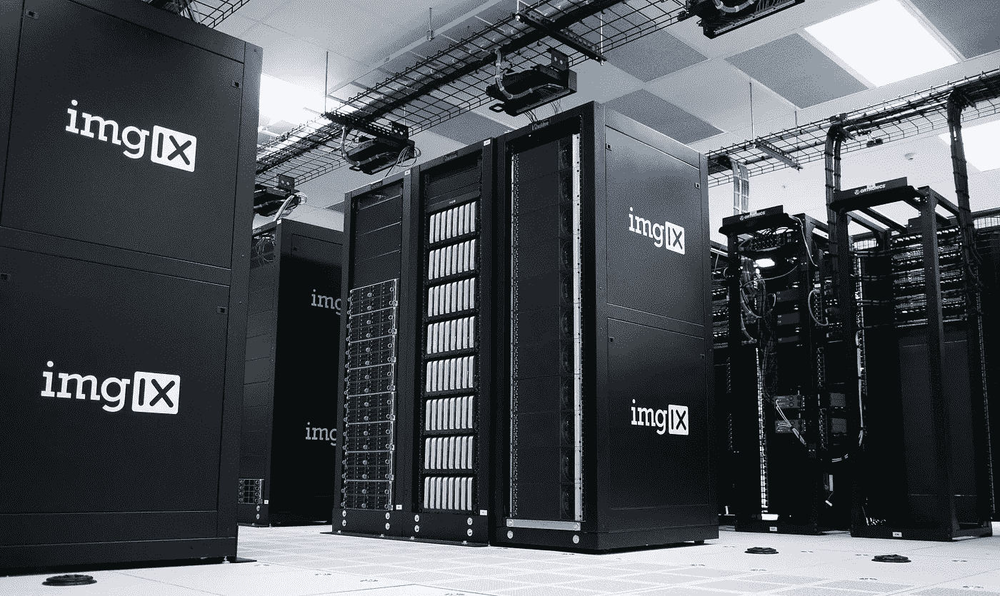

# 区块链和加密货币世界中的机器学习

> 原文：<https://towardsdatascience.com/machine-learning-in-the-world-of-blockchain-and-cryptocurrency-68651ebaecd7?source=collection_archive---------5----------------------->

## 探索机器学习及其在加密货币开采和交易领域的适用性。

> [**在我主持的这个现场培训环节，用 TensorFlow 和 Keras 学习 AI 和深度学习的基础知识。**](https://www.oreilly.com/live-events/practical-introduction-to-the-world-of-computer-vision-and-deep-learning-with-tensorflow-keras/0636920060577/0636920061406/)

照片由[思想目录](https://unsplash.com/@thoughtcatalog?utm_source=unsplash&utm_medium=referral&utm_content=creditCopyText)上的 [Unsplash](https://unsplash.com/s/photos/bitcoin?utm_source=unsplash&utm_medium=referral&utm_content=creditCopyText)

# 介绍

加密货币和区块链的世界越来越令人兴奋，这是理所当然的，因为以太坊和比特币的价格到目前为止都在 2021 年创下历史新高。更不用说区块链技术应用的增加，特别是随着不可替代令牌(NFT)的流行。

像任何技术一样，区块链和加密货币都有与安全性、利用率和效率相关的问题。除了所有的兴奋和主流关注，还有一些合理的努力集中在解决重大的区块链相关问题上。

本文将介绍一些上述问题，以及使用机器学习技术解决区块链/密码相关问题的研究成果。本文中的研究是在最近几年发布的。

# 1.交易(强化学习)

Pierre Borthiry 在 [Unsplash](https://unsplash.com/s/photos/trading?utm_source=unsplash&utm_medium=referral&utm_content=creditCopyText) 上拍摄的照片

交易比特币和以太币等加密货币已经成为散户投资者和大型金融机构的一项活动。截至本文撰写之时，CoinMarketCap 上跟踪了 308 家加密货币交易所。

如今股市中使用的传统交易机器人都带有嵌入式机器学习算法。因此，毫不奇怪，ML 技术也有助于构建加密货币市场交易系统。

在谷歌搜索引擎上键入“*机器学习加密交易机器人*”会产生超过 1200 万个搜索结果，但让我们将注意力转移到学术研究上。

Thomas E. Koker 和 Dimitrios Koutmos 撰写了一篇[研究论文](https://www.mdpi.com/1911-8074/13/8/178/htm)，介绍了使用直接强化学习来创建基于加密货币的主动交易模型。

强化学习(RL)是机器学习的一个子域，在游戏和模拟程序中很常见。RL 通过培训项目(代理)在互动环境中开发优化策略(政策)来获得回报。

这项特殊研究中提出的方法利用了直接强化学习(DRL)。在传统 RL 中，没有对代理的即时性能反馈，但是在 DRL 中，来自先前窗口的性能被用作对代理的反馈。使用 DRL，研究人员能够摆脱创建价格预测模型，并创建了一个基于特定时间间隔(每天)进行调整的系统。

## 外卖食品

强化学习是开发有利可图和适应性强的加密货币交易策略的可行方法。

# 2.优化挖掘策略(强化学习)

照片由[巴特·范·迪克](https://unsplash.com/@bart_van_dijk?utm_source=unsplash&utm_medium=referral&utm_content=creditCopyText)在 [Unsplash](https://unsplash.com/s/photos/crypto-mining?utm_source=unsplash&utm_medium=referral&utm_content=creditCopyText) 上拍摄

在我开始研究之前，这里有一个关于比特币挖矿如何工作的快速速成班。挖掘加密货币涉及利用计算资源来猜测用于求解区块链函数的一组值。允许求解该函数的挖掘器用有效的未决事务更新区块链。

然后区块链网络被更新以包含新的交易。挖掘的目的是用未决事务更新区块链，并为矿工的努力提供奖励。

矿工的这种努力将获得大宗奖励(即比特币)和相应交易产生的交易费。你的计算机越强大，你就能做出越多的猜测来求解这个函数。请注意，这是对加密挖掘的过于简单的描述，但你已经得到了要点。

本节探讨了研究工作，旨在展示 ML 技术在优化采矿工作和防止劫持采矿资源方面的适用性。

[王陶陶](https://postman511.github.io/)、宋长烈和张胜利撰写了一篇[研究论文](https://arxiv.org/pdf/1911.12942.pdf)，发表于 2021 年 1 月，该论文介绍了强化学习(RL)在优化比特币等加密货币的区块链挖掘策略中的应用。

他们的研究工作证明，如果没有区块链的初始模型和相应的参数(矿工的计算资源、交易费用等)。)有可能利用 RL 技术来动态推断与其他策略(传统诚实挖掘和[自私挖掘](https://www.investopedia.com/terms/s/selfish-mining.asp))相比更具性能的挖掘策略。

传统的强化学习算法设计了一些方法，通过这些方法，代理可以最大化地获得环境中的奖励。但是区块链网络是一个动态的环境，在其中很难创建一个有代表性的模型。该论文的作者设计了一种多维 RL 算法，使用 Q 学习(无模型算法)来优化加密货币挖掘。

作者证明，通过机器学习技术，可以解决性能挖掘策略的开发。众所周知，比特币和加密货币挖掘是一个蓬勃发展的行业。据报道，Argo Blockchain、Riot Blockchain 和 Hive Blockchain 等几家矿业公司已经开采了价值数百万美元的比特币。这些公司的技术团队中也可能有 ML 工程师。

## 外卖食品

研究人员创建了强化学习系统，为加密货币挖掘策略提供优化。

# 3.应对密码劫持(深度学习)

照片由 [imgix](https://unsplash.com/@imgix?utm_source=unsplash&utm_medium=referral&utm_content=creditCopyText) 在 [Unsplash](https://unsplash.com/s/photos/data-center?utm_source=unsplash&utm_medium=referral&utm_content=creditCopyText) 上拍摄

加密货币挖掘中机器学习的另一个值得注意的应用与安全有关。由学术机构和国家政府支持的研究实验室配备了大量的计算资源和基础设施。这使得他们成为' [*密码黑客*](https://www.malwarebytes.com/cryptojacking/) '的首要目标。

密码黑客劫持计算资源来挖掘加密货币。这种攻击已经变得司空见惯，并成为头条新闻。

来自美国的研究人员共同努力，设计了一种检测恶意程序存在的方法，这些程序试图劫持计算资源。

[**SiCaGCN**](https://ieeexplore.ieee.org/stamp/stamp.jsp?tp=&arnumber=9149622) 是研究人员给这个系统起的名字。SiCaGCN 基于对程序的控制流图表示进行的距离测量来确定一对程序或代码之间的相似性。

SiCaGCN 系统包括在深度学习和 ML 领域中发现的神经网络架构和技术的组件。

*   [**控制流程图**](https://www.geeksforgeeks.org/software-engineering-control-flow-graph-cfg/) **:** 代码/程序内指令执行流程的表示，其中每个节点代表一个基本块。有向边对应于代码执行中的跳转或流程变化。
*   [**图卷积神经网络**](https://www.topbots.com/graph-convolutional-networks/) **:** 设计用于对图进行卷积运算的神经网络架构。
*   [**注意机制**](https://blog.floydhub.com/attention-mechanism/) **:** 为突出或增强输入/输出或输入之间的重要依赖关系而设计的技术。
*   **神经张量网络、** [**胶囊网络、**](/capsule-networks-the-new-deep-learning-network-bd917e6818e8) 、距离测量( [**图形编辑距离**](https://en.wikipedia.org/wiki/Graph_edit_distance) 和**最大公共子图(MCS)** )

本文的目的不是对 SiCaGCN 进行详细的分析，但是下面是对该系统的高级操作的一步一步的快速概述:

1.  将代码/程序转换成基本块表示的控制流图(CFG)。
2.  通过图形卷积神经网络将基本块的 CFG 作为输入传递到 SiCaGCN 模型，以创建基本块的 CFG 的嵌入。
3.  注意机制(NLP)和胶囊网络被用来从输入图中提取重要的和相关的特征，从而创建更好的嵌入。
4.  使用有效距离度量(图形编辑距离，GED)和最大公共子图(MCS))来确定图形嵌入之间的相似性分数。
5.  训练数据的实例由一对基本块的 CFG 和它们的基本事实相似性得分组成。在测试期间，模型的输入是来自代码对的基本块对 CFG，输出是相似性得分。

[SiCaGCN 架构](https://ieeexplore.ieee.org/stamp/stamp.jsp?tp=&arnumber=9149622)。图片来自原始研究论文

这项研究令人兴奋的方面是 SiCaGCN 系统的实际应用。研究人员测试了该系统在一组科学源代码中检测比特币挖掘代码的能力。当与另一个图相似性计算系统( [SimGNN](https://arxiv.org/pdf/1808.05689.pdf) )比较时，SiCaGCN 表现良好。不难设想，SiCaGCN 可以被修改成一个更广泛的反病毒系统。

## 外卖食品

研究人员设计了一种独特而有效的检测恶意代码的方法，使用深度学习技术来描述和比较代码。该系统被命名为 SiCaGCN，在测试其检测外国比特币采矿代码的能力时，提供了有希望的结果。该系统防止外国程序滥用和未经授权使用计算资源。

# 结论

机器学习在区块链和加密货币的世界中占有一席之地。ML 技术的应用范围不仅仅局限于加密货币的价格预测或交易。

随着更多这些技术进入生产环境并实现商业化，区块链世界可能会在未来几年开始向机器学习从业者开放。

*感谢阅读*

[**在我主持的这个现场培训环节，用 TensorFlow 和 Keras 学习 AI 和深度学习的基础知识。**](https://www.oreilly.com/live-events/practical-introduction-to-the-world-of-computer-vision-and-deep-learning-with-tensorflow-keras/0636920060577/0636920061406/)

# 想要更多吗？

1.  [**订阅**](https://richmondalake.medium.com/subscribe) 在我发布文章时得到通知
2.  [**成为推荐媒介会员，支持我的写作**](https://richmondalake.medium.com/membership)
3.  通过 [**LinkedIn**](https://www.linkedin.com/in/richmondalake/) 联系我
4.  跟我学学 [**奥莱利**](https://www.oreilly.com/live-events/practical-introduction-to-the-world-of-computer-vision-and-deep-learning-with-tensorflow-keras/0636920060577/0636920061406/)

</creating-a-data-science-and-machine-learning-portfolio-with-notion-25888cf19356> 