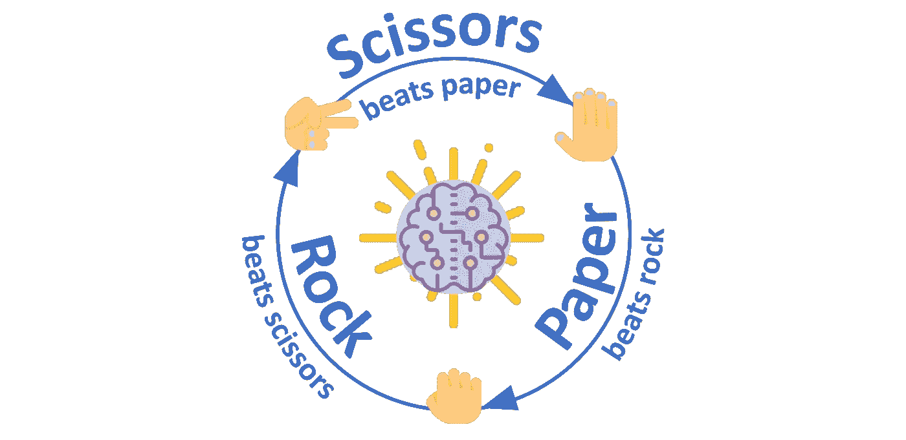
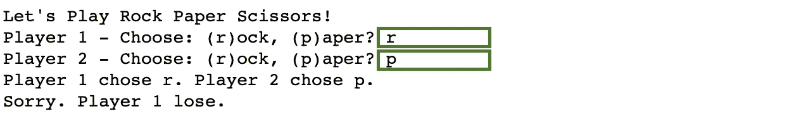
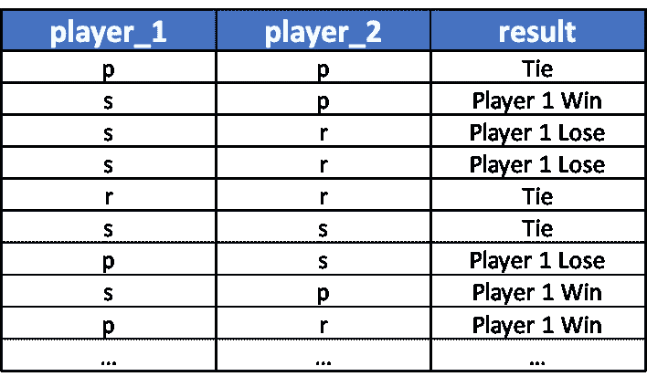
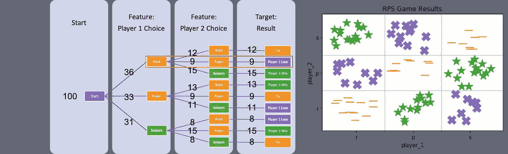
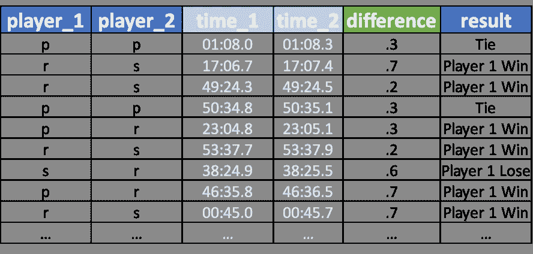
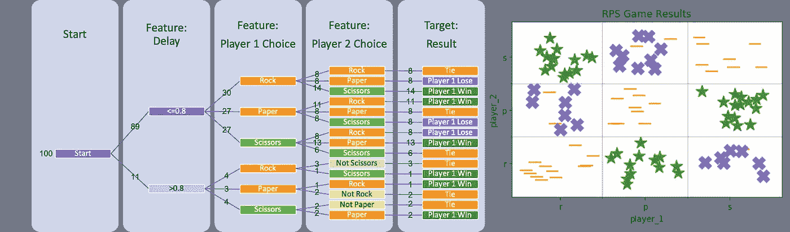
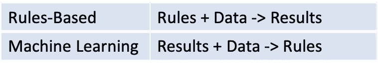
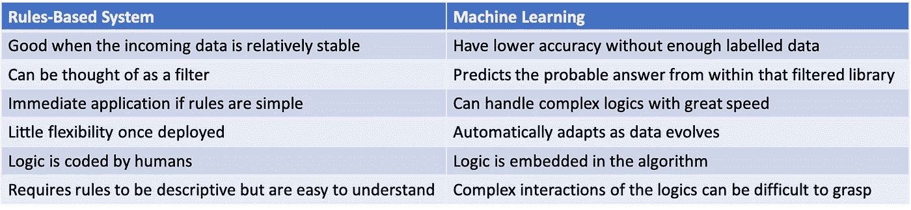

# 从熟悉的角度看机器学习直觉

> 原文：<https://towardsdatascience.com/machine-learning-intuition-from-a-familiar-angle-beada5e69ded?source=collection_archive---------34----------------------->

## 通过石头剪子布游戏探索 ML 的动机和能力

*注:本帖代码可在* [*这里*](https://github.com/kevinclee26/RPS_ML_Demo) 找到



机器学习与石头剪子布游戏(图片由作者提供)

在本文中，我们将使用两种不同的方法用 Python 构建一个简单的石头剪刀布游戏:**基于规则的系统**与**机器学习**。通过这个对比，我希望表达机器学习是如何工作的，以及它的动机。要明确的是，这不是一个关于**图像识别**或**模式识别**(玩家接下来会选择哪只手)的说明，而是一般的机器学习概念。随着自动化不断革新各行各业的未来工作，公司必须探索不同的方式来简化运营。如其[维基](https://en.wikipedia.org/wiki/Machine_learning)所述，

> 机器学习涉及计算机发现它们如何在没有明确编程的情况下执行任务。它涉及计算机从提供的数据中学习，以便它们执行某些任务。对于分配给计算机的简单任务，可以编程算法告诉机器如何执行解决手头问题所需的所有步骤；就计算机而言，不需要学习。对于更高级的任务，人工创建所需的算法可能会很有挑战性。在实践中，帮助机器开发自己的算法可能会比让人类程序员指定每个需要的步骤更有效。

## 传统的编程是基于规则的

我们创建 RPS 游戏的第一个方法是手动编程每个可能的条件。这就是所谓的基于规则的系统。让我们先把游戏简化一点，这样玩家只有两个选择:**石头**或者**纸**。

```
# Print Title
print("Let's Play Rock Paper Scissors!")# User selection
player_1 = input("Player 1 -  Choose from: (r)ock, (p)aper? ")
player_2 = input("Player 2 -  Choose from: (r)ock, (p)aper? ")# Run conditionals
if (player_1 == player_2): 
    result="A smashing tie!"

elif (player_1 == "r" and player_2 == "p"):
    result="Sorry. Player 1 lose."elif (player_1 == "p" and player_2 == "r"):
    result="Yay! Player 1 won."else:
    result="I don't understand! Next time, choose from 'r' or 'p'."

print(f"Player 1 chose {player_1}. Player 2 chose {player_2}.")
print(result)
```

根据这些简单的规则，创建游戏是很容易的。虽然我们不得不手动编程 4 个条件中的每一个(包括一个总括)，但它是可管理的。



游戏结果

让游戏回到常规规则，有三种选择:**石头**、**纸**或**剪刀**。我们必须手动编程的条件数量**快速增长**。

```
# Print Title
print("Let's Play Rock Paper Scissors!")# User selection
player_1 = input("Player 1 - Choose: (r)ock, (p)aper, (s)cissors? ")
player_2 = input("Player 2 - Choose: (r)ock, (p)aper, (s)cissors? ")# Run conditionals
if (player_1 == player_2): 
    result="A smashing tie!"

elif (player_1 == "r" and player_2 == "p"):
    result="Sorry. Player 1 lose."elif (player_1 == "p" and player_2 == "s"):
    result="Sorry. Player 1 lose."

elif (player_1 == "s" and player_2 == "r"):
    result="Sorry. Player 1 lose."

elif (player_1 == "p" and player_2 == "r"):
    result="Yay! Player 1 won."

elif (player_1 == "r" and player_2 == "s"):
    result="Yay! Player 1 won."

elif (player_1 == "s" and player_2 == "p"):
    result="Yay! Player 1 won."else:
    result="I don't understand! Next time, choose from 'r' or 'p'."

print(f"Player 1 chose {player_1}. Player 2 chose {player_2}.")
print(result)
```

当我们**给游戏增加了更多的复杂性**时，我们必须编程的条件数量从 **4** 翻倍到 **8** 。随着游戏复杂度的增加，IF 条件的数量会呈指数增长。

## 使用机器学习来推导规则

在接下来的方法中，我们将使用机器学习来学习游戏的内在规则。

> "鉴于我们对历史结果的了解，我们能对未来事件说些什么呢？"

假设我们要从过去的 100 个 RPS 游戏中检索数据:



过去的游戏结果数据

机器学习需要大量**多样**的数据。幸运的是，我们的数据包含了特征和结果的所有可能选项。我们可以将这个数据集输入到一个算法中，比如**决策树**来表示这个游戏。



决策树可用于表示游戏——每次出现的次数(图片由作者提供)

在模型训练过程中，我们称玩家 1 的选择和玩家 2 的选择为**特征**，而结果为**目标**。也被称为“拟合模型”，这个过程**使用数学和试错法的组合来找到最佳描述变量之间关系的方程**。RPS 游戏是**确定性**的，这意味着结果没有随机性，它是非常二元的。我们的模型已经识别了游戏的所有规则——例如，它观察到的模式之一是，当参与人 1 的选择和参与人 2 的选择相同时，结果总是“平局”。在之前或之后的游戏中玩什么选择，在这个模型中是不考虑的。

```
# Import Dependencies
import pandas as pd
from sklearn.preprocessing import OneHotEncoder
from sklearn.tree import DecisionTreeClassifier# Read Data
df=pd.read_csv('result/result.csv', header=None)
X=df[['player_1', 'player_2']]# Transform Data
ohencoder=OneHotEncoder()
X_transformed=ohencoder.fit_transform(X)# Fit Model
y=df['result']
clf=tree.DecisionTreeClassifier()
clf.fit(X_transformed, y)
```

需要指出的是，虽然使用机器学习的能力非常令人鼓舞，但并不一定需要了解高等数学。有很多开源的机器学习库使得实现很直观=-

一旦开发出来，我们可以用这个模型来评估新游戏的结果。例如，如果玩家的选择是“石头”，玩家 2 的选择是“纸”，则模型判定，由于这种组合的过去 9 次出现中有 9 次都导致训练数据中的“玩家 1 输了”，因此这种结果很可能是相同的。

```
game={'player_1': 'r', 'player_2': 'p'}
game_transformed=ohencoder.transform([list(game.values())])
clf.predict(game_transformed)==========output==========
array(['Player 1 Lose'], dtype=object)
```

这就是机器学习如何识别训练数据中的模式/规则。在游戏复杂度增加的时候特别有效。

假设随着时间的推移，我们开始注意到玩家在做出选择之前先等着看另一个玩家选择什么。我们希望对这种延迟进行一些限制，以确保匿名性和 T2 公平性，但是我们不知道如何在基于规则的系统中实现这一点。我们需要专家意见的一些问题是:1)延迟的阈值应该是多少，2)如果玩家在长时间延迟后选择了一手输牌，他应该输还是平局？我们可以让一个新模型利用历史游戏记录进行自我学习，而不是手动编程条件:



特征工程新列(绿色)

这一次，作为“**特征工程**过程的一部分，我们创建了一个新字段来表示两个选择之间的**时间差**。将此输入决策树算法，数据支持 800 毫秒的延迟截止。换句话说，记录显示，如果在 800 毫秒的延迟后做出第二次选择，游戏通常会使胜利无效。这个“新”规则的实现是快速而轻松的，但是要求我们有足够数量的记录以及额外的字段(列)。



机器学习有效地解释复杂的规则——每次出现的次数(图片由作者提供)

这种方法允许算法自己开发最能代表游戏的适当规则集。为了使用这个机器学习模型进行**推理**，我们将传递玩家的选择和时间作为输入。延迟的截止值是严格基于所提供的训练数据来确定的。如果收集了新的数据并且模型被重新训练，这个截止值可以改变。对于我们简单的树模型,“规则”足够明显，我们可以解释和表达它们。内部工作并不总是容易描述的，特别是当问题变得不那么绝对的时候。作为一个例子，该模型表明，当有一个长的延迟，玩家 1 选择“石头”，有一个决定是否玩家 2 选择“剪刀”，而不是在所有三个选项中选择。为什么会这样，现在还不清楚，但经过一些思考后，这是有道理的，因为参与人 2 选择“纸”和“石头”在历史上都产生了相同的结果:“平局”。机器学习使用基于每个特征的**概率方法**来评估结果。这是手动编程规则的一种受欢迎的替代方法。

## 基于规则的系统与机器学习

机器学习和基于规则的系统都旨在高度准确地自动化决策。



基于规则与机器学习

当编写和实现规则很容易时，基于规则的系统通常更好。如果我们知道规则，并且不希望变量发生变化，我们可以基于简单的 If 语句实现规则。这种方法也被称为基于专家的规则，因为人类专家的知识是必需的(并被记录)。然而，随着时间的推移，基于规则的系统可能会变得“**笨拙**”，因为需要更多的规则来应对环境的变化。机器学习是一种替代方法，它解决了基于规则的方法的一些问题。



优点和缺点

## 摘要

在本文中，我们使用众所周知的石头、剪子、布游戏来探索机器学习的**概念**。随着过去几年数据的显著增加，机器学习有很多机会改变我们为未来创造技术的方式。