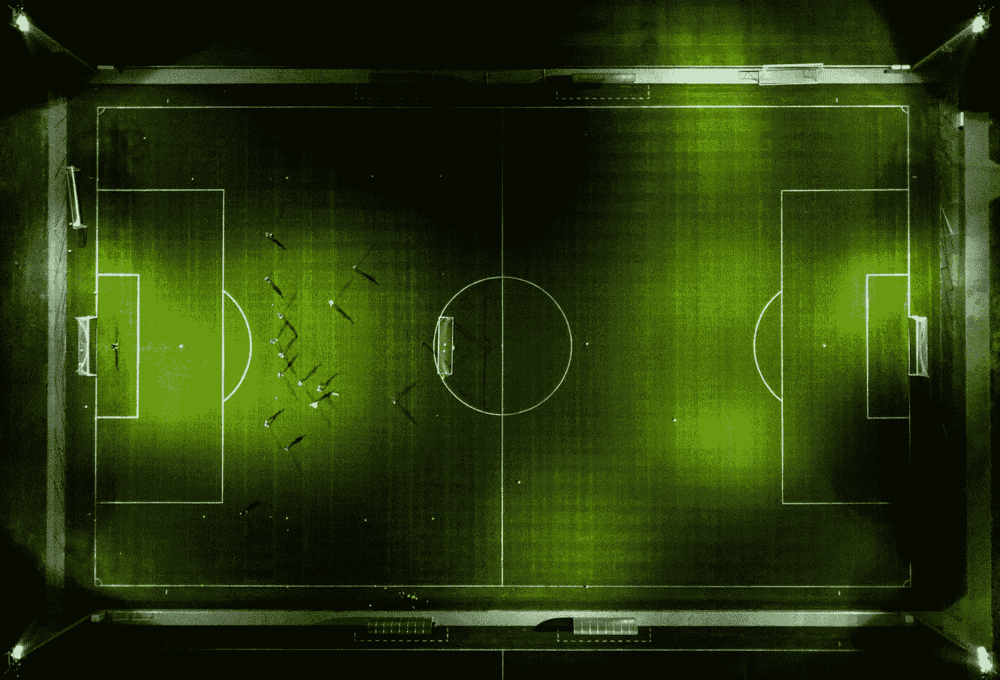
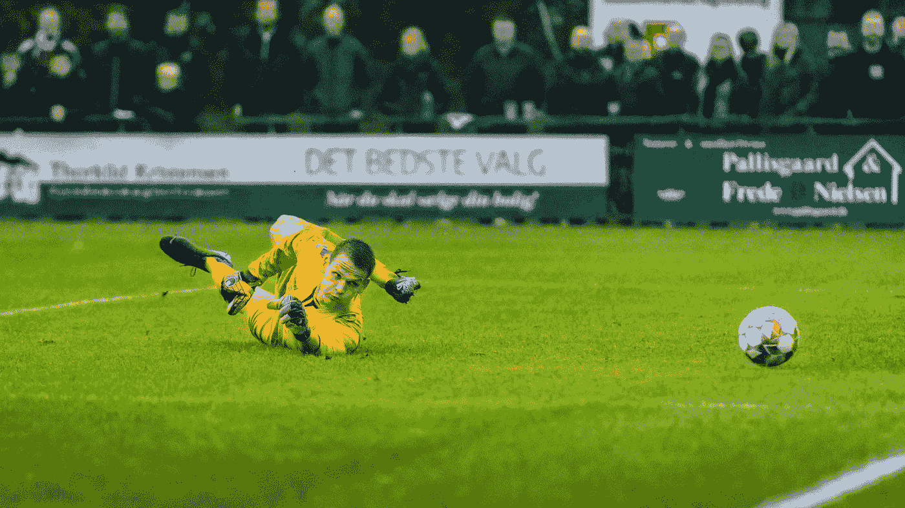

# 机器学习就像足球

> 原文：<https://towardsdatascience.com/machine-learning-is-like-football-e3e3ace8ce7a?source=collection_archive---------50----------------------->

## 对复杂话题的有趣类比

本斯·巴拉-肖特纳在 [Unsplash](https://unsplash.com/s/photos/football-field?utm_source=unsplash&utm_medium=referral&utm_content=creditCopyText) 拍摄的照片

当你成为一名专业数据科学家的计划开始实现时，你将经常不得不回答这个臭名昭著的问题:“那么，你是做什么的？”。如果你想成为机器学习专家，你将很难向没有技术背景的同事解释机器学习是什么。

卡内基梅隆大学著名计算机科学家 Tom Mitchell 教授将机器学习定义为:

> “一种计算机程序，它从经验 E 中学习关于某类任务 T 和性能测量 P，如果它在 T 中的任务的性能，如 P 所测量的，随着经验 E 而提高。”**【1】**

老实说，他的定义不会让你在任何非正式的谈话中走得很远。此外，作为一名数据科学家，您经常需要向非技术受众解释技术术语。因此，每当我发现自己在解释我所做的事情时，我都会使用我的哲学老师曾经对他的学生使用过的同样的技巧:足球类比。如果你在北美，那么你可以称之为足球类比。即使你不喜欢足球，人们似乎也能以这样或那样的方式理解这项运动及其规则。

希望足球的类比能帮助你理解或向他人解释机器学习。

# 球员(数据)

这看起来很明显，但是没有球员，就没有足球比赛。无论你是在职业水平的温布利球场踢球，还是和朋友在街上踢球，都没有关系。没有球员，那些地方只是一个空荡荡的足球场，一条典型的街道。至于机器学习，数据就像玩家；没有数据，什么都做不了。但是，并不是每个数据集都是一样的，就像玩家一样。克里斯蒂亚诺·罗纳尔多和莱昂内尔·梅西都是伟大的球员，他们将超越人们对一场伟大足球比赛的期望。如果我去踢足球，情况就不一样了。所以，好的选手做出了伟大的表演。同样，与数据科学中的名言一致，“垃圾入*，垃圾出*”。无论你的编程技能有多好，或者你对数学了解多少，如果没有有用的数据集，你的机器学习项目很可能会让你的团队失望。

# 足球经理(数据准备)

足球经理对足球队的成功至关重要。尽管英格兰国家足球队有选择顶级球员的奢侈，但它自 1966 年以来还没有赢得过世界杯。负责决定谁去世界杯的人是经理。他还负责为球员提供指导，并影响他们的训练程序。这是一个耗时的过程，如果没有正确完成，球队将无法为下一届冠军做好准备。

一项研究报告称，数据科学家将大约 80%的时间花在数据准备和数据清理上**【3】**。数据专业人员必须将他们的数据集转换成机器学习模型可以学习的格式(*例如*标准化数据，处理空值等)。).对于数据科学家和足球专业人士来说，这些都不是最令人兴奋的方面。

# 足球战术(机器学习模型)

要想赢得冠军，球队必须根据每个对手改变战术。例如，如果美国国家足球队与四次获得世界冠军的德国队比赛，他们可能会建立一个强大的防守体系。如果美国队与冰岛足球队比赛，他们可能希望建立一个强大的进攻战略，采用不同的侵略性战术。所以，一支训练有素的球队，采用正确的战术，在 90 分钟后，很可能会进一些球并赢得比赛。

在我们的世界中，机器学习实践者必须决定应用哪种算法或模型，给定特定的数据集和期望的结果。例如，机器学习专业人员根据问题选择预测模型:分类模型是关于预测标签，而回归是关于预测数量。因此，理解可用的规范和技术对一个成功的项目至关重要。这里有一些机器学习模型供您稍后检查:K-最近邻，逻辑回归，朴素贝叶斯分类器和随机森林。

# 足球设备(硬件和软件)

不同的足球位置需要不同的设备和训练。例如，守门员是唯一可以用手触球的人。因此，他们需要(特殊的)手套和独特的体能训练，相比之下，其他球员必须来回跑 90 分钟，并试图用额头进球。此外，拥有优秀赞助商的团队可以聘请营养师、医疗专家甚至数据科学家来分析表现数据。最终，设备和独特的专业人员有助于球队在世界杯上取得成功。

同样，处理一个小数据集(1000 行 x 5 列)以创建一些图表可能会在使用 MS Excel 的标准笔记本电脑上运行，但从多个服务器提取数据并处理数百万行需要特定的编程语言 Python 和具有非凡计算能力的高性能设备。

拉斯·博·尼尔森在 [Unsplash](https://unsplash.com/s/photos/goalkeeper?utm_source=unsplash&utm_medium=referral&utm_content=creditCopyText) 上的照片

# 不同的联盟(领域专长)

我认为无论你去哪里，总有人在踢足球。它可能是孩子/成人、男人/女人、室内/业余、在线/室外或业余/专业。没关系；总有人在玩。此外，你会遇到技能水平的巨大差异。不同的技术水平和比赛类型不是足球的缺点；他们代表了这项运动的多样性和包容性。每一种技能水平或比赛类型都针对一种特定的需求或需要。一些人喜欢在户外的草地上玩，而另一些人喜欢和几个好朋友在网上玩。没关系，这些人专门从事一种特定类型的足球。

机器学习就像足球一样。不同的专业人员有不同的专业知识，并在各自的领域工作，例如，商业和企业领域(金融市场)以及学术和技术领域(在大学研究开发新的算法)。

# 结论

如果你正处于成为机器学习专业人士的过程中，你不可避免地要向不同背景的人解释你是做什么的。因此，有一个简单有效的类比将有助于您让他们更容易理解机器学习。这就是足球类比的由来。专注于普通观众对足球的了解，并与机器学习建立易于记忆的联系。现在，希望你对我们日常生活中的一个复杂话题有一个有趣的类比。

**感谢阅读。这里有一些你可能会喜欢的文章:**

</trends-in-data-science-that-will-change-business-strategies-1fa3f5ee96b7>  </increase-productivity-data-cleaning-using-python-and-pandas-5e369f898012>  </what-pokémons-can-teach-you-about-machine-learning-d72586c4b202>  

**参考文献:**

**[1]米切尔，T.** (1997)。*机器学习*。麦格劳·希尔。第 2 页。

**【2】世界杯**获胜者[https://en.wikipedia.org/wiki/FIFA_World_Cup](https://en.wikipedia.org/wiki/FIFA_World_Cup)

**【3】数据清洗**[https://www . Forbes . com/sites/Gil press/2016/03/23/Data-preparation-most-time-consumption-least-happy-Data-science-task-survey-says/？sh=6bba28296f63](https://www.forbes.com/sites/gilpress/2016/03/23/data-preparation-most-time-consuming-least-enjoyable-data-science-task-survey-says/?sh=6bba28296f63)