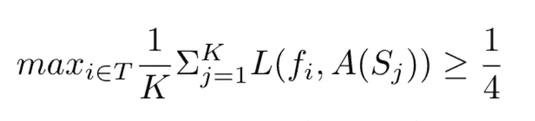
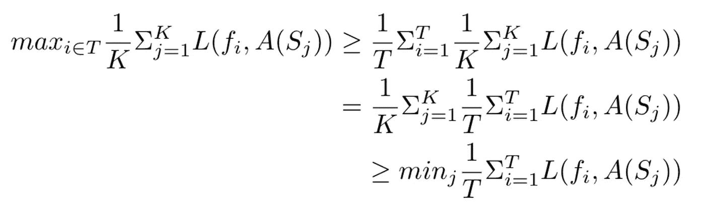
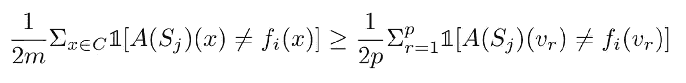
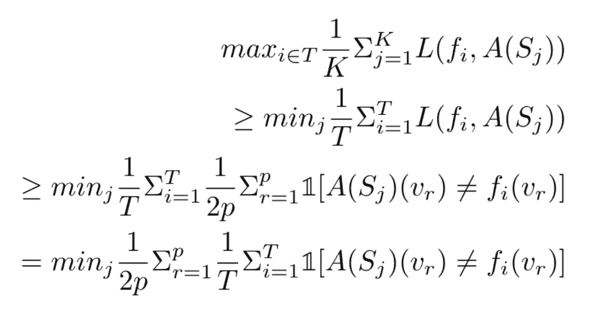
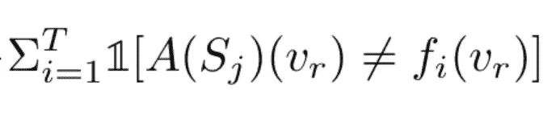
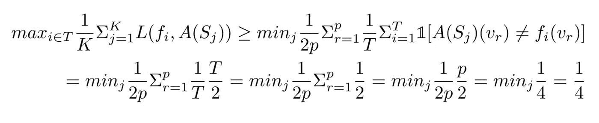

# 机器学习不是万能的:没有免费的午餐定理

> 原文：<https://towardsdatascience.com/machine-learning-is-not-all-powerful-the-no-free-lunch-theorem-16bdcd84c36?source=collection_archive---------20----------------------->

## 有没有单一的机器学习算法可以学习一切？遗憾的是，没有。请继续阅读，找出原因。

[附身摄影](https://unsplash.com/@possessedphotography?utm_source=medium&utm_medium=referral)在 [Unsplash](https://unsplash.com?utm_source=medium&utm_medium=referral) 上拍照

围绕机器学习有很多合理的炒作。过去十年中，机器学习完成的一些事情(例如 AlphaGo)确实令人惊叹。然而，有些人夸大其词了——他们声称最终我们会找到一种可以学习宇宙中任何东西的机器学习算法。不幸的是，实际上有一个重要的定理表明情况不是这样的。这就是“没有免费的午餐”定理。该定理的名称与习语“天下没有免费的午餐”有关，该理论认为，如果你想要某样东西(在我们的例子中，在一个领域学得好)，你必须放弃某样东西(在我们的例子中，在另一个领域学得不好)。理解免费午餐定理的细节将有助于你更好地理解机器学习的理论基础，并防止你被关于机器学习的荒诞说法所欺骗。让我们从几个例子开始。

# 例子

我们有一枚公平的硬币，我们抛两次。有四种可能的历史:HH，HT，TH，TT。我们的目标是给定第一次翻转，预测第二次翻转。因为硬币是公平的，所以四史的可能性是相等的。很明显，在这种情况下，没有“主算法”可以正确预测所有历史。例如，假设我的算法是，如果第一次翻转是 H，则预测 H，如果第一次翻转是 T，则预测 T。我将得到正确的 HH 和 TT 历史，而错误的 ht 和 t H 历史。我可以使用反向算法来正确预测 HT 和 TH，但这样我会把 HH 和 TT 弄错。关键是，无论你如何努力，都不可能有超过 50%的历史是正确的。这是满足“没有免费的午餐”定理的一种方式——这项任务如此困难，以至于没有有效的学习算法。

现在，你可能会问:那么，如果硬币不公平呢？如果硬币的重量偏向正面，那么在第二次投掷时总是预测 H 的算法不是表现得很好吗？这是真的。然而，同样的算法在一枚硬币上表现不佳，硬币重于尾部。这是第二种，也是更常见的满足“没有免费的午餐”定理的方式。通常，对于任何给定的任务，都存在一个运行良好的算法(不像我们的第一个公平硬币的例子，没有算法工作)。关键是这个算法在其他任务上效果不好。

这两个例子演示了两种不同的方法来证明没有免费的午餐算法。一种方法是找一个任务，这个任务太难了，所有算法都学不好。另一种方法是，对于任何给定的算法，找到该算法学习较差的任务。我们将采用第二种方法。下面的证明有一些实质性的符号，所以我们将首先解释设置。

# 证据

设 C 是一组唯一的数据点。假设 C 中有 2m 个这样的数据点，换句话说，C 的大小是 2m。这可能看起来很奇怪，我们用 2m 来表示大小，而不仅仅是变量 m，但这对以后的证明很重要。我们认为这是一个二元分类问题，所以所有这些数据点要么映射到 0，要么映射到 1。现在，我们要问的第一个问题是:C 语言中有多少种可能的函数？因为 c 有 2m 个数据点，并且每个数据点映射到 0 或 1 (2 个选择)，所以总共有 T = 2^(2m)个可能的函数。在这个证明中，我们将用 I 来索引这些函数——例如，第一个可能的函数我们记为 f1，第二个函数是 F2，第 I 个可能的函数是 f1

接下来，用 A 表示一个任意的学习算法，A 的工作方式是，首先我们决定我们要学习什么函数 f_i。然后，A 将一系列数据点 S(训练样本)作为输入，这些数据点根据 f_i 具有正确的{0，1}标签，然后在处理该序列后输出它学习 A(S)的函数。训练样本的大小为 m。因为 c 中总共有 2m 个元素，并且一个样本有 m 个元素，所以总共有 K = (2m)^m)个可能的样本。我们用 j 来索引这些样本，例如，第 j 个可能的样本是 S_ j。

最后，我们需要讨论损失函数。假设我们已经决定用样本 S_ j 来学习函数 f_i，学习算法 A 完成后，它会输出 A(S_j)，这是它学习到的函数。我们的损失函数的目标是表示 f_i 和 A(S_ j)之间的差异。在这个证明中，我们将使用 0–1 损失:我们将逐一检查 C 中的所有 2m 个元素，并找出 f_i 不同于 A(S_ j)的实例数。我们将这个数字除以 2m，得到最终的损失。简单来说:L(f_i，A(S_ j))是 C 中 2m 个元素的百分比，其中 f_i 和 A(S_ j)不同。

在我们继续证明之前，让我们再回顾一下设置。我们有一个大小为 2m 的域 C，它的元素映射到{0，1}。存在 T = 2^(2m)个可能的函数，索引为 f_i。我们表示可以尝试学习这些 f_i 的任意学习算法 a。学习过程的第一步是从 c 中抽取大小为 m 的样本，并决定要学习的函数。有 K = (2m)^m)个可能的样本，索引为 S_ j。然后在样本上训练 a，将得到的学习函数与真实函数进行比较，损失为 0–1。

证明的总体思路是这样的:对于任意的学习算法 A，我们将证明存在某个函数 f，其中 A 试图学习 f(在所有可能的样本上)的期望误差大于 1/4。换句话说，对于任何可能的学习算法，总有一些函数是学不好的。用数学术语来说，我们想表明:

为了理解这个等式，我们从内部开始。总和内的损失函数表示当我们尝试使用样本 S_j 训练 A 来学习函数 f_i 时的损失，对所有可能的样本求和，然后除以样本总数 K，得到 A 尝试在所有可能的样本上学习 f_i 的平均损失(换句话说，A 对 f_i 的预期误差)。给定学习算法 A，我们希望找到具有最高期望误差的函数，并证明它大于 1/4，因此是 I 上的 max。

下一步是做一些操作:

首先，我们利用 I 上的最大值小于 I 上的平均值的性质。然后，我们交换求和的顺序。最后，我们使用 j 上的平均值大于 j 上的最小值的性质。接下来，我们的目标是扩展和的内部——损失函数。

如前所述，损失函数是真实函数 f_i 和学习函数 A(S_ j)之间的 0–1 损失。奇怪字体的数字 1 是一个指示函数。简单来说，indicator 函数在 inside 求值为 true 时求值为 1，inside 为 false 时求值为 0。

接下来，考虑集合 C \ S_ j，或者 C 中没有被选择包含在样本 S_ j 中的元素(在集合符号中，\符号表示排除)。设 p 代表这个集合中元素的个数。由于 C 的大小是 2m，样本 S_ j 是用大小为 m 的替换来选择的，p = 2m -|S_ j| >= m .我们将用 r 和 v 来索引 C \ S_ j 的元素(例如，C \ S_j 的第 r 个元素是 v_r)。这有什么意义？在上述损失函数的展开式中，我们可以用 C \ S_j 代替 C，方法如下:

这里我们使用了两个观察值。首先，我们使用 p >= m，如前所述。第二，我们利用了 C \ S_ j(右边的和)中的每一个元素都包含在 C(左边的和)中的事实。因此，左边的和更大。综合我们目前掌握的信息，我们有:

我们已经接近尾声了。看看这个表情:

现在我们来看这个证明的关键。**注意，对于任意函数 f_i，我们可以构造另一个除 v_r 外与 f_i 完全相同的函数 f _ I’**换句话说，对于 C 中除 v_r 外的所有元素 x，我们有 f _ I(x)= f _ I’(x)。而对于 v_r，我们有 f_i(v_r) ≠ f_i'(v_r)。所有可能的函数都可以这样配对。对于每一对函数，上面的指示函数对其中一个函数的评估值为 1，对另一个函数的评估值为 0。因此，T/2 对中的每一对将对总和贡献 1 + 0 = 1。因此，表达式的计算结果为 T/2。插上这个，我们有:

我们结束了。

关于这个证明，我们应该再说一句。为什么我们要费这么大的劲去看集合 C \ S_ j？难道我们不能在集合 C 本身上使用相同的自变量(将域中只有一个元素不同的函数配对)，而不是在 C \ S_ j 上吗？答案是否定的。原因是，如果 f_i 和 f_i '之间的一个不同元素在 S_ j 中，则试图训练 f_i 的 A(S_ j)将**输出与试图训练 f_i '的 A(S_j)不同的函数**。然后，配对论点不再有效，因为即使 f_i(v_r)和 f_i’(v _ r)仍然不同，我们也没有办法保证 A(S_ j)(v_r)对于 f _ I 和 f _ I’是相同的。

在本文中，我们介绍了没有免费的午餐定理，看了几个简单的例子来建立我们的直觉，然后进行了数学证明。我知道这个证明有点复杂，所以请随时留下任何问题/评论。感谢阅读！