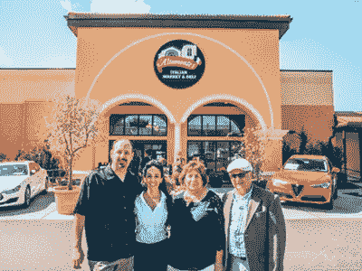
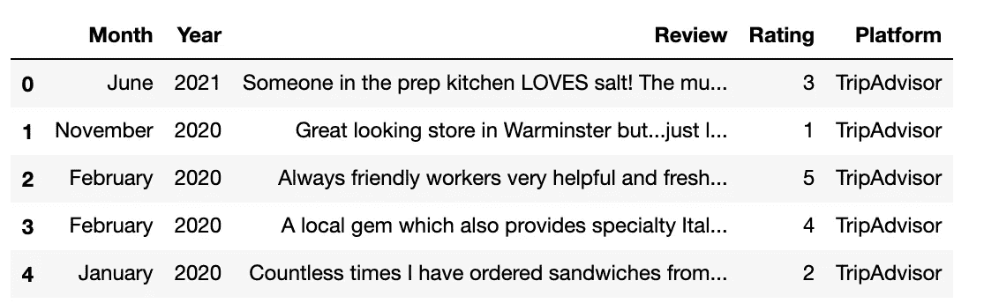
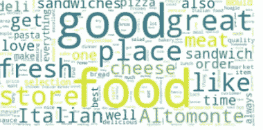

# 机器学习不只是大型科技公司的专利

> 原文：<https://towardsdatascience.com/machine-learning-is-not-just-for-big-tech-using-natural-language-processing-to-support-small-8f571249c073?source=collection_archive---------29----------------------->

## 使用自然语言处理支持小型企业。



图片经所有者批准:阿尔托蒙特意大利市场的所有者(从左至右:文森特、玛丽亚、弗朗西斯、已故的米歇尔)

Altomonte's Italian Market 是一家家族经营的意大利熟食店，自 50 多年前业主移民到美国以来，一直在大费城地区提供传统的意大利美食。Altomonte's 从日耳曼敦的一个单间肉铺起步，现已发展成为一家拥有两家店铺、每周接待数千名顾客的企业。店主弗朗西斯和已故的米歇尔将意大利/美国传统与 21 世纪的理念融合在一起，尤其是在他们的儿子文森特和女儿玛丽亚的帮助下。Altomonte 的大部分分析仍然是按照传统进行的，包括为他们的屠宰部门挑选阉牛，直观地了解客户在一年中的不同时间会购买多少肉。进入 21 世纪，他们已经将技术进步，如三明治订单的触摸屏亭以及其他创新手段融入到他们的业务运营中。这些保持同步的进步还包括建立互联网存在，在这方面，他们的社交媒体平台取得了极大的成功。那么，Altomonte 的下一步能发展到哪里呢？将机器学习(ML)融入他们的日常运营能否继续帮助建立 Altomonte 的意大利市场和熟食店？答案是肯定的。一个家族拥有和经营的意大利市场，而不是硅谷的大型科技公司，可以从 ML 分析中受益。

# **自然语言处理**

自然语言处理(NLP)是机器学习的一个集中领域，它分析人类语音和文本，以推断文档中隐藏的思想。NLP 中的“文本挖掘”是指我们可以通过对单词和 NLP 算法进行不同的转换，从文本体或“语料库”中获得更多的知识。可以采取各种方法来更好地理解一篇文章的主题。[主题模型分析](https://link.springer.com/content/pdf/10.1007/s10994-013-5413-0.pd)允许分析师提取信息，并提出主题或整个文本的摘要。情感分析模型不是寻找不同的主题和标题来描述数据，而是查看数据中隐藏的情感。这两种方法中使用了各种算法，从[潜在狄利克雷分配模型](https://www.jmlr.org/papers/volume3/blei03a/blei03a.pdf?TB_iframe=true&width=370.8&height=658.8)到[二元模型](https://dl.acm.org/doi/pdf/10.1145/564376.564476?casa_token=a_9Dlh5QMT4AAAAA:9XOBlSxC3JBQo4-SxkUky3iH4itn7zhohOOTI6wPl5U_To7ug3n-qGwjW1NxpnoXiNmx9AcuAw)到[神经网络](https://www.morganclaypool.com/doi/abs/10.2200/S00762ED1V01Y201703HLT037?casa_token=kg9An810F_4AAAAA%3AIl7ELd__ERhbD7HC5h5StB_99l4Dg3pXsQUOdWeis2jPtiXutDBXrSLCU3cwDF1nJ9uDGgfi7g&)。虽然我不打算向你展示我如何创建了一个[人工神经网络(ANN)](https://link.springer.com/article/10.1007/s11277-017-5224-x) 可以将英语俚语文本转换成意大利语并检测你的讽刺，但我可以向你展示 NLP 技术如何能够帮助支持传统的意大利市场并为其提供见解。

# **情感分析**

我可以从我为 Altomonte's 进行的分析中进入更好的细节和统计推断，相反，我认为我会让它变得有趣，并解释我如何训练一个卷积神经网络(CNN)来对脸书的市场评论进行情绪预测。所以请坐好，享受一盘美味的意大利面和肉丸(或者让我们跳过甜点，吃一个奶油甜卷)，尽情享受吧！

**什么是情感分析？**

情感分析是解读文本中隐藏的态度、感觉或情绪的过程。“情绪”被定义为[“由感觉引发的态度、思想或判断。”](https://www.merriam-webster.com/dictionary/sentiment)情感分析可以让我们在屏幕后面给我们想要交流的词语附加一种感觉。

**卷积神经网络**

总的来说，[卷积神经网络](https://ieeexplore.ieee.org/document/8308186) (CNN)在目标检测和图像分类领域显示出了有前途的结果。对于文本序列，如果 CNN 的输入维数从二维(图像高度和宽度)变为一维，则可以用于文本分析。在卷积层中，内核沿着样本滑动，沿着数据串在每个停止点进行计算。核的步幅决定了核应该沿着样本移动多少步或多少单位。例如，步幅为 2 的一维 CNN 将在句子序列中移动 2 个单位来进行计算，CNN 本质上是线性的，因此将激活函数应用于线性输出以创建非线性分量，该分量然后可用于对样本进行分类。

# 情绪分析:阿尔托蒙特的意大利市场在线评论

为了进行分析，使用了以下 python 库:

```
import keras
from keras.layers import Input, Conv1D, Embedding , MaxPooling1D, GlobalMaxPooling1D, Dense
from keras.models import Model
from keras.preprocessing.text import Tokenizer
from keras.optimizers import Adam
from keras.preprocessing.sequence import pad_sequences
import pandas as pd
import numpy as np
from sklearn.model_selection import train_test_split
import matplotlib.pyplot as plt
```

## **数据**

训练数据是一个语料库，汇集了来自 Yelp、猫途鹰和谷歌评论的在线评论。这些评论涵盖了 Altomonte 公司过去 10 年的经营情况。训练集中的每个评论具有从 1 到 5 的相关评级，其中 1 被认为是差的，5 被认为是优秀的。脸书评论没有评级，支持他们作为测试数据来预测其隐藏的意义。

```
df = pd.read_csv('Altomontes_reviews.csv')
df.head()
```



图:的输出。csv 文件

如上所示，数据是一个评论列表，每个评论都有“月”、“年”、“评级”和“平台”特性。

**数据处理**

数据以数据框的形式加载后，它被重新构造为两列，一列包含评论，另一列包含基于评论各自评级的情感。首先，模型构建过程中不使用的列被删除。

```
df = df.drop(['Month','Year','Platform'],axis=1)
df2 = df
```

接下来，创建了一个名为“Label”的新的二进制列，如果一篇评论被认为是正面的，则该列的值为 1，如果一篇评论被认为是负面的，则该列的值为 0。评级为 3 或以上的评论被确定为正面，评级为 2 或以下的评论被确定为负面。

```
df['Label'] = [1 if x >=3 else 0 for x in df['Rating']]
```

预处理的下一部分包括将句子中被称为“记号”的单词转换成数字序列。

```
MAX_VOCAB_SIZE = 10000 
tokenizer = Tokenizer(num_words=MAX_VOCAB_SIZE)
tokenizer.fit_on_texts(X_train)
sequences_train = tokenizer.texts_to_sequences(X_train)
sequences_test = tokenizer.texts_to_sequences(X_test)
```

最大 vocab 大小设置为 10000，以确保序列不会变得太大。首先，创建了一个记号化器，并对评论进行了记号化。关于 tokenizer 如何工作的更多信息可以在这里找到。然后，标记化的评论被转换成可供 CNN 阅读的序列。一旦单词被标记化，它们就需要被映射到一个索引。这确保了每个单词都有自己唯一的数字序列。

```
word2idx = tokenizer.word_index
V = len(word2idx)
```

这个数据有 3，248 个唯一的令牌(比任意的最大值 10，000 少得多)。既然文本已经被索引并转移到序列中，它需要用零填充。填充确保通过神经网络运行的数据的每个输入都具有相同的大小。使用后置填充，将 0 添加到每个序列的末尾，使它们与最长的序列大小相同。

```
data_train = pad_sequences(sequences_train,padding='post')
data_test = pad_sequences(sequences_test,maxlen=T,padding='post')
```

数据现在已经处理完毕，CNN 可以在 Altomonte 的意大利市场在线评论上接受培训。

**型号**

对于该模型，具有三个一维层的 CNN 被公式化。初始输入是一个形状为(T)的向量，其中 T 是每个序列的长度。[嵌入层](https://keras.io/api/layers/core_layers/embedding/)将每个索引变量转化为形状大小为 20 的向量。

```
D = 20 i = Input(shape = (T,))
x = Embedding(V +1 , D)(i)
x = Conv1D(16,2,activation='relu',)(x)
x = MaxPooling1D(2)(x)
x = Conv1D(32,2,activation='relu')(x)
x = GlobalMaxPooling1D()(x)
x = Dense(1,activation='sigmoid')(x)model = Model(i,x)
```

一旦创建了模型，就使用二进制交叉熵作为损失函数对其进行编译。使用二元交叉熵是因为被评估的标准是评论是否被正确地识别为 1(正面)或 0(负面)。

```
model.compile(loss='binary_crossentropy',optimizer = 'adam',metrics = ['accuracy'])
```

一旦模型被编译，它就可以适合先前创建的训练和测试数据。

```
r = model.fit(data_train,y_train,epochs=5,validation_data=(data_test,y_test))
```

5 个周期后达到的准确度为 87.8%，这是不错的。训练中出现的一个问题是数据集很小，因此过度拟合是一个主要问题。减少参数(更少的层)和一些下降有助于克服过度拟合。Altomonte 的应该考虑在未来收集更多的评论，以获得一个更通用的预测模型。

**预测**

来自[阿尔托蒙特意大利市场脸书页面](https://www.facebook.com/Altomontes/?ref=page_internal)的评论示例(嘿，看看这个！):

*“强烈推荐！！！直到最近一个朋友来我家吃饭，我才知道奥尔多蒙特。我丈夫和我决定去看看，当我们在那里时，我们见到了店主，她是有史以来最可爱的人！她带我们参观了一下。晚餐我们买了马萨拉鸡，味道好极了！我们还买了布鲁克林披萨当午餐，非常好吃！我们品尝了他们的咖啡，他们让我们品尝了奶油煎饼卷、脆饼和饼干。非常好！我们买了贝壳、番茄酱、一瓶酒、一些奶酪等。一切看起来很好，味道很好，我们可以花几个小时在那里！我们会回来的！！也许今天？”*

阅读这篇评论，我们可以直观地看到这是一个积极的情绪，然而，模型预测了什么？

```
review = tokenizer.texts_to_sequences(instance)pred_list = []
for sublist in review:
    for item in sublist:
        pred_list.append(item)predict_list = [predict_list]review = pad_sequences(flat_list, padding='post', maxlen=T)prediction = model.predict(review).round()
```

将代码转换成填充序列，可以对其情感进行预测。预测四舍五入为 0 或 1。

```
array([[1.]], dtype=float32)
```

正如你所看到的，这篇评论被预测为 1，或者是正面的(大约 88%的准确率)！就像这样，我们有一个 CNN 预测模型，Altomonte's 可以用它来衡量客户对未评级评论的态度和对其业务运营的感受！

# 结论



Altomonte 意大利市场在线评论中最常见的词(摘自完整分析)

小型企业可以将许多机器学习技术整合到他们的运营结构中，以帮助更好地了解企业生产力和绩效。对于食品行业的企业来说，自然语言处理很实用，可以更深入地了解客户的想法，而不仅仅是看评论和做出有根据的猜测。对于 Alomonte 的意大利市场，还有许多其他未讨论的 NLP 技术可以执行。评论的主题模型分析可以提供顾客在参观阿尔托蒙特企业时注意到什么和喜欢什么的反馈。小型企业要从 ML 分析中获得最佳结果，一个要点和建议是开始收集和存储大量数据，并开始整合 NLP 模型。感谢阅读！

**来源**

1.  Gé ron，A.: *用 Scikit-Learn 和 TensorFlow 实践机器学习:构建智能系统的概念、工具和技术*。加利福尼亚州塞瓦斯托波尔奥莱利媒体公司(2017 年)。
2.  瓦西里耶夫尤利。*用 Python 和 Spacy 进行自然语言处理:实用介绍*。旧金山:不上浆，2020。打印。
3.  图片的使用得到了 Altomonte 的意大利市场公司的批准。