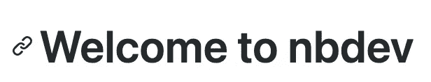
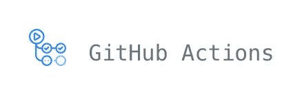
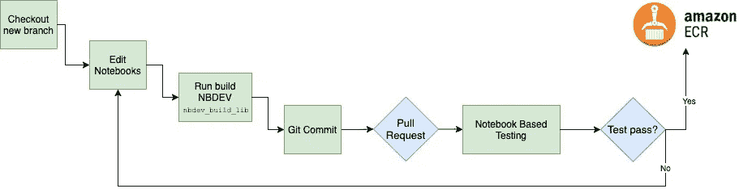
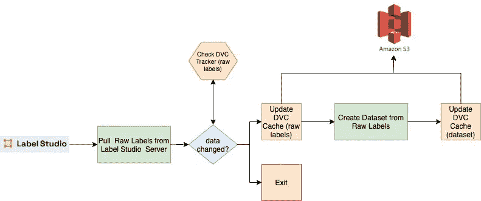
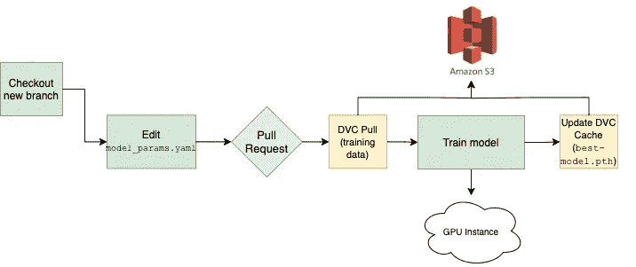
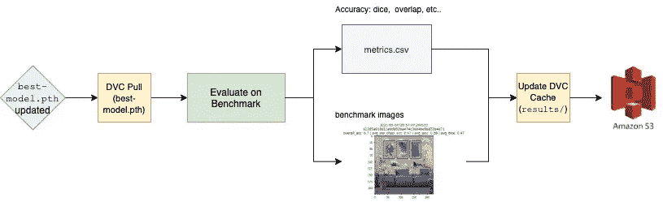

# Github Actions，Iterative.ai，Label Studio 和 NBDEV 在 MLOps 中的冒险

> 原文：<https://towardsdatascience.com/machine-learning-lifecycle-with-mlops-github-actions-label-studio-iterative-ai-and-nbdev-30515f444a3e?source=collection_archive---------20----------------------->

作者:亚伦·索林格尔和威尔·昆兹@[WallShots.co](http://wallshots.co)

在为我们的项目设计 MLOps 堆栈时，我们需要一种解决方案，允许高度的定制和灵活性，以便根据我们的实验进行发展。我们考虑了包含许多功能的大型平台，但发现它在一些关键领域有局限性。最终，我们决定采用一种方法，为标记、数据版本控制和持续集成实现单独的专用工具。本文记录了我们构建这种定制 MLOps 方法的经验。


照片由[在](https://unsplash.com/@finding_dan?utm_source=unsplash&utm_medium=referral&utm_content=creditCopyText) [Unsplash](https://unsplash.com/s/photos/unknown?utm_source=unsplash&utm_medium=referral&utm_content=creditCopyText) 上找到丹|丹·格林维斯

# NBDEV



(摘自[https://github.com/fastai/nbdev](https://github.com/fastai/nbdev))

使用 Jupyter 进行开发的典型问题是，从原型到产品需要将代码从笔记本复制/粘贴到 python 模块。NBDEV 使笔记本和模块之间的转换自动化，从而使 Jupyter 笔记本成为生产流水线的正式组成部分。NBDEV 允许开发者声明笔记本应该创建哪个模块，将哪个笔记本单元推送到模块，以及哪个笔记本单元是测试。NBDEV 的一个关键功能是它在笔记本中的测试方法，NBDEV 模板甚至提供了一个基本的 Github 动作来实现 CI/CD 框架中的测试。生成的 python 模块不需要开发人员进行编辑，并且可以使用内置的 Python 导入功能轻松集成到其他笔记本或整个项目中。

# Iterative.ai: DVC/CML


(摘自[https://iterative.ai/](https://iterative.ai/))

机器学习管道中使用的文件通常是二进制/压缩文件的大型档案，对于 git 等现有版本控制解决方案来说，这些文件是不可访问的或者成本过高。DVC 通过将大型数据集表示为文件内容的散列来解决数据版本控制问题，这使得 DVC 能够跟踪更改。它的工作方式类似于 git(例如`dvc add`、`dvc push`)。当您在数据集上运行`dvc add`时，它会被添加到`.gitignore`中，并由`dvc`跟踪变化。CML 是一个项目，它提供了将模型工件从 Github 动作工作流发布到附加 Github 问题的评论、拉请求等中的功能...这很重要，因为它有助于我们开始填补拉请求中的空白，说明培训数据的变化以及由此产生的模型准确性和有效性。

# Github 操作



(摘自[https://github.com/features/actions](https://github.com/features/actions))

我们想要自动化代码测试，包括在自动化测试管道中构建模型。Github Actions 与 CircleCI、Travis、Jenkins 竞争，后者围绕代码推送、提交、拉取请求等进行自动化测试。由于我们已经在使用 Github 来托管我们的回购，我们通过使用 Actions 来避免另一个第三方应用程序。在这个项目中，我们需要使用 Github 自托管运行程序在本地 GPU 集群上运行作业。

# 标签工作室


(摘自[https://labelstud.io/](https://labelstud.io/))

我们深入探讨了如何使用 Label Studio found [这里](/development-of-a-benchmark-dataset-with-an-interface-to-the-fastai-dataloader-using-label-studio-d3aa3c26661f)。Label Studio 是一个标注数据的解决方案。它运行良好，并且可以灵活地在各种环境中运行。

# 为什么要一起用？

该设置旨在更快地部署模型。这意味着，更多的数据科学家和谐地并行工作，存储库透明，新人入职时间更快。目标是标准化数据科学家在 project 中需要完成的活动类型，并为他们提供清晰的说明。

以下是我们希望通过该系统设计简化的任务列表:

1.  自动从 Label Studio 接收信息，并提供一个单一的接收点，用于模型培训和评估活动。
2.  对数据管道代码进行自动化测试，也就是对流程所使用的容器进行单元测试和重新部署。
3.  对模型代码的自动化测试，也就是对流程所使用的容器进行单元测试和重新部署。
4.  使自动化测试包括模型再训练和评估标准。当模型代码更改时，使用新代码训练模型，并将其与现有的现任模型进行比较。
5.  当训练数据更改时触发模型重新训练。

下面是每个任务的管道描述。

# 传统 CI/CD 渠道

该管道为每个拉请求实现自动测试反馈，包括语法、单元、回归和集成测试的评估。这个过程的结果是一个经过功能测试的 docker 映像到我们的私有存储库中。这个过程最大限度地提高了最新的最佳代码位于存储库中可用于下游任务的经过全面测试的映像中的可能性。下面是开发人员生命周期在新特性环境中的工作方式:



这里我们展示了在编辑代码时工作流是如何工作的。使用 NBDEV 使我们能够直接在 Jupyter 笔记本上工作，包括直接在笔记本上编写测试。NBDEV 要求笔记本中的所有单元无一例外地运行(除非单元被标记为不运行)。(图片由作者提供)

# 数据管道

Label Studio 目前缺少事件挂钩来支持对存储的标签数据进行更新。因此，我们采用`cron`触发的方法，每小时更新一次数据集。此外，虽然 label studio 训练数据集足够小，但更新也可以作为训练管道的一部分来完成。我们能够使用 Github Actions 接口按需触发数据管道刷新。



数据管道来自 Label Studio，并将数据集的每个版本和相关输入保存到存储在 AWS S3 的 DVC 缓存中。(图片由作者提供)

# 模型管道

建模管道将模型培训集成到存储库的 CI/CD 管道中。这使得每个拉请求能够评估在代码库上配置的语法、单元、集成和回归测试，而且还可以提供包括评估新的结果模型的反馈



本例中的工作流运行配置文件(model_params.yaml)中指定的模型训练实验，并更新模型工件(best-model.pth)(图片由作者提供)

# 基准评估管道

基准管道形成了一个“正式提交”过程，以确保所有的建模活动都根据项目的度量标准进行测量。



根据基准数据集对 best-model.pth 中新训练的模型进行评估，结果用最新的提交散列进行标记，并保存在 AWS S3 中。(图片由作者提供)

# 工作流程

这是 DVC 使用的 DAG 定义文件。它捕获工作流程步骤及其输入，并允许用户和机器之间的再现性。

```
stages:
  labelstudio_export_trad:
    cmd: python pipelines/1_labelstudio_export.py --config_fp pipelines/traditional_pipeline.yaml
      --ls_token *** --proj_root "."
    params:
    - pipelines/traditional_pipeline.yaml:
      - src.host
      - src.out_fp
      - src.proj_id
  dataset_create_trad:
    cmd: python pipelines/2_labelstudio_todataset.py --config_fp pipelines/create_traditional.yaml
      --proj_root "."
    deps:
    - data/raw_labels/traditional.json
    params:
    - pipelines/create_traditional.yaml:
      - dataset.bmdata_fp
      - dataset.labels_map
      - dataset.out_fp
      - dataset.rawdata_dir
  train_model_trad:
    cmd: python pipelines/3_train_model.py --config_fp pipelines/model_params.yaml
      --proj_root "."
    deps:
    - data/traditional_labeling
    params:
    - pipelines/model_params.yaml:
      - dataloader.bs
      - dataloader.size
      - dataloader.train_fp
      - dataloader.valid_fp
      - learner.backbone
      - learner.data_dir
      - learner.in_checkpoint
      - learner.metrics
      - learner.n_out
      - learner.wandb_project_name
      - train.cycles
  labelstudio_export_bench:
    cmd: python pipelines/1_labelstudio_export.py --config_fp pipelines/benchmark_pipeline.yaml
      --ls_token *** --proj_root "."
    params:
    - pipelines/benchmark_pipeline.yaml:
      - src.host
      - src.out_fp
      - src.proj_id
  dataset_create_bench:
    cmd: python pipelines/2_labelstudio_todataset.py --config_fp pipelines/create_benchmark.yaml
      --proj_root "."
    deps:
    - data/raw_labels/benchmark.json
    params:
    - pipelines/create_benchmark.yaml:
      - dataset.bmdata_fp
      - dataset.labels_map
      - dataset.out_fp
      - dataset.rawdata_dir
  eval_model_trad:
    cmd: python pipelines/4_eval_model.py --config_fp pipelines/bench_eval.yaml --proj_root
      "."
    deps:
    - data/models/best-model.pth
    params:
    - pipelines/bench_eval.yaml:
      - eval.bench_fp
      - eval.label_config
      - eval.metrics_fp
      - eval.model_conf
      - eval.overlay_dir
```

# 调查的结果

1.  Github Actions 工作流`cron`触发器不是非常可靠。它不能保证时间。
2.  在推送触发的 Github 动作工作流中，DVC 的工作方式并不清晰。它将改变源代码控制的跟踪器，当它被提交时，它将创建另一个 Github 动作。
3.  Github Actions orchestration 作为一种运行模型的机制，需要一个自托管的运行程序来使用 GPU。这意味着连接到云中或本地的 GPU 实例，这带来了访问控制问题。例如，如果不从 repo 中移除自托管的 runner 配置，我们就不能开源确切的 repo，否则随机的人将能够通过将代码推送到项目来在我们的培训服务器上运行工作负载。
4.  NBDEV 内置工作流在错误的地方测试代码。它是在测试笔记本而不是编译好的包。一方面，能够说“测试可以直接写在笔记本上”是件好事。另一方面，测试笔记本直接测试留下了 NBDEV 创建的代码包失败的可能性，即使笔记本运行了。我们需要的是直接测试 NBDEV 编译的包的能力
5.  从 NBDEV 是单行道的意义上来说，NBDEV 不与“传统的”Python 开发互操作。它只是允许项目以交互式 Jupyter 笔记本风格开发。这使得直接开发 Python 模块变得不可能。如果在任何时候，项目想要转换成“传统的”Python 开发测试，就需要用另一种方式来完成。
6.  一开始，我们使用 Weights & Biases 作为我们的实验跟踪仪表板，但是在将其部署到 Github 操作中时出现了问题。我们可以说的是，实现`wandb`的用户体验在动作工作流中遇到了第一次挫折。去除重量&偏见直接解决了问题。在此之前，`wandb`在 MLOps 中脱颖而出，成为最佳用户体验。

# **结论**

最终，用 Github Actions、Iterative.ai tools (DVC & CML)和 NBDEV 完成了这些管理我们代码的工具的实现，花了一周时间。这为我们提供了以下功能:

1.  Jupyter 笔记本作为代码的记录系统。我们喜欢朱庇特。它实现的主要用例是，通过在任何硬件上托管一个 Jupyter 服务器并将其转发到桌面，使我们能够直接在我们可以 SSH 到的任何硬件上工作。明确地说，即使我们不使用 NBDev，我们也会这样做，因为替代方案是使用 Vim 或一些我们不太喜欢的工具。过去用 VS 代码或 Pycharm 连接远程服务器的实验都失败了。所以是朱庇特。
2.  测试代码，并测试它创建的模型。现在，作为 CI/CD 管道的一部分，我们可以评估回购变更产生的模型是否会使模型变得更好、更差或保持不变。这在 pull 请求合并到`main`之前都是可用的。
3.  使用 Github Actions server 作为训练运行的协调器，开始允许多个数据科学家以更清晰的方式同时工作。展望未来，我们将看到这种设置在编排协作数据科学流程方面的局限性。