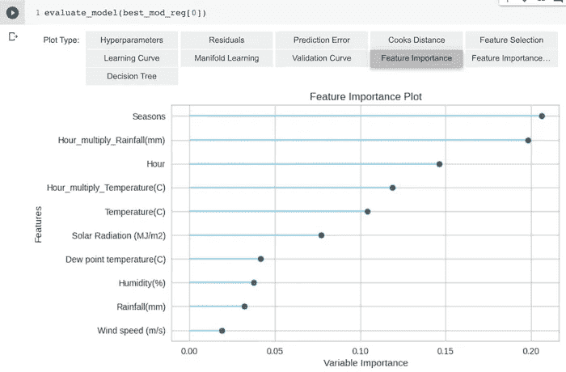

# 机器学习迷你项目 5

> 原文：<https://towardsdatascience.com/machine-learning-mini-project-6f67e511ffd3?source=collection_archive---------18----------------------->

## 使用 pycaret、keras 和 Tensorflow 概率预测首尔每小时自行车租赁量


照片由[像素](https://www.pexels.com/photo/architecture-buildings-city-cityscape-237211/?utm_content=attributionCopyText&utm_medium=referral&utm_source=pexels)的[皮克斯拜](https://www.pexels.com/@pixabay?utm_content=attributionCopyText&utm_medium=referral&utm_source=pexels)拍摄

[数据:来自 UCI 机器学习知识库的首尔自行车共享数据集。](https://archive.ics.uci.edu/ml/datasets/Seoul+Bike+Sharing+Demand)目标是**租赁自行车数量**。这意味着这是计数数据，是正整数值。预测因子/特征大多与天气相关，例如阳光、雨、风、能见度，以及时间特征，例如一天中的小时、是否是假日等。你可以在这里查看我的整个 colab 笔记本。

**问题:这应该是泊松回归问题吧？**计数数据通常假设来自泊松分布。与其回顾基础知识，我建议您参考下面两篇优秀的教程，以及普林斯顿大学关于广义线性模型(GLMs)的课堂笔记。

[*泊松回归简介*](https://medium.com/tencent-thailand/intro-to-poisson-regression-22fb33918839)

[*泊松回归图解指南*](http://An Illustrated Guide to the Poisson Regression Model)

[*泊松模型为计数数据*](https://data.princeton.edu/wws509/notes/c4.pdf)

假设我们只对系统工作的天数进行建模——这是直方图和核密度估计值，让您对 pdf 有个大概的了解。


问题的答案是:这可能没那么重要。正如教程中提到的，您可以使用最小二乘法(假设基于协变量的某个(非线性)线性预测值为高斯响应分布。如果您想要整数预测，您总是可以将连续标签四舍五入为整数值。我们还可以使用不同的损失函数来调整我们的正常方法(例如 XGBoost ),以更好地适用于计数数据。

**预处理。**我为此使用 pycaret。我发现对特性使用 ***分位数变换*** 会有所帮助，而不是像 box-cox 或 yeo-johnson 那样的幂变换。我认为***feature _ selection***和***feature _ interaction***也很有帮助，你会在下面的特性重要性分析中看到。数据被分割成 80/20，没有洗牌，因为它是一个时间序列，我们不想从未来泄漏到过去。**小时**和**季节**是整数编码变量，我决定将它们视为**序数**(有序分类)变量。我放弃了日期变量本身；我想也许人们可以将月份作为一个新的特征，但我认为季节往往会涵盖这一点——本质上，其他变量也是如此，它们描述了每日和季节性的天气状况。

**py caret 中的默认学习者**


明白了，ExtraTreesRegressor()

因此，在这里，ExtraTreesRegressor()似乎是明显的赢家。以下是一些更重要的特性，包括一些交互术语:



如果我真的不喜欢骑自行车的话，时间和降雨量的相互作用对我来说很有意义。

**替代损失函数。但是这些学习器是默认设置的，这意味着对他们中的很多人来说，你正在使用一些 MSE/RMSE 类型的损失函数。然而，您可能更感兴趣的是对 MAE 建模，或者至少是对它进行报告，因为当您谈论自行车之类的东西时，MAE 是衡量拟合优度的最“直观”的方式。然而，有足够好的理由探索不同的损失函数，如 MAE、Huber、Poisson、Logcosh 等。根据泊松偏差来考虑拟合优度也是值得的。原因何在？因为正如我们所知，MSE 往往会受到异常值的影响，而 MAE 则没有那么大。Huber 有点像 MSE 和 MAE 的组合，这意味着它试图不受异常值的过度影响，Logcosh 就像 MAE 的平滑版本，其梯度随着您达到 0 而变得平坦(因此如果您使用 SGD，可以减轻爆炸梯度)。泊松有点奇怪，但是倾向于惩罚你在泊松分布的重尾中发现的更大的计数值，导致更好的校准模型。这里有一个学习者列表，我们将尝试各种损失函数。这不是详尽的，但应该让我们知道是否有任何进一步的途径。**

```
reg_list = [
DummyRegressor(strategy = "mean"),
PoissonRegressor(max_iter = 5000),
XGBRegressor(objective = "count:poisson"),
LGBMRegressor(objective = "mae"),
LGBMRegressor(objective = "poisson"),
LGBMRegressor(objective = "huber"),
LGBMRegressor(objective = "tweedie"),
HistGradientBoostingRegressor(loss = "poisson"),
CatBoostRegressor(objective = "Poisson", verbose = 0),
CatBoostRegressor(objective = "MAE", verbose = 0),
CatBoostRegressor(objective = "Huber:delta=200", verbose = 0)]
```

以下是通过 pycaret 得出的结果:


在泊松偏离方面，我发现上面列表中的第三个 Huber 损失的 CatBoostRegressor()表现最好。如果 R2 是你选择的绩效指标，它也会被认为是最好的。

**改造目标。**通常将响应变量的平方根作为方差稳定变换。这意味着你正在转换回归方程的两边。我尝试在 pycaret 中使用 yeo-johnson。如果想求平方根，用 sklearn 中的 TransformTargetRegressor()函数自己做，就像这样。我读到过很多人在求平方根之前在回答中添加一些东西，尤其是如果有 0 的话，但是我们没有，我不确定结果会有很大变化。我对预测进行了剪辑，使任何小于 0 的值都映射到. 0001。

```
def squareme(x):
  return  x ** 2tt = TransformedTargetRegressor(regressor =    ExtraTreesRegressor(criterion  = "mse"),func = np.sqrt, inverse_func = squareme)tt.fit(X_train, y_train)
preds = tt.predict(X_test)
preds = preds.clip(min = .0001)
```

结果令人惊讶。你在这张图上看不到它，这一轮的平均寿命是 219，但你可以很容易地降到 210-215。泊松偏差也相当低，为 126，但是未转换目标上的 ExtraTreesRegressor()可以达到 119 左右，因此它可能在技术上得到更好的校准。不管是哪种方式，ExtraTreesRegressor()都远远超过其他的。


**喀拉斯**。让我们换个方式，看看深度学习在这项任务上可能会有什么表现。我们可以从一个常规的深度网络开始，它在最后有一个 **tf.exp(指数)**激活。这意味着，你把它当作一个有对数联系的泊松回归。使用深度学习的优势在于，您可以将泊松的对数(速率)表示为特征/回归变量的更具表现力的非线性函数。另一件好事是，我们可以使用 keras/tensorflow 内置的各种损失函数。换句话说，你可以使用**“Huber”、“poisson”、“logcosh”、“mae”、“MSE”**等。当你编译模型的时候。但是请记住，您必须重置回调并调整学习速率——例如，对于“mse ”,梯度为 x，因此您应该将学习速率降低到更小的值，如 1e-4。此外，我将对数据使用 MinMaxScaler()，使其在[0，1]范围内。这有很大的不同。以下是缩放后的代码:

```
early_stopping = EarlyStopping(patience = 25, restore_best_weights = True, min_delta = 0.1, monitor = "val_loss")reduce_LR = ReduceLROnPlateau(factor = 0.9, patience = 10, min_delta = 0.1)i = Input(shape = (trainx.shape[-1]))
o = Dense(100, "relu")(i)
o = Dense(50, "relu")(o)
o = Dense(25, "relu")(o)
o = Dense(1, activation = tf.exp)(o)model_dnn = Model(inputs = i, outputs = o)
model_dnn.summary()
model_dnn.compile(loss = "poisson", optimizer = Adam(2e-4))model_dnn.fit(trainx, trainy,
validation_data = (valx, valy),
callbacks = [early_stopping, reduce_LR],
batch_size = 32,
epochs = 1000)model_dnn.fit(trainx, trainy,
              validation_data = (valx, valy),
              callbacks = [early_stopping, reduce_LR],
              batch_size = 32, epochs = 1000)
```

当然，每次的结果都不一样。我会说这或多或少是 MAE/Logcosh 和泊松损失函数之间的联系。平均相对误差预计在 220-235 之间。奇怪的是，这个模型如何错过了你在下面看到的那些尖峰，我认为这是某种“高峰时间”。ExtraTreesRegressor()至少在模型预测中有某种“峰值”。


它错过了尖峰。

**张量流概率。**让我们让神经网络的最后一层更具概率性，要求它从参数分布中返回一个样本，也就是说，让我们使用神经网络来找到泊松的速率/方差，然后让我们的 yhat 预测成为该样本。为此，我们需要从 pdf 中抽取样本的图层。可以看到我注释掉了一行有 tfd 的。在里面很正常。其原因是速率>为 20 左右的泊松可以近似为具有相同均值和方差的高斯。这意味着高斯的“标度”——标准差——是它的平方根，因此是 K.sqrt(x)部分。损失函数是与理论分布相比的负对数似然。

```
import tensorflow_probability as tfp
import tensorflow as tf
tfd = tfp.distributions
import keras.backend as Kinputs = Input(shape=(trainx.shape[1],))x = Dense(100, "relu")(inputs)
x = Dense(50, "relu")(x)
x = Dense(25, "relu")(x)
x = Dense(1, tf.exp)(x)#p_y = tfp.layers.DistributionLambda(lambda x : tfd.Normal(loc = x, scale = K.sqrt(x)))(x)p_y = tfp.layers.DistributionLambda(lambda x : tfd.Poisson(x))(x)model_p = Model(inputs=inputs, outputs=p_y)def NLL(y_true, y_hat):
  return -y_hat.log_prob(y_true)model_p.compile(Adam(lr = 2e-4), loss = NLL)
model_p.summary()
```

结果相当不错:平均汇率可以降到 223 左右。使用 keras/Normal 模型，我可以在一次良好的试验中达到 213 的 MAE。这种 keras/正态模型的泊松偏差约为 106，keras/泊松可以达到 101。相比之下，ExtraTreesRegressor()的泊松偏差在 120 范围内。也许 keras/Poisson 模型可以被认为是 ExtraTreesRegressor()的一个可行的替代方案，因为它可以实现一个可比较的 MAE，但明显更好的 Poisson 偏差。

就是这样。希望你喜欢。欢迎提问和评论，记得查看我的 colab 笔记本(顶部的链接)。

这里有一些我认为有助于理解理论和想法的参考资料。

<https://stats.stackexchange.com/questions/46418/why-is-the-square-root-transformation-recommended-for-count-data>  <https://scikit-learn.org/stable/auto_examples/linear_model/plot_poisson_regression_non_normal_loss.html>  <https://blog.tensorflow.org/2019/03/regression-with-probabilistic-layers-in.html>  <https://matthewmcateer.me/blog/a-quick-intro-to-bayesian-neural-networks/>  <https://stats.stackexchange.com/questions/492726/what-is-use-of-tweedie-or-poisson-loss-objective-function-in-xgboost-and-deep-le>     