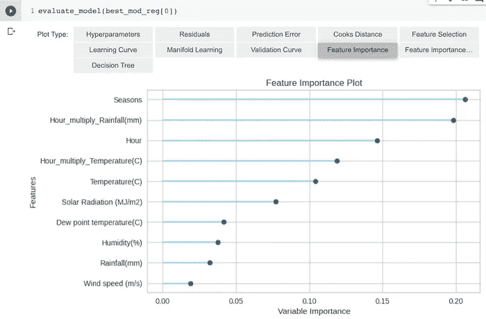
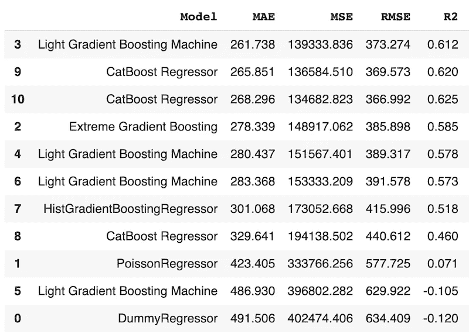
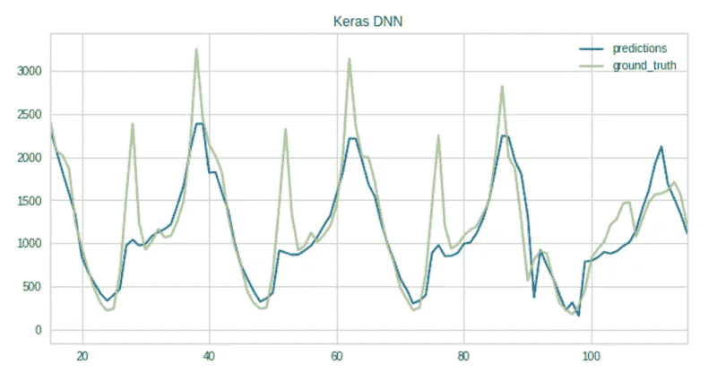

# 机器学习迷你项目 5

> 原文：<https://towardsdatascience.com/machine-learning-mini-project-6f67e511ffd3?source=collection_archive---------18----------------------->

## 使用 pycaret、keras 和 Tensorflow 概率预测首尔每小时自行车租赁量


照片由[像素](https://www.pexels.com/photo/architecture-buildings-city-cityscape-237211/?utm_content=attributionCopyText&utm_medium=referral&utm_source=pexels)的[皮克斯拜](https://www.pexels.com/@pixabay?utm_content=attributionCopyText&utm_medium=referral&utm_source=pexels)拍摄

[数据:来自 UCI 机器学习知识库的首尔自行车共享数据集。](https://archive.ics.uci.edu/ml/datasets/Seoul+Bike+Sharing+Demand)目标是**租赁自行车数量**。这意味着这是计数数据，是正整数值。预测因子/特征大多与天气相关，例如阳光、雨、风、能见度，以及时间特征，例如一天中的小时、是否是假日等。你可以在这里查看我的整个 colab 笔记本。

**问题:这应该是泊松回归问题吧？**计数数据通常假设来自泊松分布。与其回顾基础知识，我建议您参考下面两篇优秀的教程，以及普林斯顿大学关于广义线性模型(GLMs)的课堂笔记。

[*泊松回归简介*](https://medium.com/tencent-thailand/intro-to-poisson-regression-22fb33918839)

[*泊松回归图解指南*](http://An Illustrated Guide to the Poisson Regression Model)

[*泊松模型为计数数据*](https://data.princeton.edu/wws509/notes/c4.pdf)

假设我们只对系统工作的天数进行建模——这是直方图和核密度估计值，让您对 pdf 有个大概的了解。


问题的答案是:这可能没那么重要。正如教程中提到的，您可以使用最小二乘法(假设基于协变量的某个(非线性)线性预测值为高斯响应分布。如果您想要整数预测，您总是可以将连续标签四舍五入为整数值。我们还可以使用不同的损失函数来调整我们的正常方法(例如 XGBoost ),以更好地适用于计数数据。

**预处理。**我为此使用 pycaret。我发现对特性使用 ***分位数变换*** 会有所帮助，而不是像 box-cox 或 yeo-johnson 那样的幂变换。我认为***feature _ selection***和***feature _ interaction***也很有帮助，你会在下面的特性重要性分析中看到。数据被分割成 80/20，没有洗牌，因为它是一个时间序列，我们不想从未来泄漏到过去。**小时**和**季节**是整数编码变量，我决定将它们视为**序数**(有序分类)变量。我放弃了日期变量本身；我想也许人们可以将月份作为一个新的特征，但我认为季节往往会涵盖这一点——本质上，其他变量也是如此，它们描述了每日和季节性的天气状况。

**py caret 中的默认学习者**


明白了，ExtraTreesRegressor()

因此，在这里，ExtraTreesRegressor()似乎是明显的赢家。以下是一些更重要的特性，包括一些交互术语:



如果我真的不喜欢骑自行车的话，时间和降雨量的相互作用对我来说很有意义。

**替代损失函数。但是这些学习器是默认设置的，这意味着对他们中的很多人来说，你正在使用一些 MSE/RMSE 类型的损失函数。然而，您可能更感兴趣的是对 MAE 建模，或者至少是对它进行报告，因为当您谈论自行车之类的东西时，MAE 是衡量拟合优度的最“直观”的方式。然而，有足够好的理由探索不同的损失函数，如 MAE、Huber、Poisson、Logcosh 等。根据泊松偏差来考虑拟合优度也是值得的。原因何在？因为正如我们所知，MSE 往往会受到异常值的影响，而 MAE 则没有那么大。Huber 有点像 MSE 和 MAE 的组合，这意味着它试图不受异常值的过度影响，Logcosh 就像 MAE 的平滑版本，其梯度随着您达到 0 而变得平坦(因此如果您使用 SGD，可以减轻爆炸梯度)。泊松有点奇怪，但是倾向于惩罚你在泊松分布的重尾中发现的更大的计数值，导致更好的校准模型。这里有一个学习者列表，我们将尝试各种损失函数。这不是详尽的，但应该让我们知道是否有任何进一步的途径。**

```
reg_list = [
DummyRegressor(strategy = "mean"),
PoissonRegressor(max_iter = 5000),
XGBRegressor(objective = "count:poisson"),
LGBMRegressor(objective = "mae"),
LGBMRegressor(objective = "poisson"),
LGBMRegressor(objective = "huber"),
LGBMRegressor(objective = "tweedie"),
HistGradientBoostingRegressor(loss = "poisson"),
CatBoostRegressor(objective = "Poisson", verbose = 0),
CatBoostRegressor(objective = "MAE", verbose = 0),
CatBoostRegressor(objective = "Huber:delta=200", verbose = 0)]
```

以下是通过 pycaret 得出的结果:



在泊松偏离方面，我发现上面列表中的第三个 Huber 损失的 CatBoostRegressor()表现最好。如果 R2 是你选择的绩效指标，它也会被认为是最好的。

**改造目标。**通常将响应变量的平方根作为方差稳定变换。这意味着你正在转换回归方程的两边。我尝试在 pycaret 中使用 yeo-johnson。如果想求平方根，用 sklearn 中的 TransformTargetRegressor()函数自己做，就像这样。我读到过很多人在求平方根之前在回答中添加一些东西，尤其是如果有 0 的话，但是我们没有，我不确定结果会有很大变化。我对预测进行了剪辑，使任何小于 0 的值都映射到. 0001。

```
def squareme(x):
  return  x ** 2tt = TransformedTargetRegressor(regressor =    ExtraTreesRegressor(criterion  = "mse"),func = np.sqrt, inverse_func = squareme)tt.fit(X_train, y_train)
preds = tt.predict(X_test)
preds = preds.clip(min = .0001)
```

结果令人惊讶。你在这张图上看不到它，这一轮的平均寿命是 219，但你可以很容易地降到 210-215。泊松偏差也相当低，为 126，但是未转换目标上的 ExtraTreesRegressor()可以达到 119 左右，因此它可能在技术上得到更好的校准。不管是哪种方式，ExtraTreesRegressor()都远远超过其他的。


**喀拉斯**。让我们换个方式，看看深度学习在这项任务上可能会有什么表现。我们可以从一个常规的深度网络开始，它在最后有一个 **tf.exp(指数)**激活。这意味着，你把它当作一个有对数联系的泊松回归。使用深度学习的优势在于，您可以将泊松的对数(速率)表示为特征/回归变量的更具表现力的非线性函数。另一件好事是，我们可以使用 keras/tensorflow 内置的各种损失函数。换句话说，你可以使用**“Huber”、“poisson”、“logcosh”、“mae”、“MSE”**等。当你编译模型的时候。但是请记住，您必须重置回调并调整学习速率——例如，对于“mse ”,梯度为 x，因此您应该将学习速率降低到更小的值，如 1e-4。此外，我将对数据使用 MinMaxScaler()，使其在[0，1]范围内。这有很大的不同。以下是缩放后的代码:

```
early_stopping = EarlyStopping(patience = 25, restore_best_weights = True, min_delta = 0.1, monitor = "val_loss")reduce_LR = ReduceLROnPlateau(factor = 0.9, patience = 10, min_delta = 0.1)i = Input(shape = (trainx.shape[-1]))
o = Dense(100, "relu")(i)
o = Dense(50, "relu")(o)
o = Dense(25, "relu")(o)
o = Dense(1, activation = tf.exp)(o)model_dnn = Model(inputs = i, outputs = o)
model_dnn.summary()
model_dnn.compile(loss = "poisson", optimizer = Adam(2e-4))model_dnn.fit(trainx, trainy,
validation_data = (valx, valy),
callbacks = [early_stopping, reduce_LR],
batch_size = 32,
epochs = 1000)model_dnn.fit(trainx, trainy,
              validation_data = (valx, valy),
              callbacks = [early_stopping, reduce_LR],
              batch_size = 32, epochs = 1000)
```

当然，每次的结果都不一样。我会说这或多或少是 MAE/Logcosh 和泊松损失函数之间的联系。平均相对误差预计在 220-235 之间。奇怪的是，这个模型如何错过了你在下面看到的那些尖峰，我认为这是某种“高峰时间”。ExtraTreesRegressor()至少在模型预测中有某种“峰值”。



它错过了尖峰。

**张量流概率。**让我们让神经网络的最后一层更具概率性，要求它从参数分布中返回一个样本，也就是说，让我们使用神经网络来找到泊松的速率/方差，然后让我们的 yhat 预测成为该样本。为此，我们需要从 pdf 中抽取样本的图层。可以看到我注释掉了一行有 tfd 的。在里面很正常。其原因是速率>为 20 左右的泊松可以近似为具有相同均值和方差的高斯。这意味着高斯的“标度”——标准差——是它的平方根，因此是 K.sqrt(x)部分。损失函数是与理论分布相比的负对数似然。

```
import tensorflow_probability as tfp
import tensorflow as tf
tfd = tfp.distributions
import keras.backend as Kinputs = Input(shape=(trainx.shape[1],))x = Dense(100, "relu")(inputs)
x = Dense(50, "relu")(x)
x = Dense(25, "relu")(x)
x = Dense(1, tf.exp)(x)#p_y = tfp.layers.DistributionLambda(lambda x : tfd.Normal(loc = x, scale = K.sqrt(x)))(x)p_y = tfp.layers.DistributionLambda(lambda x : tfd.Poisson(x))(x)model_p = Model(inputs=inputs, outputs=p_y)def NLL(y_true, y_hat):
  return -y_hat.log_prob(y_true)model_p.compile(Adam(lr = 2e-4), loss = NLL)
model_p.summary()
```

结果相当不错:平均汇率可以降到 223 左右。使用 keras/Normal 模型，我可以在一次良好的试验中达到 213 的 MAE。这种 keras/正态模型的泊松偏差约为 106，keras/泊松可以达到 101。相比之下，ExtraTreesRegressor()的泊松偏差在 120 范围内。也许 keras/Poisson 模型可以被认为是 ExtraTreesRegressor()的一个可行的替代方案，因为它可以实现一个可比较的 MAE，但明显更好的 Poisson 偏差。

就是这样。希望你喜欢。欢迎提问和评论，记得查看我的 colab 笔记本(顶部的链接)。

这里有一些我认为有助于理解理论和想法的参考资料。

[](https://stats.stackexchange.com/questions/46418/why-is-the-square-root-transformation-recommended-for-count-data) [## 为什么建议对计数数据使用平方根变换？

### 对于泊松，平方根近似是方差稳定的。关于…有许多不同的说法

stats.stackexchange.com](https://stats.stackexchange.com/questions/46418/why-is-the-square-root-transformation-recommended-for-count-data) [](https://scikit-learn.org/stable/auto_examples/linear_model/plot_poisson_regression_non_normal_loss.html) [## 泊松回归和非正态损失-sci kit-学习 0.23.2 文档

### 这个例子说明了对数线性泊松回归在法国汽车第三方责任索赔中的应用…

scikit-learn.org](https://scikit-learn.org/stable/auto_examples/linear_model/plot_poisson_regression_non_normal_loss.html) [](https://blog.tensorflow.org/2019/03/regression-with-probabilistic-layers-in.html) [## 张量流概率中的概率层回归

### 2019 年 3 月 12 日-由 Pavel Sountsov，Chris Suter，Jacob Burnim，Joshua V. Dillon 和 TensorFlow Probability 发布…

blog.tensorflow.org](https://blog.tensorflow.org/2019/03/regression-with-probabilistic-layers-in.html) [](https://matthewmcateer.me/blog/a-quick-intro-to-bayesian-neural-networks/) [## 贝叶斯神经网络快速介绍- matthewmcateer.me

### 这篇文章探索了我和谷歌 Tensorflow 团队最近的一些工作。最近的

matthewmcateer.me](https://matthewmcateer.me/blog/a-quick-intro-to-bayesian-neural-networks/) [](https://stats.stackexchange.com/questions/492726/what-is-use-of-tweedie-or-poisson-loss-objective-function-in-xgboost-and-deep-le) [## Tweedie 或泊松损失/目标函数在 XGboost 和深度学习模型中有什么用

### 我曾经为一家大型意外保险公司专业开发这些模型，并且可能参与了…

stats.stackexchange.com](https://stats.stackexchange.com/questions/492726/what-is-use-of-tweedie-or-poisson-loss-objective-function-in-xgboost-and-deep-le)  [## 回归- pycaret 2.2.0 文档

### 此函数分析已定型模型在维持集上的性能。这可能需要在以下方面重新训练模型…

pycaret.readthedocs.io](https://pycaret.readthedocs.io/en/latest/api/regression.html)  [## 泊松损失函数| Peltarion 平台|人工智能建模

### 对计数数据建模时，泊松损失函数用于回归。数据的使用遵循泊松…

peltarion.com](https://peltarion.com/knowledge-center/documentation/modeling-view/build-an-ai-model/loss-functions/poisson)