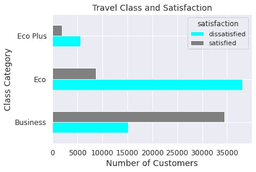
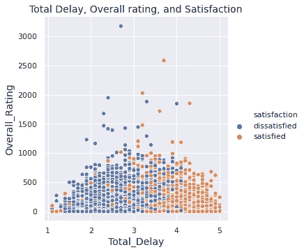
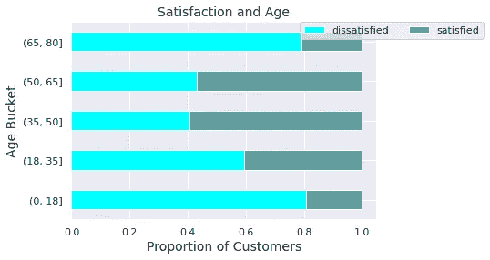
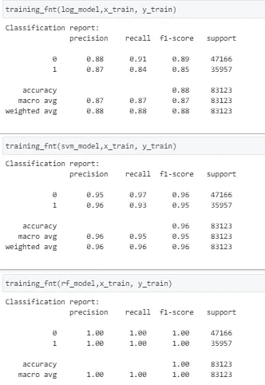
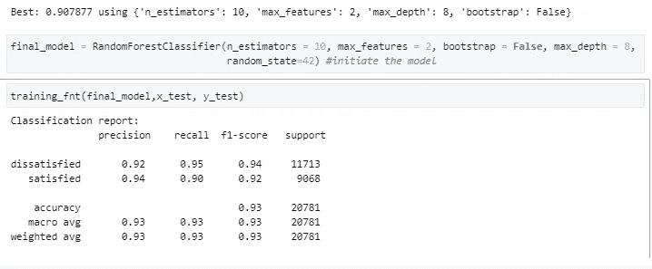
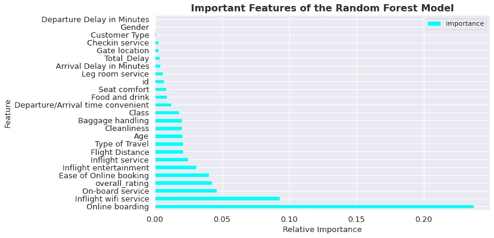

# 如何建立基于机器学习的预测系统

> 原文：<https://towardsdatascience.com/machine-learning-ml-based-predictive-system-to-predict-the-satisfaction-level-of-airlines-f0780dbdbc87?source=collection_archive---------18----------------------->

## 开发预测模型的实用数据科学指南，该模型将客户分为两类满意度


奥斯汀·迪斯特尔在 [Unsplash](https://unsplash.com/photos/wD1LRb9OeEo) 上拍摄的图片

# **简介**

我们都知道客户满意度是提升公司业绩的关键，但是组织仍然努力利用不断增长的数据可用性来满足客户。在这篇文章中，我说明了如何使用机器学习和数据科学技术来评估和评价客户满意度。我将介绍开发客户驱动的预测模型的必要步骤，从*问题框架*开始，到*数据探索* *分析*，*数据转换*， *ML 培训，以及建议*。

该数据集是从标题为“航空乘客满意度”的 [Kaggle](https://www.kaggle.com/teejmahal20/airline-passenger-satisfaction) 中提取的。

# **问题识别**

我首先阐明项目中要解决的业务问题。事实上，航空业一直面临着改变客户偏好的技术颠覆。如今，客户越来越希望享受安全的体验，为他们提供多样化而个性化的产品(普华永道，2021)。因此，对组织来说，区分满意和不满意的个人，并确定决定顾客满意度的特征是至关重要的。

# 定义目标

通过这个项目，我旨在展示如何:
、探索和可视化数据、
、为机器学习准备数据、
、训练和微调预测算法、
、提取重要特征、
、推荐创新的数据驱动技术。

```
#import packages and modules#data manipulation 
import pandas as pd
import os#data visualisation 
import matplotlib.pyplot as plt
import seaborn as sns#machine learning 
from sklearn.model_selection import train_test_split
from sklearn.preprocessing import LabelEncoder
from sklearn.pipeline import Pipeline
from sklearn.preprocessing import StandardScaler
from sklearn.compose import ColumnTransformer
from sklearn.preprocessing import OneHotEncoder
from sklearn.impute import SimpleImputer
from sklearn.metrics import classification_report 
from sklearn.linear_model import LogisticRegression
from sklearn.svm import SVC
from sklearn.ensemble import RandomForestClassifier
from sklearn.model_selection import RandomizedSearchCV
```

# **数据清理和转换**

第二个任务是执行数据争论。幸运的是，数据集不需要大量清理。但是，我必须将一些变量的数据类型转换成分类，删除不必要的列，并检测丢失的值，这些变量包括客户类型、类别、满意度、性别和旅行类型。此外，我创建了两个新变量来支持稍后阶段的数据分析；下面列出了这两个变量:
- **over_all rating:** 计算所有数字变量的平均值，从顾客反馈中取 5 分
- **total_delay:** ，合计到达和离开的延误时间。

数据清理部分的代码如下所示。

```
#Load the data
def load_data(data_path,filename):
    data_path = os.path.join(data_path, filename)
    return pd.read_csv(data_path)Airlines = load_data('/project/',"Airlines.csv") #change the path#inspect the data 
Airlines.head()#get the data info
Airlines.info()#check the shape of the data-frame
Airlines.shape #check for missing values
Airlines.isna()#check for duplicated values
Airlines.duplicated() #create a data cleaning function
def data_cleaning(
    Airlines:pd.DataFrame
              )->pd.DataFrame:
    Airlines['Gender'] = Airlines['Gender'].astype('category')
    Airlines['Type of Travel'] = Airlines['Type of Travel'].astype('category')
    Airlines['Customer Type'] = Airlines['Customer Type'].astype('category')
    Airlines['Class'] = Airlines['Class'].astype('category')
    Airlines['satisfaction'] = Airlines['satisfaction'].astype('category')
    Airlines.drop("Unnamed: 0", axis =1, inplace= True)
    return Airlines.info()#call the cleaning function 
data_cleaning(Airlines)#create a new variable : over_all rating 
Airlines['overall_rating'] = round((Airlines['Inflight wifi service']+ Airlines['Departure/Arrival time convenient'] +
Airlines['Ease of Online booking'] + Airlines['Gate location'] + Airlines['Food and drink']+ Airlines['Online boarding'] + 
Airlines['Seat comfort'] + Airlines['Inflight entertainment'] + Airlines['On-board service'] + Airlines['Leg room service'] + 
Airlines['Baggage handling'] + Airlines['Checkin service'] + Airlines['Inflight service'] + Airlines['Cleanliness'])/14,1)#create a new variable : total delay 
Airlines['Total_Delay'] = (Airlines['Departure Delay in Minutes']+ 
                                    Airlines['Arrival Delay in Minutes'])#inspect the data frame again to check the new columns
Airlines.head()
```

# **探索性数据分析**

在这一节中，我将探索数据集并展示数据可视化，以查明变量之间的关系。

> 我检查汇总统计数据，并为数据集的数值变量创建直方图，如下面的代码所示。

```
numeric_variables = list(Airlines.select_dtypes(include=['int64', 'float64'])) #select the numeric variablesAirlines[numeric_variables].describe().apply(lambda x:round(x,2)).T #apply describe methodhistograms = Airlines[numeric_variables].hist(bins =10, xlabelsize=10, ylabelsize=10, grid=False, sharey= True, figsize = (15,15)) #create the histograms
```

> 然后我研究了满意度和阶级类别之间的关系。

```
**#First Visual: Satisfaction and Class Category** by_cat_class = Airlines.groupby(['Class', 'satisfaction']) by_cat_class.size() #get the size of the dataframe 
ax = by_cat_class.size().unstack().plot(kind='barh', color = ['aqua', 'grey']) #unstack and plot ax.set_title('Travel Class and Satisfaction', size =14) #title 
plt.xticks(fontsize=12)
plt.yticks(fontsize=12)
ax.set_xlabel('Number of Customers', fontsize = 14) #set the x_label 
ax.set_ylabel('Class Category', fontsize = 14); #set the y_label
```



该图显示，商业客户最满意，而生态客户最不满意。最重要的是，80%的 eco 客户都不满意。这表明该服务的提供并不符合不同阶层的偏好，而且只对商务阶层给予了更多的关注。

> 我还调查了总延迟时间、总体评分和满意度之间的关系。

```
**#Second Visual: Total Delay, Overall Rating, and Satisfaction** plt.figure(figsize = (8,6)) #figure size 
sns.set(rc= {"font.size":14, "axes.titlesize":14, "axes.labelsize":14}) m = sns.relplot(x="overall_rating", y="Total_Delay",hue ='satisfaction', data=Airlines); #define graph variables plt.title('Total Delay, Overall rating, and Satisfaction') 
plt.xlabel('Total_Delay') # set x_label
plt.ylabel('Overall_Rating'); #set y_label
```



很明显，总延迟会影响满意度，因此延迟时间越短，平均评分越高，客户越满意。

> 我还会检查年龄是否会影响顾客的满意度。

```
**#Third Visual: Age and Satisfaction**#Discretize the overall_ratings into buckets
overall = Airlines['Age']
labels = pd.cut(overall, [0, 18, 35, 50, 65 , 80])
grouped = Airlines.groupby(['satisfaction', labels]) 
grouped.size().unstack(0) #unstack#sum group amounts
bucket_sums = grouped.overall_rating.sum().unstack(0)#normalize within buckets 
normed_sums = bucket_sums.div(bucket_sums.sum(axis=1), axis=0)#plot the discretized ratings buckets and satisfaction
plot = normed_sums.plot(kind='barh', stacked=True, color= ['aqua','cadetblue'] )plot.legend(loc="upper center",ncol=2,borderaxespad=0.,bbox_to_anchor=(1.05, 1))
plot.set_title('Satisfaction and Age', size =14)
plot.set_xlabel('Proportion of Customers', fontsize = 14)
plot.set_ylabel('Age Bucket', fontsize =14);
```



图表显示年龄在 18 岁以下和 65 岁以上的顾客满意度最低。航空公司应该考虑为成年人和老顾客提供个性化服务。

> 根据探索性分析，我们可以推断旅行等级、总延误时间和年龄正在影响顾客的满意度。

# **数据准备**

在这个阶段，我为 ML 模型准备数据。以下是应该遵循的总结步骤:
。分别以 80/20 的比率将数据分割为训练集和测试集
。将因变量“满意度”编码为{0:'不满意'，1:'满意' }
。建立完整的管道，以估算和标准化数据，并对分类变量进行编码。

```
#train_test split
Airlines_1 = Airlines.copy() #make a copy of the data
train_set, test_set = train_test_split(Airlines_1, test_size=0.2, random_state=42) #split the training (0.8) and test (0.2)
test_set.head() #inspect the test data#drop the dependent variable from the train_set 
x_train = train_set.drop("satisfaction", axis=1) #train set 
y_train= train_set['satisfaction'] #train dependent variable
x_test = test_set.drop("satisfaction", axis=1) #test set 
y_test = test_set['satisfaction'] #test dependent variable#define numeric and categorical variables
numeric_variables = list(Airlines.select_dtypes(include=['int64', 'float64']))
categorical_variables = ['Gender', 'Customer Type', 'Type of Travel', 'Class']#encode the dependent variable: satisfaction
labelencoder_y = LabelEncoder()
y_train = labelencoder_y.fit_transform(y_train)#build a pipeline for numeric and categorical datanum_pipeline = Pipeline([('imputer', SimpleImputer(strategy="median")),
('std_scaler', StandardScaler()),]) #numeric pipelinefull_pipeline = ColumnTransformer([
("num", num_pipeline, numeric_variables  ),
("cat", OneHotEncoder(),categorical_variables),]) #full pipeline#apply the pipeline
x_train = full_pipeline.fit_transform(x_train) #Apply data transformation on test_set
test_y = labelencoder_y.fit_transform(y_test) 
x_test = full_pipeline.fit_transform(x_test) x_test #inspect
```

# **预测建模和微调**

现在，在为训练准备好数据之后，我们应该选择 ML 模型。由于预测任务是二元分类，我将训练不同的监督 ML 算法，即逻辑回归、支持向量机和随机森林，来预测客户的满意度。我还会通过检查每个型号的分类报告来评估性能。

```
#Create a function to train the models
def training_fnt(model, x_train, y_train):
    model.fit(x_train , y_train ) #fit the model 
    y_predict = model.predict(x_train) #predict
    print('Classification report: \n', classification_report(y_train ,y_predict)) #classification report #initiate the models 
log_model = LogisticRegression(max_iter=200, random_state=42)
svm_model = SVC(gamma="auto", random_state=42) 
rf_model = RandomForestClassifier(random_state=42) #call the function on each model separately 
training_fnt(log_model)
training_fnt(svm_model)
training_fnt(rf_model)
```



> 根据分类报告，随机森林具有最高的准确性分数，因此，可以使用随机搜索将其列入微调的候选名单。

然后，我使用随机搜索对随机森林进行微调。

```
#use random search to fine-tune RandomForestClassifier#define the model
rnd_clf = RandomForestClassifier(random_state=42)'#define parameters 
search = [
    {'n_estimators': [3, 10, 30], 'max_features': [2, 4, 6, 8], 'bootstrap': [False, True], 'max_depth': [2, 3, 4,8] }]#set up the search search 
random_search  = RandomizedSearchCV(rnd_clf , search , cv=3,
                           scoring='f1', return_train_score=True)
#fit the search
random_result_RF = random_search.fit(x_train , y_train)#summarize results
print("Best: %f using %s" % (random_result_RF.best_score_,random_result_RF.best_params_))
```

随机搜索的结果是:

> 最佳:0.907877，使用{'n_estimators': 10，' max_features': 2，' max_depth': 8，' bootstrap': False}。

建立这些参数后，我将最终模型拟合到测试集上，以评估在看不见的数据点上的性能。



> 最终的模型在测试集上达到了 93%的平均准确率。

# 特征抽出

我还对从随机森林分类器中提取重要特征感兴趣。这些变量是客户感到满意时最看重的维度。

```
#extract the important features from the final modelnew_rf_clf = final_model
new_rf_clf.fit(x_train ,y_train) #fit the model
feature_importances = new_rf_clf.feature_importances_ 
attributes = numeric_variables + categorical_variables 
feat_importances = sorted(zip(feature_importances, attributes), reverse=True) #create a sorted tuple #visualize the feature importance of Random Forest
df_rf = pd.DataFrame(data = feat_importances) #create a dataframe 
df_rf.columns = ['importance', 'feature'] #rename the columns
df_rf.set_index('feature', inplace=True)#set the index 
fig, ax = plt.subplots(figsize=(10,6))
df_rf.plot(ax=ax, kind='barh', color ='aqua') #define the plot plt.xticks(fontsize=13)
plt.yticks(fontsize=13)
ax.set_title('Important Features of the Random Forest Model', fontweight="bold", size =16) #set title 
ax.set_xlabel('Relative Importance', fontsize = 13)
ax.set_ylabel('Feature', fontsize = 13);
```



> Random Forest 的重要功能包括:在线登机、Wi-Fi 服务、在线预订和机上娱乐。

# **结论**

根据调查结果，我们得出结论，环保客户满意度最低，年龄、登机、在线预订、娱乐和 Wifi 服务是决定客户满意度的最明显特征。总的来说，我们的预测算法有 93%的预测能力来对客户进行分类，并支持航空公司监控和评估服务绩效。

# 建议和后续步骤

最后，我可以推荐航空公司组织实施以下技术:

1-根据年龄类别为顾客设计个性化套餐，特别针对满意度最低的成年人和老年人，

2-改善飞行中的 WiFi 接入和娱乐，

3-为浏览其网站和社交媒体平台的客户实施在线预订协助服务。

接下来的步骤应该集中在生产阶段，通过该阶段，可以使用新客户的数据部署和测试预测模型。

> 我希望你喜欢这篇文章，现在你有能力开发你的预测模型。
> 
> 敬请关注更多关于数据科学的有趣阅读和知识分享！

# **参考文献:**

[1]普华永道，[航空业的未来](https://www.pwc.com/us/en/industries/transportation-logistics/tailwinds-airline-industry-trends.html) (2018)，顺风:2018 年航空业趋势