# 使用谷歌应用引擎的无服务器应用的机器学习模型

> 原文：<https://towardsdatascience.com/machine-learning-model-as-a-serverless-app-using-google-app-engine-b760de59156?source=collection_archive---------17----------------------->

## 无服务器机器学习，GCP

## 因此，您构建了一个模型，并希望将其部署为一个无服务器应用程序。让我向您展示如何使用 Docker 容器、Streamlit 和 Google App Engine 来做到这一点！

[天马](https://unsplash.com/@tma?utm_source=medium&utm_medium=referral)在 [Unsplash](https://unsplash.com?utm_source=medium&utm_medium=referral) 上拍照

# 解决方案架构和主要组件

在继续之前，让我们看一下整体架构，并介绍该解决方案的主要组件。

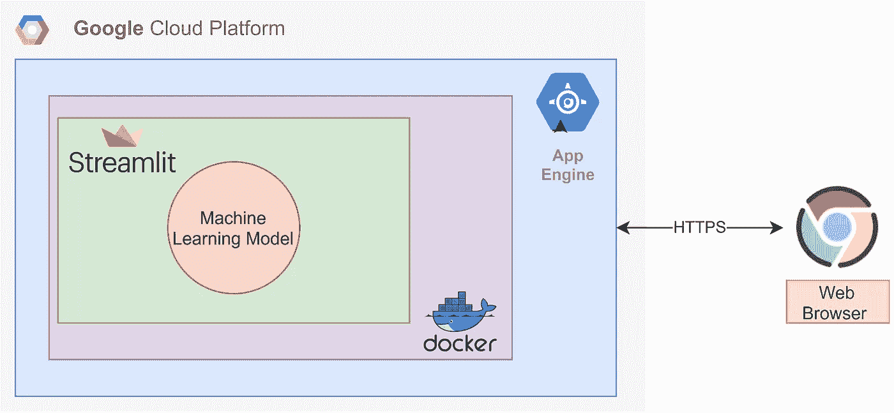

运行在 Google App Engine 上的机器学习应用的架构。(来源:作者制作)

在这个架构中，一个**机器学习模型**使用 **Streamlit** 框架变成了一个 web 应用。然后这个 app 被打包成一个 **Docker 容器**，然后部署在 **App Engine** 上与全世界分享！

## 谷歌应用引擎

[App Engine](https://cloud.google.com/appengine) 是 Google 推出的一款完全托管的无服务器应用平台产品，可让您轻松部署您的 web 应用。部署应用程序就像运行命令`gcloud app deploy`一样简单。

由于它是无服务器的，您不必担心管理服务器或任何基础设施。它会根据应用程序收到的请求数量自动扩展。因此，当没有流量时，它会缩小到零。而且你只为你用的东西付费！

谷歌云平台一分钟内的应用引擎(来源:GCP Youtube)

在这种情况下，我们将使用谷歌云平台(GCP)提供的这种无服务器产品来服务我们的机器学习模型，作为一个应用程序供其他人进行交互。

## 机器学习模型

出于本文的目的，我已经为著名的鸢尾花数据集分类问题生成了一个机器学习模型([此处可用](https://github.com/saedhussain/gcp_serverless_ml/tree/main/Iris_model))。这个问题使用以厘米为单位的花的四列测量值(萼片长度、萼片宽度、花瓣长度、花瓣宽度)来预测花的种类。

凯文·卡斯特尔在 [Unsplash](https://unsplash.com?utm_source=medium&utm_medium=referral) 上拍摄的照片

为了以教程的方式学习更多关于这个问题的知识，我推荐下面的文章[。](https://machinelearningmastery.com/machine-learning-in-python-step-by-step/)

## 细流

[Streamlit](http://www.streamlit.io) 是一个极简框架，可以将常规的 python 脚本转换成漂亮的 web 应用。作为一名数据科学家，你通常必须在 web 框架(如 Flask)中编写大量额外的代码，才能将机器学习模型作为应用程序进行共享。你还必须了解一些前端开发，使应用程序美丽。这就是 Streamlit 的用武之地。

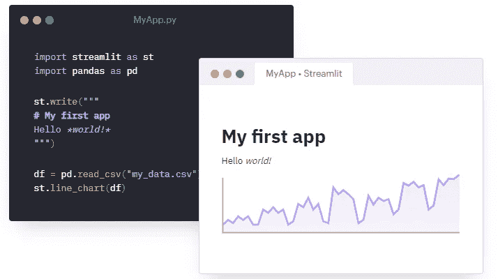

Streamlit 将简单的脚本变成漂亮的 web 应用程序。(来源:streamlit.io)

使用 Streamlit，通过向常用的数据科学 python 脚本添加几行代码，您可以在几分钟内将整个脚本转换为 web 应用程序。而且看起来很美！😍

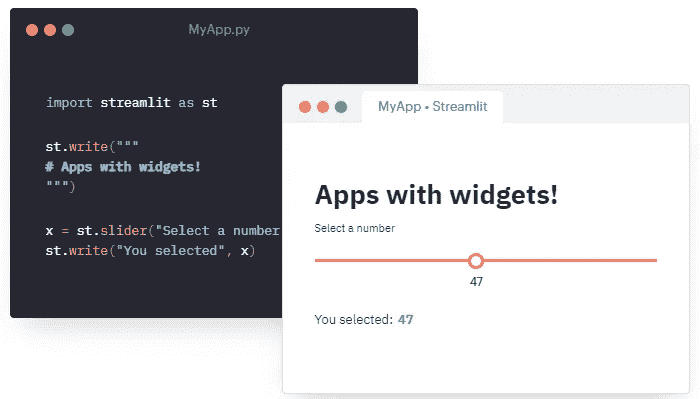

Streamlit 支持使用小部件与数据进行交互。(来源:streamlit.io)

在这个解决方案中，我们将把 iris 物种预测模型文件包装在 Streamlit 框架中，作为一个 web 应用程序与之交互。

## 码头集装箱

假设您构建了一个应用程序，并共享了所有项目文件，以便在另一台机器上运行该应用程序。如果你幸运的话，它会照常运行。但是大多数时候，你必须做一些调试来让应用程序工作。通常，这是因为缺少库或不兼容的库版本，或者缺少文件。

简而言之，环境与测试和正常运行应用程序的机器不同。为了解决这个问题，创造了容器。

照片由[安迪李](https://unsplash.com/@andasta?utm_source=medium&utm_medium=referral)在 [Unsplash](https://unsplash.com?utm_source=medium&utm_medium=referral) 上拍摄

容器是一种打包应用程序及其所有依赖项(代码、库、文件、环境配置等)的方式。)集成到一个隔离的环境中，以便该应用程序可以在不同的计算环境中可靠地运行。Docker 是构建容器的工具提供者之一。Docker 容器使用 Docker 引擎运行。

我们将使用 Docker 来封装我们的应用程序，并在 Google App Engine 上运行它。

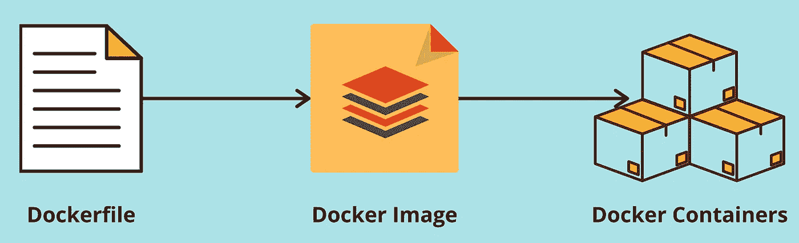

从码头文件到集装箱。(来源:作者制作)

为了将应用程序容器化，我们需要知道几个关键步骤。这一切都是从一个文档开始的。

*   **Dockerfile** :这是一个包含一组构建 Docker 容器映像的指令的文件。可以把这个文件想象成 docker 容器映像的蓝图。它首先指定容器的基本操作系统，然后是安装依赖项和设置应用程序环境的说明。最后，它以在容器(即隔离环境)创建并运行后运行的命令结束。
*   **Docker 镜像**:这是一个可执行的包，由 Docker 文件中的指令构建而成。它包括在隔离的容器环境中运行应用程序所需的一切，如 Dockerfile 文件中所指定的。它可以被看作是一个模板，Docker 容器就是从这个模板实例化的。
*   **Docker 容器**:它是 Docker 映像的一个实例，运行在 Docker 引擎上。

要了解更多关于 Docker 的内容，我强烈推荐这里的文章。

# 家政

在我们开始有趣的部分之前，这里列出了一些重要的先决条件:

*   *本文假设您已经拥有一个 GCP 账户。如果你没有，在这里注册*<https://cloud.google.com/>**可以获得一些免费积分。**
*   **要从您的本地机器与您的 GCP 帐户交互，请使用此处* *列出的* [*步骤安装 Google Cloud SDK。*](https://cloud.google.com/sdk/docs/quickstart)*
*   *确保你的本地机器上安装了 Docker。没有的话，从 [*这里*](https://www.docker.com/products/docker-desktop) *下载。**
*   **本文中的所有代码都是在 Windows 上用 Python 3.8 开发的。本文的代码和必要的文件可以在 GitHub 仓库* [*这里*](https://github.com/saedhussain/gcp_serverless_ml/tree/main/Iris_streamlit_app) *找到。**

*事不宜迟，让乐趣开始吧！😀*

# *步骤 0:在本地机器上设置虚拟环境(被认为是最佳实践)*

*如果您还没有这样做，请确保为您的项目使用虚拟环境。虚拟环境有助于将项目隔离在自包含的环境中，封装其所有依赖关系，并避免与同一系统上的其他项目发生依赖关系冲突。*

*它捕获了重新创建项目环境所需的所有信息(依赖项及其版本的列表)，这些信息可以在一个文件中共享(例如 *requirements.txt* )。*

*python 流行的虚拟环境管理器有 [venv](https://docs.python.org/3/library/venv.html) 、 [virtualenv](https://virtualenv.pypa.io/en/latest/) 、 [pipenv](https://pypi.org/project/pipenv/) 和 [conda](https://docs.conda.io/projects/conda/en/latest/index.html) 。本文使用 conda，它与 [Anaconda](https://www.anaconda.com/products/individual) 数据科学工具包发行版打包在一起，我强烈推荐它。*

*在您的本地机器上，使用终端中的`conda create --name **<env_name>**` 为您的项目创建一个新的虚拟环境。*

**

**使用 Conda* 创建虚拟环境(iris-stapp-env)*

*创建后，您可以使用`conda activate **<env_name>**` 激活环境。请注意，激活的环境的名称显示在左侧，在当前工作目录的路径之前。*

*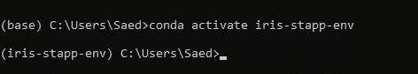*

**激活 Conda 中的虚拟环境(iris-stapp-env)**

*要在这个隔离的环境中为一个项目安装 Python 包，可以使用常用的 pip 包(即使用命令`pip install`)。但是首先，确保通过运行`conda install pip`在激活的虚拟环境中安装 pip 包。*

*你也可以点击下载所有 conda 命令[的备忘单。😃](https://docs.conda.io/projects/conda/en/latest/user-guide/cheatsheet.html)*

****重要旁注****

**如果您使用 Anaconda 安装的默认推荐设置安装了 conda，您的终端将无法识别命令* `*conda*` *。这是因为在推荐的安装设置中，Anaconda3 没有添加到 PATH 环境变量中。**

*相反，在你的开始菜单中搜索 Anaconda3 提示符，并使用它来确保 `*conda*` *被识别为命令。**

*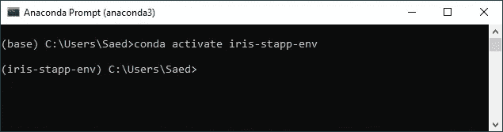*

*使用 Anaconda 提示符运行 conda 命令*

*通过运行激活脚本 `***<anaconda3_install_dir>****/Scripts/activate*` *，您还可以在普通终端中激活 anaconda 环境。**

*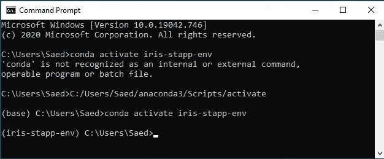*

*在现有的命令终端中激活 anaconda 环境*

# *步骤 1:下载并运行示例 Streamlit 应用程序*

*为项目创建一个文件夹，并从存储库[这里](https://github.com/saedhussain/gcp_serverless_ml/tree/main/Iris_streamlit_app)下载本文的代码文件。*

*然后使用终端(`cd **<path_to_dir>**`)导航到该目录，并确保虚拟环境处于活动状态(`conda activate **<env_name>**`)。*

*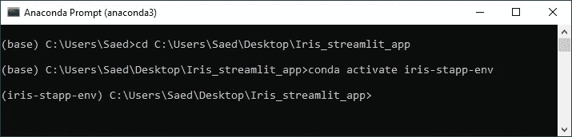*

*导航到项目目录并激活虚拟环境*

*显然，您可以使用自己喜欢的 IDE 来做同样的事情。但是一定要激活一个虚拟环境(点击[这里](https://code.visualstudio.com/docs/python/environments)获取 VS 代码)。否则，您将最终在您的默认环境中安装依赖项，这可能会中断使用该环境的其他项目。*

*现在我们来看看 Streamlit 的 app 文件(app.py)。*

*Streamlit app 文件(app.py)的 GitHub 要诀。*

*注意如何通过添加一个简单的导入(`import streamlit as st`)，一个常规的数据科学脚本(带有`pandas, numpy, model.predict(), etc.`)在一个 Streamlit web 应用程序中被转换。我们所做的就是添加 Streamlit 小部件来与模型交互，比如文本输入小部件、按钮小部件等。*

*您可以尝试使用`streamlit run app.py`在新创建的虚拟环境中运行示例 Streamlit 应用程序。*

*由于虚拟环境中缺少 python 模块，这将导致错误。你可以使用`pip install`一个接一个地安装缺失的模块，直到应用最终运行。*

*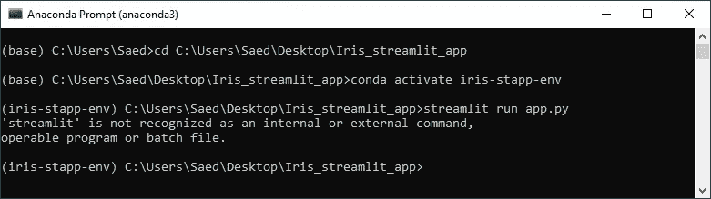*

*虚拟环境中未安装 Streamlit。*

*或者，您可以通过使用 *requirements.txt* 中的依赖项列表来安装应用程序的所有依赖项，这将复制我创建和测试应用程序的环境。*

*使用命令`pip install -r requirements.txt`将所有项目依赖项安装到虚拟环境中。*

*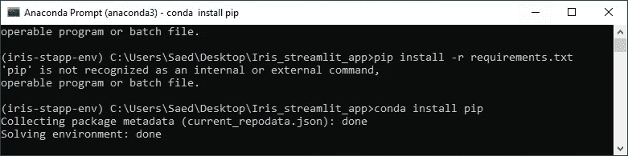*

*在 conda 虚拟环境中安装 pip 模块。*

*一旦完成，您可以通过运行`pip freeze > requirements.txt`为您自己的项目创建一个这样的依赖列表。*

*请给模块安装一些时间。完成后，您可以使用`streamlit run app.py`命令在虚拟环境中运行 Streamlit 应用程序。*

*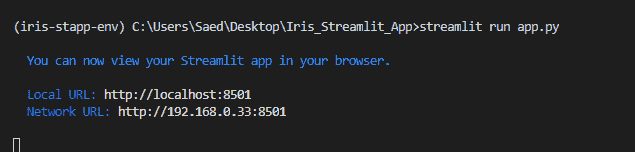*

*在本地主机上运行的 Streamlit 应用服务器，端口 8051。*

*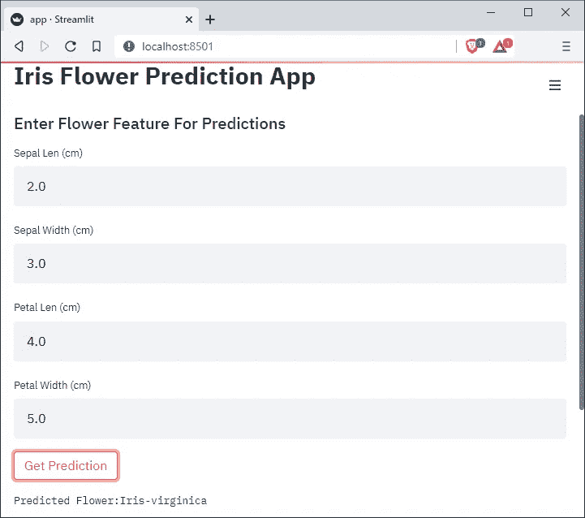*

*在本地主机上运行的鸢尾花种预测 Streamlit 应用程序:8051*

*您应该看到您的默认浏览器弹出并显示应用程序(在本地主机上，默认情况下通常是端口 8051)。请随意摆弄这些数字，看看模型是如何工作的。*

*恭喜你，你已经在几分钟内构建了一个与机器学习模型交互的 web 应用程序！😄*

*当您玩完 Streamlit 应用程序后，您可以在终端中使用 **Ctrl + C** 关闭应用服务器。*

# *步骤 2:对应用程序进行 Dockerize 并在本地测试*

*我们现在将开始 Docker 化这个应用程序，作为一个容器在任何带有 Docker 引擎的机器上运行。为此，我们需要首先根据当前目录下 Docker 文件中的指令构建一个 Docker 映像。这些指令规定了如何构建容器。*

## *Dockerfile 文件概述*

*Streamlit 应用程序的 Dockerfile。*

*文档中的说明非常直接。*

*   *`FROM python:3.8`:我们首先将基本操作系统映像设置为安装了 Python 3.8 的 Linux 操作系统。*
*   *`WORKDIR /app`:在容器中创建一个工作目录。*
*   *`COPY . /app`:将当前项目目录下的所有文件复制到容器工作目录下。*
*   *`RUN pip install -r requirements.txt`:运行常规命令，在容器环境中安装应用程序的所有依赖项。*
*   *`EXPOSE 8080`:指示容器环境公开容器的端口 8080，让全世界监听。*
*   *`CMD streamlit run app.py --server.port=8080`:一旦设置好容器，该命令将在容器环境中执行。请注意，这是启动 Streamlit 应用程序的常用命令。我们只添加了一个额外的标志来指示 Streamlit 服务器在端口 8080 上运行。*

## *构建 Docker 映像*

*虚拟环境激活后，为 docker 映像选择一个合适的名称，并在终端中运行`docker build -t **<docker_image_name> .**` ，从 docker 文件构建一个 docker 映像。*

*命令末尾的`**dot(.)**`指示 Docker 在当前目录中查找 Docker 文件。构建过程可能需要一些时间。注意它是如何执行 Dockerfile 文件中的每条指令的。*

*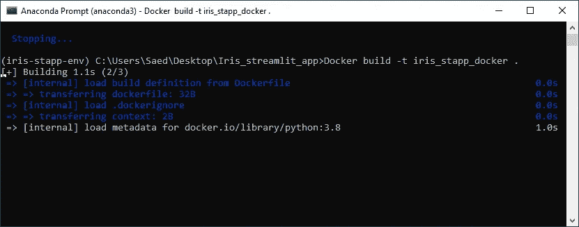*

*正在构建的应用程序的 Docker 图像。*

## *运行容器*

*一旦映像构建完成，您就可以使用`docker run -p 8080:8080 **<docker_image_name>**` 从映像中将应用程序作为容器运行。*

*这个命令告诉 Docker 引擎运行 Docker 映像，并将本地机器的端口 8080 映射到容器端口 8080。这将允许我们在浏览器上导航到 [http://localhost:8080/](http://localhost:8080/) ，以查看容器(即 Streamlit 应用程序)的输出。*

*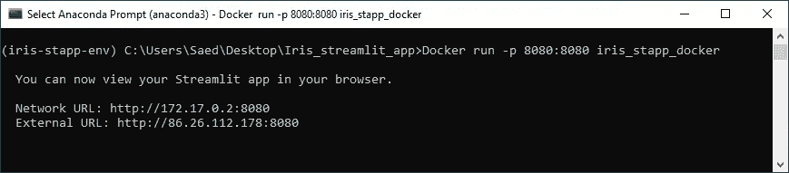*

*在 Docker 容器中运行的 Streamlit 应用程序。*

*一旦您看到应用程序从容器中运行，您就可以确定该应用程序将在任何其他具有 Docker 引擎的机器上运行，不会出现任何问题。我们终于准备好将应用部署到应用引擎了！👌*

****重要旁注****

**Docker 容器运行后打印在终端中的 URL 链接，如果您点击它们，将不起作用。这些是来自 Streamlit 服务器的输出消息，在容器本身内部。**

**我们只能访问容器向我们公开的内容，这些内容映射到我们本地机器的*[*http://localhost:8080/*](http://localhost:8080/)*。**

# ***第三步:将应用部署到谷歌应用引擎***

*在将 app 部署到 app engine 之前，我们需要在项目目录中添加另一个文件: *app.yaml.* 这是一个配置文件，基本上包含了 App Engine 的设置。*

*为了这篇文章的简单，我们保持了它的基本性。你可以从指南[这里](https://cloud.google.com/appengine/docs/flexible/python/configuring-your-app-with-app-yaml)了解更多关于使用该文件配置应用引擎的信息。*

*现在，您可以使用命令`gcloud app deploy`从项目目录中的虚拟环境部署应用程序。*

*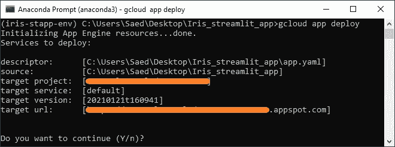*

*将 Streamlit 应用部署到 Google 应用引擎。*

*它应该要求部署应用程序的一些基本设置。按照提示进行操作，部署应该会开始。这可能需要一些时间，而且有充分的理由。*

*App engine 获取当前目录中的所有文件，并将其推送到云端。然后，根据 docker 文件中的说明，它在云中构建应用程序的 docker 映像，并将其存储在 [Google 容器注册表](https://cloud.google.com/container-registry)中。然后，它使用这个映像在 App Engine 上部署一个容器(这个映像的运行实例)。*

*部署完成后，您可以使用目标 url 看到该应用程序在互联网上运行。*

*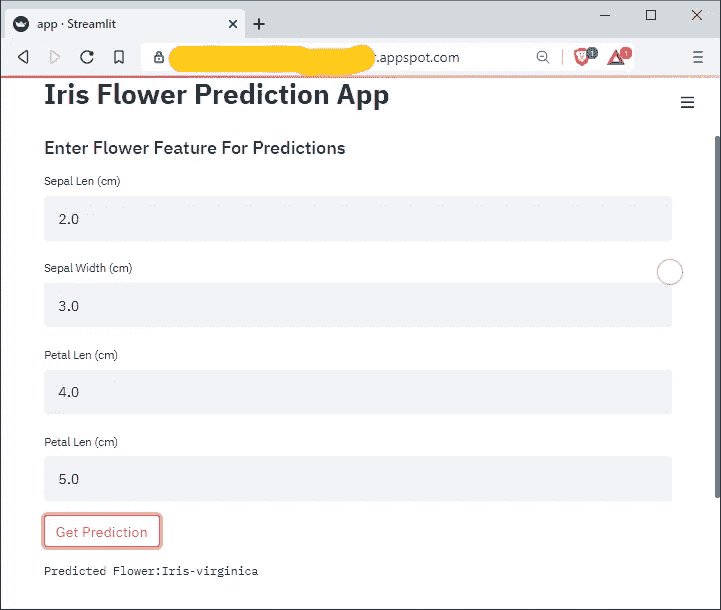*

*简化从 Google App Engine 上的 Docker 容器运行的应用程序*

****重要旁注****

**如果您这样做是为了学习，请确保在* [*GCP 控制台*](https://console.cloud.google.com/) *App 引擎仪表盘中停止运行该应用。**

**此外，分享应用程序的 URL 时要小心。否则，你可能会因其他人访问你的应用程序而招致不必要的费用！现在你知道为什么截图里模糊的线条了。*😅*

*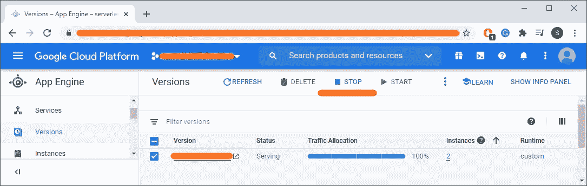*

*显示正在运行的应用程序版本的 GCP 控制台应用程序引擎仪表板。*

# *结论*

*恭喜你！！您现在知道如何在 GCP 上将您的模型部署为无服务器应用程序。😄*

***要了解如何将机器学习模型部署为无服务器端点，请查看我的文章** [**这里**](/machine-learning-model-as-a-serverless-endpoint-using-google-cloud-function-a5ad1080a59e) **。**😄*