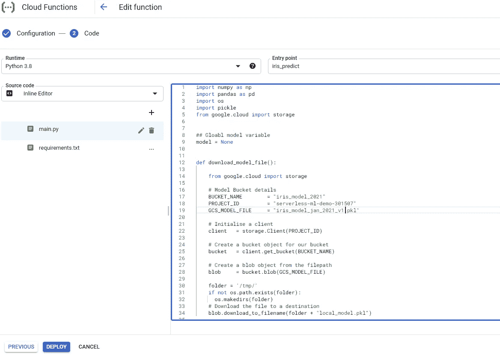

# 使用谷歌云功能作为无服务器端点的机器学习模型

> 原文：<https://towardsdatascience.com/machine-learning-model-as-a-serverless-endpoint-using-google-cloud-function-a5ad1080a59e?source=collection_archive---------9----------------------->

## 无服务器机器学习

## 因此，你已经建立了一个模型，并希望将其生产为谷歌云平台(GCP)上的无服务器解决方案。让我告诉你如何使用谷歌云功能做到这一点！

约书亚·阿拉贡在 [Unsplash](https://unsplash.com?utm_source=medium&utm_medium=referral) 上拍摄的照片

## 谷歌云功能是什么？

[Google Cloud Functions](https://cloud.google.com/functions) 是一款无服务器的计算产品，它允许你编写当附属事件被触发时被触发的函数。由于这是一项无服务器服务，我们不必担心设置或管理服务器或任何基础设施。这种产品也被称为功能即服务(FaaS)。

照片由[左 eris kallergis](https://unsplash.com/@lefterisk?utm_source=medium&utm_medium=referral) 在 [Unsplash](https://unsplash.com?utm_source=medium&utm_medium=referral) 上拍摄

它的成本效益很高，因为它只在附属于它的事件被触发时运行，并在函数执行后终止。此外，资源会根据事件的频率自动扩展。因此，无需做任何进一步的工作，它就可以相应地伸缩来处理事件，从一天几次调用到数百万次调用。

在我们的例子中，我们将使用 GCP 提供的这种无服务器解决方案，为我们的机器学习模型预测提供服务，以响应 HTTP 请求事件。

简单地说，我们将把我们的模型部署为一个函数，它通过 HTTP 端点响应模型预测请求。

## 家政

*本文假设你已经有了一个 GCP 账户。如果你还没有，在这里注册*<https://cloud.google.com/>**可以获得一些免费积分。**

**如果你想从你的本地机器上与你的 GCP 账户进行交互，使用* [*这里*](https://cloud.google.com/sdk/docs/quickstart) *列出的步骤安装 Google Cloud SDK。**

*本文中的所有代码都是用 Python 3.8 开发的。本文的代码和必要的文件可以在 GitHub 仓库 [*这里*](https://github.com/saedhussain/gcp_serverless_ml) *找到。**

## *解决方案架构:作为无服务器 HTTP 端点的模型*

*在我们继续之前，让我们看一下无服务器机器学习预测 HTTP 端点的解决方案的架构。*

**

*使用谷歌云功能的无服务器机器学习模型 HTTP 端点*

*在这个架构中，机器学习模型文件存储在一个[谷歌云存储](https://cloud.google.com/storage)桶中。我们的云函数执行以下操作，以响应模型预测的 HTTP 请求:*

*   *从云存储中下载模型文件。*
*   *基于通过 HTTP 事件发送的参数运行预测。*
*   *返回预测结果。*

*好吧！事不宜迟，让我们开始吧！*

## ***第 0 步:构建&保存你的模型(如果你还没有的话)***

*要继续，我们首先需要一个机器学习模型。如果您已经为您的问题保存了一个模型，您可以跳到下一步。*

**

*照片由[本·马特](https://unsplash.com/@benjmater?utm_source=medium&utm_medium=referral)在 [Unsplash](https://unsplash.com?utm_source=medium&utm_medium=referral) 拍摄*

*出于本文的目的，我已经为著名的 iris flowers 数据集分类问题生成了一个机器学习模型([此处可用](https://github.com/saedhussain/gcp_serverless_ml/tree/main/Iris_model))。这个问题使用以厘米为单位的花的四列测量值(萼片长度、萼片宽度、花瓣长度、花瓣宽度)来预测花的种类。*

*为了以教程的方式学习更多关于这个问题的知识，我推荐下面的网站[。](https://machinelearningmastery.com/machine-learning-in-python-step-by-step/)*

## *步骤 1:将模型上传到 Google 云存储桶*

**

*在谷歌云平台控制台上搜索存储*

*在 GCP 控制台中，搜索存储找到云存储，然后单击**创建存储桶。**给 bucket 一个合适的名称，并确保在计划运行云功能的同一区域创建 bucket。您可以保留其余的设置，然后点击创建。*

**

*创建云存储桶来存储模型*

*创建存储桶后，您可以通过拖放或使用 upload 按钮将模型文件上传到存储桶中。*

**

*ML 模型上传到 Google 存储桶*

*如果您已经安装了 Cloud SDK，那么您还可以使用命令行/终端来创建 bucket 并上传模型。参考此处的命令[从命令行与您的云存储交互](https://cloud.google.com/storage/docs/quickstart-gsutil)。*

## *步骤 2:创建和配置云功能*

*现在在 GCP 控制台上搜索云函数，点击**创建函数**。给云函数一个合适的名称，并确保它与模型存储桶在同一个区域。将函数触发器类型选择为 HTTP。*

**

*创建云函数为模型预测服务*

*为简单起见，将身份验证设置为**允许未经身份验证的调用**。在现实世界的解决方案中，它必须设置为**要求认证**，这将允许您使用[云 IAM](https://cloud.google.com/iam) 控制对此功能的访问。*

*其余的变量可以保持原样。我们的功能非常简单，模型文件也很小。因此，一个 256 MiB 的执行环境对于我们的目的来说已经足够了。*

## *步骤 3:编写云函数代码*

*从前一个设置中单击 next 后，您将能够看到内联源代码编辑器窗口。这是我们定义运行时环境和编写要执行的函数的地方。选择 python 3.8 作为运行时环境，因为我们将使用 python 进行编码。*

**

*编码模型预测云函数*

*请注意，源代码内联编辑器下面显示了两个文件:*

*   ***main.py** :功能代码驻留的主文件，在触发事件发生时执行。*
*   ***requirements.txt** :这是我们声明需要安装在环境中以执行我们的功能的库的地方。*

*你可以从资源库[复制粘贴这两个文件的内容到这里](https://github.com/saedhussain/gcp_serverless_ml/tree/main/Iris_http_cloud_func)或者下面的要点。*

*无服务器模式预测 HTTP 端点的 Google 云函数文件要点*

*main.py 文件中有两个函数:*

*   ***下载 _ 模型 _ 文件***
*   ***iris_predict***

****download _ model _ file**函数将模型从指定的云存储桶中检索到云函数环境中。注意，在云函数环境下，我们只能写到 **/tmp** 目录。因此，模型被下载并保存在这个目录中。**

****iris_predict** 函数是响应 HTTP 请求的主入口点函数。如果模型在内存中不可用，它将调用下载模型函数，如果 HTTP 请求发送了特性 JSON 输入，它将运行预测。确保将入口点输入框更新为 **iris_predict** 。**

**请注意 model 全局变量是如何用于在内存中缓存模型的。在第一次函数调用期间，将从 GCS 检索模型文件，并通过 pickle 加载。因此，后续调用的响应时间会更快，因为模型已经在内存中了。**

## **步骤 4:部署云功能**

****

**云功能已部署并处于活动状态**

**一旦源文件被更新，启动部署过程，这将从需求文件安装库并设置云功能。这可能需要一些时间，您会在函数名旁边看到一个加载圆。**

**一旦设置完成且功能部署成功，功能名称旁边将出现一个绿色对勾。**

## **步骤 4:测试无服务器机器学习模型预测**

**您现在可以通过点击函数名并选择**测试选项卡**来测试您的函数。在这个选项卡中，您可以通过发送一个 JSON 特性输入来触发云功能，如 so **{"features":[2，3，4，5]}** 。**

**该函数将使用模型预测进行响应，该预测将出现在输出部分。您也可以从**触发标签**中获取模型触发 URL，该 URL 可以被其他服务使用。**

****

**虹膜模型的无服务器机器学习模型预测**

**注意，cloud 函数中没有代码来对发送的 JSON 进行健全性检查。因此，如果 JSON 无效或者 features 键的值不是预期的格式，当前函数将生成一个错误。**

**目前，我们在函数中做的唯一检查是，如果 features 键在 JSON 请求中不存在，就用一条消息进行响应。**

****

**JSON 请求缺少 features 键时的云函数响应**

**在现实世界的应用程序中，进行检查以验证 JSON 及其内容是非常重要的。为了简化本文，已经避免了它们。**

## **结论**

**恭喜你！！现在，您已经知道如何在 GCP 上将您的模型部署为无服务器功能。😄**