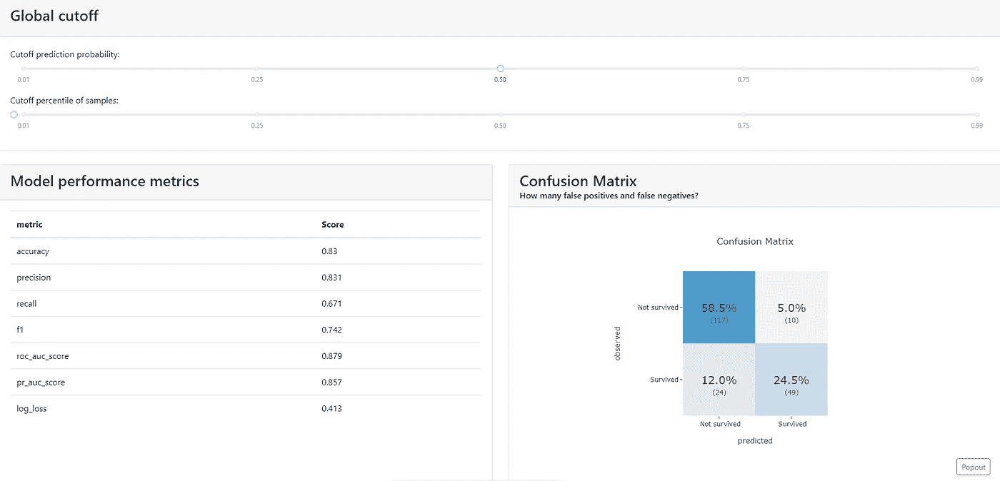

# 机器学习模型仪表板

> 原文：<https://towardsdatascience.com/machine-learning-model-dashboard-4544daa50848?source=collection_archive---------7----------------------->

## 创建仪表板来解释机器学习模型

如今，创建机器学习模型很容易，因为市场上有不同的 python 库，如 sklearn、lazypredict 等。这些库易于使用，用于创建不同类型的模型以及不同类型的可视化，并找出模型的性能。如果你不知道懒惰预测是如何工作的，看看下面给出的文章。

</build-multiple-machine-learning-models-easily-54046f022483>  

现在的主要挑战是模型不容易解释，这使得非技术人员很难理解和解释逻辑以及模型如何工作。

Explainer dashboard 是一个开源的 python 库，它创建了机器学习模型仪表板，可用于轻松理解和分析模型工作的重要因素，如特征重要性、模型性能、可视化等。

你可以通过我的 Youtube 频道来看看 Explainer Dashboard 和更多的 Python 库。[订阅更多这样的视频。](https://www.youtube.com/@hmix13)

在本文中，我们将使用 explainer 仪表板来创建机器学习仪表板，并了解模型是如何工作的。

让我们开始吧…

# 安装所需的库

我们将从使用 pip 安装一个解释器仪表板开始。下面给出的命令可以做到这一点。

```
pip install explainerdashboard
```

# 导入所需的库

在这一步中，我们将导入所需的库和函数来创建机器学习模型和仪表板。

```
from sklearn.ensemble import RandomForestClassifier
from explainerdashboard import ClassifierExplainer, ExplainerDashboard
from explainerdashboard.datasets import titanic_survive, titanic_names
```

# 创建模型和仪表板

这是最后一步，我们将创建机器学习模型，然后通过创建仪表板来解释该模型。

1.  **创建模型**

```
feature_descriptions = {
    "Sex": "Gender of passenger",
    "Gender": "Gender of passenger",
    "Deck": "The deck the passenger had their cabin on",
    "PassengerClass": "The class of the ticket: 1st, 2nd or 3rd class",
    "Fare": "The amount of money people paid", 
    "Embarked": "the port where the passenger boarded the Titanic. Either Southampton, Cherbourg or Queenstown",
    "Age": "Age of the passenger",
    "No_of_siblings_plus_spouses_on_board": "The sum of the number of siblings plus the number of spouses on board",
    "No_of_parents_plus_children_on_board" : "The sum of the number of parents plus the number of children on board",
}X_train, y_train, X_test, y_test = titanic_survive()
train_names, test_names = titanic_names()
model = RandomForestClassifier(n_estimators=50, max_depth=5)
model.fit(X_train, y_train)
```

2.**创建仪表板**

```
from sklearn.ensemble import RandomForestClassifier
from explainerdashboard import ClassifierExplainer, ExplainerDashboard
from explainerdashboard.datasets import titanic_survive, titanic_namesfeature_descriptions = {
    "Sex": "Gender of passenger",
    "Gender": "Gender of passenger",
    "Deck": "The deck the passenger had their cabin on",
    "PassengerClass": "The class of the ticket: 1st, 2nd or 3rd class",
    "Fare": "The amount of money people paid", 
    "Embarked": "the port where the passenger boarded the Titanic. Either Southampton, Cherbourg or Queenstown",
    "Age": "Age of the passenger",
    "No_of_siblings_plus_spouses_on_board": "The sum of the number of siblings plus the number of spouses on board",
    "No_of_parents_plus_children_on_board" : "The sum of the number of parents plus the number of children on board",
}X_train, y_train, X_test, y_test = titanic_survive()
train_names, test_names = titanic_names()
model = RandomForestClassifier(n_estimators=50, max_depth=5)
model.fit(X_train, y_train)explainer = ClassifierExplainer(model, X_test, y_test, 
                                cats=['Deck', 'Embarked',
                                    {'Gender': ['Sex_male', 'Sex_female', 'Sex_nan']}],
                                cats_notencoded={'Embarked': 'Stowaway'}, 
                                descriptions=feature_descriptions,
                                labels=['Not survived', 'Survived'], 
                                idxs = test_names, 
                                index_name = "Passenger", 
                                target = "Survival", 
                                )db = ExplainerDashboard(explainer, 
                        title="Titanic Explainer", 
                        shap_interaction=False,
                        )
db.run(port=8050)
```

在下面的视频中，我展示了使用 explainer 仪表盘创建的仪表盘。

仪表板(来源:作者)


仪表板主页(来源:[作者](https://www.linkedin.com/in/himanshusharmads/))



仪表板(来源:[作者](https://www.linkedin.com/in/himanshusharmads/)

在这里，您可以清楚地看到使用 explainer 仪表板创建的仪表板。我们可以清楚地分析模型和其他参数的不同性质。

继续尝试不同的数据集，并创建漂亮的仪表板来解释模型。如果您发现任何困难，请在回复部分告诉我。

本文是与 [Piyush Ingale](https://medium.com/u/40808d551f5a?source=post_page-----4544daa50848--------------------------------) 合作完成的。

# 在你走之前

***感谢*** *的阅读！如果你想与我取得联系，请随时在 hmix13@gmail.com 上联系我或我的* [***LinkedIn 个人资料***](http://www.linkedin.com/in/himanshusharmads) *。可以查看我的*[***Github***](https://github.com/hmix13)**简介针对不同的数据科学项目和包教程。还有，随意探索* [***我的简介***](https://medium.com/@hmix13) *，阅读我写过的与数据科学相关的不同文章。**