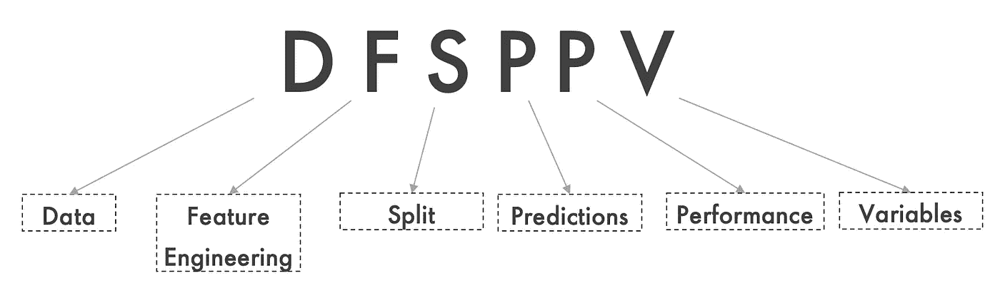

# 机器学习模型部署—一个简单的清单

> 原文：<https://towardsdatascience.com/machine-learning-model-deployment-a-simplistic-checklist-dc5558a88d1b?source=collection_archive---------15----------------------->

## 在将您的机器学习模型部署到生产之前、之中和之后需要检查的必要事项

亚历克斯·丘马克在 [Unsplash](https://unsplash.com?utm_source=medium&utm_medium=referral) 上的照片

将您的机器学习模型从研究环境转移到生产环境时，可能会出现许多问题。数据科学家/ML 工程师经常低估打破 ML 模型并使结果不可再现的容易程度

# **目标受众:**

*   数据科学家希望确保他们的代码/模型可以在没有任何可能使模型结果不可复制的情况下被容易地部署
*   当在环境/平台之间移动模型时，想要快速列出可能出错的事情的机器学习工程师

**这些检查最好按顺序进行，以确认上一个场景的问题不会延续到下一步**

# 为了方便起见要记住的关键字:

记住潜在问题的简单关键词。作者图片

# **场景— 1:**

**数据不可再现性**

*   机器学习模型对数据进行处理。如果基础数据与研究环境不同，模型就不可能产生相同的结果
*   你可能认为这是常识。但实际上，数据科学家和 ML 工程师经常忽视的一个被低估的问题(我也有同感)是底层数据的微小变化及其对模型推断的假设的影响
*   在预处理/工程之前进入系统的基础原始数据必须与研究环境相匹配。再多的特征工程也无法弥补不正确/不可复制的原始数据
*   从事大数据工作的人通常会觉得说不可能匹配如此大量的数据很方便。不可能逐行匹配。但是，为了进行合理的比较，必须制定一套统计措施
*   应该比较将数据加载到环境中的 ETL 过程，并且必须检查该过程的每个输出。在进行大型聚合时，不要忽略精度及其影响
*   检查在向环境传输数据的过程中是否有潜在的数据包/数据丢失
*   如果有多个数据源向模型提供数据，那么必须对每个数据源进行检查

# **场景— 2:**

**特征工程步骤的不同结果**

*   一旦您确认原始数据是可再现的，下一步将是检查特征工程后的再现性
*   一个常见的错误是在使用涉及数据采样的特征工程时没有设置种子
*   检查预处理逻辑不匹配(空值、nan、极值等的处理)。)、聚合不匹配、数据精度
*   检查两种环境中的 Python 版本和基础库版本，以及库中的默认值是否已更改
*   与上一步类似，使用统计方法/KPI 来比较环境之间的工程/处理数据

# **场景— 3:**

**不同的列车试运行**

*   不可复制的分裂的恐怖是无限的。在将数据加载到任何 ML 模型之前，我们将数据分成训练、验证和测试数据集。有必要确保这些数据集在环境内部和环境之间是可复制的
*   最常见的情况是，数据科学家在进行分割时忘记设定种子
*   如果您正在进行交叉验证，在重复的 KFold、ShuffleSplit、GroupShuffleSplit 的情况下设置种子尤其重要
*   如果您使用 RDBMS，请确保维护了正确的数据顺序，并确保设置了排序或保持数据顺序的逻辑

# **场景— 4:**

**预测不匹配**

如果模型生成 NaNs 或 infinite 作为预测:

*   环境数据可能包含代码中未处理的空数据
*   数据(尤其是测试或流数据)可能包含以前未观察到的类别
*   流式传输/测试时出现错误数据

这些问题可以通过在代码中涵盖这些场景来解决。尽管在数据和处理上可能需要 SME 的输入

如果模型预测不匹配或部分匹配:

*   在研究/生产环境中，没有为底层算法或采样设置种子
*   不同的 Python 或库版本可能会修改算法处理数据的方式

# **场景— 5:**

**性能低于预期:**

*   由于 KPI 和期望值在某些情况下会快速变化，因此当您的模型投入生产时，您的模型可能无法满足期望值
*   我们应该进行检查，以确保训练和实时预测之间的分布差异不大。对于一些用例，数据和概念漂移可能会随着时间的推移而迅速发展
*   在监督学习的情况下，我们还必须检查目标是否仍然是对结果的真实期望。如果目标不可靠或随时间变化，模型性能也会随时间恶化/变得不可靠

# **情景— 6:**

**可变不可用性或非频繁特性**

*   在现实生活中，变量经常会过时和被替换。我们可以尝试用最相似的变量替换它，或者删除该变量，重新训练并重新评估模型性能
*   变量本质上也可以是非频繁的。我们应该确认，如果某个特定值长时间没有到达，它不会严重影响机器学习模型做出的推断

这些是数据科学家和机器学习工程师在开发模型并将其部署到生产中时实际观察到的最常见的场景，也是他们经常忽略的场景。部署和维护 ML 模型与开发它们一样困难(如果不是更困难的话)。希望这篇简短的文章能帮助你避免职场中常见的陷阱。有没有你觉得必须涵盖的场景？请随时发表评论。我很乐意从你的经历中学习。