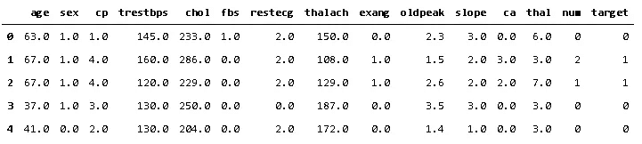
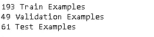
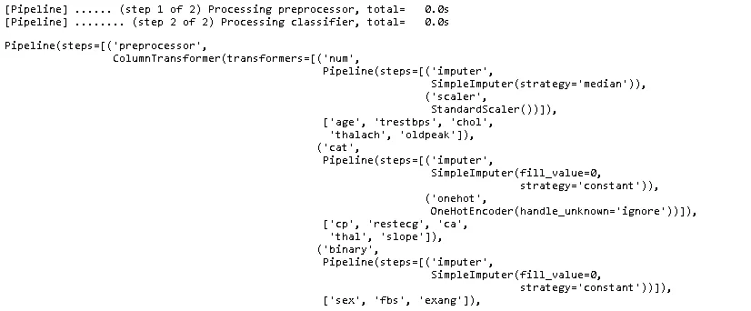
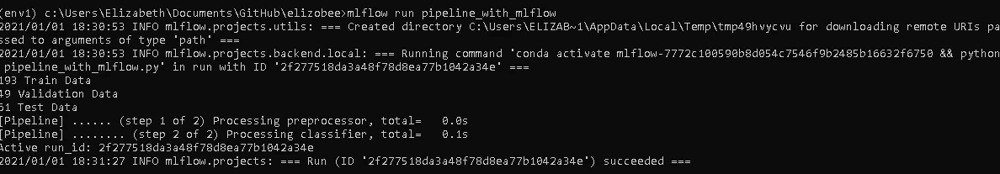
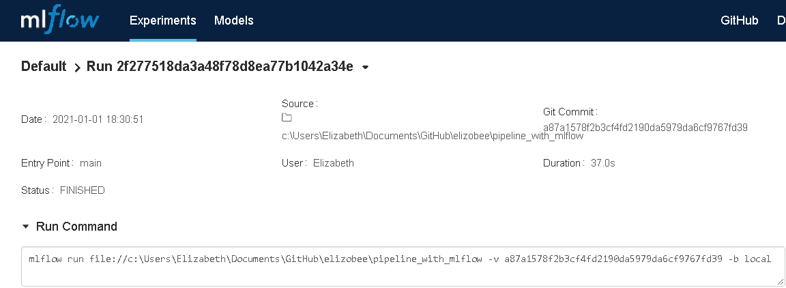
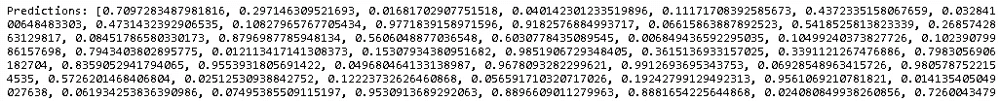

# 使用 MLflow 和 Scikit-learn 管道开发和部署机器学习模型

> 原文：<https://towardsdatascience.com/machine-learning-model-development-and-deployment-with-mlflow-and-scikit-learn-pipelines-f658c39e4d58?source=collection_archive---------20----------------------->

## 从 Python 模型创建 API 部署


维多利亚时代转换汽油吊灯-作者图片

维多利亚式汽油器是一个工业天然气管道的例子，它的终端是一个优雅的固定装置。同样，我们的机器学习管道需要功能性，与其他系统兼容，对开发者和用户都有吸引力。这篇文章包含一个使用 Scikit-learn 管道和 MLflow 部署的 python 机器学习模型开发的示例。这些步骤包括:

*   利用定制变压器的 **Scikit-learn** 管道
*   将模型和定制变压器代码输出到 **MLflow** 跟踪服务器
*   使用 **ML 项目**将模型代码链接到结果
*   通过 REST-API 从 **MLflow** 跟踪服务器提供模型

为什么要使用这种方法？这种方法的组合消除了对额外的模型服务逻辑的需要，允许对原始模型开发代码的可追溯性，结合了基于领域知识的行业标准和定制代码，并允许简单的模型部署。

> 人工智能需要根据您的业务环境进行定制。你不能下载一个开源包，然后把它应用到你的问题上。—吴恩达

通过将领域知识与可重用的代码库相结合，我们可以利用开源解决方案来解决类似的问题，并构建定制的系统。

# 管道

管道有许多优点。

*   确保测试和训练数据之间没有信息泄漏
*   将带有预处理步骤的模型捆绑到单个序列化对象中，而不是多个步骤和输出
*   允许在开发和部署期间运行相同的数据准备步骤

Scikit-learn 管道还兼容其他建模包，如 Keras 和 XGBoost。

对于这个管道，我们将从[加州大学欧文分校机器学习库](https://archive.ics.uci.edu/ml/datasets/Heart+Disease)导入克利夫兰诊所心脏病数据集。Kaggle 上也有一个非常相似的数据集。与实验室和生理测试相关的功能包括:

*   患者年龄
*   患者性别
*   CP——胸痛类型
*   trest bps——静息血压
*   胆固醇——血清胆固醇
*   FBS —空腹血糖
*   静息心电图—静息心电图结果
*   thal ach——最大心率
*   运动诱发的心绞痛
*   运动诱发的 old peak-ST 段压低
*   斜率——峰值运动 ST 段的斜率
*   CA——用荧光显微镜着色的主要血管的数量
*   Thal —缺陷类型
*   num——心脏病诊断

让我们读入数据，设置我们的目标变量，并查看数据。

```
import numpy as np
import pandas as pd
from sklearn.compose import ColumnTransformer
from sklearn.pipeline import Pipeline
from sklearn.impute import SimpleImputer
from sklearn.preprocessing import StandardScaler, OneHotEncoder
from sklearn.linear_model import LogisticRegression
from sklearn.model_selection import train_test_split
from sklearn.metrics import accuracy_score, precision_score, recall_scoreimport mlflow
import mlflow.sklearn
from mlflow.models.signature import infer_signatureURL = 'https://archive.ics.uci.edu/ml/machine-learning-databases/heart-disease/processed.cleveland.data'df = pd.read_csv(URL, header=None, names=['age','sex','cp','trestbps','chol','fbs','restecg','thalach'
,'exang','oldpeak','slope','ca','thal','num'])df['target']=np.where(df['num'] > 0,1,0)df.head()
```



为了演示自定义变压器的使用，我们将根据静息血压与最大血压的比率创建一个新功能。此功能将被创建为一个新类并保存到一个单独的文件中，因此它可以输出到 MLflow tracking 服务器，以便在部署过程中与保存的模型结合使用。

```
import pandas as pd
from sklearn.base import BaseEstimator, TransformerMixin#Custom Transformer Class
class NewFeatureTransformer(BaseEstimator, TransformerMixin):
     def fit(self, x, y=None):
          return self def transform(self, x):
          x['ratio'] = x['thalach']/x['trestbps']
          x=pd.DataFrame(x.loc[:, 'ratio'])
          return x.values
```

现在，让我们将数据分成训练、验证和测试数据集。

```
train, test = train_test_split(df, test_size=0.2)
train, val = train_test_split(train, test_size=0.2)print(len(train), 'Train Examples')
print(len(val), 'Validation Examples')
print(len(test), 'Test Examples')
```



我们现在准备导入我们的自定义类并定义管道。

```
from custom_class import NewFeatureTransformer#Define the Pipelinenumeric_features = ['age','trestbps','chol','thalach','oldpeak']
numeric_transformer = Pipeline(steps=[
     ('imputer', SimpleImputer(strategy='median')),
     ('scaler', StandardScaler())])categorical_features = [ 'cp','restecg','ca','thal','slope']
categorical_transformer = Pipeline(steps=[ 
     ('imputer', SimpleImputer(strategy='constant',fill_value=0)),
     ('onehot', OneHotEncoder(handle_unknown='ignore'))])binary_features = [ 'sex','fbs','exang']
binary_transformer = Pipeline(steps=[
     ('imputer',SimpleImputer(strategy='constant',fill_value=0))])new_features_input =  [ 'thalach','trestbps']
new_transformer = Pipeline(steps=[
     ('new', NewFeatureTransformer())])preprocessor = ColumnTransformer(
     transformers=[
          ('num', numeric_transformer, numeric_features),
          ('cat', categorical_transformer, categorical_features),
          ('binary', binary_transformer, binary_features),
          ('new', new_transformer, new_features_input)])# Now join together the preprocessing with the classifier.clf = Pipeline(steps=[('preprocessor', preprocessor),
     ('classifier', LogisticRegression())], verbose=True)#fit the pipeline
clf.fit(train, train['target'].values)#create predictions for validation data
y_pred = clf.predict(val)
```



现在我们有了管道，下一步是将结果模型保存到 MLflow 跟踪服务器。

# MLflow

MLflow 项目是一种与框架无关的模型跟踪和部署方法，最初由 Databricks 于 2018 年 7 月作为开源发布。截至 2020 年 7 月，MLflow 现在是 [Linux 基金会](https://www.linuxfoundation.org/press-release/2020/06/the-mlflow-project-joins-linux-foundation/)的成员。也可以通过 Seldon 将保存在 MLflow 跟踪服务器上的模型部署到 Kubernetes 中。这允许将 MLflow 的模型跟踪功能与 Seldon 的扩展部署功能结合使用。

尽管 MLflow 对模型有一种 scikit-learn 的“风格”,但是由于使用了定制的转换器，我们将需要使用通用的“python 函数风格”。将 MLflow 与 scikit-learn 管道结合使用允许我们将模型定义和所有预处理步骤和转换保存到一个对象中，再加上我们的自定义转换器代码。首先设置模型输出类和将来执行模型所需的 conda 环境。

```
class ModelOut (mlflow.pyfunc.PythonModel):
     def __init__(self, model):
          self.model = model def predict (self, context, model_input):
          model_input.columns= map(str.lower,model_input.columns)
          return self.model.predict_proba(model_input)[:,1]mlflow_conda={'channels': ['defaults'],
     'name':'conda',
     'dependencies': [ 'python=3.6', 'pip',
     {'pip':['mlflow','scikit-learn','cloudpickle','pandas','numpy']}]}
```

接下来，我们将向跟踪服务器输出模型和一些指标。

```
with mlflow.start_run():
     #log metrics
     mlflow.log_metric("accuracy", accuracy_score( val['target'].values, y_pred))
     mlflow.log_metric("precison", precision_score( val['target'].values, y_pred))
     mlflow.log_metric("recall", recall_score( val['target'].values, y_pred)) # log model
     mlflow.pyfunc.log_model(   artifact_path="model",
          python_model=ModelOut(model=clf,),
          code_path=['custom_class.py'],
          conda_env=mlflow_conda)
     signature = infer_signature(val, y_pred) #print out the active run ID
     run = mlflow.active_run()
     print("Active run_id: {}".format(run.info.run_id))
```

# 使用 MLflow 项目执行

使用 MLflow 项目和 Github，保存到跟踪服务器的模型可以链接到 [Github 代码](https://github.com/elizobee/pipeline_with_mlflow)。也可以使用 MLproject 文件在本地执行。下面是一个非常简单的 MLproject 文件的示例。

```
name: heartdisease_pipeline_with_mlflowconda_env: disease_conda.yamlentry_points:
     main:
          command: 'python pipeline_with_mlflow.py'
```

我们可以基于 conda.yaml 文件执行这个命令来设置一个新的 conda 环境，或者使用-no-conda 选项来执行。



现在，我们可以在包含 MLflow 的激活环境的 anaconda 提示符下执行`mlflow ui`,查看 MLflow 跟踪服务器中 run_id 的详细信息。我们在`http:\\localhost:5000`找到跟踪服务器



# 模型服务

该模型现在可以从 Anaconda 提示符下提供服务。

```
mlflow models serve -m file:C:\Users\Elizabeth\Documents\GitHub\EO\mlruns\0\4c5e296e18174521a470891251eed5ea\artifacts\model\
```

在构建并激活 conda 环境之后，您将会得到一条消息，表明该模型正在为 http://localhost:5000 服务。我们现在可以向模型提供数据并接收预测。我们将在这里使用 python 来演示，但是也可以调用这个 API 来对来自流的数据进行评分。

```
import requests
host = 'localhost'
port = '5000'url = f'http://{host}:{port}/invocations'headers = {'Content-Type': 'application/json',}
# test contains our data from the original train/valid/test splithttp_data = test.to_json(orient='split')
r = requests.post(url=url, headers=headers, data=http_data)print(f'Predictions: {r.text}')
```



# 摘要

使用 Scikit-learn 管道和 MLflow 模型跟踪服务器有助于为数据科学模型编写基于 python 的生产就绪部署代码。使用这种方法，数据科学家可以从一个模型中产生一个 API，而不需要对输入数据流进行额外的 ETL。这可以促进部署，并允许软件工程师专注于基础设施和系统集成，包括持续集成和交付，而不是维护与建模相关的代码库。它还使得重新部署像在 MLFlow 跟踪服务器上引用新的 run_id 一样简单。