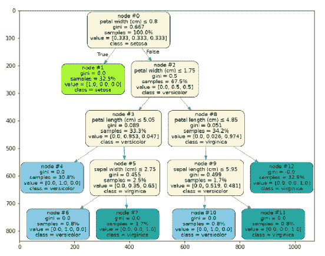
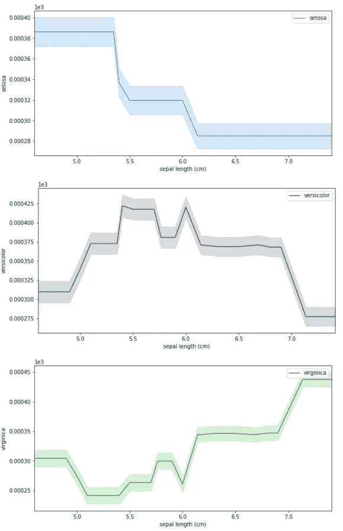
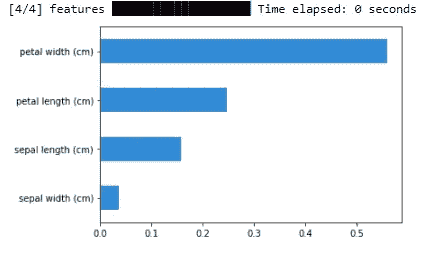

# 机器学习模型解释

> 原文：<https://towardsdatascience.com/machine-learning-model-interpretation-47b4bc29d17f?source=collection_archive---------34----------------------->

## 使用 Skater 建立 ML 可视化



树(来源:[作者](https://www.linkedin.com/in/himanshusharmads/)

解释机器学习模型是一项艰巨的任务，因为我们需要了解模型在后端如何工作，模型使用的所有参数是什么，以及模型如何生成预测。我们可以使用不同的 python 库来创建机器学习模型可视化，并分析模型的工作对象。

[](/machine-learning-model-dashboard-4544daa50848) [## 机器学习模型仪表板

### 创建仪表板来解释机器学习模型

towardsdatascience.com](/machine-learning-model-dashboard-4544daa50848) 

Staker 是一个开源的 python 库，支持对不同类型的黑盒模型进行机器学习模型解释。它帮助我们创建不同类型的可视化，使我们更容易理解模型是如何工作的。

在这篇文章中，我们将探索滑板和它的不同功能。让我们开始吧…

# 安装所需的库

我们将从使用 pip 安装安装一个溜冰者开始。下面给出的命令将使用 pip 安装溜冰者。

```
!pip install -U skater
```

# 导入所需的库

下一步将是导入所需的库。要使用 Skater 解释模型，我们首先需要创建一个模型。

```
%matplotlib inline 
import matplotlib.pyplot 
import matplotlib.pyplot as plt 
import numpy as np 
from sklearn.model_selection 
import train_test_split from sklearn.ensemble 
import RandomForestClassifier 
from sklearn import datasets 
from sklearn import svm
from skater.core.explanations import Interpretation
from skater.model import InMemoryModel
from skater.core.global_interpretation.tree_surrogate 
import TreeSurrogate
from skater.util.dataops import show_in_notebook
```

# 创建模型

我们将创建一个随机森林分类器，并使用 IRIS 数据集。

```
iris = datasets.load_iris()
digits = datasets.load_digits()
X = iris.data
y = iris.target
clf = RandomForestClassifier(random_state=0, n_jobs=-1)

xtrain, xtest, ytrain, ytest = train_test_split(X,y,test_size=0.2, random_state=0) clf = clf.fit(xtrain, ytrain)y_pred=clf.predict(xtest)
prob=clf.predict_proba(xtest)from skater.core.explanations import Interpretation
from skater.model import InMemoryModelfrom skater.core.global_interpretation.tree_surrogate import TreeSurrogate
from skater.util.dataops import show_in_notebookinterpreter = Interpretation(
        training_data=xtrain, training_labels=ytrain, feature_names=iris.feature_names
    )
pyint_model = InMemoryModel(
            clf.predict_proba,
            examples=xtrain,
            target_names=iris.target_names,
            unique_values=np.unique(ytrain).tolist(),
            feature_names=iris.feature_names,
        )
```

# 创建可视化

我们将从创建不同的可视化开始，这将帮助我们分析我们创建的模型是如何工作的。

1.  **部分依赖情节**

该图向我们展示了特定特征如何影响模型的预测。

```
interpreter.partial_dependence.plot_partial_dependence(
   ['sepal length (cm)'] , pyint_model, n_jobs=-1, progressbar=**False**, grid_resolution=30, with_variance=**True**,figsize = (10, 5)
)
```



PDP 剧情(来源:[作者](https://www.linkedin.com/in/himanshusharmads/)

2.**特征重要性**

在此图中，我们将分析我们创建的模型中的功能的重要性。

```
plots = interpreter.feature_importance.plot_feature_importance(pyint_model, ascending=True, progressbar=True,
                                n_jobs=-1)
```



功能重要性(来源:[作者](https://www.linkedin.com/in/himanshusharmads/))

3.**代理树**

这是我们创建的随机森林模型的图形表示。在每一步，它都显示基尼指数值、等级等。

```
surrogate_explainer = interpreter.tree_surrogate(oracle=pyint_model, seed=5)
surrogate_explainer.fit(xtrain, ytrain)
surrogate_explainer.plot_global_decisions(show_img=True)
```


代理树(来源:[作者](https://www.linkedin.com/in/himanshusharmads/)

这就是我们如何使用 Skater 来创建不同的图表，帮助我们分析模型的表现。继续尝试不同的数据集，并让我知道您在回复部分的评论。

本文是与[皮尤什·英加尔](https://medium.com/u/40808d551f5a?source=post_page-----47b4bc29d17f--------------------------------)合作完成的。

# 在你走之前

***感谢*** *的阅读！如果你想与我取得联系，请随时通过 hmix13@gmail.com 联系我或我的* [***LinkedIn 个人资料***](http://www.linkedin.com/in/himanshusharmads) *。可以查看我的*[***Github***](https://github.com/hmix13)**简介针对不同的数据科学项目和包教程。还有，随意探索* [***我的简介***](https://medium.com/@hmix13) *，阅读我写过的与数据科学相关的不同文章。**