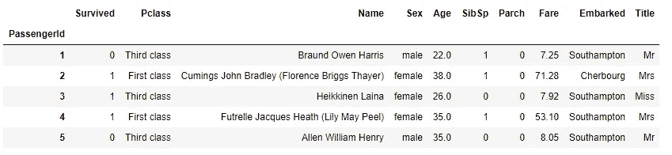
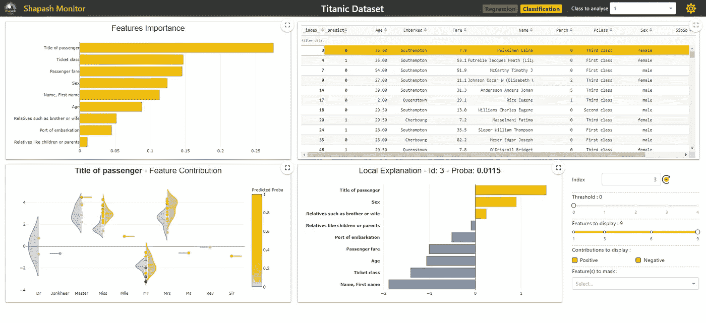
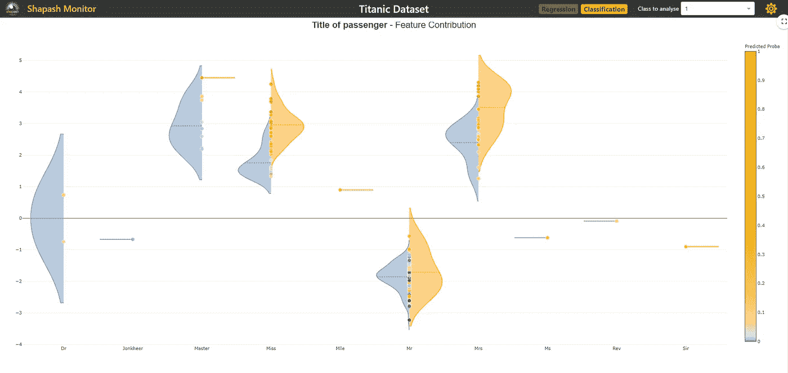

# 机器学习模型可视化

> 原文：<https://towardsdatascience.com/machine-learning-model-visualization-cc3b46136647?source=collection_archive---------24----------------------->

## 使用 Shapash 使 ML 模型可解释


卢克·切瑟在 [Unsplash](https://unsplash.com?utm_source=medium&utm_medium=referral) 上的照片

创建机器学习模型是 ml 工程师的日常任务，他们可以很容易地理解它们并解释它们以获得有用的信息，但对于不属于数据科学领域的人来说，很难理解机器学习模型及其试图表达的内容？

数据科学家可以理解模型是关于什么的，但是与其他团队成员或管理层分享结果是困难的。Shapash 是一个开源 python 库，用于创建不同类型的可视化，绕过显式标签，即使是非技术人员也能理解。它用于与最终用户共享模型的结果，最终用户可以通过可视化的方式轻松地解释和理解它们。

在本文中，我们将通过使用给定的数据集创建一个仪表板来探索 Shapash 及其特性。

让我们开始吧…

# 安装所需的库

我们将从使用 pip 安装 shapash 开始，您可以运行下面给出的命令来安装 shapash。

```
pip install shapash
```

# 导入所需的库

接下来，我们将导入所有需要的库。

```
import pandas as pd
from category_encoders import OrdinalEncoder
from lightgbm import LGBMClassifier
from sklearn.model_selection import train_test_split
```

# 加载数据和预处理

我们将在本文中使用的数据集是著名的 Titanic 数据集，我们将使用 shapash 加载它，之后，我们将对数据执行一些预处理。

```
from shapash.data.data_loader import data_loading
titanic_df, titanic_dict = data_loading('titanic')
titanic_df.head()
```



数据集(来源:作者)

```
y_df=titanic_df['Survived'].to_frame()
X_df=titanic_df[titanic_df.columns.difference(['Survived'])]# Converting categorical columns to numerical
categorical_features = [col for col in X_df.columns if X_df[col].dtype == 'object']encoder = OrdinalEncoder(
    cols=categorical_features,
    handle_unknown='ignore',
    return_df=True).fit(X_df)X_df=encoder.transform(X_df)#Splitting data into training and testing
Xtrain, Xtest, ytrain, ytest = train_test_split(X_df, y_df, train_size=0.8, random_state=1)
```

# 创建模型

对数据进行预处理后，我们将使用 LightGBM 分类器创建分类模型。

```
classifier = LGBMClassifier(n_estimators=200).fit(Xtrain,ytrain)
```

# 创建仪表板应用程序

下一步也是最后一步是为我们使用的模型和数据集创建应用程序。Shapash 使用 dash.js 创建一个仪表板，并将其用作 flask 应用程序。

```
from shapash.explainer.smart_explainer import SmartExplainer
xpl = SmartExplainer(features_dict=titanic_dict)xpl.compile(
    x=Xtest,
    model=classifier,
    preprocessing=encoder # Optional: compile step can use inverse_transform method
)#Creating Application
app = xpl.run_app(title_story='Titanic Dataset')
```

运行这些命令将创建一个仪表板，并显示应用程序运行的 URL。复制 URL 并在你的浏览器中打开它，它将看起来像下面给出的图片。



Shapash 仪表板(来源:作者)

在这里，您可以看到我们使用 shapash 创建仪表板是多么容易，在这里我们可以看到不同的可视化效果，我们可以使用它来清楚地解释和理解我们正在使用的机器学习模型。

我们可以通过展开并全屏观看来浏览所有的可视化效果，以便清楚地理解它们。在这里，您还可以看到我们可以分析两个类，即“0”和“1”。



专题供稿(来源:作者)

这就是我们如何使用 shapash 来创建机器学习模型的仪表板。继续尝试这个，如果你遇到任何困难，请在回复部分告诉我。

**本文与** [**皮尤什·英格尔**](https://medium.com/u/40808d551f5a?source=post_page-----cc3b46136647--------------------------------) **合作。**

# 在你走之前

***感谢*** *的阅读！如果您想与我取得联系，请随时通过 hmix13@gmail.com 联系我或我的* [***LinkedIn 个人资料***](http://www.linkedin.com/in/himanshusharmads) *。可以查看我的*[***Github***](https://github.com/hmix13)**简介针对不同的数据科学项目和包教程。还有，随意探索* [***我的简介***](https://medium.com/@hmix13) *，阅读我写过的与数据科学相关的不同文章。**