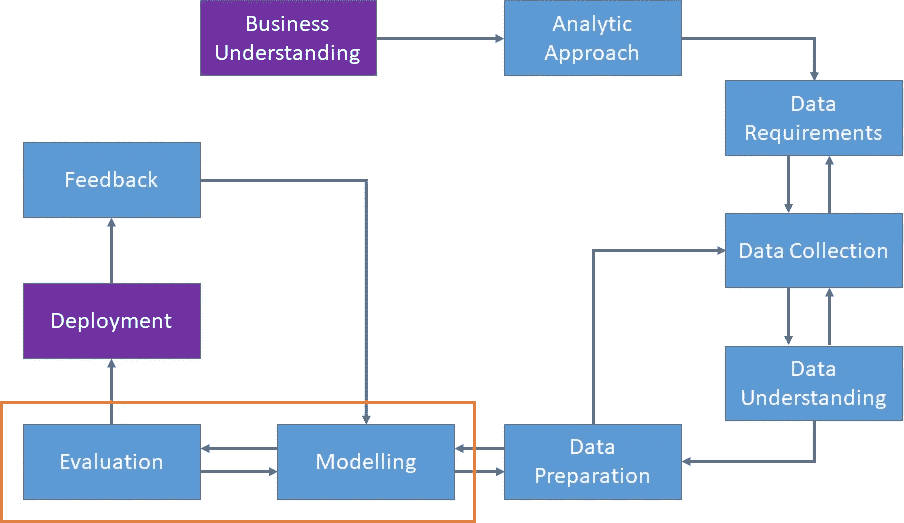
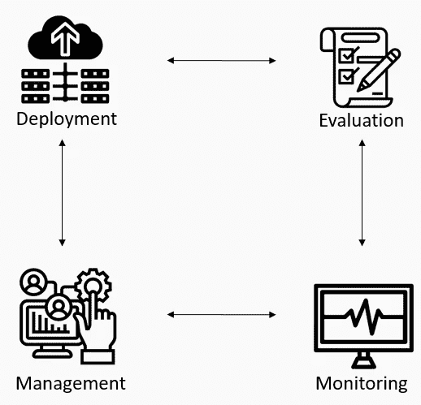
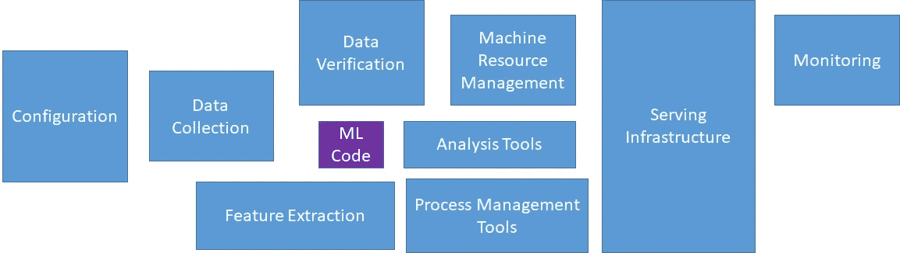

# 机器学习模型部署

> 原文：<https://towardsdatascience.com/machine-learning-models-deployment-123773c476bc?source=collection_archive---------13----------------------->

## 它是什么，为什么重要，它的主要挑战是什么

图片来自 [Pixabay](https://pixabay.com/illustrations/analytics-information-innovation-3088958/)

# 介绍

如今，在互联网上，你可以找到各种各样的资源，这些资源涉及成功开发机器学习模型的科学和方法。无论你想开发一个有监督的还是无监督的学习模型及其所有子类型，数以千计的帖子将一步一步地告诉你如何去做。

然而，有一个阶段是使这些 ML 模型具有生命力并真正能够从中提取价值的关键:部署它们并将它们产品化。这一阶段通常被忽视或根本没有解决。

所以，这就是我们在这篇文章中要探索的:什么是模型部署，为什么它很重要，它的主要挑战是什么。

> 注意:这篇文章包含附属链接，这样你就可以轻松地购买这本书，而不需要任何额外的费用，同时有助于创建更多像这样的帖子。
> 
> 这篇文章的灵感来自 Pramod Singh 的伟大著作[将机器学习模型部署到生产中](https://amzn.to/3gNtJeB)。如果你有兴趣并想深入研究这个话题，我强烈建议你去看看并购买它。

# 什么是模型部署？

我在以前的帖子中谈到了成功开发机器学习模型，我甚至发布了几个解决回归和分类等问题的实际例子。

模型开发和部署的一般过程与此非常相似:

作者图，灵感来自[来源](/data-science-methodology-101-ce9f0d660336)

构建和部署一个模型是一个迭代的过程，其中一些循环部分将从其他需要改进的步骤的信息中得到启发。数据科学团队和业务部门需要回答一些问题:

*   你试图解决的问题是什么？
*   如何用数据解决这个问题？
*   我们需要什么数据？我们目前有什么？
*   数据来源是什么，我们如何访问它们？
*   收集的数据代表问题吗？
*   需要哪些资料准备？
*   我们如何将数据可视化？
*   开发的模型是为了回答最初的问题还是需要调整？
*   我们如何将模型付诸实践？
*   我们如何获得建设性的反馈来回答这个问题？

这里，我们将重点关注部署步骤。基本上，部署一个模型是为了让其他方可以使用它来为业务产生价值。

我们至少需要部署以下阶段:

*   特征工程
*   特征选择
*   机器学习模型构建

因此，在实践中，我们没有部署机器学习模型，而是一个管道。

一旦模型准备好在生产环境中使用，我们需要通过一些 API 将它暴露给看不见的数据。这是关键部分，也是我们稍后将讨论的挑战所在。

## 步伐

第一步是在生产环境中部署 ML 模型并测试结果。

然后，我们应该持续监控它的性能。如果模型的性能低于某个阈值，则需要对其进行重新训练，并且该重新训练的模型将替代旧的模型。

通过这个过程，对它的版本和特性进行良好的模型管理是至关重要的，这样它就不会影响以前的用户请求。

当这个新模型被部署时，这个过程将被重复。

图由作者提供，灵感来自[来源](https://image.slidesharecdn.com/slides-170512093121/95/deploying-machine-learning-models-to-production-8-638.jpg?cb=1507239367)

## ML 应用程序与典型的软件应用程序有何不同

机器学习应用是独特的，并且在两个主要方面不同于其他软件应用:

*   基础模型
*   基础数据

如前所述，部署模型基本上是通过将它集成到现有的业务应用程序中，使它可供其他方使用，从而为业务创造价值。

简单地说，ML 模型被公开为 REST API 端点，并服务于:

*   应用程序平台内的请求
*   直接用户的请求

并且可以部署:

*   作为独立的预测器，使用批量数据给出输出
*   作为实时请求的服务器，作为一个动态模型

模型部署是模型管理阶段的起点，这个阶段充满了挑战和潜在的问题。因此，要成功完成这一阶段，需要所有相关利益方的大量投入和协调:

*   数据科学家
*   数据工程师
*   应用开发人员
*   MLOps 和/或 DevOps
*   业务团队成员
*   最终用户

# 为什么模型部署很重要？

我们需要理解 ML 模型在期望的业务应用中的作用。根据应用程序的最终目标，它可能有不同的角色。它可以是单个预测、多个预测的组合或某种推荐。

可以使用机器学习模型来预测汽车保险公司的客户，这些客户可能也对获得人寿保险感兴趣，这是基于他们的特征(收入、年龄、性别、他们是否有孩子……)。

除了机器学习模型可能的最终目标之外，它的部署对于能够与业务应用程序通信并最终从中提取价值也是至关重要的。它的预测将提供给业务应用程序，人们可以从它的洞察力中受益，以执行数据驱动的决策。另一个关键点是，可以从实时数据中获得预测。

当以下任何陈述为真时，部署尤其重要:有大量数据，数据来自流，有大量用户，需要快速响应。

# 主要挑战

我们应该理解的第一件事是开发一个 ML 模型和部署一个 ML 模型之间有巨大的差异。这些差异转化为性能、速度和资源消耗方面的巨大差异。

所有的任务和优先级都应该服从于对所部署的 ML 模型的持续监控，应用程序应该有最好的版本，以便在生产中服务于来自用户的实时请求。

而且，在实践中，ML 代码在生产中的整体部署中的作用是它正确工作所需的整个结构的非常小的一部分。如下图所示的顺序:

[机器学习系统中隐藏的技术债务](https://papers.nips.cc/paper/2015/file/86df7dcfd896fcaf2674f757a2463eba-Paper.pdf) —图片由作者转载

## 利益相关者协调

通常，任何 ML 模型部署中最常见的问题是协调部署团队与其他缺乏机器学习知识或理解的团队成员。

模型部署是一项团队任务，需要不断的沟通和对整体目标的共同理解。在 ML 模型开发的早期阶段，一个充分的计划是 MLOps/DevOps 团队为部署做好准备的关键。

## 编程语言差异

通常，ML 模型是用 Python 或 TensorFlow 或 PyTorch 之类的变体开发的，使用其输出的应用程序是用 Java、C++或 Ruby 开发的。虽然现在迁移 ML 模型以与应用程序顺利集成变得越来越容易，但编程差异给集成带来了一些挑战。

## 模型漂移

模型漂移是指 ML 模型的性能降低到指定的基准/阈值以下。这就是为什么持续监控 ML 模型性能如此重要的原因，以便能够检测和更新模型，从而获得在线和运行的最佳版本。

这种性能下降通常是由以下原因造成的:

*   改变数据的行为:由于数据的动态特性，它和它的内部模式可能会随着时间而改变。因此，当模式和内部权重的调整不再反映当前数据时，一个在部署时表现非常好的 ML 模型将会看到其性能如何随着时间而下降。在这些情况下，必须用最真实的数据重新训练模型，并将新版本投入生产。
*   改变对新数据的解释:这是由于概念漂移，通常是由于某个标签或类别的解释发生变化。例如，某些客户群可能属于 X 类，而在某个时间点，企业决定将其更改为 y 类。同样，该模型将不再有用，需要重新培训并重新投入生产。

## 内部部署与基于云的部署

这两种方法各有利弊，根据要解决的问题而定，哪种方法更合适。因此，业务部门和数据科学团队需要分析并决定哪种实施是最好的。

## 清晰的所有权

团队的每个成员都必须清楚地知道自己的职责和角色。通常，DevOps 不太了解模型下发生了什么，需要对其行为进行足够深入的解释，以便将其正确集成到应用程序中。另一方面，数据科学家倾向于假设他们的工作在模型开发出来后就完成了。因此，整个团队之间的顺畅沟通至关重要，以确保在要求的时间、成本和质量内完成部署，并避免任何潜在的问题。

## 模型性能监控

在将模型投入生产之前，需要对监控策略进行规划，通常围绕以下问题进行设计:

*   什么时候重新训练模型？
*   将使用多少数据来重新训练模型？
*   模型的性能阈值是多少？

## 版本管理

这是需要考虑的一个关键方面。它有助于:

*   追踪哪个模型是最好的
*   不同的文件依赖关系
*   数据资源指针

Git 是跟踪版本和分阶段部署最广泛的方式。

## 隐私保护和安全模型

这个话题是最重要的话题之一。关键是要确保模型的安全，这样就没有恶意攻击会将其数据暴露给第三方。

# 结论

在整篇文章中，我们探讨了什么是模型部署，为什么它很重要，以及它面临的一些最常见的挑战。一如既往，我希望你喜欢它，并学到一些新东西:)

*如果你喜欢这个帖子，你可以看看我关于数据科学和机器学习的其他帖子* [*这里*](https://medium.com/@rromanss23) *。*

*如果你想了解更多关于机器学习、数据科学和人工智能的知识* ***请在 Medium*** *上关注我，敬请关注我的下一篇帖子！*