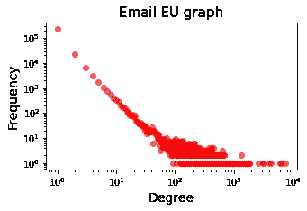
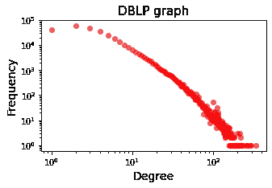
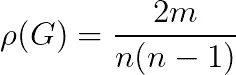
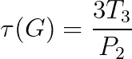
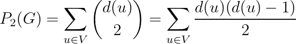
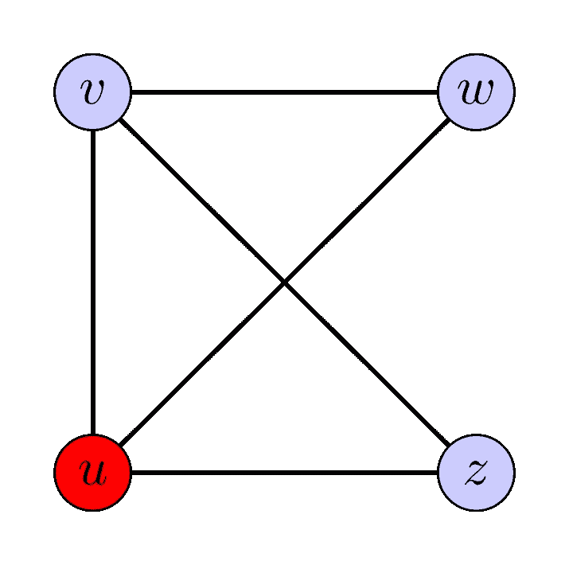
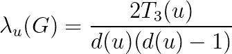
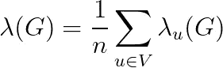
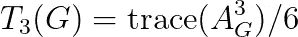
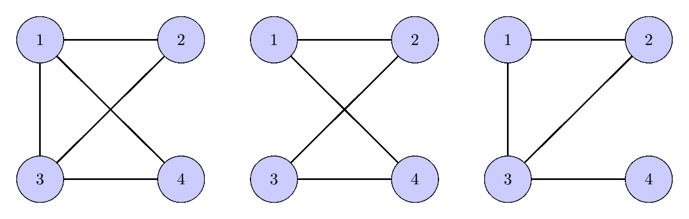

# 图上的机器学习，第 1 部分

> 原文：<https://towardsdatascience.com/machine-learning-on-graphs-part-1-9ec3b0bd6abc?source=collection_archive---------14----------------------->


艾莉娜·格鲁布尼亚克在 [Unsplash](https://unsplash.com/s/photos/network?utm_source=unsplash&utm_medium=referral&utm_content=creditCopyText) 上的照片

## 收集基本统计数据

在一系列帖子中，我将概述几种从图形数据中学习的机器学习方法。从用于描述图形的基本统计开始，我将通过讨论节点嵌入、图形核、图形信号处理以及最终的图形神经网络来深入探讨这个主题。这些帖子旨在反映我在学术界和工业界的个人经历，包括我的一些研究论文。我的主要动机是首先介绍一些关于图的机器学习的基本方法，这些方法应该在深入研究像图神经网络这样的高级算法之前使用。

在第一篇文章中，我介绍了一些常见的图表分析技术，这些技术应该可以帮助我们更好地理解我们的数据。

## 预赛

我假设你熟悉基本的图形概念。我将考虑没有自环的无向图(节点通过一条边连接到自己)，但这只是为了便于展示。一个图用 *G=(V，E)* 表示，其中 *V* 是节点或顶点的集合， *E* 是边的集合。节点的数量由 *n = |V|* 表示，边的数量由 *m = |E|表示。*

## 要寻找什么图形统计？

在着手解决一个问题之前，我们通常会花一些时间进行探索性的数据分析。这为我们提供了对数据的洞察，这些数据可能对我们以后的工作至关重要。理想情况下，我们会像绘制地铁图一样绘制图表，但大多数现实生活中的图表都很大，很容易可视化。相反，下面是一些重要的统计数据:

*   **程度分布。**两个现实网络的度分布如图 1 所示。第一张[图](https://snap.stanford.edu/data/email-EuAll.html)来自欧盟机构的电子邮件通信，第二张[图](https://snap.stanford.edu/data/com-DBLP.html)是来自 DBLP 数据库的合著图。我们观察到电子邮件图中最常见的节点度是 1，意味着大多数人只与一个人交流。在合著图中，大多数作者都有两到三个合著者。



图 1:学位分布。图片作者。

*   **图形密度**。数量定义为



解释很简单:边的最大可能数量是 n*(n-1)/2，因为每个节点可以恰好连接到 n-1 个其他节点，并且边是无向的。它衡量一个图与一个完全连通的图或者一个*集团*的接近程度。大多数现实生活中的网络是非常稀疏的，因此在大多数情况下，这种方法不能提供很多信息。

*   **连接组件。**我们说，如果在 *u* 和 *v* 之间存在一条路径，即一系列边，那么从节点 *v* 可以到达节点 *u* 。在连通组件中，每个节点都可以从该组件中的所有其他节点到达。连通分量的数量和相应的大小可以提供关于图形的信息。然而，在大多数情况下，我们感兴趣的是由单个连通分量组成的连通图。
*   **图形直径。**两个节点 *u* 和 *v* 之间的最短路径是从*u*开始到达 *v* 需要遍历的最小边数。图直径是图中任意两个节点之间的最大最短路径长度。如果图有多个连通分支，那么它的直径是无穷大。在这种情况下，我们感兴趣的是每个连通分量的直径。图的直径可以用来区分不同类型的网络。例如，地铁网络可能比小型社交网络具有更大的直径。
*   **三角形的数量和传递系数。**在图论中，有[erdős–rényi 图](https://en.wikipedia.org/wiki/Erd%C5%91s%E2%80%93R%C3%A9nyi_model)的基本概念。这是一个理论模型，其中节点之间的边是随机生成的，每个边都有固定的概率 *p* ，独立于其他边。现实生活中的图与 erdős–rényi 图非常不同，因为边不是随机独立创建的。特别是，对于大多数真实的图，它通常认为“我的朋友的朋友也是我的朋友”。这使得研究人员认为三角形是图形分析的基本单位[1]。在高层次上，三角形的数量显示了我们的图形与随机图形的不同之处。

图的传递系数定义为



在上面的例子中，分子是三角形的数量乘以 3，分母表示图中 2-路径的数量，可以计算如下:



在图 2 的图形中，有两个三角形，分别是 *(u，v，w)* 和 *(u，v，z)* 。2-路径是由 en 边连接的 3 节点序列，例如 *z-u-w* 。观察到给定节点的每对邻居都产生一条 2-路径，因此得到了上面的 2-路径总数公式。我们将三角形的数量乘以 3，因为我们计算了它的 3 2 条路径中的每一条。因此，传递系数是介于 0(完全没有三角形)和 1(完全连通图)之间的值。

在图 2 中，2-路径的数量是 8，因此传递系数是 0.75。

在大多数真实的图中，传递系数是常数。传递系数越大，网络连接越紧密。事实上，它在 1998 年被引入来描述小世界网络模型。



图二。一个紧密连接的图。图片作者。

*   **三角形的局部数量和聚类系数。**定义节点 *u* 的局部聚类系数



即以 u 为节点的三角形的数量除以以 *u* 为中心的 2-路径的数量。

然后将其推广到全局聚类系数



在图 2 中，节点 u 的局部聚集系数为 2/3，图的全局聚集系数为(2/3+2/3+1+1)/4 =0.833。

最后，我们希望指出，在文献中，传递性系数有时被称为聚类系数，而如上定义的全局聚类系数被称为平均聚类系数。符号的混乱源于 Watts 和 Strogatz 在他们的开创性论文[1]中错误地声称及物性系数和聚类系数是相同的。

## 怎么数三角形的个数？

从上面的讨论可以明显看出，最重要的图统计似乎是三角形的数量以及相应的传递性和聚类系数。让我们看看如何计算它。我推荐在处理图形时使用 Python 的 [networkx 库](https://networkx.org/)。它使用起来简单直观，并提供了许多基本的图形算法，如最短路径、连通分量数，甚至传递系数。

```
import networkx as nx
import numpy as npG = nx.Graph()
for u, v in <list of edges or edge generator>:
      G.add_edge(u, v)
```

我们可以用图的邻接矩阵的三次方来计数三角形。精确的公式是



迹被定义为矩阵中对角线元素的和。中的每个对角线条目测量从相应节点到其自身的长度恰好为 3 的路径的数量。考虑三个节点(u，v，w)之间的三角形。这三个节点有 6 种排列，这就是为什么我们需要将轨迹除以 6。在 Python 中，代码看起来像

```
def count_triangles(G):
   A = nx.to_scipy_sparse_matrix(G)
   A2 = A.dot(A)
   A3 = A2.dot(A)
   return A3.diagonal().sum()/6
```

注意，上面使用了稀疏矩阵乘法。然而，邻接矩阵的三次幂不能保证是稀疏的，特别是对于小直径的图，计算可能成为瓶颈。在这种情况下，我建议使用 Doulion 算法[2]。Doulion 的工作原理是对原始图形的边进行采样。每个边缘以概率 *p* 保持。因此，一个三角形以概率 p 存在于稀疏图中。我们通过将稀疏图中的三角形数量乘以 1/p 来估计原始图中的三角形数量。

```
def sparsify_graph(G, p):
    G_sparse = nx.Graph()
    for u,v in G.edges():
        if np.random.random() <= p:
            G_sparse.add_edge(u,v)
    return G_sparse
```

我在从 DBLP 网络获得的[图上运行了一个实验。该图由 317，080 个节点组成，边数刚刚超过 100 万。通过以 10%的概率对边缘进行采样，我获得了精确计数算法和 Doulion 的以下运行时间。并且所获得的三角形数量的近似值非常好。](https://snap.stanford.edu/data/com-DBLP.html)

```
Elapsed time exact:   13.21 secs
Elapsed time Doulion: 1.19 secs
Approximation exact/estimated: 1.030
```

## 一些更高级的统计数据。

让我们简单提一下还有更高级的图表统计。

*   **介数中心性。**这个[度量](https://en.wikipedia.org/wiki/Betweenness_centrality)捕获了图中节点的影响。对于每个节点 *u* ，我们计算节点对之间有多少条最短路径经过*u。*具有高介数中心性的节点被认为在网络中更重要。介数中心性分数的分布为我们提供了对图结构的进一步了解。然而，计算所有节点的中心性的计算复杂度是 O(m*n)。
*   **稠密连接的子图。**一个重要的研究课题是密集连通子图的检测【3】。这些是原始图中的子图，其中几乎所有的节点对都由一条边连接。这是社区检测算法的基础。但是这些致密成分的数量和密度也是重要的统计数据。
*   **挖掘图形主题。**检测频繁图模式是一个活跃的研究领域[4]。它将三角形计数算法推广到挖掘和计数更复杂的子图，或*主题。*这些计数可用于图形分类任务。在图 3 中，我在 4 个节点上展示了三个不同的主题。然而，对基序进行计数在计算上可能是昂贵的，并且仅限于小的子图。有人可能会认为，图形神经网络的成功是基于它们学习与手头问题相关的复杂主题的能力。



图 3。4 个节点上的子图主题。

## 密码

以上例子的代码可以在:[https://github.com/konstantinkutzkov/ML_on_graphs/](https://github.com/konstantinkutzkov/ML_on_graphs/blob/main/basic_graph_statistics.ipynb)找到

[1]邓肯·j·瓦茨，史蒂文·h·斯特罗加兹。[小世界网络的集体动力学](https://www.nature.com/articles/30918)。自然 393，1998。

[2]查拉兰波斯·e·措拉卡基斯、U·康、加里·米勒和克里斯特斯·法卢特索斯。 [DOULION:用一枚硬币数海量图形中的三角形](http://www.cs.cmu.edu/~ukang/papers/kdd09.pdf)。KDD 2009。

[3]查拉兰波斯·祖拉卡基斯、弗朗切斯科·邦奇、阿里斯蒂德斯·乔尼斯、
弗朗切斯科·古罗和玛丽亚·齐阿利。[比最密子图更密:
提取质量有保证的最优拟团](http://www.francescobonchi.com/denserthanthedensest.pdf)。KDD 2013。

[4]古越汉和哈里什塞图。[蹒跚随机行走:在大图中快速准确挖掘模体统计](https://arxiv.org/pdf/1605.09776.pdf)。ICDM 2016。