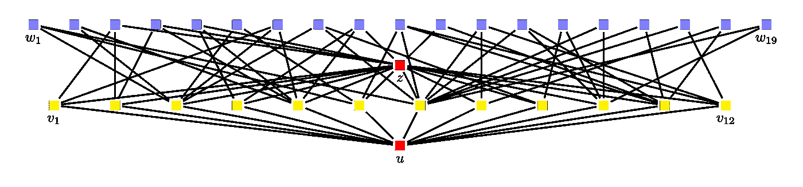
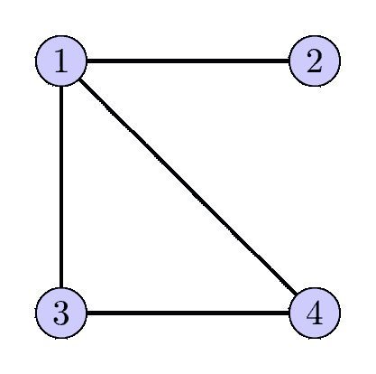
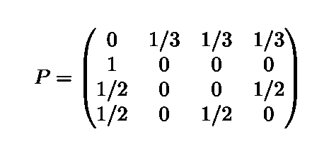
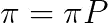
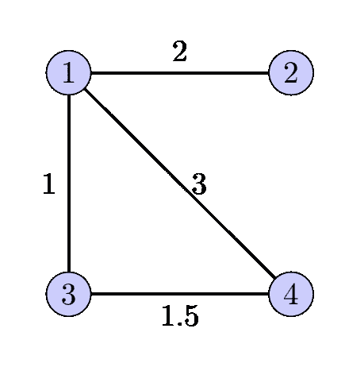
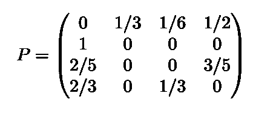
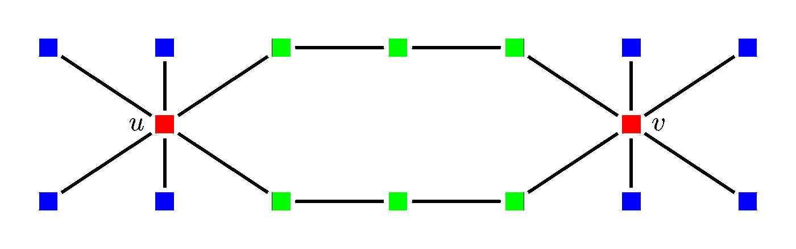

# 图上的机器学习，第 2 部分

> 原文：<https://towardsdatascience.com/machine-learning-on-graphs-part-2-205c46b3ef60?source=collection_archive---------23----------------------->


艾莉娜·格鲁布尼亚克在 [Unsplash](https://unsplash.com/s/photos/network?utm_source=unsplash&utm_medium=referral&utm_content=creditCopyText) 上的照片

> 节点嵌入。

在[之前的博客文章](/machine-learning-on-graphs-part-1-9ec3b0bd6abc)中，我介绍了在开始为你的图表数据开发机器学习模型之前应该收集的基本图表统计数据。在第二篇文章中，我将介绍第一种合适的机器学习方法。也就是说，学习用连续向量来表示离散对象，如图形节点，即所谓的*节点嵌入*。类似于单词嵌入，节点嵌入可以用于下游机器学习应用。

在介绍学习节点嵌入的算法之前，让我详细说明一下我在下一篇文章中的主要目标。

**动机。**图无处不在。从社交网络到交通枢纽，图模拟了对象之间的关系。在某种意义上，图将顺序数据概括为更复杂的交互。毫不奇怪，从图形数据中学习已经成为学术界和工业界的热门话题。鉴于深度学习的整体优势，从图形数据中学习的最强大的算法是基于图形神经网络，这是一种专门设计用于处理图形数据的特殊神经网络。在学术界，目标是在竞争激烈的场所发表研究论文，大多数关于图学习的新作品都基于图神经网络，因为它们改进了基准数据集上的最佳已知结果。大多数图形机器学习课程的重点是图形神经网络。例如，考虑这个关于图形机器学习的极好的斯坦福课程[。课程材料质量非常高，我强烈推荐给每个想深入研究图形机器学习的人。然而，大约 70%的讲座是关于图形神经网络的。并且省略了像图核机器这样的更基本的技术。根据我的经验和观察，这给人一种印象，从图中学习的默认方法是图神经网络。](https://www.youtube.com/playlist?list=PLoROMvodv4rPLKxIpqhjhPgdQy7imNkDn)

另一方面，众所周知，当处理一个新问题时，应该从一个简单的、具有众所周知的特性的解决方案开始。对于许多从业者和机器学习爱好者来说，处理新问题的主要目标是在投入太多时间开发高级解决方案之前先尝试一些东西。对于图形相关的机器学习来说尤其如此，在这种情况下，我们经常需要解决一个没有给出明确图形的问题，但是我们可以使用一些关于数据的元信息来创建自己的图形。例如，给我们一个大城市的道路交通数据集，我们想预测何时何地会发生交通堵塞。我们可能想尝试一种图表方法，即创建与街道位置相对应的节点，并用显示交通堵塞如何从一个节点传播到另一个节点的边将它们连接起来。但是当然不能保证图表方法是有前途的，因此我们更想要一个概念的证明而不是一个完整的解决方案。

神经网络，即使是简单的，也不是简单的解决方案。对于图形神经网络来说更是如此，因为图形没有它们的节点的总顺序，因此表现出比像文本和图像这样的顺序或网格结构数据复杂得多的结构。

因此，在接下来的几篇博客文章中，我想集中讨论不基于图形神经网络的图形机器学习技术。我将介绍一些简单而直观的从图中进行机器学习的方法。

## 我们应该从一个简单的图机器学习算法中期待什么？

*   **易于实现。**我们需要一个概念证明，即图形机器学习是我们问题的一个有前途的方向，我们应该能够轻松实现一个解决方案。
*   **效率高。**该模型应该能够在合理的时间内提供初步结果，即使不使用昂贵的计算机硬件。
*   **战功图。**假设我们收集节点度作为节点特征。这很容易实现，而且我们可以训练一个有效的算法。但是这样的解决方案将是图形不可知的，因为它忽略了图形结构，而这正是我们最终想要在我们的模型中利用的。
*   **可解释性。尽管对人类来说，图表不如图像或文本容易理解，但它仍然能让我们对数据的本质有一些直觉。理想情况下，机器学习模型应该能够帮助这种直觉。**

好了，让我们从节点嵌入开始，这是一种强大的图形机器学习方法。

## 什么是节点嵌入？

受 word2vec 和 GloVe 等从自然语言数据中学习单词嵌入的算法成功的启发，研究人员发明了学习图节点嵌入的算法。对于单词嵌入，我们想要学习连续的向量表示，使得频繁出现在一起的单词具有相似的表示。很容易为文本序列定义“一起出现”，这些是彼此接近的单词。但是图形更复杂。考虑图 1 中的示例图。黄色节点 *v1* 到 *v12* 是 *u* 的近邻。另一方面，红色节点 *z* 可以由来自 u 的更多路径到达，并且它看起来是更中心的节点。那么 *v1* 到 *v12* 还是节点 *z* 更能代表 *u* ？



图一。图片作者。

***随机游走***

随机漫步是遍历图的一种简单方法。从一个给定的节点开始，我们均匀地随机选择它的一个邻居，然后均匀地随机选择这个邻居的一个邻居，等等。随机漫步很容易实现，也很直观。

随机游动的性质已经被研究了几十年，并且是图论中几个重要结果的核心。它们是一个非常强大的工具，因为它们能够捕捉图形结构。高度连接或容易到达的节点更有可能被访问，这符合我们对重要性的直觉。

更正式地，对于连通图 G，设 A(G)是它的邻接矩阵，其中 A[u，v] = 1 当且仅当节点 u 和 v 之间有边(我们假设节点是 1 和 n 之间的整数)。从邻接矩阵，我们将转移概率矩阵定义为 P[u，v] = A[u，v]/d(u)，其中 d(u)是节点 u 的度。P[u，v]因此表示如果我们当前在节点*u*处，则选择节点 *v* 的概率注意，P 的每一行中的概率总和必须为 1。此外，请注意，对于无向图，邻接矩阵是对称的，但转移矩阵是不对称的，见下面的例子。**



图二。未加权图。图片作者。



未加权图的转移矩阵。图片作者。

给定转移矩阵，平稳分布π定义为:



平稳分布给出了在一次很长的随机行走中到达给定节点的概率，与我们开始的位置无关。事实上，固定分布是谷歌的 PageRank 算法的核心。本质上，我们越有可能在长时间随机浏览的同时访问某个页面，该页面的排名就越高。

## 加权图的随机游动。

许多图具有加权边，其中权重对应于节点之间的关联强度。例如，在对应于所有世界机场的图中，边可以对应于具有直达航班连接的城市之间的飞行时间的倒数。在这种情况下，在随机行走中，根据相应的边权重对随机邻居进行采样。考虑下面图 3 中的权重图和相应的转移矩阵。从节点 1 开始，我们最有可能访问节点 3，因为边权重更大。注意，只有当我们在节点 1 时，节点 1 和 2 之间的边权重才是重要的。如果我们在节点 2，那么权重并不重要，因为唯一的邻居是节点 1。



图 3。加权图。图片作者。



加权图的转移矩阵。图片作者。

## 节点嵌入

随机行走打开了将单词嵌入学习算法扩展到图形数据的大门。也就是说，我们可以通过生成随机行走来创建节点序列，并将其输入到学习单词嵌入的模型中。实现简单而直观:

```
def random_walk(G, u, k):
    curr_node = u
    walk = []
    for i in range(k):
        idx = random.randint(0,len(list(G[curr_node]))-1)
        curr_node = list(G[curr_node])[idx]
        walk.append(curr_node)
    return u, walk
```

一旦我们生成了随机游走，我们就生成了正节点对和负节点对。

```
def generate_pairs(G, u, walk, nr_neg_pairs):
         positive_pairs = []        
         negative_pairs = [] 
         for v in walk:
             positive_pairs.append((u,v))
         for _ in range(nr_neg_pairs):
             w = <sample a random node from G>
             negative_pairs.append((u,w))
         return positive_pairs, negative_pairs 
```

然后，我们将正对和负对输入到学习节点嵌入的模型中。每个节点 *u* 最初由随机向量 *vec(u)* 表示，每当我们看到涉及 *u* 的正或负对时，该向量就会更新。这是采用负采样的标准 word2vec 方法。我们训练一个逻辑回归模型，其中输入是正负节点对的节点嵌入的内积。我参考[实现](https://github.com/konstantinkutzkov/ML_on_graphs/blob/main/node_embeddings.ipynb)来了解更多细节。

一些实际的考虑:

1.  **随机漫步应该持续多长时间？**别忘了上一篇文章的*图直径*。对于短直径图，任何一对节点都由一条短路径连接。应该注意不要使用太长的随机行走，因为它们可能很快收敛到平稳分布，并产生相似的行走，从而产生相似的嵌入。
2.  **对每个序列中的节点重新加权。**您可能想给不同的节点对分配不同的权重。但是，请注意，随机行走已经考虑了节点距离。离我们的起始节点越远的节点通常不太可能出现在随机漫步中。如果它确实经常出现，那么它就是一个重要节点，通过许多路径连接到我们的起始节点。您可能需要考虑在相邻节点之间分配不同的转移概率。但是在这样做之前，你应该对你的数据有一个坚实的理解。所以，除非你真的知道自己在做什么，否则使用标准的随机漫步算法是最安全的。

## 结构角色节点嵌入。

随机漫步方法假设彼此容易到达的节点也彼此相似。对于许多应用来说，这当然是合理的。然而，有时我们感兴趣的是节点在图中扮演的*结构角色*，而不是它的邻居。

让我们考虑一个具体的例子。一些节点可以是中心，就像有很多追随者的 twitter 用户(图 4 中的红色节点)。或者，一些节点可能程度较低，但它们在社区之间起着桥梁作用，因此对于影响传播跟踪等任务很重要(图 4 中的绿色节点)。使用标准的随机行走，我们可以捕获节点所属的社区，但是不能捕获节点在这些社区中的角色。

我们现在将讨论如何学习关于单个节点的结构角色的嵌入。

假设我们有节点的标签。然后，我们通过运行随机漫步来生成序列，但是我们收集的不是节点 id，而是节点标签。通过这种方式，我们生成了长字符串，并希望使具有相似节点字符串的节点彼此相似。直觉上，具有相似结构角色的节点将具有相似的节点标签序列。例如，一个流行音乐明星会有许多年轻且对音乐感兴趣的追随者。同样的模式也适用于世界各地的流行歌星，不管他们是在美国、印度还是俄罗斯。

当然，现在我们必须以某种方式生成相似和不相似的对象。一个简单的解决方案是根据这个相似性函数定义生成的序列和样本节点之间的相似性函数。当然，相似性是一个非常普遍的概念，所以让我们考虑一个具体的例子，它将提供更多的直觉。

**举例。**考虑图 4。假设节点根据其程度被标记为 H(高度)、M(中度)和 L(低度)。在图 4 中，我用颜色对节点标签进行了编码。低度节点为蓝色，中度节点为绿色，高度节点为红色。假设我们收集长度为 k = 5 的随机游走。一次遍历生成一个类似 L，H，M，M，M 的序列。比较这些序列的一个自然方法是比较它们的 n 元语法分布。对于 n=2，L，H，M，M，M 中的克数是(L，H)，(H，M)，(M，M)，(M，M)。这两条路 L，H，M，M，M 和 L，H，L，H，M 看起来很相似，但并不完全相同。计算它们的 2 克，我们看到 4 个 2 克中有 2 个是相同的。



图 4。颜色是节点标签。图片作者。

在[我关于学习任意相似函数嵌入的文章的第二部分](/what-does-word2vec-actually-learn-489f3f950388)，我讨论了从任意相似函数学习嵌入的方法。这些技术在这里适用。关于如何在上述设置中生成相似节点的样本，请参考那里描述的技术。

## 如何使用节点嵌入？

节点嵌入是节点分类或回归任务的完美选择。例如，您的图表是一个由城市和村庄组成的网络，其中相邻的城镇通过一条边连接在一起。我们希望预测网络中每个城镇的天气，但是收集网络中每个节点的历史天气数据成本太高。通过仅在部分城镇建立气象站，我们创建了一个训练数据集。使用节点嵌入作为我们问题的输入特征，然后我们可以使用我们最喜欢的机器学习算法预测所有城镇的天气情况。当然，我们可以用额外的数据来增加嵌入。例如，收集关于降水的数据是昂贵的，我们满足于城镇的子集，但是我们能够负担得起收集所有节点的温度和大气压力数据。然后，我们可以将捕捉城镇之间地理邻近性的嵌入与附加功能相结合。

但是如果我们想要使用嵌入来分类子图甚至独立图呢？例如，我们希望根据用户的浏览行为对他们进行分类。这将生成独立的图形，其节点对应于所访问的网站，边对应于网页之间的超链接。我们可以使用每个网页的单个节点嵌入来对全球网络图的这些小的子图进行分类吗？

***从节点嵌入到(子)图嵌入。***

标准技术是简单地取(子)图中所有节点嵌入的平均值。这是一个合理的选择，但我们可能会以这种方式丢失信息。以这种方式考虑:单个嵌入维度代表用户的不同特征。比如第一维显示对政治的兴趣，第二维显示对音乐的兴趣，第三维显示对体育的兴趣，第四维显示对电影的兴趣等等。通过平均嵌入，我们将知道群体的主要利益。但是我们很可能会忽略一些重要的细节，比如这个群组实际上包含了两个喜欢运动和时尚的用户群，以及一个主要对政治和电影感兴趣的用户群。

提出了一种解决方案，其工作原理是为每个感兴趣的子图创建一个虚拟节点，并将子图中的所有节点连接到该虚拟节点。当训练嵌入时，虚拟节点将在某种程度上捕获子图的结构。这本质上也是一种平均方法，但是我们将对更有可能被随机漫步访问的邻域节点给予更大的权重。这种方法的一个缺点是我们需要在训练感兴趣的子图之前决定嵌入。

在这一系列的下一篇博文中，我将展示*图核，*一种强大而直观的基于图的机器学习方法，它建立在像 SVM 这样的核机器上。然后，我将展示一种简单的技术，用于将单个节点嵌入组合成图嵌入。所以，敬请关注:-)

## 结论。

最后，让我们回到帖子的开头，讨论节点嵌入如何满足我们对简单而强大的机器学习模型的要求。给定用于训练嵌入的公开可用的工具，它们很容易实现。这些工具是高度优化的，因此是高效的。随机漫步充分利用了图形结构。人们甚至可以说它们是图形分析最强大的工具，因为它们天生偏向于容易访问的节点。嵌入向量是不可直接解释的。但是它们对节点相似性进行建模，节点相似性本身是可解释的，并且如上所述，可以是用户定义的。因此，为您的图训练节点嵌入，然后将它们与众所周知的 ML 算法结合使用，是处理图数据的自然的第一步。

## 代码。

训练节点嵌入并在节点分类问题中使用它们的代码可以在[这里](https://github.com/konstantinkutzkov/ML_on_graphs/blob/main/node_embeddings.ipynb)找到。

这个系列的代码在这里:【https://github.com/konstantinkutzkov/ML_on_graphs/ 

Bryan Perozzi，Rami Al-Rfou，Steven Skiena: [DeepWalk:在线学习社会表征](https://arxiv.org/abs/1403.6652)。KDD 青奥会。

Aditya Grover，Jure Leskovec: [node2vec:网络的可扩展特征学习](https://arxiv.org/abs/1607.00653)。 [KDD 2016 年奥运会](https://dblp.org/db/conf/kdd/kdd2016.html#GroverL16)

李，丹尼尔·塔洛，马克·布洛克施密特，理查德·泽梅尔。[门控图序列神经网络](https://arxiv.org/abs/1511.05493)。ICLR 2016。