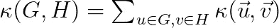
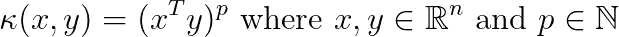
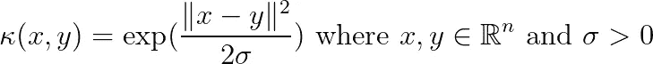
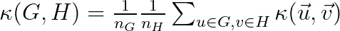
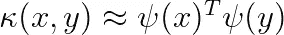
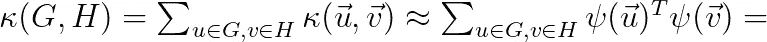
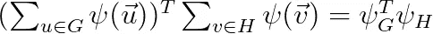
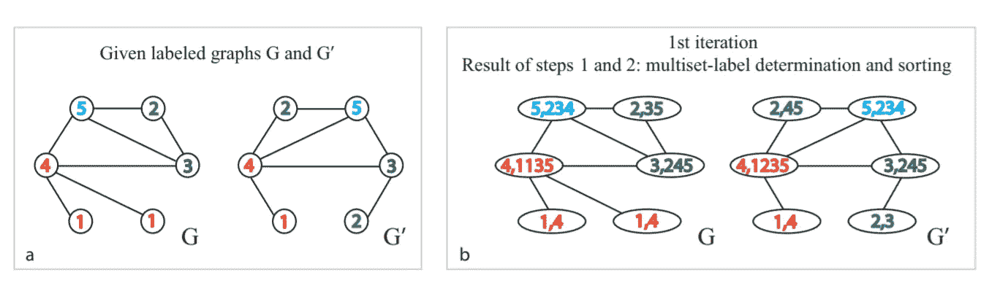

# 图上的机器学习，第 3 部分

> 原文：<https://towardsdatascience.com/machine-learning-on-graphs-part-3-b968e1cc1aa3?source=collection_archive---------31----------------------->

艾莉娜·格鲁布尼亚克在 [Unsplash](https://unsplash.com/s/photos/network?utm_source=unsplash&utm_medium=referral&utm_content=creditCopyText) 上的照片

## 图核方法易于实现，并产生可以有效训练的模型

在本系列的第三篇文章中，我将讨论图形内核。图核是一种将支持向量机等核机器一般化以处理图的方法。简而言之，图核的思想是通过将两个图作为输入的函数来比较这两个图。直观地说，这个函数应该测量不同相似性概念的图形之间的相似性。

图核是从图数据进行机器学习的第一个主要方法。在深度学习和图形神经网络兴起之后，它们不再流行，但仍然是一个强大的工具。在这篇文章中，我将专注于图核方法，这些方法易于实现并产生可以有效训练的模型。正如在系列的前一篇文章[中所讨论的，主要目标是在进入图形神经网络之前，提出在图形上进行机器学习的简单算法。](/machine-learning-on-graphs-part-2-205c46b3ef60)

## 一般设置

图核的前提是我们有一组图作为输入，我们想要训练一个分类或回归算法。注意，这些图可以是大型图的子图，例如大型社交网络图中的不同社区。大约 20 年前，在深度学习占据主导地位之前，研究人员提出了为图分类问题训练支持向量机的想法。为了做到这一点，需要设计一个特定于图的核函数来比较两个图。然后，我们可以使用标准的 SVM 算法，该算法使用核技巧来创建由训练集中所有图形对的核函数组成的 Gram 矩阵。然后，我们学习支持向量，或在我们的情况下，支持图，允许我们通过简单地评估以新图和所有支持图作为输入的核函数来分类新图。

接下来，我将介绍一个通用的图核家族。

## 卷积图核

让我们暂时假设我们已经在每个节点收集了一个矢量。例如，这可以是一个节点嵌入向量，就像上一篇文章中讨论的那样。稍微简化一下，两个图 G 和 H 的卷积图核被定义为

在上面，κ 是两个向量之间的(非线性)核函数。例如，多项式核:

或者 RBF 内核:

关于内核函数的更多细节，我建议读者参考我的关于非线性内核函数的博客文章。

请注意，有一个*规范化的*版本的内核定义:

让我们分析卷积图核的定义。

1.  我们比较所有的节点对，因为一个图是无序的，所以我们需要比较两组。核心被称为卷积，因为来自一个图的每个节点向量与来自另一个图的每个向量进行比较。(就像在卷积神经网络中，我们将每个滤波器与输入图像中的所有补片进行比较。)
2.  我们使用(非线性)核函数来比较两个向量，以便捕捉节点之间更复杂的相关性。核函数的选择可以赋予相似性不同的含义。例如，RBF 核的正确参数可以迫使我们只考虑向量几乎彼此相同的向量对。

上述的明显缺点是二次计算复杂度。对于两个图，每个在 *n* 个节点上，我们需要计算 n 次核函数。此外，对于训练数据集中的 m 个图的集合，我们需要一个由 m 对核函数组成的 Gram 矩阵。接下来，我将介绍一种非常有效的近似计算图核的方法。

## 显式图形特征映射

正如在[我的关于非线性核的显式特征映射的帖子](/explicit-feature-maps-for-non-linear-kernel-functions-171a9043da38)中所讨论的，我们可以将非线性核函数近似为

在上面的例子中，ψ是一个函数，它将向量映射到一个合理的、用户定义的维度的新特征空间。维度越大，近似性越好。

显式特征映射的主要结果允许我们如下重写图形核表达式。下面是对[3]的主要结果的简化:

以上表明，我们可以从单个节点的嵌入中获得整个图的特征表示。两个图特征向量的内积逼近两个图的核函数。

观察到，对于图核的归一化版本和节点向量的线性核，即，κ(u，v) = u^T v，以上对应于取图中所有节点嵌入的平均向量。

## 履行

有一个[大型图形基准数据集集合用于图形内核评估](https://ls11-www.cs.tu-dortmund.de/staff/morris/graphkerneldatasets)。在这篇文章的 [Jupyter 笔记本中，我展示了读取输入图并将其转换成我们可以用来训练节点嵌入的表示的代码。注意，这些图是不相交的，因此像 node2vec 这样的标准方法是行不通的。相反，我实现了上一篇关于节点嵌入的文章的第二部分中概述的方法的变体。我们假设节点被标记。如果没有提供标签，我们可以创建自己的标签来描述节点度。我从每个图中的每个节点开始，进行了多次短距离随机行走。对于每次行走，我都记录下行走过程中遇到的节点的标签。然后，我将具有相同步移的节点分组在一起，即具有相同标签序列的步移。从这些组中，我对具有负采样的 word2vec 类节点嵌入算法的正对进行采样。读者可以参考](https://github.com/konstantinkutzkov/ML_on_graphs/blob/main/graph_kernels.ipynb) [Jupyter norebook](https://github.com/konstantinkutzkov/ML_on_graphs/blob/main/graph_kernels.ipynb) 了解更多细节。

## 其他图形内核

使用节点嵌入作为节点向量是一个自然的选择，因为节点嵌入捕获了图的结构。然而，我想简单提一下一些最广泛使用的计算图核的方法。然而，请注意，这些方法是在节点嵌入算法出现之前设计的。对于图核算法的全面概述，我建议读者参考[2]。

## k 步核

从每个节点，我们开始一些长度正好为 *k* 的随机行走。节点处的向量就是所有遍历中标签的分布。(注意，对于未标记的图，通常使用节点度作为标记。)

## 最短路径核

对于每个节点，记录到图中每个其他节点的最短路径。然后，类似于 k-walk 核，创建描述收集的路径中的标签分布的向量。

## 魏斯费勒-雷曼核

对于图中的每个节点，收集其邻居的标签并进行排序。然后从结果字符串创建一个新标签。迭代 t 次并为每个节点创建 t+1 个标签。向量由这些标签的 id 组成。

魏斯费勒-雷曼重新标记算法。来源:[1]

## 密码

实现可以在[本 Jupyter 笔记本](https://github.com/konstantinkutzkov/ML_on_graphs/blob/main/graph_kernels.ipynb)中找到。

[1] Nino Shervashidze，Pascal Schweitzer，Erik Jan van Leeuwen，Kurt Mehlhorn，karst en m . Borgwardt:Weisfeiler-Lehman Graph Kernels。j .马赫。学习。第 12:2539-2561 号决议(2011 年):[https://www . jmlr . org/papers/volume 12/shervashidze 11 a/shervashidze 11 a . pdf](https://www.jmlr.org/papers/volume12/shervashidze11a/shervashidze11a.pdf)

[2] Karsten Borgwardt，Elisabetta Ghisu，feli PE llina RES-Lopez，Leslie O'Bray，Bastian Rieck。图形内核。最新技术和未来挑战。https://arxiv.org/pdf/2011.03854.pdf

[3] Moez Draief，Konstantin Kutzkov，Kevin Scaman，米兰·:
:孔:有序邻域图的核。[neur IPS 2018](https://dblp.org/db/conf/nips/nips2018.html#DraiefKSV18):4055–4064[https://arxiv.org/pdf/1805.10014.pdf](https://arxiv.org/pdf/1805.10014.pdf)