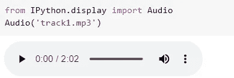
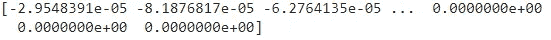
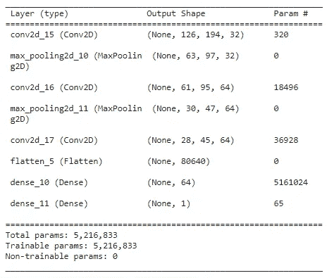
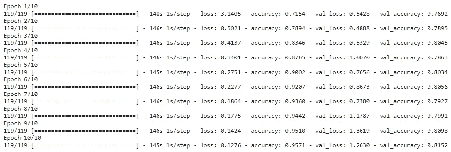
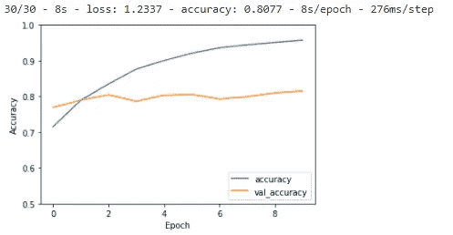

# 声音和音频数据的机器学习

> 原文：<https://towardsdatascience.com/machine-learning-on-sound-and-audio-data-3ae03bcf5095?source=collection_archive---------1----------------------->

## 使用流派分类用例学习如何将机器学习应用于声音和音频数据

声音的机器学习。由 [Unsplash](https://unsplash.com/?utm_source=unsplash&utm_medium=referral&utm_content=creditCopyText) 上的 [ConvertKit](https://unsplash.com/@convertkit?utm_source=unsplash&utm_medium=referral&utm_content=creditCopyText) 拍摄。

在本文中，您将学习对声音数据进行机器学习的基础知识。声音数据(通常称为音频数据)是一种不太直观的数据类型。看完这篇文章，你会明白:

*   如何将声音文件(mp3 或其他)转换成数字数据
*   如何训练用于体裁分类的卷积神经网络
*   深入音频领域所需的所有基础知识。

# 声音数据

从声音数据开始的最大困难是，与表格数据或图像不同，声音数据不容易用表格格式表示。

您可能知道，也可能不知道，图像可以很容易地表示为矩阵，因为它们是基于像素的。每个像素都有一个值，表示黑色和白色的强度(或者对于彩色图像，分别表示红色、绿色和蓝色的强度)。

另一方面， ***声音是一种复杂得多的数据格式:***

*   声音是不同强度的波频率的混合。在进行任何机器学习之前，有必要转换成某种表格或类似矩阵的数据集。
*   其次，声音有一个**时间因子**。它实际上更像是视频数据，而不是图像，因为你有一定持续时间的声音片段，而不是仅仅在一个时间点的捕捉。

[***如果你想更深入的了解什么是声音，可以看看这篇文章。***](/what-is-sound-691988d780bb)

# 用于流派分类的示例声音数据集

在深入之前，我们先介绍一个示例数据集。因为我们是在处理歌曲，所以很难获得一个我们可以确定没有侵犯版权问题的数据集。因此，为了这篇文章，我决定自己创建一个小型数据库，只使用来自一个名为 [Uppbeat](http://uppbeat.io) 的无版权音乐网站的节拍:

*   Uppbeat 流派“傻劲”的 100 首曲目
*   Uppbeat 流派“戏剧”的 100 首曲目

我不想重新分发这些歌曲，但如果你想继续下去，你可以很容易地创建一个免费帐户，并从这两个类别下载一些歌曲。

## 如何组织数据和环境以处理声音

为了跟随您自己的环境，我建议您创建一个名为 tracks 的文件夹，在其中创建两个文件夹:

*   戏剧性:包含所有的歌曲与流派戏剧性
*   愚蠢能量:包含所有类型的愚蠢能量的歌曲

对于本教程，我建议使用 Jupyter 笔记本，因为有一些很好的功能可以直接从笔记本上播放声音。如果你想避免环境或软件包安装问题，你可能想使用 [Google Colab:一个伟大的、免费的、在线的笔记本环境](/importing-data-to-google-colab-the-clean-way-5ceef9e9e3c8)。

# 用 Python 进行流派分类

在描述的数据集中，你有两种类型的音轨:“愚蠢的能量”和“戏剧性的”。这篇文章的目标是给你建立一个体裁分类模型的基本步骤。

这两种类型的声音应该非常不同，因此训练一个可以将这两种类型区分开来的机器学习模型应该相对容易。

## 基于内容与基于频谱图的方法

在本教程中，我们将做一个“真实的”**基于声音的机器学习模型**。:我们将**为我们的机器学习模型**使用声音的数字转录。

然而，我想补充的是，使用声音的元数据而不是实际声音来构建**流派分类模型也是可能的。在这种情况下，您可以使用以下功能:**

*   作者
*   出版者
*   歌词
*   等等等等

虽然这也是一个很好的方法，但是它不在当前模型的范围内。

# 为机器学习准备声音数据

现在让我们开始使用 Python，深入实用的一面。到目前为止，您的环境中应该已经有了这些磁道。让我们现在开始为机器学习做准备。这是棘手的部分。

由于声音或音乐是我们听到的东西，很难想象如何将其数字化。然而，数字音乐无处不在，这个问题已经得到很好的解决。如果你想了解更多这方面的背景信息，你可以看看这篇关于傅立叶变换的文章或者这篇关于音乐如何转换成数字的文章。

在本文中，我们将使用 [librosa 库](https://librosa.org/doc/main/index.html):一个在 Python 中处理声音和音乐的伟大库。

## 使用 Jupyter 笔记本载入并播放歌曲

您可以使用以下代码导入一首示例歌曲并试听:

声音的机器学习。使用 Jupyter 在 Python 中导入 MP3。

声音的机器学习。使用 Jupyter 在 Python 中播放 MP3。图片作者。

通过用 librosa 导入它，您还可以看到它在数字上的样子，如下所示:

声音的机器学习。用 Python 创建一首 MP3 歌曲的数字表示。

您将获得一个表示音乐的 NumPy 数组，如下所示:

声音的机器学习。Python 中 MP3 歌曲的数字表示。图片作者。

## 把歌曲切成等长的片段

为了给机器学习准备声音数据，我们刚刚使用 librosa load 函数生成了表示音乐的数字数组。现在已经完成了，把声音分成同样长的片段就相对容易了。

对于这个项目，我们创建宽度为 100000 的数组，因为这在歌曲中创建了大量的分割(它将歌曲分割成大约 20 到 30 个片段)。

在现实生活的用例中，文件分割和重用是您需要根据您的用例以及您使用的数据和模型做出的选择。例如，如果你需要在短音段上预测，你应该在短音段上训练。此外，如果你有更多的数据，你可能需要每首歌更少的片段:有许多相似的片段不一定是机器学习的最佳选择。

## 用 CNN 创建用于体裁分类的 melspectrograms

声音准备的第二步是转换成 melspectrograms。虽然这不是声音准备的唯一方法，但这种方法是常用的，也是一个很好的起点。

使用[傅立叶变换](/fourier-transform-for-time-series-292eb887b101)创建光谱图。简而言之，傅立叶变换分离出声音中存在的不同声音频率，并在每频率强度矩阵中恢复它们，我们称之为声谱图。你也可以在这篇文章中读到更多关于声音的[傅立叶变换](/what-is-sound-691988d780bb)。

以下代码同时执行上述两个步骤:

为流派分类创建 melspectrograms。

# 用于声音数据机器学习的 CNN

刚刚描述的声谱图方法将每首歌曲(或歌曲片段)转换成声谱图:一个二维矩阵。要对二维输入数据进行机器学习，最好的方法是使用 CNN，即卷积神经网络。

CNN 在图像数据上的表现是众所周知的。你可以认为频谱图是一种图像，因此 CNN 是声音数据的最先进的机器学习模型。

让我们继续讨论一个简单的 CNN 定义，看看如何将准备好的声音数据放入 CNN 神经网络。

## 为 Keras 生成声音数据

要创建适合 keras 输入的数据格式，我们可以使用下面的代码。请注意，这只有在您按照上述方式创建了文件结构的情况下才有效:

您需要一个名为“曲目”的文件夹，其中包含:

*   一个名为“戏剧”的文件夹，里面有一些戏剧歌曲(如来自 Uppbeat)
*   一个名为“愚蠢能量”的文件夹，里面有一些愚蠢的能量歌曲

如果您有其他歌曲和其他流派，您可以根据您的具体情况轻松调整代码。

为 Keras CNN 准备类型分类数据。

## 培训/验证/测试分割

我们可以使用以下代码创建一个训练/验证/测试分割，这在[标准机器学习管道](/beginner-guide-to-build-compare-and-evaluate-machine-learning-models-in-under-10-minutes-19a6781830de)中很常见:

声音的机器学习。使用 Keras 进行流派分类的训练测试分割。

我们将使用训练数据来训练模型，同时也通过验证。测试集将保持独立，直到最后对我们的模型进行最终评估。

# 使用 Keras 建立一个类型分类 CNN

我们在这里只使用一个非常基本和标准的 CNN。本文的目标不是在调整神经网络上花费太多时间，而是给出对声音数据的机器学习管道的全面理解。请随意构建一个更好的模型！

## 流派分类 CNN 模型架构

下面使用的模型使用非常标准的 CNN 架构，中间有三个卷积层和两个 MaxPooling 层。

这种架构实际上只是一个起点，在现实生活的用例中还需要更多的调整。对于示例管道，它至少将向您展示如何在声音数据上安装 CNN，这是本文的目标。

声音的机器学习。CNN 使用 Keras 进行流派分类。

你可以看到下面的模型总结。如果您没有遵循确切的示例，请注意这个模型架构将适用于二进制分类。如果你想使用两个以上的流派，你将需要在你的最后一个稠密层输出形状(前面代码的第 15 行)。

美国有线电视新闻网的流派分类。图片作者。

## 适合 Keras CNN 的类型分类

既然已经定义了模型架构，我们需要编译它，并选择损失函数、优化器和指标。在本例中，我们使用二元分类(两种可能的结果)，因此我们选择“二元交叉熵”。作为优化器，让我们使用 RMSprop，并选择 set“accuracy”作为度量。

然后，我们使用 X_train(训练歌曲)和 y_train(训练标签)来拟合模型。我们将验证数据设置为 X_val 和 y_val。

声音的机器学习。使用 Keras 拟合 CNN 的类型分类。

我们对该模型进行 10 个时期的训练，并获得以下结果:

声音的机器学习。CNN 用于类型分类的 Epocs。图片作者。

## 显示模型历史

检查训练历史的一个更好的方法是制作一个非常普通的图表，显示各个时期的训练准确性和验证准确性。为此，您可以使用以下代码:

声音的机器学习。创造历史情节。

对于当前的 CNN，我们得到下面的图表。它表明训练精度在上升:模型在学习一些东西。然而，验证精度并没有提高多少，这表明该模型需要一些调整才能变得有用。

声音的机器学习。准确性图表。作者配图。

# 结论和改进模型的下一步措施

在本文中，您看到了用 Python 处理声音数据的简单易懂的管道。您已经学习了如何将 mp3 文件中的数据准备到 NumPy 数组中。您还看到了如何开始与 CNN 合作，基于这些数据构建一个流派分类模型。

我希望这篇文章已经让你很好地理解了体裁分类管道的不同元素，并且给你在这个领域更进一步的基础知识。

如果你想在这个模型上更进一步，让我给你一些建议。您可以处理数据(更多的歌曲、更多的流派、查看每首歌曲的片段数量和片段长度)，也可以处理模型(尝试其他架构、其他超参数等)。

现在，我想感谢你的阅读。不要犹豫，继续关注更多的统计、数学、ML 和数据科学内容！