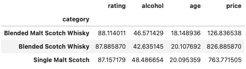
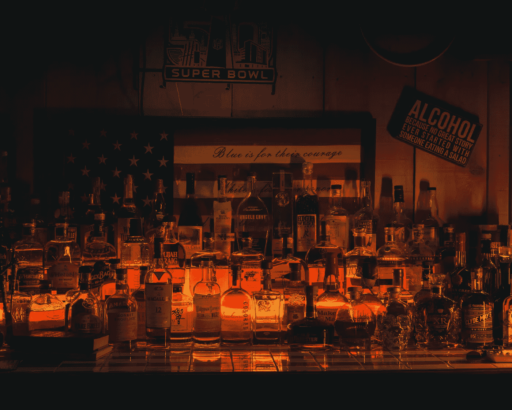

# 机器学习“触礁”🥃

> 原文：<https://towardsdatascience.com/machine-learning-on-the-rocks-f49f75219c02?source=collection_archive---------13----------------------->

## [实践教程](https://towardsdatascience.com/tagged/hands-on-tutorials)

## 威士忌数据集~ K 均值聚类、逻辑回归和 EDA

*“永远带一壶威士忌以防被蛇咬，此外，永远带一条小蛇。”|厕所区域*


照片由 [PublicDomainPictures](https://pixabay.com/users/publicdomainpictures-14/?utm_source=link-attribution&utm_medium=referral&utm_campaign=image&utm_content=315178) 在 [PixaBay](https://pixabay.com/photos/whiskey-bar-alcohol-glass-scotch-315178/) 上拍摄

显然，这个项目的领域依赖于世界上最受欢迎的酒——威士忌。一种来自各种谷物的黑暗之神，在世界各地蒸馏，并形成了相当多的风格(爱尔兰、苏格兰、波旁等)[1]。苏格兰、爱尔兰、加拿大&日本是著名的出口国，在国际范围内，全球产量几乎达到 9500 万美元的收入水平[2]。

这里的主要范围是以一种…“友好”的方式介绍,**聚类算法**在任何我们需要在(大)数据集中发现模式的时候是多么有用。实际上，它可能被认为是标准探索性数据分析(EDA)的强大扩展，在使用监督机器学习(ML)模型之前，尝试这种分析通常非常有益。最后还实现了后者的预测情况(**逻辑回归**)。

## 概念

在成功调谐了一个音乐播放列表“the-Python-way”后，我工作的数据公司接受了一个新项目:协助一家知名威士忌供应商实现多样化。也就是说，要弄清楚哪些威士忌品种卖得更好，并记住这一点，进行适当的合并/收购，以促进销售。然而，主要的障碍是供应商没有任何来自竞争对手的销售数据(也就是潜在的收购目标)。但是:

*如何使用威士忌相关数据，包括任何属性(如年份、口味、类型、价格等)，以一种对供应商有意义的方式对其进行分类，并最终指导他们应该购买哪些特定的葡萄酒？*

为了更好地交流结果，提出了一些假设:

#1:为了给我们的分析定义一组足够的数据，我使用了来自 [Kaggle](https://www.kaggle.com/koki25ando/22000-scotch-whisky-reviews) 的一个相关数据集——一个几乎任何种类数据的显著来源。

#2:我使用的酒类属性是:威士忌的`name`、`category`、`rating`、&、`description`，同时开发了几个新的属性(见第 2 节)。

#3:代替任何与销售相关的数据，完成我们任务的唯一方法是发现潜在的“潜在”模式，这些模式可能导致供应商巧妙地增加销售量。Id est，保存可销售的品种，而不仅仅是出售最贵或最高等级的瓶子。

## 作案手法

1.  设置**环境**来运行代码。
2.  使用 Numpy，Pandas &执行 **EDA** 一些额外的 Python 库。
3.  通过使 K-Means 聚类算法适合数据集，揭示额外的数据模式。
4.  使用现在已标记的数据集(clusters = labels)，实施多分类技术— **逻辑回归** —对新的列表(威士忌)进行预测。

# 1.建立

在这一节中，我们将设置所需的环境，以便应用分析技术。

*   安装 [Jupyter](https://jupyter.org/index.html) 笔记本——一个开源网络应用程序，用于创建/共享包含实时代码、方程式、可视化和叙述性文本的文档。你可以在这里按照步骤[进行](https://jupyter.org/install.html)。
*   安装[Requests](https://2.python-requests.org/en/master/)/[beautiful soup](https://www.crummy.com/software/BeautifulSoup/bs4/doc/)——一个 Python 模块，分别用于处理 API 和从 HTML 和 XML 文件中提取数据。您可以使用 CLI(命令行界面)或 Jupyter 笔记本来运行以下命令:

install.py

*   导入必要的库:

import.py

# 2.数据清理

第一部分包括将数据读入 DataFrame 对象`df_init`。


“df_init”数据集的预览

接下来，我们采取一系列必要的措施，为进一步的分析做好准备。最重要的是，我们:

*   检查空值(无空值)/删除冗余列(`Unnamed:`和`currency`)。
*   将`price`转换为浮点型。
*   检查与`name`列相关的重复项，并用平均值[ `category`、`rating`、`price` ]替换这些列表。
*   通过使用特定的正则表达式，从`name`列中提取新的特性`age`和`alcohol`。

data_cleaning.py


“df”数据集的预览

# 3.电子设计自动化(Electronic Design Automation)

*为了减少杂乱，我在这里不包括数据可视化代码，但是在 GitHub* [*资源库*](https://github.com/makispl/Machine-Learning-Whiskey-Dataset) *上有。*

## 一.明显的洞察力📕

首先，我们检查数据集以确认任何明显的推论。变量(`description`除外)是定量的，同时也属于测量的比率尺度。因此，盒须图可以有效地描述每个特征的个体分布，并与描述性统计表(通过`pandas.DataFrame.describe`方法)一起，可以为我们提供一个很好的视觉直觉，即落入每个特定四分位数的值的比例(`*price*` *具有很大的值范围，因此单独绘制*)。


“df”描述性统计和箱线图

*   `rating`变量从 70%开始(相当倾斜，因此没有坏威士忌，如前所述！)而平均评论在 87%左右。
*   正如所料(对于威士忌而言)，T7 和 T8 分别从 3 年和 40%开始，前者的平均值为 20 年。
*   考虑到`price`特征，苏格兰威士忌的平均价格(黄色▲)为 700 美元，而中位数(红线)为 108 美元。这清楚地表明分布是右偏的。然而，突出显示的是从 10 到 157.000 美元的范围！

按照假设#3(见上文)，没有销售数据可用，不可避免地，我们必须操纵现有的功能。我们建立了以下“机制”:

供应商对提高利润率感兴趣，因此拉开了`[price` - `cost]`的差距。除了右偏之外，`price`本身不能作为供应商的决策因素，因为销售额外昂贵的瓶子也意味着额外的采购成本。

> 发现 1:我们不应该将`price`作为一个决策因素。最终，我们必须捕捉特征之间的任何相互关系，这可能揭示是哪种力量推动销售(和利润)上升。

## 二。深刻的见解📙

通过“成对地”检查变量，我们可以捕捉它们之间有用的关系。散点图矩阵能够显示变量组合之间的二元关系。


df 散布矩阵


皮尔逊相关系数表

用皮尔逊相关系数解释矩阵，我们得到的最深刻的发现如下:

*   最令人兴奋的发现是，好的`rating`不一定伴随着高的 a `price` (cor = 0.12)。换句话说，花更少的钱享受高质量的苏格兰威士忌是很有潜力的——很划算。
*   在`age`和`rating` (cor = 0，32)之间也有很好的关系。
*   最高的相关性(cor = 0，33)出现在`price`和`age`之间；超贵的瓶子属于陈年酒。但是，很明显，如果供应商选择收购一家生产超成熟威士忌的公司，他们可能会出售极其昂贵的酒类，从而影响其品种分布:

成熟 _ 威士忌 _ 价格. py

```
186    60000.0
739    60000.0
182    60000.0
82     30000.0
699    27620.0
29     26650.0
102    25899.0
397    25899.0
103    25899.0
816    25899.0
Name: price, dtype: float64
```

所以，除了排除`price` ( *发现#1* )我们还应该排除`age`和`*alcohol*`。

> 发现#2:因此，我们应该专注于`rating`功能，这预计会对供应商的利润产生巨大影响(更受欢迎的威士忌意味着更高的销售额)。

## 三。更深刻的见解📒

寻找一种可以启发供应商主要推销什么瓶子的模式(为了获得更高的利润)，我们将通过`category`属性分析“卡瓦”，同时也“启发”了`rating`特征。

groupby_category.py



按“类别”分组的平均特征


按“类别”分组的“评级”方框图

混合麦芽在`rating`中领先，简单混合紧随其后，前者的平均值高出 0.23%(88，11–87，88)。值得注意的是，混合麦芽的中位数远远高于第二个四分位数(平均值)，因此超过 50%的瓶子被评为高于平均值(88%)。这是一个不错的见解，我们可以为供应商提供…

> 发现#3:供应商可能会选择提高混合麦芽的销量。这样，由于这种威士忌的流行，他们可能会实现更大的销售，从而享受更高的利润。

⚠️:但是，我们仍然违反了条件 3(保持威士忌的多样性)——这个问题我们还没有很好地解决。因此，我们不再推荐混合(且只有混合)的瓶子，而是努力向顾客保证多样性，转而采用一种新的、更全面的聚类方式。

# 4.k 均值聚类

在无监督学习中，我们在数据中寻找模式，而不是在有监督的 ML 中进行预测。在这种情况下，当可能存在多个(不可见的)组时，聚类算法能够将相似的行分组在一起。这些组形成了我们可以看到的*簇*，并开始更好地理解数据的结构。 [**K-Means 聚类**](https://en.wikipedia.org/wiki/K-means_clustering) 是一种流行的基于质心的聚类算法。

k 指的是我们想要对数据进行分段的聚类数，必须提前声明。在可用的估算方法中，我们将使用 [*肘方法*](https://en.wikipedia.org/wiki/Elbow_method_(clustering)) ，根据该方法:

1.  我们对不同的 k(这里从 1 到 10)运行该算法。
2.  对于每次迭代，我们计算组内平方和(WCSS ),并将其存储在各自的列表中。
3.  我们绘制了 WCSS~#团簇的 k 关系。
4.  我们定位“肘部”——线下降更平滑后的闭合区域(名为 [kneed](https://pypi.org/project/kneed/) 的源代码 Python 库对此很有用)。

locate _ 肘部. py

在切换到由 1.355 份威士忌组成的无空值(`df_no_nulls`)的新数据框架后，我们绘制了 WCCS 线。


类内平方和(WCSS)~类图

最佳的聚类数目是 3，我们准备实现 K-Means 聚类。

kmeans.py

该模型展示了以下聚类和{瓶数}，分别为:**聚类 0** {# 353}、**聚类 1** {# 363} & **聚类 2** {# 639}。检查相关的箱线图以及第 3 节的那些图，我们推导出以下…


按“聚类”分组的“评级”箱线图


(第 3 节)`评级'箱线图按`类别'分组

## 四。顶级见解📗

> ✔️聚类揭示了一个更清晰的迹象，即哪种威士忌能促进`rating`(以及销售)。与先前分析的类别相比，查看新的分类如何区分自己。
> 
> 就`rating`而言，✔️1 号集群要好得多。不仅平均值领先于其余的，而且它的中值位于最右边，这意味着至少有一半的集群的瓶子超过了这个显著的值(89.33%)。
> 
> ✔️与此同时，第一类包括单一麦芽苏格兰威士忌、混合苏格兰威士忌和混合麦芽苏格兰威士忌，因此保证了多样性！
> 
> ✔️迄今为止，该分析考虑了比先前尝试的(`*rating*`)更多的特征(`rating`、`alcohol`、`age`)，证明了聚类促进了来自更多分量的信号的数据的更全面分离的观点。

把它们都放到同一个空间，我们就可以看到一个 3D 散点图。实际上，我们勉强能够做到这一点，因为对于 3 个以上的变量，必须先进行降维处理(如 PCA 等)。


“聚类”三维散点图

非常突出的是，簇#1(红色)“占据”y 轴的较高区域(`rating`)。此外，如果我们将数据标准化，我们可以绘制雷达图。通过说明红色多边形如何更好地“关注”几乎所有的特征，这可以进一步帮助解释结果。


按“集群”分组的特征雷达图

# 5.逻辑回归

受监督的 ML 拿起火炬，现在我们的数据集被标记为(聚类)。我们的目标是训练一个模型，给定一个新列表(威士忌)的 3 个特征[`rating`、`alcohol`、`age`，它将**预测**它的标签(又名聚类)。这样，供应商将能够直接对其进行分类，并推断其是否有商业化的“潜力”!

像这样的多分类问题，在首先应用一些调整之后，可以用一个**逻辑回归**模型来解决。特别是，我们将实现*一对一对所有*方法，其中我们选择一个类别(即集群#1)作为正面案例，并将其余的作为错误案例分组，迭代。每个产品模型都是一个二元分类模型，将返回一个概率[0-1]。当应用新数据时，我们选择与预测最高概率的模型相对应的标签。

logistic _ 回归. py

准确率达到了 98.9%，这意味着 100 个新酒类条目中几乎有 98 个可以成功归类到我们开发的 3 个聚类之一。

# 结论

最终，我们到达了目的地；从外观到对威士忌“类型”的全面洞察，都有助于培养供应商的创业精神。

从 Kaggle 的数据集开始，我们逐渐从简单的 EDA 发展到无监督的 ML 模型(K-Means)。这样，我们揭示了有见地的模式，这有助于我们更好地识别真正需要什么来提高威士忌的销量。最后，我们在标记的数据集上拟合了一个逻辑回归模型，以高精度预测了一个新瓶子可能注册到的簇。



尼克·里克顿在 Unsplash[上的照片](https://unsplash.com/?utm_source=unsplash&utm_medium=referral&utm_content=creditCopyText)

我把这篇文章献给我的好朋友科斯塔斯和帕诺斯；在疫情之前，我们过去常常在周五品尝新的麦芽酒……实际上，在数量“领域”之外，不是`price`而是让威士忌更美味的好公司……所以，为我们的下一次“回顾会议”干杯！

感谢您的阅读。[回购](https://github.com/makispl/Machine-Learning-Whiskey-Dataset)是*调味*并准备运行🥃！

**参考文献**

[1][https://www.thespruceeats.com/history-of-whisky-1807685](https://www.thespruceeats.com/history-of-whisky-1807685)

[2][https://www . statista . com/outlook/10020100/100/whiskey/world wide # market-global revenue](https://www.statista.com/outlook/10020100/100/whisky/worldwide#market-globalRevenue)

[3][https://machine learning mastery . com/logistic-regression-for-machine-learning/](https://machinelearningmastery.com/logistic-regression-for-machine-learning/)