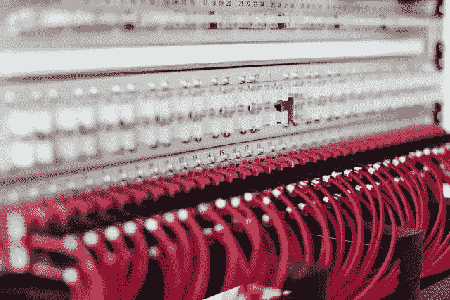
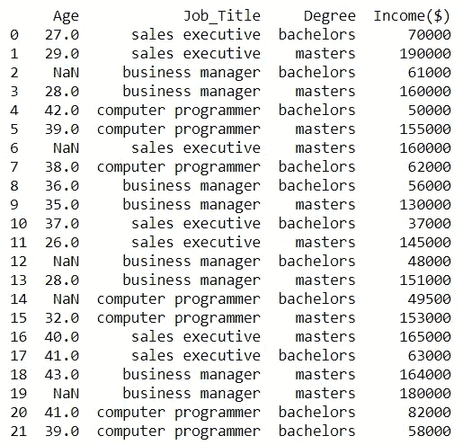
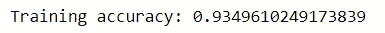

# 机器学习管道

> 原文：<https://towardsdatascience.com/machine-learning-pipelines-4cab73603ea2?source=collection_archive---------19----------------------->

拉斯·金勒在 [Unsplash](https://unsplash.com/s/photos/data-pipeline?utm_source=unsplash&utm_medium=referral&utm_content=creditCopyText) r

## 使用 SkLearn-Pandas 自动化机器学习工作流

机器学习工作流包括从原始数据构建机器学习模型所需的所有步骤。这些过程可以分为转换和培训阶段。

转换阶段包括将原始数据转换为特征(特征工程)所需的过程，而训练阶段封装了使用特征来构建机器学习模型的过程。

真实世界数据的混乱通常使特征工程成为机器学习中最具挑战性和最关键的步骤，尤其是在处理来自不同来源的海量数据流时。在这种情况下，特征工程过程可以包括将不同的原始数据映射到机器学习特征的多个重复且不同的步骤。处理此类任务的一种有效方式是使用特征管线。

特征管线是用于将多个、重复且不同的特征工程过程自动应用于原始数据的框架，顺序且连续。

当设计了特征管线时，它们可以与机器学习算法合并，以创建机器学习管线，其自动化机器学习工作流；从转换数据到构建评估器。

我们将使用一个简单的数据集作为介绍性示例，来实践如何利用管道来高效、轻松地使用原始数据来构建估算器。

我们将使用一个假想的“[收入](https://github.com/Chiebukar/dataset)”数据集，其中包含员工的年龄、职称、最高学历和年收入，以展示如何利用管道高效、轻松地转换原始数据来构建估值器。我们的目标是设计和执行一个机器学习管道，使用 SkLearn-Pandas 库实现数据转换和构建过程的自动化。

首先，让我们看一下数据集。

雇员年龄、职称和资格的样本数据。(图片由作者提供)。

很明显，在将数据输入算法进行训练之前，我们需要对这些数据进行一定的转换。下表描述了使用这些数据构建模型所需的过程。你可以查看我在[特性工程技术](/feature-engineering-techniques-bab6cb39ed7e)上的帖子，了解为什么选择这些特定的方法进行转换的更多细节。

显示要应用于数据的转换的表。(图片由作者通过 Sheetsu.com 提供)。

接下来，我们将定义一个机器学习管道，以自动将这些过程应用于数据。我们将使用 [SkLearn-Pandas 的](https://pypi.org/project/sklearn-pandas/1.5.0/) [DataFrameMapper](https://dunyaoguz.github.io/my-blog/dataframemapper.html) 和 SkLearn 的预处理方法来完成这项工作。

然后，定义的流水线可以用于使用特征和目标变量来训练算法。

我们已经成功地开发了一个管道来自动化机器学习工作流，这样它也可以用于转换其他具有类似结构的数据流。您还可以将管道传递给 RandomSearchCV 或 GridSearchCV 进行超参数调优。

## 摘要

机器学习管道对于自动化数据转换和构建评估器的迭代过程是有用的。管线提供了有效的方法来自动将特定的或不同的变换应用于特定的或大量的输入特征。Sklearn 和 SkLearn-Pandas 等 Python 库提供了定义和执行机器学习管道的便捷方法。