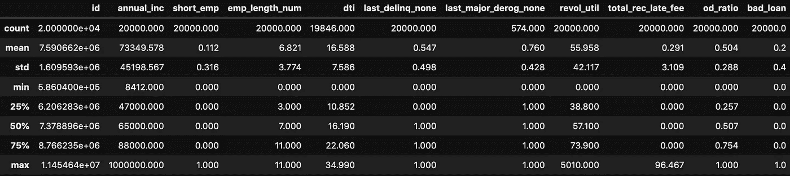
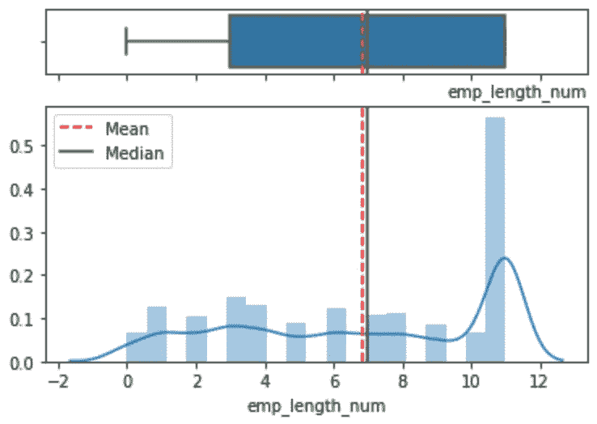
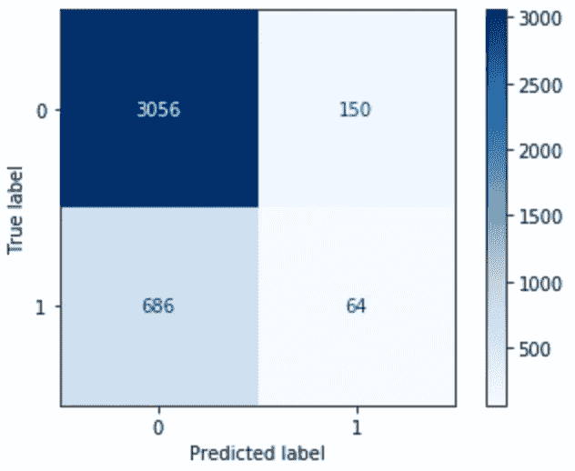

# 机器学习:预测银行贷款违约

> 原文：<https://towardsdatascience.com/machine-learning-predicting-bank-loan-defaults-d48bffb9aee2?source=collection_archive---------0----------------------->

## 一种数据科学方法，用于预测和了解申请人的情况，以最大限度地降低未来贷款违约的风险。


由 [Unsplash](https://unsplash.com?utm_source=medium&utm_medium=referral) 上的[absolute vision](https://unsplash.com/@freegraphictoday?utm_source=medium&utm_medium=referral)拍摄

# 关于项目

该数据集包含有关信贷申请人的信息。在全球范围内，银行使用这种数据集和信息数据类型来创建模型，以帮助决定接受/拒绝谁的贷款。

在所有探索性的数据分析、清理和处理我们可能(将)发现的所有异常之后，好/坏申请人的模式将暴露出来，供机器学习模型学习。

# 机器学习问题和目标

我们正在处理一个有监督的二进制分类问题。目标是训练最佳的机器学习模型，以最大限度地提高深入了解过去客户概况的预测能力，最大限度地降低未来贷款违约的风险。

# 绩效指标

鉴于我们正在处理一个高度不平衡的数据，用于模型评估的指标是 ROC AUC**T5。**

# 项目结构

该项目分为三类:

1.  探索性数据分析
2.  数据争论:清理和特征选择
3.  机器学习:预测建模

# 数据集

你可以在这里下载数据集[。](https://drive.google.com/file/d/1WFvu8dnVwZV5WuluHFS_eCMJv3qOaXr1/view?usp=sharing)

## 功能描述

*   **id** :贷款申请的唯一 id。
*   **等级** : LC 指定的贷款等级。
*   **annual_inc** :借款人在登记时提供的自报年收入。
*   **short_emp** : 1 年或 1 年以下雇佣。
*   **emp_length_num** :任职年限。可能的值介于 0 和 10 之间，其中 0 表示不到一年，10 表示十年或更长时间。
*   **房屋所有权**:房屋所有权的类型。
*   **dti(债务收入比)**:用借款人每月总债务支付额除以借款人自报月收入计算的比率，不包括抵押贷款和要求的信用证贷款。
*   **用途**:借款人针对贷款请求提供的类别。
*   **期限**:贷款的还款次数。值以月为单位，可以是 36 或 60。
*   **last _ deliq _ none**:1 借款人至少发生一次违约事件。
*   last_major_derog_none : 1 借款人至少有 90 天的不良评级。
*   **revol_util** :循环额度利用率，或借款人相对于所有可用循环信贷的信贷金额。
*   **total_rec_late_fee** :到目前为止收到的滞纳金。
*   **od_ratio** :透支比率。
*   **bad_loan** : 1 一笔贷款未支付时。


照片由 [Ashutosh Dave](https://unsplash.com/@ashu?utm_source=medium&utm_medium=referral) 在 [Unsplash](https://unsplash.com?utm_source=medium&utm_medium=referral) 上拍摄

**导入**所需的库和依赖项:

```
import pandas as pd
import numpy as np
import seaborn as sns
import pingouin as pgimport scipy
from scipy.stats import chi2
from scipy.stats import chi2_contingency
from scipy.stats import pearsonr, spearmanrfrom sklearn.preprocessing import StandardScaler
from sklearn.preprocessing import MinMaxScaler
from sklearn.model_selection import train_test_split
from sklearn.model_selection import GridSearchCV
from sklearn.ensemble import RandomForestClassifier
from sklearn.linear_model import LogisticRegression
from sklearn.neighbors import KNeighborsClassifier
from sklearn.svm import SVC
from sklearn import tree
from sklearn.tree import export_graphviz
from sklearn.externals.six import StringIO
from sklearn.linear_model import Perceptron
from sklearn.neural_network import MLPClassifier
from sklearn.metrics import  precision_recall_curve, roc_auc_score, confusion_matrix, accuracy_score, recall_score, precision_score, f1_score,auc, roc_curve, plot_confusion_matrix​from category_encoders import BinaryEncoder
from IPython.display import Image
import pydotplusimport matplotlib.pyplot as plt
%matplotlib inline
color = sns.color_palette()seed = 42
```

加载并显示数据集:
`>> data = pd.read_csv('lending_club_loan_dataset.csv', low_memory=False)`
`>> data.head()`


( **data.shape (20000，15)** )。图片作者。

# EDA:实验数据分析

主要**数值**属性统计:




(**数字属性**)。图片作者。

该数据集有 2000 个观察值和 15 个变量，包括目标，分为 11 个数字特征和 4 个类别特征。

有缺少值的变量:“home_ownership”为 7.46%，“dti”为 0.77%，“last_major_derog_none”为 97.13%。

根据平均值和中值之间的差异，以及变量“年度收入”、“革命效用”和“总收入延迟费用”的最大值的距离，似乎存在一些异常值。

主**类别**属性统计:
`>> data.describe(include=[np.object])`


(**分类属性**)。图片作者。

```
**# Checking data balance/proportion**loan = data.bad_loan.value_counts().to_frame().rename(columns={"bad_loan":"absolute"})loan["percent"] = (loan.apply(lambda x: x/x.sum()*100).round(2))display(loan)---**​# pie chart**data.bad_loan.value_counts().plot(kind='pie', subplots=True, autopct='%1.2f%%', explode= (0.05, 0.05), startangle=80, legend=True, fontsize=12, figsize=(14,6), textprops={'color':"black"})plt.legend(["0: paid loan","1: not paid loan"]);
```


(**饼状图**)。图片作者。

**不平衡数据:** target 有 80%的违约结果(值 1)，而有 20%的贷款以已支付/非违约(值 0)结束。

**类型**的变量:
`>> data.dtypes.sort_values(ascending=True)`

```
id                         int64
short_emp                  int64
emp_length_num             int64
last_delinq_none           int64
bad_loan                   int64
annual_inc               float64
dti                      float64
last_major_derog_none    float64
revol_util               float64
total_rec_late_fee       float64
od_ratio                 float64
grade                     object
home_ownership            object
purpose                   object
term                      object
dtype: object
```

Couting **变量按类型:**
`>> data.dtypes.value_counts()`

```
float64    6
int64      5
object     4
dtype: int64
```

检查**缺失值:**

```
nulval = data.isnull().sum().to_frame().rename(columns={0:"absolute"})nulval["percent"] = (nulval.apply(lambda x: x/x.sum())*100).round(2)nulval
```


(**缺失值**)。图片作者。

# EDA 功能

使用和滥用图形描述数据集中的所有要素。首先为每个图表定义一些函数:箱线图、直方图、条形图和饼图、散点图、数据透视图以及统计描述。

```
**# General statistics** def stats(x):
    print(f"Variable: {x}")
    print(f"Type of variable: {data[x].dtype}")
    print(f"Total observations: {data[x].shape[0]}")
    detect_null_val = data[x].isnull().values.any()
    if detect_null_val:
        print(f"Missing values: {data[x].isnull().sum()} ({(data[x].isnull().sum() / data[x].isnull().shape[0] *100).round(2)}%)")
    else:
        print(f"Missing values? {data[x].isnull().values.any()}")
    print(f"Unique values: {data[x].nunique()}")
    if data[x].dtype != "O":
        print(f"Min: {int(data[x].min())}")
        print(f"25%: {int(data[x].quantile(q=[.25]).iloc[-1])}")
        print(f"Median: {int(data[x].median())}")
        print(f"75%: {int(data[x].quantile(q=[.75]).iloc[-1])}")
        print(f"Max: {int(data[x].max())}")
        print(f"Mean: {data[x].mean()}")
        print(f"Std dev: {data[x].std()}")
        print(f"Variance: {data[x].var()}")
        print(f"Skewness: {scipy.stats.skew(data[x])}")
        print(f"Kurtosis: {scipy.stats.kurtosis(data[x])}")
        print("")

        **# Percentiles 1%, 5%, 95% and 99%**print("Percentiles 1%, 5%, 95%, 99%")
        display(data[x].quantile(q=[.01, .05, .95, .99]))
        print("")
    else:
        print(f"List of unique values: {data[x].unique()}")---**# Variable vs. target chart** def target(x):
    short_0 = data[data.bad_loan == 0].loc[:,x]
    short_1 = data[data.bad_loan == 1].loc[:,x]

    a = np.array(short_0)
    b = np.array(short_1)

    np.warnings.filterwarnings('ignore')

    plt.hist(a, bins=40, density=True, color="g", alpha = 0.6, label='Not-default', align="left")
    plt.hist(b, bins=40, density=True, color="r", alpha = 0.6, label='Default', align="right")plt.legend(loc='upper right')
    plt.title(x, fontsize=10, loc="right")
    plt.xlabel('Relative frequency')
    plt.ylabel('Absolute frequency')
    plt.show()---​**# Boxplot + Hist chart** def boxhist(x):
    variable = data[x]
    np.array(variable).mean()
    np.median(variable)f, (ax_box, ax_hist) = plt.subplots(2, sharex=True, gridspec_kw= {"height_ratios": (0.5, 2)})
    mean=np.array(variable).mean()
    median=np.median(variable)sns.boxplot(variable, ax=ax_box)
    ax_box.axvline(mean, color='r', linestyle='--')
    ax_box.axvline(median, color='g', linestyle='-')sns.distplot(variable, ax=ax_hist)
    ax_hist.axvline(mean, color='r', linestyle='--')
    ax_hist.axvline(median, color='g', linestyle='-')plt.title(x, fontsize=10, loc="right")
    plt.legend({'Mean':mean,'Median':median})
    ax_box.set(xlabel='')
    plt.show()---**# Histogram** def hist(x):
    plt.hist(data[x], bins=25)
    plt.title(x, fontsize=10, loc="right")
    plt.xlabel('Relative frequency')
    plt.ylabel('Absolute frequency')
    plt.show()---**# Pie chart** def pie(x):
    data[x].value_counts(dropna=False).plot(kind='pie', figsize=(6,5), fontsize=10, autopct='%1.1f%%', startangle=0, legend=True, textprops={'color':"white", 'weight':'bold'});**# Number of observations by class** obs = data[x].value_counts(dropna=False)
o = pd.DataFrame(obs)
o.rename(columns={x:"Freq abs"}, inplace=True)
o_pc = (data[x].value_counts(normalize=True) * 100).round(2)
obs_pc = pd.DataFrame(o_pc)
obs_pc.rename(columns={x:"percent %"}, inplace=True)
obs = pd.concat([o,obs_pc], axis=1)
display(obs)---​**# Variable vs. target chart** def target(x):
    short_0 = data[data.bad_loan == 0].loc[:,x]
    short_1 = data[data.bad_loan == 1].loc[:,x]

    a = np.array(short_0)
    b = np.array(short_1)

    np.warnings.filterwarnings('ignore')

    plt.hist(a, bins=40, density=True, color="g", alpha = 0.6, label='Not-default', align="left")
    plt.hist(b, bins=40, density=True, color="r", alpha = 0.6, label='Default', align="right")plt.legend(loc='upper right')
    plt.title(x, fontsize=10, loc="right")
    plt.xlabel('Relative frequency')
    plt.ylabel('Absolute frequency')
    plt.show()---​**# Boxplot + Hist chart** def boxhist(x):
    variable = data[x]
    np.array(variable).mean()
    np.median(variable)f, (ax_box, ax_hist) = plt.subplots(2, sharex=True, gridspec_kw= {"height_ratios": (0.5, 2)})
    mean=np.array(variable).mean()
    median=np.median(variable)sns.boxplot(variable, ax=ax_box)
    ax_box.axvline(mean, color='r', linestyle='--')
    ax_box.axvline(median, color='g', linestyle='-')sns.distplot(variable, ax=ax_hist)
    ax_hist.axvline(mean, color='r', linestyle='--')
    ax_hist.axvline(median, color='g', linestyle='-')plt.title(x, fontsize=10, loc="right")
    plt.legend({'Mean':mean,'Median':median})
    ax_box.set(xlabel='')
    plt.show()----**# Bar chart** def bar(x):
    ax = data[x].value_counts().plot(kind="bar", figsize=(6,5), fontsize=10, color=sns.color_palette("rocket"), table=False)
    for p in ax.patches:
        ax.annotate("%.2f" % p.get_height(), (p.get_x() + p.get_width() / 2., p.get_height()), ha='center', va='center', xytext=(0, 5), textcoords='offset points')plt.xlabel(x, fontsize=10)
    plt.xticks(rotation=0, horizontalalignment="center")
    plt.ylabel("Absolute values", fontsize=10)
    plt.title(x, fontsize=10, loc="right")

---

**# Barh chart** def barh(x):
    data[x].value_counts().plot(kind="barh", figsize=(6,5), fontsize=10, color=sns.color_palette("rocket"), table=False)
    plt.xlabel("Absolute values", fontsize=10)
    plt.xticks(rotation=0, horizontalalignment="center")
    plt.ylabel(x, fontsize=10)
    plt.title(x, fontsize=10, loc="right")---

**# Pivot_table_mean** def pivot_mean(a, b, c):
    type_pivot_mean = data.pivot_table(
        columns=a,
        index=b,
        values=c, aggfunc=np.mean)
    display(type_pivot_mean)**# Display pivot_table**
    type_pivot_mean.sort_values(by=[b], ascending=True).plot(kind="bar", title=(b), figsize=(6,4),fontsize = 12);**# Pivot_table_sum** def pivot_sum(a, b, c):
    type_pivot_sum = data.pivot_table(
        columns=a,
        index=b,
        values=c, aggfunc=np.sum)
    display(type_pivot_sum)# **Display pivot_table**
    type_pivot_sum.sort_values(by=[b], ascending=True).plot(kind="bar", title=(b), figsize=(6,4),fontsize = 12);---

**# Scatter plot**
def scatter(x, y):
    targets = data["bad_loan"].unique()for target in targets:
        a = data[data["bad_loan"] == target][x]
        b = data[data["bad_loan"] == target][y]plt.scatter(a, b, label=f"bad loan: {target}", marker="*")

    plt.xlabel(x, fontsize=10)
    plt.ylabel(y, fontsize=10)
    plt.title("abc", fontsize=10, loc="right")
    plt.legend()
    plt.show()
```

**数值分布的可视化:**

```
data.hist(figsize=(10,9), bins=12, ec="b", xlabelsize=8, ylabelsize=8, alpha=0.9, grid=False)plt.tight_layout()
plt.show()
```


(**数值分布)。**图片作者。

**类别分布的可视化:**

```
for col in data.select_dtypes(include=["object"]).columns:
    data[col].value_counts().plot(kind="bar", color=sns.color_palette("rocket"))

    plt.xlabel("Class", fontsize=10)
    plt.xticks(rotation=90, horizontalalignment="center")
    plt.ylabel("Count", fontsize=10)
    plt.title(col, fontsize=10, loc="right")
    plt.show()
```


(**)【分类分布】)**)。图片作者。

在“36 个月”这一课中，变量“term”似乎有一个打印错误。让我们通过降低大写字符来修复它。

```
>> data.term = data.term.str.lower()
>> data.term.value_counts()36 months    15001
 60 months     4999
Name: term, dtype: int64
```

# 功能:等级

LC 指定的贷款等级。

```
stats("grade")Variable: grade
Type of variable: object
Total observations: 20000
Missing values? False
Unique values: 7
List of unique values: ['A' 'D' 'E' 'B' 'G' 'C' 'F']---bar("grade")
```


(**栏**)。作者图片

```
pivot_sum("home_ownership","grade","id")
```


( **pivot_sum** )。作者图片


( **pivot_sum** )。作者图片

当等级级别降低时，房屋所有权的类型倾向于从抵押贷款转向租赁。在 B 级、C 级和 D 级上，我们把自己的礼仪类型视为最高等级。

```
target("grade")
```


(**目标**)。作者图片

最高的非违约贷款发生在高等级阶层之间。

## 功能:年度 _ 公司

借款人在登记时提供的自报年收入。

```
boxhist("annual_inc")
```


( **boxhist** )作者图片

```
stats("annual_inc")Variable: annual_inc
Type of variable: float64
Total observations: 20000
Missing values? False
Unique values: 2566
Min: 8412
25%: 47000
Median: 65000
75%: 88000
Max: 1000000
Mean: 73349.57835
Std dev: 45198.56725472537
Variance: 2042910481.8799326
Skewness: 5.275648123592321
Kurtosis: 66.72665803201564

Percentiles 1%, 5%, 95%, 99%0.01     20519.5
0.05     30000.0
0.95    145000.0
0.99    225000.0
Name: annual_inc, dtype: float64---target("annual_inc")
```


(**目标**)图片作者

直方图告诉我们，收益越高，违约趋势越高。

```
scatter("annual_inc","dti")
```


(**散开**)。作者图片

散点图显示了“年收入”和“债务收入比”之间微弱的负相关。

```
data.annual_inc.corr(dti)
>> -0.22853314935876534
```

**相关值为-0.23** ，表示随着年度 _inc 减少，实例 1(违约/未支付)的贷款增加。

## 功能:short_emp

1 当雇佣期为 1 年或更短时。

```
hist("short_emp")
```


( **hist** )图片作者

受雇一年或一年以下的客户(实例 1)占 11.25%，而 88.75%的客户受雇一年以上。

```
stats("short_emp")Variable: short_emp
Type of variable: int64
Total observations: 20000
Missing values? False
Unique values: 2
Min: 0
25%: 0
Median: 0
75%: 0
Max: 1
Mean: 0.1125
Std dev: 0.3159885163057429
Variance: 0.09984874243710473
Skewness: 2.4526820936006293
Kurtosis: 4.015649452269171

Percentiles 1%, 5%, 95%, 99%0.01    0.0
0.05    0.0
0.95    1.0
0.99    1.0
Name: short_emp, dtype: float64---target("short_emp")
```


(**目标**)图片作者

雇用时间少于 1 年的部门比其他部门更经常出现贷款违约。

## 特征:雇员长度数量

雇佣年限。可能的值介于 0 和 10 之间，其中 0 表示不到一年，10 表示十年或更长时间。

```
boxhist("emp_length_num")
```



( **boxhist** )。作者图片

```
stats("emp_length_num")Variable: emp_length_num
Type of variable: int64
Total observations: 20000
Missing values? False
Unique values: 12
Min: 0
25%: 3
Median: 7
75%: 11
Max: 11
Mean: 6.8214
Std dev: 3.7742302898357223
Variance: 14.24481428071344
Skewness: -0.27964924120655704
Kurtosis: -1.3664296257576731

Percentiles 1%, 5%, 95%, 99%0.01     0.0
0.05     1.0
0.95    11.0
0.99    11.0
Name: emp_length_num, dtype: float64---target("emp_length_num")
```


(**目标**)。作者图片

除了少数例外，这种非违约贷款发生在 10 年以上不间断工作的客户中。

```
pivot_mean("bad_loan", "purpose", "emp_length_num")
```


( **pivot_mean** )。作者图片

平均而言，结婚和度假是大多数贷款最终未能偿还的两个目的。

# 特征:房屋所有权

房屋所有权的类型。

```
stats("home_ownership")Variable: home_ownership
Type of variable: object
Total observations: 20000
Missing values: 1491 (7.46%)
Unique values: 3
List of unique values: ['RENT' 'OWN' 'MORTGAGE' nan]---bar("home_ownership")
```


(**栏**)。作者图片

```
pie("home_ownership")
```


(**派**)。作者图片

```
pivot_sum("bad_loan", "home_ownership", "id")
```


( **pivot_sum** )。作者图片

从比例上来说，房屋所有权和违约贷款之间没有太大的区别。

## 特征:债务收入比

使用借款人每月总债务付款对总债务(不包括抵押贷款和要求的 LC 贷款)除以借款人自我报告的月收入计算的比率。

```
boxhist("dti")
```


( **boxhist** )。作者图片

```
stats("dti")Variable: dti
Type of variable: float64
Total observations: 20000
Missing values: 154
Unique values: 3295
Min: 0
25%: 10
Median: 16
75%: 22
Max: 34
Mean: 16.58784137861536
Std dev: 7.585811951545168
Variance: 57.544542964205505
Skewness: nan
Kurtosis: nan

Percentiles 1%, 5%, 95%, 99%0.01     1.7800
0.05     4.6500
0.95    29.6900
0.99    33.4355
Name: dti, dtype: float64---target("dti")
```


(**目标**)。作者图片

平均而言，与良好贷款相比，不良贷款(违约)的分布具有更高的“dti”值(债务收入比)。趋势是:努力率越高，贷款违约越频繁。

```
pivot_sum("home_ownership", "purpose", "dti")
```


( **pivot_sum** )。作者图片

众所周知，申请贷款的主要目的是“债务合并”,其次是“信用卡”,分别有超过 6000 人和 4000 人申请“抵押”和“自有”房屋所有权。

另一方面,“搬家”和“婚礼”以及 19 和 47 在所有权类型的两个相同部分中较少声明的目的。对于那些住在租来的房子里的人来说，申请贷款的人在比例上要少得多。


( **pivot_sum** )。作者图片

```
pivot_sum("bad_loan", "grade", "dti")
```


( **pivot_mean** )。作者图片

趋势是，当年级减少时，拖欠贷款的可能性增加。

# 功能:用途

借款人为贷款请求提供的类别。

```
stats("purpose")Variable: purpose
Type of variable: object
Total observations: 20000
Missing values? False
Unique values: 12
List of unique values: ['credit_card' 'debt_consolidation' 'medical' 'other' 'home_improvement'
 'small_business' 'major_purchase' 'vacation' 'car' 'house' 'moving'
 'wedding']---barh("purpose")
```


( **barh** )。作者图片

```
pivot_sum("bad_loan", "purpose", "id")
```


( **pivot_sum** )。作者图片

# 功能:术语

贷款的付款次数。值以月为单位，可以是 36 或 60。

```
pie("term")
```


(**派**)。作者图片

```
target("term")
```


(**目标**)。作者图片

违约贷款发生相反，更频繁地超过 60 个月的期限。

```
pivot_mean("term", "grade", "annual_inc")
```


( **pivot_mean** )。作者图片

平均而言，36 个月的期限在债务收入比最高的客户中最常见，这些客户属于最低等级类别。

## 特征:last _ delinq _ none

1 借款人至少有一次违约事件。

```
target("last_delinq_none")
```


(**目标**)。作者图片

```
pie("last_delinq_none")
```


(**派**)。作者图片

```
stats("last_delinq_none")Variable: last_delinq_none
Type of variable: int64
Total observations: 20000
Missing values? False
Unique values: 2
Min: 0
25%: 0
Median: 1
75%: 1
Max: 1
Mean: 0.5466
Std dev: 0.49783614979391533
Variance: 0.24784083204162968
Skewness: -0.18721487004502552
Kurtosis: -1.9649505924340243

Percentiles 1%, 5%, 95%, 99%0.01    0.0
0.05    0.0
0.95    1.0
0.99    1.0
Name: last_delinq_none, dtype: float64---pivot_mean("bad_loan","purpose","last_delinq_none")
```


( **pivot_mean** )。作者图片

平均而言，在度假和购房等贷款用途中，违约贷款更为常见。

## 特征:last_major_derog_none

1 名借款人至少有 90 天的不良评级。

```
bar("last_major_derog_none")
```


(**栏**)。作者图片

```
stats("last_major_derog_none")Variable: last_major_derog_none
Type of variable: float64
Total observations: 20000
Missing values: 19426 (97.13%)
Unique values: 2
Min: 0
25%: 1
Median: 1
75%: 1
Max: 1
Mean: 0.759581881533101
Std dev: 0.42771012441406686
Variance: 0.18293595052629658
Skewness: nan
Kurtosis: nanPercentiles 1%, 5%, 95%, 99%0.01    0.0
0.05    0.0
0.95    1.0
0.99    1.0
Name: last_major_derog_none, dtype: float64---target("last_major_derog_none")
```


(**目标**)。作者图片

# 功能:革命 _ 实用

循环额度利用率，或借款人相对于所有可用循环信贷使用的信贷金额。

```
stats("revol_util")Variable: revol_util
Type of variable: float64
Total observations: 20000
Missing values? False
Unique values: 1030
Min: 0
25%: 38
Median: 57
75%: 73
Max: 5010
Mean: 55.95814805499972
Std dev: 42.117455872216155
Variance: 1773.880089148075
Skewness: 81.32716395041949
Kurtosis: 9569.242123791564Percentiles 1%, 5%, 95%, 99%0.01     2.699
0.05    14.500
0.95    91.800
0.99    97.300
Name: revol_util, dtype: float64---scatter("annual_inc", "revol_util")
```


(**散开**)。作者图片

客户的年收入越低，相对于所有可用的循环信贷，借款人使用的信贷额度就越高。

```
boxhist("revol_util")
```


( **boxhist** )。作者图片

# 特征:总费用

迄今收到的滞纳金。

```
stats("total_rec_late_fee")Variable: total_rec_late_fee
Type of variable: float64
Total observations: 20000
Missing values? False
Unique values: 166
Min: 0
25%: 0
Median: 0
75%: 0
Max: 96
Mean: 0.29062163999999996
Std dev: 3.1086544166442467
Variance: 9.663732282121781
Skewness: 14.299156408331024
Kurtosis: 262.30322072057277Percentiles 1%, 5%, 95%, 99%0.01     0.0
0.05     0.0
0.95     0.0
0.99    15.0
Name: total_rec_late_fee, dtype: float64---target("total_rec_late_fee")
```


(**目标**)。作者图片

```
scatter("annual_inc", "total_rec_late_fee")
```


(**散点**)图片作者。

```
data.total_rec_late_fee.corr(annual_inc)
>> -0.00975830114406848
```

年收入最低的客户是滞纳金比较多的客户，尤其是最高重的客户。

```
pivot_mean("bad_loan", "purpose", "total_rec_late_fee")
```


( **pivot_mean** )。作者图片

滞纳金在贷款用途中发生的频率更高，如房屋、小企业或度假。另一方面，婚礼和汽车是执行滞纳金最低的信贷目的。

# 特征:od_ratio

透支比例。

```
boxhist("od_ratio")
```


(**博克斯特**)。作者图片

```
stats("od_ratio")Variable: od_ratio
Type of variable: float64
Total observations: 20000
Missing values? False
Unique values: 20000
Min: 0
25%: 0
Median: 0
75%: 0
Max: 0
Mean: 0.5044303048872487
Std dev: 0.2877201586666063
Variance: 0.0827828897031371
Skewness: -0.02052095981509419
Kurtosis: -1.1914529752985776Percentiles 1%, 5%, 95%, 99%0.01    0.009887
0.05    0.051495
0.95    0.951616
0.99    0.990142
Name: od_ratio, dtype: float64---scatter("annual_inc", "od_ratio")
```


(**散开**)。作者图片

年收入最低的客户之间的透支率更高，同样的申请人涉及最频繁的拖欠贷款。

```
pivot_sum("bad_loan", "term", "od_ratio")
```


( **pivot_sum** )。作者图片

按比例来说，在违约贷款中，60 个月期限的透支比率较高。

# 特征:坏账

1 未支付贷款时。

```
stats("bad_loan")Variable: bad_loan
Type of variable: int64
Total observations: 20000
Missing values? False
Unique values: 2
Min: 0
25%: 0
Median: 0
75%: 0
Max: 1
Mean: 0.2
Std dev: 0.40001000037498174
Variance: 0.16000800039999288
Skewness: 1.4999999999999996
Kurtosis: 0.24999999999999956Percentiles 1%, 5%, 95%, 99%0.01    0.0
0.05    0.0
0.95    1.0
0.99    1.0
Name: bad_loan, dtype: float64---bar("bad_loan")
```


(**栏**)。作者图片

## 相关

## 热图→皮尔逊方法

```
mask = np.triu(data.corr(), 1)plt.figure(figsize=(19, 9))sns.heatmap(data.corr(), annot=True, vmax=1, vmin=-1, square=True, cmap='BrBG', mask=mask);
```


(**热图**)。作者图片

热图显示变量之间存在一些正相关和负相关。

现在让我们找出哪些数字特征与目标最相关**。**

```
bad_loan_c = pg.pairwise_corr(data, columns=['bad_loan'], method='pearson').loc[:,['X','Y','r']]bad_loan_c.sort_values(by=['r'], ascending=False)
```


与目标相关的数字特征。作者图片

与目标最相关的变量是**‘DTI’，弱正相关，为 0.141884** 。

## **热图→** 斯皮尔曼方法

```
data_spear = data.copy()data_spear.drop(["bad_loan"], axis=1, inplace=True)---spearman_rank = pg.pairwise_corr(data_spear, method='spearman').loc[:,['X','Y','r']]pos = spearman_rank.sort_values(kind="quicksort", by=['r'], ascending=False).iloc[:5,:]neg = spearman_rank.sort_values(kind="quicksort", by=['r'], ascending=False).iloc[-5:,:]con = pd.concat([pos,neg], axis=0)display(con.reset_index(drop=True))
```


10 个最相关的数值对(Spearman 方法)。作者图片

```
mask = np.triu(data_spear.corr(method='spearman'), 1)plt.figure(figsize=(19, 9))sns.heatmap(data_spear.corr(method='spearman'), annot=True, vmax=1, vmin=-1, square=True, cmap='BrBG', mask=mask);
```


(**热图**)。作者图片

通过绘制热图(spearman 方法)，很容易理解变量“last_major_derog_none”和“last _ delinq _ none”是两个最相关的要素，具有最高的单调关系(60%)。尽管如此，' last_major_derog_none '有 19426 个缺失值(97%)，这太多了。

在这种情况下，将从数据集中删除列“last_major_derog_none”以及所有的 *nan 值*。因此，下一个最相关的变量是“雇员长度数量”和“雇员长度数量”，斯皮尔曼值为-55%。

# **数据争论:**清洗和特征选择

## 极端值

让我们检查数据并检查任何异常值。从选择和过滤数字和类别数据开始。

```
data_ca = data.select_dtypes(exclude=["int64","float64"]).copy()data_nu = data.select_dtypes(exclude=["object","category"]).copy()
```

**#箱线图:**可视化数值数据离散度

```
fig, axs = plt.subplots(ncols=3, nrows=4, figsize=(16, 8))
index = 0
axs = axs.flatten()for k,v in data_nu.items():
    sns.boxplot(y=k, data=data_nu, ax=axs[index], orient="h")
    index += 1
    plt.tight_layout(pad=0.4, w_pad=0.5, h_pad=5.0)
```


(**箱线图**)。作者图片

`display(data.describe().loc[["mean","50%","std"]].loc[:,["annual_inc","revol_util","total_rec_late_fee"]])`


图片作者。

当然，**在变量‘年度 _ 公司’，‘革命 _ 效用’和‘总 _ 收入 _ 延迟 _ 费用’中有一些异常值**。让我们检测并解决它们。

## '年度公司'

```
print(data.annual_inc.describe())count      20000.000000
mean       73349.578350
std        45198.567255
min         8412.000000
25%        47000.000000
50%        65000.000000
75%        88000.000000
max      1000000.000000
Name: annual_inc, dtype: float64---boxhist("annual_inc")
```


( **boxhist** )。作者图片

图表和箱线图表明该变量在上四分位数之外有太多的数据点。异常值被绘制为超出盒状图须的那些单独的点。这里使用的方法是 **IQR 分数**。

```
**# Dealing with the outliers through IQR score method**Q1 = data['annual_inc'].quantile(0.25)
Q3 = data['annual_inc'].quantile(0.75)IQR = Q3 - Q1data['annual_inc'] = data.annual_inc[~((data.annual_inc < (Q1 - 1.5 * IQR)) |(data.annual_inc > (Q3 + 1.5 * IQR)))]---print(data.annual_inc.describe())count     19074.000000
mean      66792.117857
std       27241.646991
min        8412.000000
25%       46000.000000
50%       62000.000000
75%       84000.000000
max      149000.000000
Name: annual_inc, dtype: float64---boxhist("annual_inc")
```


( **boxhist** )。作者图片

```
print(int(data_nu.annual_inc.describe()[0]) - int(data.annual_inc.describe()[0]),"outliers were removed with this operation.")**>> 926 outliers were removed with this operation.**
```

## “革命”

```
print(data.revol_util.describe())count    20000.000000
mean        55.958148
std         42.117456
min          0.000000
25%         38.800000
50%         57.100000
75%         73.900000
max       5010.000000
Name: revol_util, dtype: float64---boxhist("revol_util")
```


( **boxhist** )。作者图片

图表和箱线图分析表明，该变量有一个远离上四分位数的数据点。

异常值被绘制为超出箱线图胡须的单个点，但这并不意味着上下四分位数之外的每个数据点都是异常值。

最好检查一下，并尽可能删除那个孤立点。

```
**# Dealing with the 5010.0 outlier**value = data.revol_util.quantile([.99999])
p = value.iloc[0]
data = data[data["revol_util"] < p]---print(data['revol_util'].describe())​count    19999.000000
mean        55.710434
std         23.380722
min          0.000000
25%         38.800000
50%         57.100000
75%         73.900000
max        128.100000
Name: revol_util, dtype: float64---boxhist("revol_util")
```


( **boxhist** )。作者图片

```
print(int(data_nu.revol_util.describe()[0]) - int(data.revol_util.describe()[0]),"outlier was removed with this operation.")**>> 1 outlier was removed with this operation.**
```

## ' total_rec_late_fee '

可视化数据**离散度**:

```
sns.boxplot(x=data['total_rec_late_fee'],data=data)plt.xlabel('total_rec_late_fee', fontsize=10)plt.show()
```


(**箱线图**)。作者图片

**移除**异常值:

```
value = data.total_rec_late_fee.quantile([.989])p = value.iloc[0]data = data[data["total_rec_late_fee"] < p]
```

检查结果**:**

```
sns.boxplot(x=data['total_rec_late_fee'],data=data)plt.xlabel('total_rec_late_fee', fontsize=10)plt.show()
```

****

**(**箱线图**)。作者图片**

**尽管有大量数据点远离上四分位数，但我相信这些数据点不是异常值，它们的值对于目标分类是有意义的。**不除去**任何别人。**

```
for col in data[["annual_inc", "total_rec_late_fee", "revol_util"]].columns:
    sns.boxplot(data[col])
    plt.show()
```

****

**(**箱线图**)。作者图片**

## **缺少值**

**是时候发现并消除它们了。**

```
for column in data.columns:
    if data[column].isna().sum() != 0:
        missing = data[column].isna().sum()
        portion = (missing / data.shape[0]) * 100
        print(f"'{column}': number of missing values '{missing}' ---> '{portion:.3f}%'")*>> 'annual_inc': number of missing values '915' ---> '4.626%'
>> 'home_ownership': number of missing values '1476' ---> '7.462%'
>> 'dti': number of missing values '152' ---> '0.768%'
>> 'last_major_derog_none': number of missing values '19208' ---> '97.113%'*
```

## **'年度公司'**

```
data.annual_inc.value_counts(dropna=False)NaN         915 <---
60000.0     771
50000.0     729
65000.0     607
70000.0     599
           ... 
109097.0      1
88621.0       1
50455.0       1
18300.0       1
96241.0       1
Name: annual_inc, Length: 2349, dtype: int64---boxhist("annual_inc")
```

****

**图片作者。**

****策略**:用平均值(average)替换缺失值。**

```
data["annual_inc"] = data.annual_inc.fillna(data.annual_inc.mean())print(f"Fillna done. Anomalies detected: {data.annual_inc.isnull().values.any()}")**>> Fillna done. Anomalies detected: False**
```

## **'住宅 _ 所有权'**

```
data.home_ownership.value_counts(dropna=False)MORTGAGE    9744
RENT        6959
OWN         1600
NaN         1476 <---
Name: home_ownership, dtype: int64---bar("home_ownership")
```

****

**图片作者。**

****策略**:模式插补(用最频繁值代替 NaN:Mortage)。**

```
data["home_ownership"] = data.home_ownership.fillna(data.home_ownership.value_counts().index[0])print(f"Imputation done. Missing values: {data.home_ownership.isnull().sum()}")**>> Imputation done. Missing values: 0**
```

## **' dti '**

```
data.dti.value_counts(dropna=False)NaN      152 <---
19.64     20
15.87     20
9.60      19
13.49     19
        ... 
1.61       1
29.00      1
29.19      1
31.78      1
3.26       1
Name: dti, Length: 3286, dtype: int64---boxhist("dti")
```

****

**图片作者。**

****策略**:用平均值替换缺失值。**

```
data["dti"] = data.dti.fillna(data.dti.mean())print(f"Fillna done. Missing values: {data.dti.isnull().values.any()}")**>> Fillna done. Missing values: False**
```

## **' last_major_derog_none '**

```
abs_mv = data.last_major_derog_none.value_counts(dropna=False)pc_mv = data.last_major_derog_none.value_counts(dropna=False, normalize=True) * 100pc_mv_df = pd.DataFrame(pc_mv)pc_mv_df.rename(columns={"last_major_derog_none":"Percent %"}, inplace=True)abs_pc = pd.concat([abs_mv,pc_mv_df], axis=1)abs_pc
```

****

**作者图片**

****策略**:删除' last_major_derog_none '数值变量(异常过多)。**

```
data.drop("last_major_derog_none", axis=1, inplace=True)print(f"All missing values are solved in the entire dataset: {data.notnull().values.any()}")**>> All missing values are solved in the entire dataset: True**
```

## **特征选择**

**`>> data.info()`**

****

**作者图片**

****策略**:丢弃‘id’数值变量(无关特性)。**

```
data.drop("id", axis=1, inplace=True)---data.shape
>> (19779, 13)
```

## **数字特征和分类/二元目标**

****仅选择数值型**变量:
`>> data_nu = data.select_dtypes(exclude=["object","category"]).copy()`**

**创建**子集** :
`>> Xnum = data_nu.drop(["bad_loan"], axis= "columns")
>> ynum = data_nu.bad_loan`**

```
**# Identifying the predictive features using the Pearson Correlation p-value**pd.DataFrame(
    [scipy.stats.pearsonr(Xnum[col], 
    ynum) for col in Xnum.columns], 
    columns=["Pearson Corr.", "p-value"], 
    index=Xnum.columns,
).round(4)
```

****

**作者图片**

****策略**:降‘od _ ratio’(p 值> 0.05) →低信息给目标，其他全部保留。**

## **分类特征和分类/二元目标**

****仅选择类别** c 变量:**

```
Xcat = data.select_dtypes(exclude=['int64','float64']).copy()
```

**创建**子集**:**

```
Xcat['target'] = data.bad_loan
Xcat.dropna(how="any", inplace=True)ycat = Xcat.target
Xcat.drop("target", axis=1, inplace=True)
```

****卡方检验**独立性检验:**

```
for col in Xcat.columns:
    table = pd.crosstab(Xcat[col], ycat)
    print()
    display(table)
    _, pval, _, expected_table = scipy.stats.chi2_contingency(table)
    print(f"p-value: {pval:.25f}")
```

****

**(**卡方**检验)。作者图片**

****

**(**卡方**检验)。作者图片**

****策略**:保留所有特征(p 值< 0.05)。分类变量具有预测能力。**

## **编码和转换**

**让我们继续将分类变量编码并转换成数字变量。**

**特征“等级”是一个尺度，这意味着我将**把它映射**到数字上。另一方面，关于变量‘term’，‘home _ ownership’和‘purpose’，我们需要检查并决定哪个程序 **(OHE** 或**二进制编码**)是最佳选择。**

## **变量:“等级”**

**`>> data["grade"] = data.grade.map({"A":7, "B":6, "C":5, "D":4, "E":3, "F":2, "G":1})`**

## **变量:“期限”、“房屋所有权”、“用途”**

**一个热编码和二进制编码都将显示，所以我们可以选择最好的应用。**

```
df_term = data.term
df_home = data.home_ownership
df_purp = data.purpose**#term**
t_ohe = pd.get_dummies(df_term)
bin_enc_term = BinaryEncoder()
t_bin = bin_enc_term.fit_transform(df_term)**#home_ownsership**
h_ohe = pd.get_dummies(df_home)
bin_enc_home = BinaryEncoder()
h_bin = bin_enc_home.fit_transform(df_home)**#purpose**
p_ohe = pd.get_dummies(df_purp)
bin_enc_purp = BinaryEncoder()
p_bin = bin_enc_purp.fit_transform(df_purp)*>> The results are:*** COLUMNS OHE **
term: 2 <--- best
home: 3 <--- best
purp: 12

** COLUMNS BINARY **
term: 2
home: 3
purp: 5 <--- best
```

## **一个热门编码(OHE)**

**`>> data = pd.get_dummies(data, columns=["term","home_ownership"])`**

## **二进制编码**

**`>> bin_enc_purp = BinaryEncoder()
>> data_bin = bin_enc_purp.fit_transform(data.purpose)`**

```
**# Concatenating both datasets**
df = pd.concat([data,data_bin],axis=1)**# Dropping 'purpose'**
df.drop(["purpose"], axis=1, inplace=True)**# Lowering upper characters**
df.columns = [x.lower() for x in df.columns]**# printing 5 first rows**
df.head()
```

****

**图片作者。**

**在这一点上，我们准备测试和训练一些模型！**

# **机器学习:预测建模**

**我们正在使用**分类**技术处理**监督二进制问题**。**

**鉴于我们有**不平衡数据，**我们将使用 **AUC ROC** 作为评估以下模型性能的最佳指标。**

**让我们定义一个 AUC 函数来绘制和显示真阳性率(TPR)和假阳性率(FPR)之间的阈值。**

```
**# ROC Curve: Area Under the Curve**def auc_roc_plot(y_test, y_preds):
    fpr, tpr, thresholds = roc_curve(y_test,y_preds)
    roc_auc = auc(fpr, tpr) print(roc_auc) plt.title('Receiver Operating Characteristic')
    plt.plot(fpr, tpr, 'b', label = 'AUC = %0.2f' % roc_auc)
    plt.legend(loc = 'lower right')
    plt.plot([0, 1], [0, 1],'r--'
    plt.xlim([0, 1])
    plt.ylim([0, 1])
    plt.ylabel('True Positive Rate'
    plt.xlabel('False Positive Rate')
    plt.show()
```

# **逻辑回归**

```
**# Making a copy of the dataset**df_lr = df.copy()---**# Dividing the dataset in train (80%) and test (20%)**train_set_lr, test_set_lr = train_test_split(df_lr, test_size = 0.2, random_state = seed)X_train_lr = train_set_lr.drop(['bad_loan'], axis = 1)
y_train_lr = train_set_lr['bad_loan']X_test_lr = test_set_lr.drop(['bad_loan'], axis = 1)
y_test_lr = test_set_lr['bad_loan']---**# Normalizing the train and test data**scaler_lr = MinMaxScaler()
features_names = X_train_lr.columnsX_train_lr = scaler_lr.fit_transform(X_train_lr)
X_train_lr = pd.DataFrame(X_train_lr, columns = features_names)X_test_lr = scaler_lr.transform(X_test_lr)
X_test_lr = pd.DataFrame(X_test_lr, columns = features_names)---**%%time**lr = LogisticRegression(max_iter = 1000, solver = 'lbfgs', random_state = seed, class_weight = 'balanced' )parameters = {'C':[0.001, 0.01, 0.1, 1, 10, 100]}clf_lr = GridSearchCV(lr, parameters, cv = 5).fit(X_train_lr, y_train_lr)*>>> CPU times: user 10.3 s, sys: 449 ms, total: 10.8 s
Wall time: 3.21 s*---clf_lr*>>> GridSearchCV(cv=5, error_score=nan, estimator=LogisticRegression(C=1.0, class_weight='balanced', dual=False, fit_intercept=True, intercept_scaling=1, l1_ratio=None, max_iter=1000, multi_class='auto', n_jobs=None, penalty='l2', random_state=42, solver='lbfgs', tol=0.0001, verbose=0, warm_start=False), iid='deprecated', n_jobs=None, param_grid={'C': [0.001, 0.01, 0.1, 1, 10, 100]}, pre_dispatch='2*n_jobs', refit=True, return_train_score=False, scoring=None, verbose=0)*clf_lr.best_estimator_*>>> LogisticRegression(C=0.1, class_weight='balanced', dual=False, fit_intercept=True, intercept_scaling=1, l1_ratio=None, max_iter=1000, multi_class='auto', n_jobs=None, penalty='l2', random_state=42, solver='lbfgs', tol=0.0001, verbose=0, warm_start=False)*---y_preds_lr = clf_lr.predict_proba(X_test_lr)[:,1]---auc_roc_plot(y_test_lr, y_preds_lr)**>> 0.7074872114784778**
```

****

**图片作者。**

```
**# Confusion Matrix display**plot_confusion_matrix(clf_lr, X_test_lr, y_test_lr, values_format=".4g", cmap="Blues");---**# Creating assignments for Final Results**tn, fp, fn, tp = confusion_matrix(y_test_lr == 1, y_preds_lr > 0.5).ravel()tn_lr = tn
fp_lr = fp
fn_lr = fn
tp_lr = tp
```

****

**图片作者。**

# ****K-最近邻** ( **KNN** )**

```
**# Making a copy of the dataset**df_knn = df.copy()---**# Dividing the dataset in train (80%) and test (20%)**train_set_knn, test_set_knn = train_test_split(df_knn, test_size = 0.2, random_state = seed)​X_train_knn = train_set_knn.drop(['bad_loan'], axis = 1)
y_train_knn = train_set_knn['bad_loan']X_test_knn = test_set_knn.drop(['bad_loan'], axis = 1)
y_test_knn = test_set_knn['bad_loan']---**# Normalizing train and test data**scaler_knn = MinMaxScaler()
features_names = X_train_knn.columnsX_train_knn = scaler_knn.fit_transform(X_train_knn)
X_train_knn = pd.DataFrame(X_train_knn, columns = features_names)X_test_knn = scaler_knn.transform(X_test_knn)
X_test_knn = pd.DataFrame(X_test_knn, columns = features_names)---**%%time**for k in range(1, 200, 5):
    k = k + 1
    knn = KNeighborsClassifier(n_neighbors = k).fit(X_train_knn, y_train_knn)
    acc = knn.score(X_test_knn, y_test_knn)
    print('Accuracy for k =', k, ' is:', acc)Accuracy for k = 2  is: 0.7965116279069767
Accuracy for k = 7  is: 0.7944893832153691
Accuracy for k = 12  is: 0.8066228513650152
Accuracy for k = 17  is: 0.8066228513650152
Accuracy for k = 22  is: 0.8088978766430738
Accuracy for k = 27  is: 0.8081395348837209
Accuracy for k = 32  is: 0.8106673407482305
Accuracy for k = 37  is: 0.8094034378159757
Accuracy for k = 42  is: 0.8116784630940344
Accuracy for k = 47  is: 0.8119312436804853
Accuracy for k = 52  is: 0.8109201213346815
Accuracy for k = 57  is: 0.8104145601617796
Accuracy for k = 62  is: 0.8096562184024267
Accuracy for k = 67  is: 0.8101617795753286
Accuracy for k = 72  is: 0.8101617795753286
Accuracy for k = 77  is: 0.8104145601617796
Accuracy for k = 82  is: 0.8109201213346815
Accuracy for k = 87  is: 0.8106673407482305
Accuracy for k = 92  is: 0.8104145601617796
Accuracy for k = 97  is: 0.8106673407482305
Accuracy for k = 102  is: 0.8104145601617796
Accuracy for k = 107  is: 0.8104145601617796
Accuracy for k = 112  is: 0.8104145601617796
Accuracy for k = 117  is: 0.8104145601617796
Accuracy for k = 122  is: 0.8104145601617796
Accuracy for k = 127  is: 0.8106673407482305
Accuracy for k = 132  is: 0.8104145601617796
Accuracy for k = 137  is: 0.8104145601617796
Accuracy for k = 142  is: 0.8101617795753286
Accuracy for k = 147  is: 0.8101617795753286
Accuracy for k = 152  is: 0.8101617795753286
Accuracy for k = 157  is: 0.8104145601617796
Accuracy for k = 162  is: 0.8104145601617796
Accuracy for k = 167  is: 0.8104145601617796
Accuracy for k = 172  is: 0.8104145601617796
Accuracy for k = 177  is: 0.8104145601617796
Accuracy for k = 182  is: 0.8104145601617796
Accuracy for k = 187  is: 0.8104145601617796
Accuracy for k = 192  is: 0.8104145601617796
Accuracy for k = 197  is: 0.8104145601617796
*>> CPU times: user 1min 8s, sys: 883 ms, total: 1min 9s
Wall time: 1min 10s*---**%%time**knn = KNeighborsClassifier(n_neighbors = 47, weights='uniform').fit(X_train_knn, y_train_knn)y_preds_knn = knn.predict(X_test_knn)*>> CPU times: user 1.29 s, sys: 16 ms, total: 1.31 s
Wall time: 1.31 s*---auc_roc_plot(y_test_knn, y_preds_knn)**>> 0.6670792264504056**
```

****

**图片作者。**

```
**# Confusion Matrix display**plot_confusion_matrix(knn, X_test_knn, y_test_knn, values_format=".4g", cmap="Blues");---**​# Creating assignments for Final Results**tn, fp, fn, tp = confusion_matrix(y_test_knn == 1, y_preds_knn > 0.5).ravel()tn_knn = tn
fp_knn = fp
fn_knn = fn
tp_knn = tp
```

****

**图片作者。**

# **支持向量机**

```
**# Making a copy of the dataset**df_svm = df.copy()---**# Dividing the dataset in train (80%) and test (20%)**train_set_svc, test_set_svc = train_test_split(df_svm, test_size = 0.2, random_state = seed)X_train_svc = train_set_svc.drop(['bad_loan'], axis = 1)
y_train_svc = train_set_svc['bad_loan']X_test_svc = test_set_svc.drop(['bad_loan'], axis = 1)
y_test_svc = test_set_svc['bad_loan']---**# Standardization of train and test data**zscore_svc = StandardScaler()
features_names = X_train_svc.columnsX_train_svc = zscore_svc.fit_transform(X_train_svc)
X_train_svc = pd.DataFrame(X_train_svc, columns = features_names)X_test_svc = zscore_svc.transform(X_test_svc)
X_test_svc = pd.DataFrame(X_test_svc, columns = features_names)---**%%time**svc = SVC(random_state=seed, class_weight='balanced',probability=True, verbose=True)parameters = {'C':[0.1, 1, 10]}clf_svc = GridSearchCV(svc, parameters, cv = 5).fit(X_train_svc, y_train_svc)*>> [LibSVM][LibSVM][LibSVM][LibSVM][LibSVM][LibSVM][LibSVM][LibSVM][LibSVM][LibSVM][LibSVM][LibSVM][LibSVM][LibSVM][LibSVM][LibSVM]CPU times: user 14min 34s, sys: 22.7 s, total: 14min 57s
Wall time: 15min 2s*---**%%time**y_preds_svc = clf_svc.predict_proba(X_test_svc)[:,1]*>> CPU times: user 2.95 s, sys: 17.9 ms, total: 2.97 s
Wall time: 3 s*---auc_roc_plot(y_test_svc, y_preds_svc)**>> 0.6754917862341443**
```

****

**图片作者。**

```
**# Confusion Matrix display**plot_confusion_matrix(clf_svc, X_test_svc, y_test_svc, values_format=".4g", cmap="Blues");---**​# Creating assignments for Final Results**tn, fp, fn, tp = confusion_matrix(y_test_svc == 1, y_preds_svc > 0.5).ravel()tn_svc = tn
fp_svc = fp
fn_svc = fn
tp_svc = tp
```

****

**图片作者。**

# **决策树**

```
**# Making a copy of the dataset**df_trees = df.copy()---**# Dividing the dataset in train (80%) and test (20%)**train_set_dt, test_set_dt = train_test_split(df_trees, test_size = 0.2, random_state = seed)X_train_dt = train_set_dt.drop(['bad_loan'], axis = 1)
y_train_dt = train_set_dt['bad_loan']X_test_dt = test_set_dt.drop(['bad_loan'], axis = 1)
y_test_dt = test_set_dt['bad_loan']---**%%time**clf_tree = tree.DecisionTreeClassifier(random_state = seed, max_depth = 10).fit(X_train_dt, y_train_dt)*>> CPU times: user 203 ms, sys: 65.8 ms, total: 268 ms
Wall time: 388 ms*---clf_tree.score(X_test_dt, y_test_dt)>> 0.788675429726997---**# Visualizing variables by importance**important_features = pd.DataFrame(data = clf_tree.feature_importances_, index = X_train_dt.columns, columns = ["value"])important_features.sort_values(by = "value", ascending = False)
```

****

**图片作者。**

```
y_preds_dt = clf_tree.predict_proba(X_test_dt)[:,1]---auc_roc_plot(y_test_dt, y_preds_dt)**>> 0.6295855687253067**
```

****

**图片作者。**

```
**# Confusion Matrix display**plot_confusion_matrix(clf_tree, X_test_dt, y_test_dt, values_format=".4g", cmap="Blues");---**# Creating assignments Final Results**tn, fp, fn, tp = confusion_matrix(y_test_dt == 1, y_preds_dt > 0.5).ravel()tn_dt = tn
fp_dt = fp
fn_dt = fn
tp_dt = tp
```

****

**图片作者。**

# **随机森林**

```
**# Making a copy of the dataset**df_rf = df.copy()---**# Dividing the dataset in train (80%) and test (20%)**train_set_rf, test_set_rf = train_test_split(df_rf, test_size = 0.2, random_state = seed)X_train_rf = train_set_rf.drop(['bad_loan'], axis = 1)
y_train_rf = train_set_rf['bad_loan']X_test_rf = test_set_rf.drop(['bad_loan'], axis = 1)
y_test_rf = test_set_rf['bad_loan']---**%%time**rf = RandomForestClassifier(random_state = seed, class_weight = None).fit(X_train_rf, y_train_rf)parameters = {'n_estimators':[10, 100, 300, 1000]}clf_rf = GridSearchCV(rf, parameters, cv = 5).fit(X_train_rf, y_train_rf)*>> CPU times: user 2min 11s, sys: 3.33 s, total: 2min 14s
Wall time: 2min 15s*---y_preds_rf = clf_rf.predict_proba(X_test_rf)[:,1]---auc_roc_plot(y_test_rf, y_preds_rf)**>> 0.6735905593678521**
```

****

**图片作者。**

```
**# Confusion Matrxi display**plot_confusion_matrix(clf_rf, X_test_rf, y_test_rf, values_format=".4g", cmap="Blues");---​**# Creating assignments for Final Results**tn, fp, fn, tp = confusion_matrix(y_test_rf == 1, y_preds_rf > 0.5).ravel()tn_rf = tn
fp_rf = fp
fn_rf = fn
tp_rf = tp
```

****

**图片作者。**

# **神经网络**

```
**# Making a copy of the dataset**df_nn = df.copy()---**# Dividing the dataset in train (80%) and test (20%)**train_set_nn, test_set_nn = train_test_split(df_nn, test_size = 0.2, random_state = seed)X_train_nn = train_set_nn.drop(['bad_loan'], axis = 1)
y_train_nn = train_set_nn['bad_loan']X_test_nn = test_set_nn.drop(['bad_loan'], axis = 1)
y_test_nn = test_set_nn['bad_loan']---**# Normalization of the train and test data**scaler_nn = MinMaxScaler()
features_names = X_train_nn.columnsX_train_nn = scaler_nn.fit_transform(X_train_nn)
X_train_nn = pd.DataFrame(X_train_nn, columns = features_names)X_test_nn = scaler_nn.transform(X_test_nn)
X_test_nn = pd.DataFrame(X_test_nn, columns = features_names)---**%%time**mlp_nn = MLPClassifier(solver = 'adam', random_state = seed, max_iter = 1000 )parameters = {'hidden_layer_sizes': [(20,), (20,10), (20, 10, 2)], 'learning_rate_init':[0.0001, 0.001, 0.01, 0.1]}clf_nn = GridSearchCV(mlp_nn, parameters, cv = 5).fit(X_train_nn, y_train_nn)*>> CPU times: user 25min 41s, sys: 41.4 s, total: 26min 22s
Wall time: 6min 53s*---y_preds_nn = clf_nn.predict_proba(X_test_nn)[:,1]---auc_roc_plot(y_test_nn, y_preds_nn)**>> 0.7081023081721772**
```

****

**图片作者。**

```
**# Confusion Matrix display**plot_confusion_matrix(clf_nn, X_test_nn, y_test_nn, values_format=".4g", cmap="Blues");​---**# Creating assignments for Final Results**tn, fp, fn, tp = confusion_matrix(y_test_nn == 1, y_preds_nn > 0.5).ravel()tn_nn = tn
fp_nn = fp
fn_nn = fn
tp_nn = tp
```

****

**图片作者。**

# **结果:模型之间的性能比较**

```
**# Creating performance table**results_1 = {'Classifier': ['AUC ROC (%)','TN (%)','FP (%)','FN (%)','TP (%)'],'Logistic Regression (LR)': [aucroclr, (tn_lr/3956*100).round(2), (fp_lr/3956*100).round(2), (fn_lr/3956*100).round(2), (tp_lr/3956*100).round(2)],'K Nearest Neighbour (KNN)': [aucrocknn, (tn_knn/3956*100).round(2),(fp_knn/3956*100).round(2), (fn_knn/3956*100).round(2),(tp_nn/3956*100).round(2)],'Support Vector Machine (SVC)': [aucrocsvc, (tn_svc/3956*100).round(2),(fp_svc/3956*100).round(2), (fn_svc/3956*100).round(2),(tp_svc/3956*100).round(2)],'Decision Trees (DT)': [aucrocdt, (tn_dt/3956*100).round(2), (fp_dt/3956*100).round(2), (fn_dt/3956*100).round(2),(tp_dt/3956*100).round(2)],'Random Forest (RF)': [aucrocrf, (tn_rf/3956*100).round(2), (fp_rf/3956*100).round(2), (fn_rf/3956*100).round(2),(tp_rf/3956*100).round(2)],'Neural Networks (NN)': [aucrocnn, (tn_nn/3956*100).round(2), (fp_nn/3956*100).round(2),(fn_nn/3956*100).round(2),(tp_nn/3956*100).round(2)]}df1 = pd.DataFrame(results_1, columns = ['Classifier', 'Logistic Regression (LR)', 'K Nearest Neighbour (KNN)', 'Support Vector Machine (SVC)', 'Decision Trees (DT)', 'Random Forest (RF)', 'Neural Networks (NN)'])df1.set_index("Classifier", inplace=True)results = df1.T
results 
```

****

**图片作者。**

```
​**# Creating table for graphic visualization**results_2 = {'Classifier': ['ROC AUC'], 'Logistic Regression (LR)': [aucroclr], 'K Nearest Neighbour (KNN)': [aucrocknn], 'Support Vector Machine (SVC)': [aucrocsvc], 'Decision Trees (DT)': [aucrocdt], 'Random Forest (RF)': [aucrocrf], 'Neural Networks (NN)': [aucrocnn]}df2 = pd.DataFrame(results_2, columns = ['Classifier', 'Logistic Regression (LR)', 'K Nearest Neighbour (KNN)', 'Support Vector Machine (SVC)', 'Decision Trees (DT)', 'Random Forest (RF)', 'Neural Networks (NN)'])df2.set_index("Classifier", inplace=True)
results_2 = df2---**# Display tHe graph**ax = results_2.plot(kind="bar", title=("Evaluating models' performance"), figsize=(12,8) ,fontsize=10, grid=True)for p in ax.patches:
    ax.annotate("%.2f" % p.get_height(), (p.get_x() + p.get_width() / 2., p.get_height()), ha='center', va='center', xytext=(0, 5), textcoords='offset points')plt.legend(fontsize=8.5, loc="upper right")
plt.xlabel('')
plt.xticks(rotation='horizontal')
plt.ylabel('Relative frequency (%)')
plt.show()
```

****

**图片作者。**

# **结论**

**最佳模型:支持向量机-分类器(SVC): 75.21%。**

**经验法则非常简单:ROC AUC 指标的值越高越好。如果随机模型显示 0.5，完美模型将达到 1.0。**

**学术评分系统如下:**

```
.9 -  1 = excellent  (A)
.8 - .9 = good       (B)
.7 - .8 = reasonable (C)
.6 - .7 = weak       (D)
.5 - .6 = terrible   (F)
```

**TPR 和 FPR 之间的比率由阈值确定，超过该阈值导致阳性情况，将所选模型(SVC)置于合理水平(C ), ROC AUC 得分为 75.21%。**

**你可以在这里下载数据集[。](https://drive.google.com/file/d/1WFvu8dnVwZV5WuluHFS_eCMJv3qOaXr1/view?usp=sharing)**

**其他一些文章:**

**<https://goncaloggomes.medium.com/machine-learning-hierarchical-and-k-means-clustering-with-python-fb73ee729128>  </machine-learning-costs-prediction-of-a-marketing-campaign-exploratory-data-analysis-part-i-758b8f0ff5d4>  <https://goncaloggomes.medium.com/15-business-questions-about-mobile-marketing-campaigns-roas-return-on-ad-spend-ff636a8095b6>  

如何与我联系:

*   [领英](http://bit.ly/2ybRqYT)
*   [推特](https://bit.ly/3gAwMTP)
*   评论如下

👏🏻如果你觉得值得的话。

✅感谢你的阅读！**