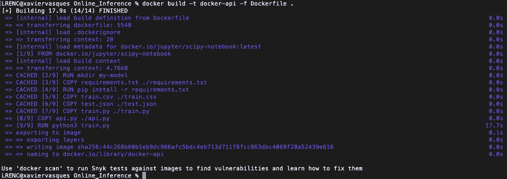
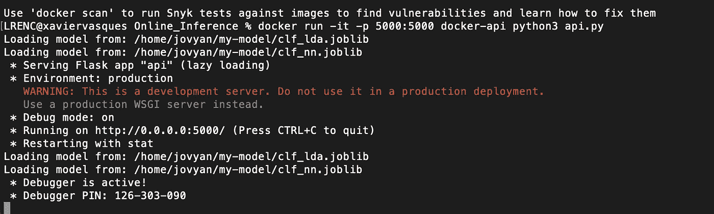
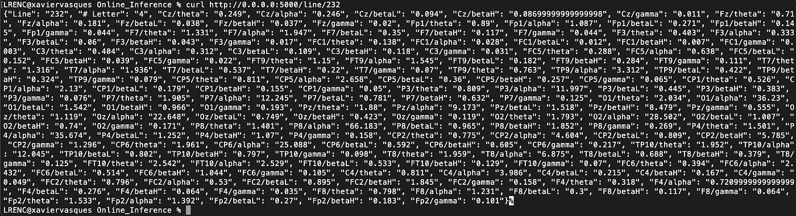
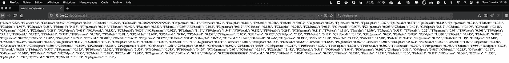
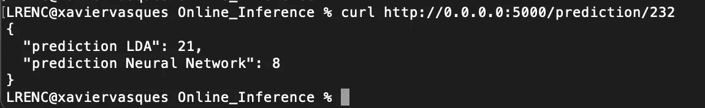
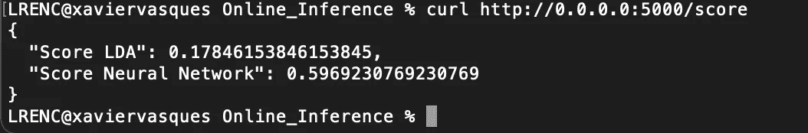

# 使用 Docker 和 Python REST APIs 和 Flask 进行实时机器学习预测

> 原文：<https://towardsdatascience.com/machine-learning-prediction-in-real-time-using-docker-and-python-rest-apis-with-flask-4235aa2395eb?source=collection_archive---------2----------------------->

Docker 容器和 REST APIs 执行在线推理的快速示例


Annamária Borsos 摄影

本文的想法是快速简单地构建一个 Docker 容器，使用 Python APIs 和 Flask，通过经过训练的机器学习模型执行在线推理。在阅读本文之前，请不要犹豫阅读[为什么使用 Docker 进行机器学习](https://xaviervasques.medium.com/why-using-docker-for-machine-learning-74c927ceb6c4)、[快速安装并首次使用 Docker](https://xaviervasques.medium.com/quick-install-and-first-use-of-docker-327e88ef88c7) 以及[为您的机器学习模型构建并运行 Docker 容器](/build-and-run-a-docker-container-for-your-machine-learning-model-60209c2d7a7f)，在其中我们将学习如何使用 Docker 进行模型训练和批量推理。

当你有时间计算你的预测时，批量推断是非常有用的。让我们假设你需要实时预测。在这种情况下，批量推理并不更合适，我们需要在线推理。如果没有在线预测，许多应用将无法工作或不会非常有用，例如自动驾驶汽车、欺诈检测、高频交易、基于定位数据的应用、物体识别和跟踪或大脑计算机接口。有时，需要以毫秒为单位提供预测。

为了学习这个概念，我们将使用 Docker 和 Flask-RESTful 实现在线推理(线性判别分析和多层感知器神经网络模型)。

首先，我们考虑以下文件: **Dockerfile，train.py，api.py，requirements.txt，** **train.csv，test.json.**

**train.py** 是一个 python 脚本，它接收并标准化 EEG 数据，并训练两个模型来对数据进行分类。 **Dockerfile** 将用于构建我们的 Docker 映像，requirements.txt (flask，flask-restful，joblib)用于 Python 依赖项，api.py 是将被调用来使用 REST APIs 执行在线推理的脚本。 **train.csv** 是用于训练我们的模型的数据，而 **test.json** 是一个包含新 EEG 数据的文件，将用于我们的推理模型。

你可以在 [GitHub](https://github.com/xaviervasques/Online_Inference) 上找到所有文件。

# flask-RESTful API

构建 API 的第一步是考虑我们想要处理的数据，我们想要如何处理它，以及我们想要 API 产生什么样的输出。在我们的例子中，我们将使用 **test.json** 文件，其中有 1300 行 EEG 数据，每行有 160 个特征(列)。我们希望我们的 API 满足以下要求:

- API 1:我们给 API 一个行号，它将从所选行中提取数据并打印出来。

- API 2:我们将为 API 提供一个行号，该 API 将提取所选行，将新数据注入模型并检索分类预测(数据中的字母变量)

- API 3:我们将要求 API 获取 **test.json** 文件中的所有数据，并立即为我们打印模型的分类分数。

最后，我们希望通过发出 HTTP 请求来访问这些进程。

让我们来看看 api.py 文件:

在导入包括开源 web 微框架 Flask 在内的依赖项之后，第一步是设置写在 docker 文件中的环境变量。我们还需要加载我们的线性判别分析和多层感知器神经网络序列化模型。我们通过编写 **app = Flask(__name__)来创建我们的 Flask 应用程序。**然后，我们创建三个 Flask 路由，以便在该路由上服务 HTTP 流量:

-[http://0 . 0 . 0 . 0:5000/line/250](http://0.0.0.0:5000/line/250):从 test.json 获取数据，并返回由变量 Line 定义的请求行(在本例中，我们希望提取行号为 250 的数据)

-[http://0 . 0 . 0 . 0:5000/prediction/51](http://0.0.0.0:5000/prediction/51):通过注入请求的数据，从 LDA 和神经网络训练模型返回分类预测(在本例中，我们希望注入第 51 行的数据)

-[http://0 . 0 . 0 . 0:5000/score](http://0.0.0.0:5000/score):返回神经网络和 LDA 推理模型对所有可用数据的分类得分( **test.json** )。

Flask routes 允许我们通过向 URL([http://0 . 0 . 0 . 0:5000](http://0.0.0.0:5000/))添加我们的过程的名称( **/line/ < Line >，/prediction/ < int:Line >，/score** )来从 API 请求我们需要的东西。无论我们添加什么数据， **api.py** 总是会返回我们请求的输出。

# 机器学习模型

**train.py** 是一个 python 脚本，它吸收并归一化 csv 文件(train.csv)中的 EEG 数据，并训练两个模型对数据进行分类(使用 scikit-learn)。该脚本保存了两个模型:线性判别分析(clf_lda)和神经网络多层感知器(clf_NN):

# 在线推理的 Docker 图像

我们都必须建立自己的码头工人形象。首先，我们需要我们的 **Dockerfile** 和 **jupyter/scipy-notebook** 图像作为我们的基础图像。我们还需要设置我们的环境变量并安装 joblib，以允许我们的训练模型和 flask ( **requirements.txt** )的序列化和反序列化。我们将 **train.csv** 、 **test.json** 、 **train.py** 和 **api.py** 文件复制到镜像中。然后，我们运行 **train.py** ，它将拟合并序列化机器学习模型，作为我们映像构建过程的一部分。

这是:

要构建此映像，请运行以下命令:

```
docker build -t my-docker-api -f Dockerfile . 
```

我们获得以下输出:



# 运行 Docker 在线推理

现在，我们的目标是运行我们的在线推理，这意味着每次客户端向 **/line/ < Line >、/prediction/ < Line >、/score** 端点发出 POST 请求时，我们将显示请求的数据(行)，使用我们的预训练模型预测我们注入的数据的类别，并使用所有可用数据预测我们的预训练模型的得分。为了启动 web 服务器，我们将运行一个 Docker 容器并运行 **api.py** 脚本:

```
docker run -it -p 5000:5000 my-docker-api python3 api.py
```

**-p** 标志将容器中的端口 5000 暴露给我们主机上的端口 5000， **-it** 标志允许我们查看来自容器的日志，我们在 **my-api** 映像中运行 **python3 api.py** 。

输出如下所示:



您可以看到我们运行在 [http://0.0.0.0:5000/](http://0.0.0.0:5000/) 上，现在我们可以使用 web 浏览器或 **curl** 命令向该 IP 地址发出 POST 请求。

如果我们键入:

```
curl [http://0.0.0.0:5000/line/232](http://0.0.0.0:5000/line/232)
```

我们将从我们的数据(test.json)中提取第 232 行:



使用 web 浏览器得到相同的结果:



如果我们键入以下 curl 命令:

```
curl [http://0.0.0.0:5000/prediction/232](http://0.0.0.0:5000/prediction/232)
```

我们将看到以下输出:



上述输出意味着 LDA 模型将提供的数据(行 232)分类为字母 21 (U ),而多层感知器神经网络将数据分类为字母 8 (H)。这两个模型不一致。

如果我们打字

```
curl [http://0.0.0.0:5000/score](http://0.0.0.0:5000/score)
```

我们将看到我们的模型在整个数据集上的得分:



正如我们所看到的，我们应该更信任多层感知器神经网络，其准确度分数为 0.59，即使分数不是很高。有些工作要做，以提高准确性！

# 下一步是什么？

我希望你能看到使用 Docker 和 flask 来执行在线推理，从而将你的机器/深度学习应用容器化的简单性。当我们想把我们的模型投入生产时，这是必不可少的一步。当然，这是一个简单的观点，因为我们需要考虑更多方面，如网络、安全、监控、基础设施、协调或添加数据库来存储数据，而不是使用 json 文件。

**来源**

【https://www.fernandomc.com/posts/your-first-flask-api/ 号

【https://mlinproduction.com/docker-for-ml-part-4/ 

[https://www . kdnugges . com/2019/10/easy-deploy-machine-learning-models-using-flask . html](https://www.kdnuggets.com/2019/10/easily-deploy-machine-learning-models-using-flask.html)