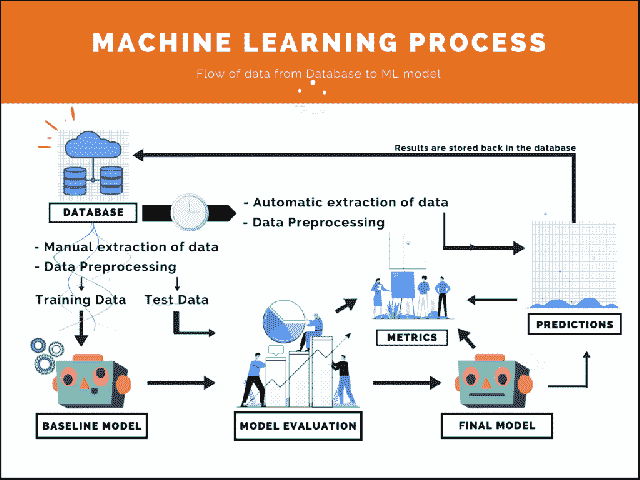
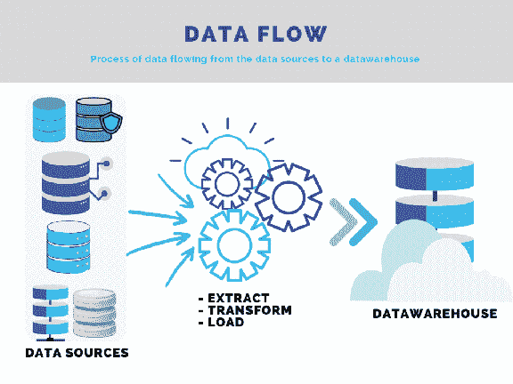
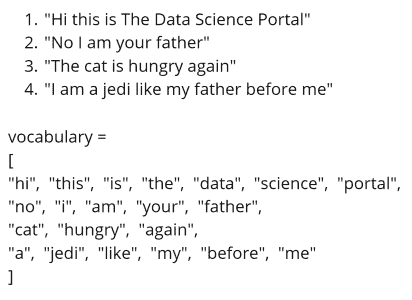
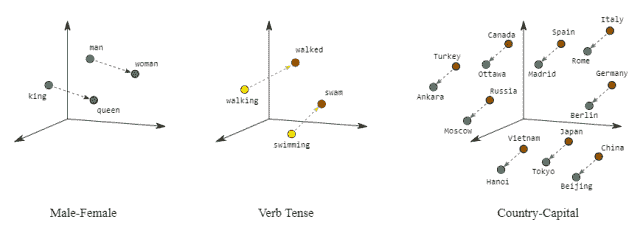

# 机器学习:解决任何机器学习问题的过程

> 原文：<https://towardsdatascience.com/machine-learning-process-for-solving-any-machine-learning-problem-cdebfdae5a55?source=collection_archive---------46----------------------->

Jr Korpa 在 [Unsplash](https://unsplash.com?utm_source=medium&utm_medium=referral) 上拍摄的照片

## 当我们解决机器学习问题时，我们最终可能使用的算法取决于我们拥有的数据类型和问题本身。尽管有许多算法可供选择，我们仍然有一个通用的程序或框架来解决我们的问题。

在这篇文章中，我们将介绍可以用作解决任何机器学习问题的模板的通用过程或框架。读完这篇文章，你会-

*   了解机器学习的基础知识
*   查看机器学习过程中涉及的各个步骤
*   了解其他流行的机器学习框架

# 机器学习

机器学习是一个与构建系统或程序有关的研究领域，这些系统或程序能够在没有明确编程的情况下*学习*。机器学习系统接收大量数据，*从中学习*模式和标签，基本上是在从未见过的数据上预测信息。

由[卢卡斯·布拉塞克](https://unsplash.com/@goumbik?utm_source=medium&utm_medium=referral)在 [Unsplash](https://unsplash.com?utm_source=medium&utm_medium=referral) 上拍摄的照片

下面是机器学习的一个流行定义:

> *如果由 P 测量的计算机程序在 T 中的任务上的性能随着经验 E 而提高，则称该计算机程序从关于某类任务 T 和性能测量 P 的经验 E 中学习*
> 
> [*汤姆·米切尔*](http://www.cs.cmu.edu/~tom/)

我知道这很难完全理解，所以让我把它分解成更简单的术语——把*经验*想象成数据，把*任务*想象成用这些数据预测某事，把*绩效评估*想象成预测实际上是否正确的答案。现在，如果你想对机器学习有一个大致的了解，看看这个帖子-

 [## 那么什么是机器学习呢？

### 你可以很容易地找到许多机器学习的流行用例。我敢肯定，当你需要购买新的…

thedatascienceportal.com](https://thedatascienceportal.com/posts/so-what-is-machine-learning) 

现在我们已经了解了什么是机器学习，让我们看看它是如何应用于解决有趣的商业问题的。

# 机器学习过程

一个过程被定义为*为了达到一个特定的目的*而采取的一系列步骤的行动。在这里，我们的过程是实现一个机器学习算法的成功实施。该过程从收集数据开始，然后以某种方式对数据进行处理和转换。然后，超级酷的机器学习算法应用于它，以做出一些预测，并得出有影响力的商业见解。这是这个过程的基本框架

**机器学习过程**

*   [**数据采集**](https://thedatascienceportal.com/posts/machine-learning-process/#data-gathering)

从各种来源收集数据并组合形成一个数据结构

*   [**探索性数据分析**](https://thedatascienceportal.com/posts/machine-learning-process/#exploratory-data-analysis)

使用数据分析技术研究数据并获得见解

*   [**数据预处理**](https://thedatascienceportal.com/posts/machine-learning-process/#data-preprocessing)

既然我们已经了解了数据是怎样的，我们执行一些数据预处理步骤

*   [**型号选择**](https://thedatascienceportal.com/posts/machine-learning-process/#model-selection)

选择机器学习模型并训练该模型以创建基线模型

*   [**车型评价**](https://thedatascienceportal.com/posts/machine-learning-process/#model-evaluation)

基于测试集和各种性能指标对模型进行评估

*   [**模型调优**](https://thedatascienceportal.com/posts/machine-learning-process/#model-tuning)

根据评估，我们通过改变一些超参数甚至返回并添加更多数据来调整模型

*   [**模型预测**](https://thedatascienceportal.com/posts/machine-learning-process/#model-predictions)

当模型在测试过程中开始表现良好时，它就会被保存和部署以供使用——对新输入的数据进行预测。

机器学习过程|作者照片

现在我们已经设计好了框架，让我们仔细检查每一个步骤，以便更好地理解整个过程。顺便说一下，如果你以前应用过机器学习来解决一个问题，你就会知道整个过程是相当迭代的。如果你以前没有这样做过，那基本上意味着你将应用上面提到的许多步骤，直到你得到想要的结果。在步骤#5 中，借助于完全由问题陈述定义的评估集和性能度量来计算该合意性。如果您现在还不明白这一点，请不要担心，我们会详细介绍流程中的每一步。

# 数据采集

你可能听过这样一句话，“垃圾进，垃圾出！”。如果没有，那么你肯定会，几乎每隔一天处理数据(不，认真)。数据是最重要的东西——如果你有好的数据，那么你的模型将有最好的机会像预期的那样运行，并给出在现实世界中有意义的预测。

数据收集是机器学习过程中的第一步，它被定义为收集和组合与我们试图解决的问题相关的所有数据的行为。这些数据后来被用于训练和评估我们的机器学习模型。在这一步中可能会面临几个挑战-

我们试图处理的数据无法在一个地方获得。必须提取和组合来自多个系统的数据。

*   这是一个常见的行业问题，人们必须依靠他们的数据工程技能来解决这个问题。
*   首先，我们必须找到从每个系统中提取数据的方法。我们可以使用 SQL 连接到系统数据库。
*   根据您的要求，使用 SQL 以某种方式连接数据集。

**数据是可用的，但作为一个静态文件，必须从一些系统手动导出。**

*   出于训练和评估目的，我们可以使用手动提取的数据集，因为这是一次性活动，我们可以重复使用相同的数据进行模型选择。
*   当我们到达预测阶段时，也就是说，当最终的模型已经部署时，我们需要建立一个架构，该架构自动执行从系统中提取数据的过程，如果有多个系统，则连接提取的数据，然后通过一些数据预处理管道运行该数据，使其达到所需的格式/结构。这样做是为了不需要人工干预，机器学习模型可以直接使用数据。同样，这是一个数据工程练习，我们可以将流程定义为类似于这样的内容

数据流|作者照片

数据可能是从不同的来源和系统提取的，这些来源和系统不一定有任何相互通信的方式，因此这种活动既麻烦又耗时。但是 **ETL 管道**可以帮助我们从各种来源收集数据，并将它们以所需的格式存储在仓库中，以备数据分析师和数据科学家访问。

# 探索性数据分析

在我们建立我们的机器学习模型之前，我们必须研究数据，以了解我们需要运行什么样的分析，以及基本上我们可以用数据回答什么样的商业问题。这一步与我们试图解决的业务问题密切相关。顾名思义，在这一步中，我们*通过执行一些分析来探索*数据，以找出我们拥有什么样的功能，它们是如何相关的，并使用描述性统计以报告和仪表板的形式进行一些数据可视化。在这一步，你应该戴上你的研究员帽。

Firmbee.com 在 [Unsplash](https://unsplash.com?utm_source=medium&utm_medium=referral) 上[拍照](https://unsplash.com/@firmbee?utm_source=medium&utm_medium=referral)

在第一步之后，数据从我们收集数据的地方导入。在这一步中，我们发现了几件事，这些事将继续塑造我们如何处理问题的方法。对于初学者来说，对数据有一个好的整体感觉总是好的，我们可以通过做以下事情来得到一个好的想法

*   熟悉数据及其不同的特性。
*   找出这些特征之间的关系，看看它们是否相关。
*   找出数据的描述性指标——重要数字特征的平均值、中值、最小值、最大值以及最常见、最不常见的分类特征。根据问题的不同，可能会有无限多的指标。
*   通过按各种特征对数据进行分组，了解特征值的各种可能组合，从而深入了解我们拥有的各种数据。这有助于发现数据中隐藏的模式。
*   通过执行统计测试来查看数据，找出数据中的异常值(有时人们可以通过简单的直觉来判断)。
*   寻找丢失的值和可能的错误，并正确处理它们。

在这一步中，你还可以做更多的事情。如果你真的对数据和手头的问题充满热情，那么这可能是你将花费大量时间的一步(相信我！).

# 数据预处理

现在我们已经研究了数据，我们确切地知道我们拥有什么——这是一件非常重要的事情。我们现在有了一个更好的想法，我们应该如何转换数据，以便在其上运行机器学习算法。要做到这一点，我们必须改变现有的特征。但在此之前，还有许多其他问题需要考虑——缺失数据、不正确数据、重复值等等。数据永远不够干净，无法直接输入机器学习算法，这正是这一步如此重要的原因。

米卡·鲍梅斯特在 [Unsplash](https://unsplash.com?utm_source=medium&utm_medium=referral) 上的照片

我们拥有的特性可能是不同类型的(大多数情况下是这样的！)—数字、类别、列表、自由文本或者其他东西。为了运行机器学习算法，这些特征将必须被转换成算法能够理解它们的状态。我们已经有了一个想法，计算机只理解数字，基本上一切都可以归结为 0 和 1(是的，这也包括你尴尬的高中照片)，这正是我们试图用我们的数据预处理技术做的。对于我们遵循的不同类型的数据，有不同的技术。这些是常见的-

## 数字特征

我们检查数字特征是**连续**还是**离散**。

**连续:**这意味着在可能值的区间上测量的特征值本质上是连续的。

*   它们不是静止值，可以取该区间内任何可能的值。
*   一个很好的例子是在 48 小时内测量的温度。
*   另一个可能是房子的价格，其中价格可以是[$7 万，$70 万]内的任何值。

**离散:**这意味着特征值本质上是固定的，只能从根据问题定义的集合中取值。

*   它们不一定是整数值，但它们取自特定的集合。
*   一个简单的例子可以是[0，1] —值可以是 0 或 1。
*   另一个例子可以是鞋码，比如在[英国 6，英国 12]以内。

## 分类特征

我们对分类特征进行编码。编码仅仅意味着给它们分配一个离散的数值或一个集合中的向量值。

**One-Hot Encoding:**feature 列被拆分成列中不同数量的类别。

*   因此，如果我们从包含类别[“差”、“还行”、“好”、“棒极了”]的一列开始，现在我们有四列。
*   包含某个类别的每个记录在该类别的列下的值为 1，其余的为 0。
*   “好”现在将变成[0，0，1，0]，而“坏”将变成[1，0，0，0]，在四列[“坏”、“还好”、“好”、“棒极了”]下。

**离散化:**另一种方式是，如果我们有类别[“坏的”、“还好的”、“好的”、“棒极了”]，我们可以像[0，1，2，3]一样对它们进行编码，从而将它们变成离散变量。

*   我相信这是更有效的方法，因为我们仍然只有一列，而不是将特性列分成许多列。

## 文本特征

文本特征也被编码，但是与分类特征非常不同。有几种方法可以对文本进行编码，但所有这些方法最终都会被数字所取代。为了做到这一点，我们首先制作一个叫做*的词汇*。词汇表是基于文本的特性列中出现的所有唯一单词的列表(虽然在下面的例子中我没有这样做，但是词汇表可以按升序排序)。这是一些常见的-

从数据到词汇|作者图片

**一键编码:**将所有唯一的单词考虑在内，组成词汇表。现在有两种方法可以热编码

*   第一种方法是，每个句子都用一个与词汇长度相同的向量进行编码。
*   如果一个句子包含一个特定的单词，该单词在词汇向量中的向量位置被标记为 1，其余的被保留为 0。因此，一个布尔向量。
*   所以上面的第三句话会变成— [0，0，0，1，0，0，0，0，0，0，1，1，1，0，0，0，0]
*   没有任何单词的顺序感、位置感或意义感，它只是一个布尔值。
*   就处理空间和时间而言，一键编码的第二种方式成本要高得多。这和之前我们对分类特征做的一样。每个单词都用一个词汇长度向量进行编码，如果该单词出现在句子中，则在词汇中该单词的位置标记 1，而其余的保持为零。所以最后，如果句子开始时有 n 个单词，现在它已经用 n 个向量编码了，每个向量的长度与词汇的长度相同。

**单词包:**所有独特的单词都被认为构成了词汇表。

*   在这里，每个句子都用一个与词汇长度相同的向量进行编码。
*   如果一个句子包含一个特定的单词，该单词在词汇向量中的向量位置被标记为 1，其余的被保留为 0。如果同一个单词有多个条目，则增加计数。因此，我们得到一个频率向量。
*   所以像“我爸爸又饿了，像我的猫一样”这样的句子会是—
    【0，0，1，0，0，0，0，0，0，1，1，1，1，0，0，1，2，0，0】
*   尽管现在我们在计算频率时至少有了一些意义，但是对于单词的顺序和位置还是一无所知。

**TF-IDF:** 这是流行的词频-逆文档频率算法。

*   它实际上是对单词袋方法的扩展或改进。这里，我们用 tf-idf 值的向量代替词频向量作为编码值。
*   一个单词的 TF-IDF 值在较高层次上是通过将该单词在文档中的频率乘以它在文档中出现的次数的倒数来动态计算的。
*   TF 是通过使用之前的词汇和词频向量来计算和归一化的—
    TF =(单词的频率/词汇的长度)
    —这对于像介词这样的常见单词来说仍然会给出很高的值。因此，这仅仅是一个不完整的指标。
*   单词的 IDF 是通过计算该单词出现的文档数来计算的。这样做带来了几个问题，所以我们做了一些修改。
    ——如果我们仅将包含该词的文档数量作为 IDF 值，那么对于常用词来说，IDF 值将非常高。
    -这就是为什么我们将文档总数除以包含该单词的文档数，以便非常常用的单词具有较低的 IDF 值，而不常用的单词具有较高的 IDF 值。这就是“逆”文档频率的含义，它提供了一种意义感。
    -但是如果文档的总数很大，而分母不是呢？这个词会有很高的意义。为了在保持重要性的同时缩放该值，我们采用对数值。
    -另一个数学修改是，对于给定值的任何分数，分母不得为零，因此我们将 1 加到分母上，最终得到以下结果—
    IDF = log(文档总数/ (1 +包含该单词的文档数))
*   这就是我们如何计算每个单词的 tf-idf 值，并像前面一样为每个句子形成词汇长度向量，唯一的区别是，这里我们有每个单词的 tf-idf 值，而不是词频。

**单词嵌入:**这是单词的最具信息性的表示之一，因为单词嵌入为相似的单词提供了相似的表示。

*   单词被映射到一个特定的向量表示，这个向量表示是通过映射高维向量空间中的所有单词而找到的。
*   单词“汽车”和“自行车”在向量空间中将比单词“汽车”和“床”更接近，因此将获得更接近的向量值，自然地捕捉它们的含义。
*   这种有意义的空间让你的机器学习系统有机会检测可能有助于学习任务的模式。

通过嵌入进行类比| *图片由* [*谷歌开发者*](https://developers.google.com/machine-learning/crash-course/embeddings/translating-to-a-lower-dimensional-space)

对了，这只是冰山一角！当你开始做项目时，你会很快意识到数据预处理会占用你大部分的时间。没有固定的规则，需要从 EDA 的前一步进行彻底的调查，以从信息片段中获得相关且可用的数据集。无论如何，在所有这些调查和预处理完成之后，接下来要做的事情是将数据分成两个或三个部分。

数据分割|作者照片

如果您考虑按照最佳实践工作，那么将数据按照接近 60:20:20 的比例分割成 3 部分(取决于数据的大小)，并确保数据是随机分割的。有多种方法可以通过编程实现这一点。最大的数据块进入训练集，其余的分成验证集和测试集。

**训练数据集:**这是将用于训练机器学习模型的数据集。该模型通过考虑数据集的所有特征和复杂性来学习该数据集。

**验证数据集:**这是用于在机器学习模型被训练后对其进行评估的数据集。也许一些模型参数需要重新调整，或者也许整个算法需要改变。

**测试数据集:**该数据集用于在未见过的数据上测试模型，以检查模型能够多好地理解其任务并推广到新数据。这给人一种模型在真实场景中表现如何的感觉。

如果你想了解更多关于数据预处理的知识，这里有一篇全面而简单的文章。了解数据预处理技术，以及处理缺失数据、错误数据、特征编码、降维等问题的方法..

 [## 数据预处理:概念

### 本文的目的是介绍数据预处理中使用的概念，数据预处理是机器…

thedatascienceportal.com](https://thedatascienceportal.com/posts/data-preprocessing) 

# 型号选择

在探索、调查和清理数据之后，我们对需要做什么来解决业务问题有了更好的理解。模型选择是我们实际选择哪种算法最适合获得当前数据的相关结果的步骤。我们从一组候选模型开始，最终选定一个基于证据的模型。

在选择算法时，有几件事情需要考虑。有人在某个教程中用来解决类似问题的方法可能并不总是最佳选择，因为最终一切都取决于您要处理的数据类型。还可能有其他约束，比如模型复杂性、可维护性、部署成本和资源可用性，我们将在评估期间讨论这些。这一步的目的是创建一个基线模型，用于进一步的评估和微调。理想的情况是使用训练数据训练不同的候选模型，并使用验证数据对它们进行比较。但是这种数据丰富的情况很难发生，所以有几种其他方法可以做到这一点。例如，您可以使用像[交叉验证](https://machinelearningmastery.com/k-fold-cross-validation/#:~:text=Cross%2Dvalidation%20is%20a%20resampling,k%2Dfold%20cross%2Dvalidation.)这样的数据重采样技术来训练和测试不同的算法，以便仅使用训练数据来选择理想的算法。

走哪条路？|作者照片

我们选择的模型显然取决于我们拥有的数据类型和我们试图解决的问题类型。比如说我们想造一个聊天机器人。聊天机器人将按照用户的询问进行回答。因此，我们可以说，任何对话的第一步都将是聊天机器人试图识别用户的意图，这是我们的第一个机器学习问题——意图分类。这个问题要求我们使用一种特殊类型的数据——基于文本的数据。我们选择的机器学习算法必须是一种分类算法，即它根据已经看到的数据，将新的输入数据分类到某个标签类。当然，在这一步之前，来自用户的文本将被编码并经过所有必要的数据预处理步骤，然后将被输入到机器学习算法中。在这一步中，我们所要做的就是创建一个基线模型，它接受文本输入并将其分类到某个意图类中。

# 模型评估

现在我们已经有了一个基线模型，我们必须努力让这个模型可以投入生产。在这一步中，我们将根据可用的基准和业务定义的 KPI 和指标来评估模型性能。我们总是有各种各样的工具和算法来解决特定的问题。作为一名数据科学家，我们有责任在各种算法的所有相关配置中对其进行调整和测试。对正则化、过拟合、欠拟合等概念以及准确度、精确度、召回率、混淆矩阵和 f1 分数等各种性能指标的良好掌握总是有帮助的。如果我们正在进行某个项目，我们完全没有办法事先知道哪个模型在我们的数据上表现最好，所以让我们来谈谈评估是如何进行的。这就是我们在上一步中所做的分割派上用场的地方。这里有一些事情需要考虑-

## 模型复杂性

从简单和天真的机器学习模型开始，然后逐步发展到复杂的模型，这总是明智的。这主要是因为这些原因-

*   简单的模型更容易调试。理解架构并做出快速更改需要更少的时间和精力。
*   最终一切都归结为运行成本——简单模型在云上运行更便宜，主要是因为它们通常处理时间更短，内存需求也低得多。
*   它们相对更容易向项目涉众解释。可解释的人工智能是一件大事，因为如果一个企业已经部署了一个人工智能模型来帮助他们，他们需要能够向他们的客户解释模型预测。

## 表演

我们需要关注模型性能，可能需要做一些超参数调整，或者我们需要完全改变算法。当涉及到性能时，我们必须确保模型已经被输入了可能的最佳配置值，并且输出的结果在现实世界中是有意义的。

## 项目要求

根据问题的不同，我们可能有一组需要更多关注的高优先级指标。就像在癌症预测的情况下，我们不仅需要小心假阳性，因为这会给患者带来很高的经济和情感负担，而且我们需要非常确定模型何时说不，这意味着我们必须有非常低的假阴性(0 是这里的最佳数字，尽管不切实际)。因此，我们需要绝对确定项目需求，以定义一个“足够好的模型”。我们需要知道哪些 KPI 和度量是业务和项目涉众关注的。

因此，我们在模型选择期间使用训练数据训练不同的候选模型，然后在模型评估期间使用验证数据评估它们各自的性能，这两者都是我们在前面的数据预处理步骤中创建的。一旦您评估了基线模型，现在是时候检查结果并考虑如何改进模型了。

# 模型调整

在模型被选择、训练和评估之后，现在是重新调整模型的时候了，以便以某种方式处理在前面的步骤中突出显示的问题。顾名思义，模型调整是指我们从之前的训练和评估步骤中获取反馈和结果，以重新配置和调整模型，从而获得更好的拟合。

这可能涉及改变一些参数或超参数的值、添加/删除数据或简单地改变我们在数据预处理步骤中处理数据的方式。这一切都取决于我们从上一步中得到的评价。如前所述，最终是项目涉众定义了规则，使用这些规则，我们可以将模型分类为“足够好”，如果在评估之后，模型不是足够好，那么我们知道有些东西需要改变。

[HalGatewood.com](https://unsplash.com/@halacious?utm_source=medium&utm_medium=referral)在 [Unsplash](https://unsplash.com?utm_source=medium&utm_medium=referral) 上拍照

幸运的是，像 GridSearchCV 这样的库可以帮助我们自动选择和评估超参数的不同组合，用于我们设计的所有步骤，从数据预处理到模型选择，一直到评估和微调。尽管计算量非常大，但这被认为是行业最佳实践。它应该只使用一次，因此即使成本很高，也是值得的，因为我们可以找到超参数的完美组合，而无需手动来回操作并反复运行模型，这很可能会变得更加昂贵。

这些算法为我们提供了所有超参数的最佳值，同时也为我们创建了优化的模型。因此，这样我们就不必使用新的超参数来重新训练机器学习模型。

# 模型预测

现在，我们已经有了针对给定问题的最佳机器学习模型，是时候看看该模型在完全看不见的数据上做得如何了。如果我们仍然没有使用测试集(同样，这将是罕见的，因为大多数情况下数据并不丰富)，我们可以对机器学习模型进行测试，看看它在测试集上的表现如何。到目前为止，我们应该不会出现高得惊人的错误数量，因为我们已经很好地训练了模型，并接受了反馈来重新配置和优化模型。但是，即使有一些琐碎的问题，我们总是可以后退一步，采用调试方法来解决问题。

瑞安·斯通在 [Unsplash](https://unsplash.com?utm_source=medium&utm_medium=referral) 上的照片

然而，该步骤的主要目的不是解决反馈，而是设计管道和设置架构以具有适当的机器学习流程，该流程根本不需要任何人工干预来运行模型和收集其结果。设计机器学习管道是一项具有挑战性的任务，但人们可以随时查阅[文档中的各种示例](https://scikit-learn.org/stable/modules/generated/sklearn.pipeline.Pipeline.html)，并通过社区帮助来构建它们。

*   机器学习管道将连接所有前面的步骤，并一起运行它们，以产生一个训练有素和高度优化的模型对象，该对象可以重复使用和部署，以扩大项目规模。
*   在我们得到这个最终模型之后，我们必须设计一个数据预处理工作流，以便任何用于预测机器学习模型的新数据与用于训练机器学习模型的数据处于相同的状态。
*   因此，来自数据仓库存储的新数据将经历与训练数据相同的数据预处理步骤。
*   将有一个从模型到数据仓库的连接来存储结果，并使用它来使用数据可视化工具和软件(如 Tableau 和 PowerBI)制作报告和仪表板。

# 其他机器学习框架

还有其他几个机器学习过程，但它们或多或少都非常相似。一些专注于机器学习算法实现，而一些专注于部署流程。如果你试图建立一个数据优先的组织和方法，参考所有的框架总是好的。我发现这些流行的方法很有用-

*   国玉峰的[机器学习的 7 个步骤](/the-7-steps-of-machine-learning-2877d7e5548e)
*   Francois Chollet 的[用 Python 进行深度学习](https://www.amazon.com/Deep-Learning-Python-Francois-Chollet/dp/1617294438)
*   乔·布利茨坦和汉斯·彼得·菲斯特的[数据科学流程](https://www.kdnuggets.com/2016/03/data-science-process-rediscovered.html)
*   马修·梅奥的[机器学习过程](https://www.kdnuggets.com/2018/05/general-approaches-machine-learning-process.html)

最后，我们在此结束循环，新数据的结果将呈现给项目干系人，以帮助他们构建洞察力并做出数据驱动的决策。这就是一个端到端的机器学习项目是如何设计并成功执行的。在这篇文章中，我想给你一个过程或者模板，你可以在你自己的项目中重复使用。将机器学习应用于一个全新的问题可能有点令人不知所措，有时甚至令人望而生畏。这种机器学习过程模板将指导您，并让您在您必须执行的所有任务上保持正轨，同时可能为您节省大量时间。

感谢您的阅读！

*原载于 2021 年 3 月 29 日 https://thedatascienceportal.com**[*。请访问数据科学门户网站，了解更多此类内容！*](https://thedatascienceportal.com/posts/machine-learning-process/)*

* [## 主页-数据科学门户

### 我肯定你上过网飞、脸书和 YouTube。你看到你喜欢的东西，你和它互动-你喜欢一个…

thedatascienceportal.com](https://thedatascienceportal.com)*