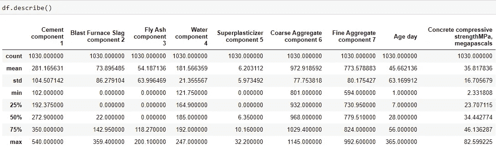
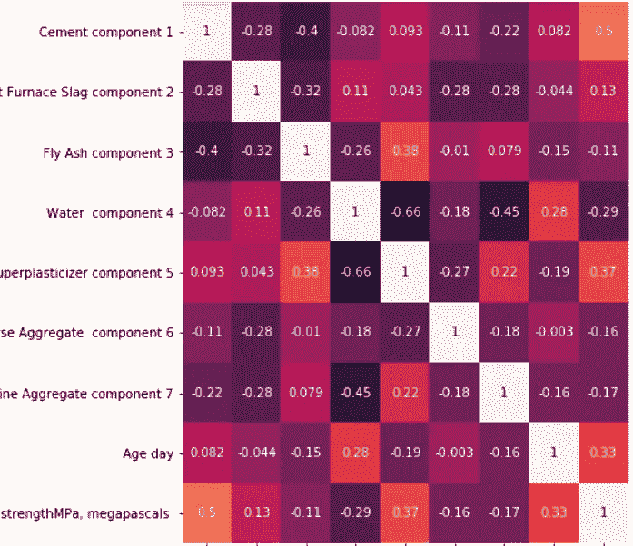
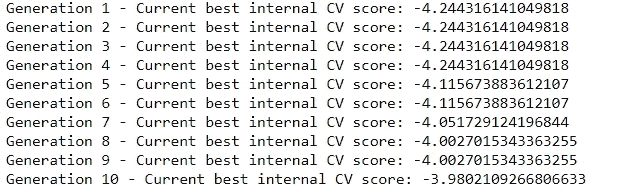
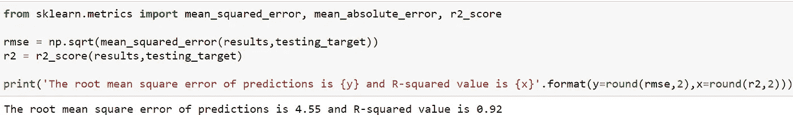
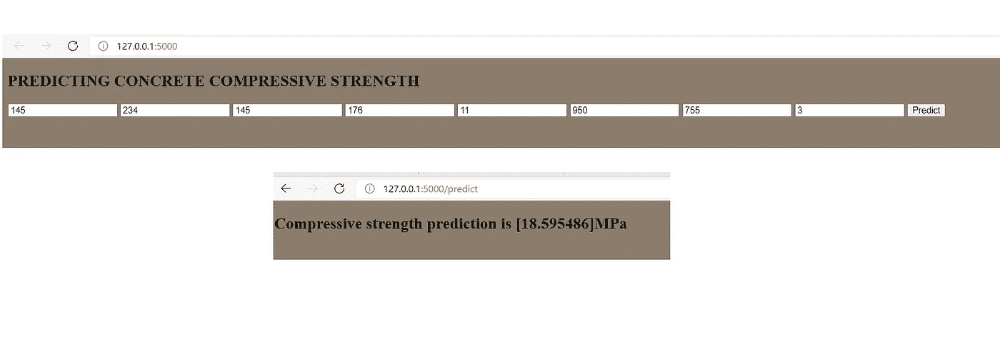

# 机器学习:进度检查和混凝土的气候变化足迹

> 原文：<https://towardsdatascience.com/machine-learning-progress-check-and-concretes-climate-change-footprint-4614749d58e2?source=collection_archive---------62----------------------->

## 随着时间的推移，我的技能有了怎样的提高？关于气候变化的影响，混凝土属性建模能告诉我什么？


Mikel Parera 在 [Unsplash](https://unsplash.com?utm_source=medium&utm_medium=referral) 上的照片

自从我第一次发现 UCI 数据集来预测混凝土抗压强度，已经有一段时间了(一年多)。

我记得努力分析别人的代码，破译他们的思维过程，然后试图理解我不断收到的持久性 Python 错误消息。我一直没时间做模型！

所以我很好奇:**我现在看起来怎么样？**然后我心中的化学工程师变得更加好奇:**关于混凝土的特性及其影响气候变化的能力，我能了解到什么？**

下面是带有支持代码的 GitHub [repo](https://github.com/Ranga2904/Concrete_Pred/tree/main) 。

本文摘要:

*   **定义问题**
*   **数据加载和分析**
*   **开发模型并评估性能**
*   **部署最佳模型**
*   **结论:客户的外卖**

让我们看看我的模型相对于我第一次看到这个数据集时看到的其他人的工作表现如何。该代码实现了 0.84 的 R 平方和 41.2 的均方误差。比较其他人的表现[这里](/concrete-compressive-strength-prediction-using-machine-learning-4a531b3c43f3)、这里[这里](https://www.scipedia.com/public/Silva_et_al_2020a)和[这里](https://github.com/pranaymodukuru/Concrete-compressive-strength)达到相同或稍好的表现。

免责声明:这只是一个通过使用方便的指标和容易获得的数据集来衡量我的进展的练习。这与收集和清理数据以及大规模建设管道的实用性相去甚远。

努力应该指向那里，而不是在工业规模上取得毫无意义的微小进步。

# 定义问题

混凝土的抗压强度与其质量成正比，预测这一特性是有价值的，而无需进行昂贵且有问题的测试。其他博客如 [this](/concrete-compressive-strength-prediction-using-machine-learning-4a531b3c43f3) 提供了我们为什么要解决这个问题的更多背景信息。

博客中较少提及的是混凝土在气候变化中的作用——这篇[文章](https://www.theguardian.com/cities/2019/feb/25/concrete-the-most-destructive-material-on-earth)为全球 4 %- 8%的二氧化碳分配了具体的责任。[维基百科](https://en.wikipedia.org/wiki/Environmental_impact_of_concrete#Cement_production_and_use)将这些排放的 50%分配给化学生产过程，40%分配给燃烧燃料。关键因素是:

*   混凝土中的水泥量，因为每生产一吨水泥会排放 900 千克二氧化碳
*   固化混凝土所需的加热程度。

减少排放的选项包括用影响较小的物质(如粉煤灰和其他液体添加剂)替代混凝土。因此，让我们扩大这一努力的范围来一窥这种影响。

# 数据加载和分析

在使用 Pandas 读取数据后，让我们感受一下不同的特征以及它们之间的关联程度:

```
import pandas as pd, numpy as np
import seaborn as snsdf = pd.read_excel('Concrete_Data.xls',keep_default_na=False)df.columns = [x.replace('(kg in a m^3 mixture)',"")for x in df.columns]
df.columns = [x.replace("(","")for x in df.columns]
df.columns = [x.replace(")","")for x in df.columns]df.describe()import matplotlib.pyplot as pltplt.figure(figsize=(8,8))
sns.heatmap(df.corr(),annot=True)plt.show()
```



图 1:数据集分布



图 2:特征关联矩阵

以上要点:

*   特征的比例显示了变化，所以我可能需要使用缩放来充分利用基于距离的算法，例如 kNN
*   没有一个特征显示出与我们感兴趣的 y 变量的压倒性相关性，最高的是超塑化剂组分 5 (0.37)
*   粉煤灰含量与水泥含量呈负相关——考虑到我们在介绍中了解到的情况，这并不奇怪。

# 开发模型并评估性能

我将使用一个流行的 AutoML 包，名为 TPOT，是基于树的管道优化工具的缩写。我期待一个带有预处理和建模步骤的便捷管道。

```
*# Packages to install TPOT*
%pip install tpot
import tpot*# Importing TPOT Regressor and means to setup the cross validation*
from tpot import TPOTRegressor
from sklearn.metrics import mean_squared_error
from sklearn.model_selection import KFoldcv_tpot = RepeatedKFold(n_splits=10, n_repeats=3, random_state=1)*# Setting up the TPOTRegressor.*
reason_model = TPOTRegressor(cv=cv_tpot,
                             generations=10, population_size=50,
                             scoring='neg_root_mean_squared_error', 

                      verbosity=2, random_state=1, n_jobs=-1, 
                      early_stop=15)
reason_model.fit(x,y)reason_model.export('best_model.py')
```

我选择了 10 代和 50 的人口规模，以避免花费过多的时间建模。

拟合结果:



图 2

这份简历看起来很有希望。我从导出的 best_model.py 中取出脚本，并使用 TPOT 推荐的管道在测试集上评估模型性能。

```
from sklearn.model_selection import train_test_split
from sklearn.pipeline import make_pipeline
from sklearn.preprocessing import PolynomialFeatures
from tpot.builtins import ZeroCountfrom tpot.export_utils import set_param_recursive# NOTE: Make sure that the outcome column is labeled 'target' in the data file
tpot_data = pd.read_excel('Concrete_Data.xls', dtype=np.float64)tpot_data.columns = [x.replace('(kg in a m^3 mixture)',"")for x in df.columns]
tpot_data.columns = [x.replace("(","")for x in df.columns]
tpot_data.columns = [x.replace(")","")for x in df.columns]features = tpot_data.drop('Concrete compressive strengthMPa, megapascals ', axis=1)
training_features, testing_features, training_target, testing_target = \
            train_test_split(features, tpot_data['Concrete compressive strengthMPa, megapascals '], random_state=1)**exported_pipeline = make_pipeline(
    ZeroCount(),
    PolynomialFeatures(degree=2, include_bias=False, interaction_only=False),
    XGBRegressor(learning_rate=0.1, max_depth=7, min_child_weight=14, n_estimators=100, nthread=1, objective="reg:squarederror", subsample=0.8)**-- from sklearn.metrics import mean_squared_error, mean_absolute_error, r2_scorermse = np.sqrt(mean_squared_error(results,testing_target))
r2 = r2_score(results,testing_target)print('The root mean square error of predictions is {y} and R-squared value is {x}'.format(y=round(rmse,2),x=round(r2,2)))
```



图 3:最佳模型性能

这是可以接受的性能，超过了我对其他尝试的快速调查。分析 TPOT 的选择，我对多项式特征预处理的使用并不感到惊讶，这表明原始特征之间存在依赖关系，所有这些都会影响具体的属性。

# **部署最佳型号**

在这篇[文章](https://medium.com/towards-artificial-intelligence/time-series-forecasting-building-and-deploying-models-f647c2ec7567)中，我已经详细介绍了使用 Flask 部署模型的细节——下面是用户指定输入并获得最终混凝土强度(MPa)的界面快照



图 4:输入和输出接口

# **结论:客户的外卖**

如果我们的客户负责混凝土保证，他们可以高枕无忧，因为他们知道我们可以用混凝土抗压强度的准确预测器取代他们昂贵的测试设备。

But——如果我们希望降低混凝土对气候变化的影响，同时实现这种传统混凝土所需的平均抗压强度 17–28 MPa[链接](https://www.heritageconcrete.net/resources/concrete-fact-sheets/concrete-in-practice-35-testing-compressive-strength-of-concrete/)——那么让我们分析下面的交互式可视化。

我的外卖:

*   混凝土制造商应该能够在粉煤灰和水泥浓度大致相等的情况下达到 17-25 MPa，大约为 140-150kg/m3
*   我们还没有到那一步——如果我们参考详细描述数据集分布的图 1，飞灰含量的第 75 百分位是 118 kg/m3，而水泥的四分位范围是 192–350kg/m3。
*   我们有空间来改善这里的气候！

一如既往，我欢迎任何意见/建议。