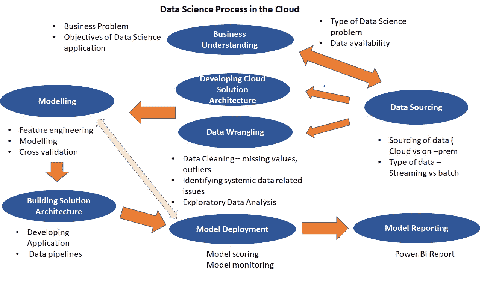

# 云上的机器学习项目——过程中的关键步骤

> 原文：<https://towardsdatascience.com/machine-learning-projects-on-the-cloud-key-steps-in-the-process-d61f67d9d454?source=collection_archive---------21----------------------->

## 在本文中，我着眼于理解当部署在云系统(如 Microsoft Azure 平台)上时，数据科学过程需要如何发展。

照片由[吉井博子](https://unsplash.com/@hiro0718?utm_source=medium&utm_medium=referral)在 [Unsplash](https://unsplash.com?utm_source=medium&utm_medium=referral) 上拍摄

在云上部署 ML 模型肯定不同于在您的系统上使用 Jupyter 笔记本。但是更重要的是理解云系统以及 ML 解决方案是如何部署的。机器学习和数据科学迄今为止的发展方式，我们都非常适应我们的 Jupyter 笔记本工作方式。不幸的是，这不太符合组织中收集、存储和处理数据的方式。随着数据量的增加，在系统上工作变得不可行，越来越多的机器学习项目正在从试点项目模式转向云。许多项目涉及数 Pb 的数据，基于云的解决方案是唯一的答案。此外，大多数大型组织都在投资基于云的数据基础架构。大玩家是 AWS 和微软 Azure。因此，无论您是初级数据科学家还是高级数据科学家，某种基于云的接触都变得至关重要。

在这篇文章中，我将讨论在 Azure 系统中从头开始开发项目的过程。这实际上是熟悉的领域，但并不相同。考虑到云系统很复杂，并且有许多与访问、权限、数据存储类型、ETL、数据处理方式等相关的层，因此需要对该方法进行一些修改。此外，一旦我们将项目转移到云中，它肯定会从我们的“宝贝”变成需要各种其他角色的支持，包括数据工程师和解决方案架构师。一个人有可能扮演这些角色吗？必要时可能会。但是对于大多数组织中 IT 部门的结构来说，这可能是不可能的。

这篇文章具体介绍的是数据科学项目过程的终结以及它是如何发生的。这既包括云上的资源调配(不是屏幕截图的确切过程，但更像是您在存储和计算能力方面的需求)，也包括设置、培训、测试和部署模型的过程。如前所述，我已经将这一点具体化为 Azure，但我确信类似的构造也可以用于 AWS。我也强烈建议浏览一下微软 Azure 关于团队数据科学过程的文档——这里的链接是。

**使用基于云的系统的数据科学流程**

图片作者，灵感来自[https://docs . Microsoft . com/en-us/azure/machine-learning/team-data-science-process/overview](https://docs.microsoft.com/en-us/azure/machine-learning/team-data-science-process/overview)

上图完美地展示了基于云的数据科学流程，在较高的层面上，它看起来类似于传统的数据科学流程。然而，魔鬼真的在细节中。让我们详细看看每一步。

**第一步:业务理解**

这一步处理理解数据科学项目的业务需求。通常，这一步要求我们定义可能使用数据科学解决方案的业务问题。现在，商业问题往往是全球性的大问题。数据科学解决方案可能只是整个业务问题的一小部分。数据科学应用程序可能希望开发可作为业务流程一部分的自动化或应用程序。例如，机器学习引导的自动化可以提高电子邮件的针对性，从而提高打开率，这是通过营销电子邮件吸引客户的更大目标的一部分。因此，明确两者的区别很重要。

一旦确定了与数据科学应用程序相关的特定业务目标，下一步就是确定数据科学问题要解决的问题类型。概括地说，数据科学通常寻求解决 5 种类型的问题:

1.  预测“多少”通常是一个回归类型的问题
2.  将观察结果分类——通常是一个分类问题
3.  识别未知数据集中的组—通常是一个聚类问题
4.  试图评估“这是否奇怪”——这通常是一个异常检测问题
5.  确定应该提供哪些选项—一个推荐问题

一旦确定了数据科学可以帮助解决的关键问题，我们还可以尝试确定目标变量，例如，它可以是业务的关键 KPI。在这个阶段，我们还应该尝试对机器学习算法的“好”的定义。例如，这可以是期望的或使解决方案可接受的精度百分比、MAPE 或 MSE。

讨论如何在生产环境中部署解决方案也很有用，尽管这部分讨论可能是假设性的。在这一阶段，还应讨论如何确定数据来源。还应该对云资源供应进行一些讨论。云的一个问题是，与本地系统不同，云上的虚拟机带有电荷，因此需要充电。一般来说，所有计算、存储和部署应用程序都会有一些相关成本，并且很可能会受到限制。因此，重要的是要注意可能需要展示清楚的商业利益。

通常，步骤 1 由项目章程或范围界定文档签署。这一点非常重要，因为数据科学项目本质上是高度进化的，关于协议和范围的文档非常关键。

**第二步:识别和理解数据源**

***识别***

这一步可能需要最长的时间。大多数组织中的数据杂乱、不完整且难以获得。如果数据在云中，事情实际上会变得更好，因为当数据被摄入云存储时，可能已经经过了某种协调和合理化。然而，云中的数据也意味着它不一定更容易到达。如上所述，需要调配数据以及计算和分析资源。考虑到这一点，如果从“内部”数据仓库中提取一个平面文件，用于在分析师自己的笔记本电脑上进行分析，那么对结果的扫描就不仅仅是扫描了。审查数据源时，最好了解它们是哪种类型:内部还是云。无论是通过流水线还是通过批处理。无论是存储在数据湖还是 SQL 数据库中。

这一阶段的目标是确定高质量的数据，用于实施最初的试点项目，然后开发数据管道，自动刷新数据并对数据进行评分。

***对数据的理解***

数据理解遵循探索性数据分析、数据清理、识别缺失值和异常值以及确定估算它们的最佳方法的标准流程。这个过程通常是迭代的。

一旦审查了数据质量，处理了异常值和缺失值，下一步就是理解数据中的模式以选择合适的分析模型。EDA 的重点应该是:

*   确定是否有足够的数据用于建模
*   识别与目标变量密切相关的变量
*   确定变量之间的模式和相互联系，这些变量可以作为建模的特征工程阶段的先导

**步骤 2a:准备解决方案架构**

这是我们开始偏离本地机器上的方法的第一点。云系统的一个关键特性是所有数据都以各种形式存在，比如数据湖。通过构建自动化的数据管道，可以很容易地将它应用于 ML 应用程序。这有利于使整个端到端过程自动化。与运行在组织服务器或数据科学家的本地机器上的模型不同，该模型可以建立自动化管道，用于数据评分和再培训。

在这一点上，我们需要开始考虑云架构以及如何实现数据流的自动化。这可以通过自动化管道或工作流来完成。该架构将由管道组成，用于:

*   获得新数据
*   基于新数据的再训练模型

通过为耗时且反复的任务(如 EDA、模型训练和验证)开发自动化，可以使这一过程更高级。然而，如果我们处于模型开发阶段的早期，我们可以专注于评分管道。

**第三步:特征工程**

这是开发建模过程的阶段。这通常是一个反复的过程。第一步是执行特征工程以识别用于建模的最佳变量，第二步是执行模型训练。

特征工程是建模步骤中一个复杂而关键的过程。它本质上经常是迭代的。特征工程的一个重要部分是利用领域和业务知识进行 EDA，包括变量和变量转换。一个关键的平衡行为是识别与目标变量密切相关的变量，以及包含太多变量会导致模型中包含噪声。

**第四步:模型训练和验证**

模型训练程序是标准的。如果有足够的数据，我们可以采用“测试-训练”方法。使用基于云的资源进行分析的优势之一是灵活计算资源的可用性。这使得可以一次测试多个模型和超参数调整，并比较结果。要使用的算法取决于:

*   需要回答的业务问题(预测、分类、探索等)
*   数据量和带标签的训练数据的可用性
*   数据场景在准确性方面的要求—衡量模型的整体有效性
*   参数数量-这些参数用于提高模型的拟合度，如误差容差或迭代次数

Azure 等云系统提供 AutoML 等全自动机器学习服务。在训练过程中，Auto ML 创建了许多并行尝试不同算法以及超参数调整的管道。当达到目标退出标准(如准确度百分比)时，它将退出运行。Auto ML 还可以通过投票或堆叠集成方法实现简单的集成建模。它还包括最佳做法，以避免过度拟合使用正则化(L1，L2 和弹性网)。其他最佳实践，如 K 折叠交叉验证，可以使用预构建的模块轻松合并。

Azure ML 的其他优势包括集中式工作区，可以跟踪运行 ML 模型时创建的工件。其中包括所有模型、日志、指标、输出和脚本的历史记录。通过分配用户角色来共享工作场所无疑是云工作的一大优势，通过高效协作的劳动分工使项目进行得更快。

**第五步:部署模型和监控**

***型号部署***

一旦模型被认为符合目的，并被业务部门批准，我们就可以继续以更具可伸缩性的方式部署模型。基于云的系统使得模型部署变得更加容易和快速。模型的部署通常是设置模型的过程，以便它可以使用新数据。在生产期间部署您的 AI 模型时，您需要考虑它将如何进行预测。人工智能模型的两个主要过程是:

> 批量推断:基于一批观察结果进行预测的过程。然后，这些预测将作为文件存储在最终用户或业务应用程序的数据库中。当需要异步处理大量数据时，这很有用。
> 
> 实时(或交互式)推理:模型随时做出预测，并引发即时反应。该模式可用于分析流和交互式应用程序数据。

— *部署期间的机器学习推理*，未注明。

***模式监控***

模型部署的一个重要方面是监控模型，以确保它在技术上是可行的，并且能够生成预测。如果一个组织的应用程序依赖于模型并实时使用它，这是很重要的。其次，监控模型性能以检查它连续生成的预测是否相关是很重要的。

另一个需要注意的重要事项是，当用于定型模型的数据与预测阶段发送给模型的数据之间存在显著差异时，是否会发生数据漂移。造成数据漂移的原因有很多，包括传感器问题、季节性、用户行为变化以及与数据源相关的数据质量问题。云平台通常内置这一功能，以支持带有数据漂移的模型监控。然后，这可以提供一个警告，即模型需要用更相关的数据重新训练。然而，并不是所有情况下都需要模型再训练，所以建议在投入再训练之前调查并理解数据漂移的原因。通常的调查是收集生产数据和培训数据，并对其进行 EDA。

重新训练模型从来都不是一个完全自动化的过程。必须检查模型中非常明显的数据漂移或数据变化——例如，如果模型需要部署到新的区域。最初，组织通常只自动化模型的培训和部署，而不自动化验证、监控和再培训步骤，这些都是手动执行的。

**最终想法**

这是对“新瓶装旧酒”的长期报复，即数据科学过程转移到云，而不是使用服务器和各种笔记本电脑在“内部”进行。很明显，云在可扩展性、协作工作场所、许多关键机器学习算法和过程的预编程模块方面具有显著优势。基于云的方法的缺点是，机器学习项目不能很快进行试点。即使是一个简单的试点项目，也需要安排大量的基础设施。其次，基于云的解决方案也带来了对数据工程师和机器学习工程师等资源的需求。

**参考文献**

本文基于微软关于机器学习、数据科学、AutoML、部署等 Azure 平台的文档。在参考文献列表中，我提到了我参考较多的页面。

1.  *数据科学家团队数据科学流程*。(未注明)。docs.Microsoft.com。2021 年 3 月 31 日检索，来自[https://docs . Microsoft . com/en-us/azure/machine-learning/team-data-science-process/team-data-science-process-for-data-scientists](https://docs.microsoft.com/en-us/azure/machine-learning/team-data-science-process/team-data-science-process-for-data-scientists)
2.  *部署过程中的机器学习推理*。(未注明)。docs.Microsoft.com。2021 年 4 月 2 日检索，来自[https://docs . Microsoft . com/en-us/azure/cloud-adoption-framework/innovate/best-practices/ml-deployment-inference](https://docs.microsoft.com/en-us/azure/cloud-adoption-framework/innovate/best-practices/ml-deployment-inference)
3.  [https://docs . Microsoft . com/en-us/azure/machine-learning/team-data-science-process/概述](https://docs.microsoft.com/en-us/azure/machine-learning/team-data-science-process/overview)
4.  [https://docs.microsoft.com/en-us/azure/machine-learning/](https://docs.microsoft.com/en-us/azure/machine-learning/)