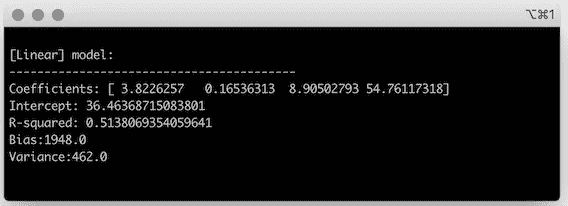

# 现实生活中的机器学习正则化技术

> 原文：<https://towardsdatascience.com/machine-learning-regularization-techniques-in-real-life-your-dogs-nap-time-as-a-regularized-9c533510fe83?source=collection_archive---------26----------------------->

## [实践教程](https://towardsdatascience.com/tagged/hands-on-tutorials)

## 你的狗的午睡时间作为一个正规化的线性模型


作者图片

当你建立一个机器学习模型时，你面临着[偏差-方差权衡](/bias-variance-tradeoff-in-machine-learning-models-a-practical-example-cf02fb95b15d)，你必须在拥有一个模型之间找到平衡:

1.  非常有表现力，能够捕捉数据中的真实模式。
2.  生成与实际值相差不太远的预测，

一个非常有表现力的模型具有较低的偏差，但它也可能过于复杂。而生成的预测与真实值相差不太远的模型方差较低。

# 过度拟合

当模型过于复杂，并试图从训练数据中编码比实际需要更多的模式时，它将开始拾取噪声。因为它已经超出了数据的真实模式，这个模型**过度拟合了**数据。

过度拟合通常发生在当您的训练集很小，小到无法展示数据中的所有细微差别和模式时。由于只有少量的数据可以学习，该模型最终只高度关注它可以在训练集中*看到*的模式。因此，**该模型是不可推广的**，这意味着它不会很好地预测它以前从未*见过的数据的目标。*

> 过度拟合模型也是一种不可概括的模型，因为它经过了微调，可以预测训练集中数据的目标。

这就是正规化的用武之地！您可以使用正则化技术来控制过度拟合，并创建具有高预测准确性的模型，同时尽可能保持模型的简单性。

在实践中，正则化调整系数的值。有些系数最终对模型的贡献可以忽略不计，甚至等于零，您可以放心地在模型中忽略它们。这就是为什么正则化技术也被称为*收缩*技术。

> 正则化技术也被称为*收缩技术，因为它们收缩了系数的值。有些系数可以缩小到零。*

尽管正则化通常用于线性模型，但它也可以应用于[非线性模型](https://www.sciencedirect.com/science/article/abs/pii/S0378375809003528)。

# (狗)打盹的一年

现在你在家的时间越来越多了，你可以看到你的狗睡了多长时间了！

日常生活并没有太大变化，但是你会注意到午睡的持续时间是变化的，这取决于他们做什么或者他们和谁互动。

如果你能预测你的狗明天会睡多久，这不是很有趣吗？

经过一番思考，你可以想到影响你的狗午睡时间的四个主要因素:

*   他们得到了多少次*干的款待*，
*   他们一天有多少*游戏时间*，
*   如果他们看到松鼠潜伏在后院，
*   如果你有包裹送上门。

其中一些活动和互动可能会产生焦虑，其他的只是纯粹的兴奋。总的来说，它们会影响你的狗的能量水平，从而影响它们一天的午睡时间。

既然你想预测你的狗的午睡时间，你开始把它想成一个[多元线性模型](https://en.wikipedia.org/wiki/General_linear_model)。

影响午睡时间的不同因素是自变量，而午睡时间本身是因变量。

在机器学习术语中，自变量是**特性**而因变量，你要预测的，是模型**目标**。


将你的狗的午睡时间建模为多元线性模型。

查看这个小睡持续时间模型， *Beta 0* 是**截距**，当所有特征都等于零时目标采用的值。

剩余的贝塔系数是未知的**系数**，它和截距一起是模型中缺失的部分。您可以观察不同功能组合的结果，但是您不知道每个功能如何影响目标的所有细节。

一旦你确定了每个系数的值，你就知道了方向，正的或负的，以及每个特性对目标的影响的大小。

对于线性模型，您假设所有的特征都是相互独立的，因此，例如，您收到一份快递对您的狗一天得到多少份零食没有任何影响。

此外，您认为特征和目标之间存在线性关系。

所以，在你和你的狗玩得越多的日子里，它们会越来越累，会想睡得更久。或者，在外面没有松鼠的日子里，你的狗不需要睡那么久，因为它们不会花那么多精力保持警惕，留意松鼠的一举一动。

# 你的狗明天要睡多久？

在脑海中有了模型的大致想法后，你收集了几天的数据。现在，您对模型的特征和目标有了真实的观察。


对你的狗午睡期间的特征和目标进行几天的观察。

但是仍然缺少一些关键部分，即系数值和截距。

寻找线性模型系数的最流行的方法之一是[普通最小二乘法](https://en.wikipedia.org/wiki/Ordinary_least_squares)。

普通最小二乘法(OLS)的前提是，你将选择最小化 [**残差平方和**](https://en.wikipedia.org/wiki/Residual_sum_of_squares) 的系数，即你的预测和观测数据之间的总平方差【1】。


对于残差平方和，并不是所有的残差都被同等对待。您希望举例说明模型生成的预测与观察值相差太远的情况。

与其说预测值与观测值相差太远，不如说是误差的大小。你对残差求平方，并惩罚太远的预测，同时确保你只处理正值。

> 对于残差平方和，预测值与观测值相差太多无关，而是与误差的大小有关。

这样，当 RSS 为零时，它实际上意味着预测值和观察值相等，而不仅仅是算术的副产品。

在 python 中，可以使用普通的最小二乘法使用 [ScikitLearn](https://scikit-learn.org/stable/modules/linear_model.html) 来拟合数据的线性模型。

由于您希望使用未经训练的数据来测试模型，因此您希望将原始数据集的一部分放入测试集中。在这种情况下，测试数据集随机留出 20%的原始数据集。

```
import numpy as np
from sklearn.model_selection import train_test_split
from sklearn import linear_model def get_bias(predicted_values, true_values): *""" Calculates model bias
    :param predicted_values: values predicted by the model
    :param true_values: true target values for the data
    :return: integer representing the bias of the model
    """* return np.round(np.mean((predicted_values - true_values) ** 2), 0)def get_variance(values):
    *""" Calculates variance of an array of values
    :param values: array of values
    :return: integer representing the variance of the values
    """* return np.round(np.var(values), 0)def fit_model(features, targets, type='Linear', alpha=0.5):
    *"""
    Fits a linear model or the Lasso and Ridge regularizations.
    :param features: model features
    :param targets: model targets
    :param type: type of model to fit (Linear with OLS, Lasso and Ridge Regularizations)
    :param alpha: regularization penalty
    """* train_features, test_features, train_targets, test_targets =
train_test_split(features, targets, test_size=0.2, random_state=123) if type == 'Lasso':
        model = linear_model.Lasso(alpha=alpha)
    elif type == 'Ridge':
        model = linear_model.Ridge(alpha=alpha)
    elif type == 'Linear':
        model = linear_model.LinearRegression()
    else:
        return None fitted_model = model.fit(train_features, train_targets)
    predictions = fitted_model.predict(test_features)
    print('\n\n[' + type + '] model:')
    print('-----------------------------------------') print('Coefficients: ' + str(fitted_model.coef_))
    print('Intercept: ' + str(fitted_model.intercept_))
    print('R-squared: ' + str(fitted_model.score(train_features, np.array(train_targets).reshape(-1, 1)))) print('Bias:' + str(get_bias(predictions, test_targets)))
    print('Variance:' + str(get_variance(predictions)))features = [[3, 40, 1, 0],
            [1, 60, 0, 0],
            [4, 35, 1, 1],
            [2, 60, 0, 1],
            [0, 0, 1, 0],
            [4, 25, 1, 0],
            [3, 15, 1, 0],
            [1, 15, 1, 1],
            [4, 10, 1, 0]]targets = [120, 24, 95, 135, 48, 105, 75, 80, 30]
fit_model(features, targets)
```

将线性模型拟合到训练集后，可以检查其特征。



系数和截距是定义模型和进行预测所需的最后一部分。输出数组中的系数遵循数据集中要素的顺序，因此您的模型可以写成:


计算一些度量来评估模型的质量也是有用的。

[R 平方](https://en.wikipedia.org/wiki/Coefficient_of_determination)，也称为决定系数，给出了模型在描述训练数据中的模式方面有多好的感觉，其值范围为 0 到 1。它显示了目标中有多少可变性是由特征解释的[1]。

例如，如果你用一个线性模型来拟合数据，但是目标和特征之间没有线性关系，R 平方将非常接近于零。

偏差和方差是有助于平衡模型可能存在的两种误差来源的指标:

*   偏差与训练误差有关，即来自训练集预测的误差。
*   方差与泛化误差有关，即测试集上的预测误差。

这个线性模型具有相对较高的方差。让我们使用正则化来减少方差，同时尽量保持较低的偏差。

# 模型正则化

正则化是一组在以下方面改进线性模型的技术:

*   预测准确性，通过减少模型预测的方差。
*   可解释性，通过*收缩*或将与模型不相关的系数减少到零【2】。

使用普通的最小二乘法，您希望最小化残差平方和(RSS)。


但是，在普通最小二乘法的正则化版本中，您希望*收缩*它的一些系数以减少整体模型方差。你可以通过对剩余平方和进行惩罚来达到这个目的。

在 OLS 的*正则化*版本中，你试图找到最小化的系数:


*收缩损失*是调整参数和回归系数的乘积，因此随着损失的回归系数部分变小，损失也会变小。调谐参数控制剩余平方和*中*收缩损失*的影响。*

*收缩损失*永远不会应用于β0(截距),因为您只想控制系数对特征的影响，而截距没有与之关联的特征。如果所有特征的系数都为零，则目标值将等于截距值。

有两种不同的正则化技术可应用于 OLS:

*   岭回归，
*   套索。

# 里脊回归

岭回归使系数的平方和最小化。

它也被称为 L2 范数，因为随着调谐参数*λ*的增加，最小二乘系数向量的范数将总是减小。


即使它以相同的比例收缩每个模型系数，岭回归实际上永远不会将它们收缩到零。

使这种正则化更稳定的方面也是它的缺点之一。您最终减少了模型的方差，但是模型保持了它原来的复杂程度，因为没有一个系数减少到零。

通过运行以下代码，可以用岭回归拟合模型。

```
fit_model(features, targets, type='Ridge')
```

这里的*λ*，即 [scikit 学习方法](https://scikit-learn.org/stable/modules/generated/sklearn.linear_model.Ridge.html#sklearn.linear_model.Ridge)中的 alpha，被任意设置为 0.5，但在下一节中，您将经历调整该参数的过程。

基于岭回归的输出，您的狗的午睡持续时间可以建模为:


查看模型的其他特征，如 R 平方、偏差和方差，您可以看到，与 OLS 的输出相比，所有这些都减少了。


岭回归在*收缩*系数的值时非常有效，因此，模型的方差显著降低。

然而，模型的复杂性和可解释性保持不变。你仍然有四个影响你的狗每天午睡时间的特征。

让我们转向套索，看看它的表现如何。

# 套索

Lasso 是*最小绝对收缩和选择算子*【2】的简称，它最小化系数的绝对值之和。


它非常类似于岭回归，但是它使用 L1 范数作为*收缩惩罚*的一部分，而不是 L2 范数。这就是为什么 Lasso 也被称为 L1 正则化。

Lasso 的强大之处在于，它实际上会*将*一些系数缩小到零，从而降低方差和模型复杂性。

Lasso 使用了一种叫做软阈值的技术。它*将每个系数收缩*一个恒定的量，这样，当系数值低于*收缩常数*时，它将减少到零。

同样，使用 0.5 的任意*λ*，您可以将 lasso 拟合到数据。

```
fit_model(features, targets, type='Lasso')
```

在这种情况下，您可以看到功能*松鼠被*从模型中删除，因为它的系数为零。


使用 Lasso，您的狗的午睡持续时间可以描述为具有三个特征的模型:


这里，相对于岭回归的优势在于，你最终得到了一个更易解释的模型，因为它的特征更少。

从可解释性的角度来看，从四个到三个要素并不是什么大事，但是您可以看到这在具有数百个要素的数据集中是多么有用！

# 找到你的最佳λ

到目前为止，你用来看岭回归和套索的方式是完全随意的。但是有一种方法可以微调λ的值，以保证可以降低整体模型的方差。

如果你对一组连续的*λ*值绘制[均方根误差](https://en.wikipedia.org/wiki/Root-mean-square_deviation)，你可以使用 [*肘技术*](https://en.wikipedia.org/wiki/Elbow_method_(clustering)) 找到最优值。


*使用肘技术为套索和岭回归寻找最佳λ值。*

此图强调了岭回归比套索更稳定的事实。可以看到，对于起始值*λ*= 0.01，误差开始非常高，但随后稳定在 2.5 左右。因此，对于岭回归，2.5 的*λ*将是最佳值，因为在此之后误差会略微增加。

至于套索，有更多的变化。放大以获得更多细节，当λ在 0.15 和 0.2 之间时，误差实际上开始变得更糟，然后在λ= 15 左右稳定下来。

以下是如何用 Python 创建这些图。

```
def find_lambda(features, targets, plot_type=''):
    train_features, test_features, train_targets, test_targets = train_test_split(features, targets, test_size=0.2, random_state=123) lambda_array =[]
    rmse_array_lasso = []
    rmse_array_ridge = []
    line_color = ['#021E73', '#F27272'] stop = 20
    step = 0.25 if plot_type == 'zoom':
        stop = 1
        step = 0.01 for lambda_value in np.arange(start=0.01, stop=stop, step=step):
        lambda_array.append(lambda_value)

        model_lasso = linear_model.Lasso(alpha=lambda_value)
        fitted_model_lasso = model_lasso.fit(train_features, train_targets)
        predictions_lasso= fitted_model_lasso.predict(test_features)
        rmse_array_lasso.append(mean_squared_error(test_targets, predictions_lasso, squared=True)) model_ridge = linear_model.Ridge(alpha=lambda_value)
        fitted_model_ridge = model_ridge.fit(train_features, train_targets)
        predictions_ridge= fitted_model_ridge.predict(test_features)
        rmse_array_ridge.append(mean_squared_error(test_targets, predictions_ridge, squared=True)) fig, ax = plt.subplots(figsize=(12, 7)) # removing to and right border
    ax.spines['top'].set_visible(False)
    ax.spines['right'].set_visible(False) # adding major gridlines
    ax.grid(color='grey', linestyle='-', linewidth=0.25, alpha=0.5) # axis labels
    ax.set_xlabel(r'$\lambda$')
    ax.set_ylabel('RMSE') plt.plot(lambda_array, rmse_array_lasso, color=line_color[0], linewidth=3, label='Lasso')
    plt.plot(lambda_array, rmse_array_ridge, color=line_color[1], linewidth=3, label='Ridge')
    plt.legend(loc='upper right') if plot_type == 'zoom':
        ax.xaxis.set_ticks(np.arange(0., 1, 0.05)) plt.savefig('output/lambda_tuning_' + plot_type + '.png')find_lambda(features, targets)
find_lambda(features, targets, plot_type='zoom')
```

我们可以通过再次拟合数据来验证这一点，现在使用了更有针对性的值。

```
fit_model(features, targets, type='Lasso', alpha=0.01)
fit_model(features, targets, type='Lasso', alpha=0.017)
fit_model(features, targets, type='Lasso', alpha=1)
fit_model(features, targets, type='Lasso', alpha=15)fit_model(features, targets, type='Ridge', alpha=0.01)
fit_model(features, targets, type='Ridge', alpha=0.017)
fit_model(features, targets, type='Ridge', alpha=2.5)
fit_model(features, targets, type='Ridge', alpha=15)
```

您可以确认，对于 Lasso，方差首先变得更差，但随后逐渐变好，并稳定在等于 15 的*λ*附近。在这一点上，Lasso 从模型中去掉了*松鼠*，与*λ*的较低值相比，总体方差显著降低。

使用套索，你最终显著减少了方差和偏差。

使用岭回归，模型保持所有特征，并且随着*λ*增加，总体偏差和方差变低。正如您在图表中注意到的，当λ大于 2.5 时，偏差继续降低，但方差实际上变得更差。


# 什么时候用套索 vs 山脊？

选择正则化技术的类型将取决于模型的特征，以及您希望在模型准确性和可解释性方面做出的权衡。

## 当…时使用套索

您的模型中有少量特征突出，即具有高系数，而其余特征的系数可以忽略不计。

在这种情况下，Lasso 将选择主要特征，而*将其他特征的系数缩小到零。*

## 当…时使用岭回归

您的模型有许多特征，并且在模型中具有相对相似的*权重*，即它们的系数值非常相似。

# 结论

根据您正在处理的问题，与方差较低但过于复杂的模型相比，更容易解释的模型可能更有用。归根结底，这就是权衡取舍！

尽管这是一个非常小的数据集，但正则化的影响和有效性是显而易见的:

*   **调整系数和截距**。具体到 Lasso，松鼠的特征*可以从模型中删除，因为它的系数*收缩*到零。*
*   **当你选择最佳的*λ*进行正则化时，与普通的最小二乘法相比，方差确实减少了**。
*   **你可以看到偏差-方差的权衡。*λ*为 15 的岭回归模型，与*λ、*值较低的模型相比，以增加方差为代价，具有较低的偏差。**

希望您喜欢学习正则化如何帮助提高机器学习模型的质量。

*感谢阅读！*

# 参考

[1] Gareth James、Daniela Witten、Trevor Hastie 和 Robert Tibshirani。2014.统计学习介绍:在 R 中的应用。起拱石

2 TiB shirani，R. (1996 年)。通过套索的回归收缩和选择。j .罗亚尔。统计学家。Soc B，58，267–288