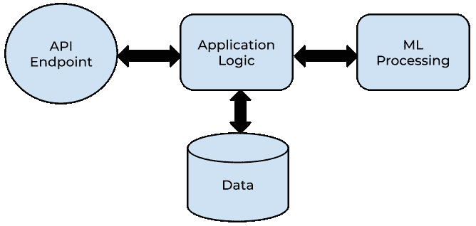
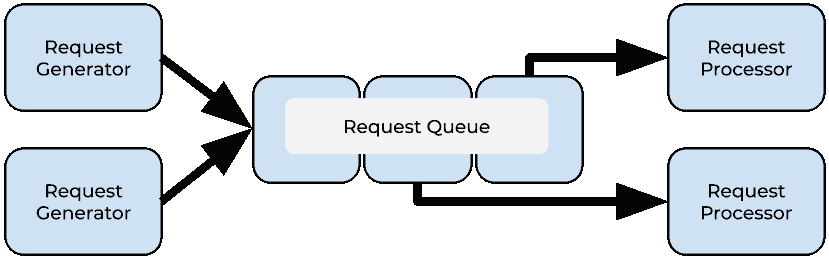

# 每个团队的机器学习扩展选项

> 原文：<https://towardsdatascience.com/machine-learning-scaling-options-for-every-team-5e713d66bf03?source=collection_archive---------42----------------------->

## [行业笔记](https://towardsdatascience.com/tagged/notes-from-industry)

由[卡米尔·皮特扎克](https://unsplash.com/@kpietrzakweb?utm_source=medium&utm_medium=referral)在 [Unsplash](https://unsplash.com?utm_source=medium&utm_medium=referral) 上拍摄的照片

机器学习有无数的应用，但是将机器学习集成到一个软件应用中会面临巨大的挑战！机器学习(ML)算法很复杂，可能需要很大的二进制参数文件，并且计算量很大。此外，随着新的数据和技术变得可用，改进机器学习方法通常是有价值的，这意味着您在应用程序中合并 ML 的方法必须是灵活的。

最重要的是，构建和训练伟大的机器学习算法所需的技能与构建和扩展伟大的软件所需的技能并不相同(尽管存在重叠)。为了获得最好的结果，ML 从业者需要有能力使用各种工具来训练和迭代算法。软件工程师的目标是开发能够轻松部署、有效扩展并产生可靠结果的应用程序。这些要求意味着大规模应用机器学习的团队必须针对几个困难的目标进行优化。

我个人遇到过这个问题的很多方面。当我还是一名在 R&D 团队工作的软件工程师时，我想确保算法在生产中像在笔记本和脚本中一样有效，并且将它们集成到产品中具有成本效益。我想了很多关于自动化测试、API 定义和扩展的问题。作为一名数据科学家，我的重点不仅是训练准确的，而且是可概括的模型，这些模型将告知我们用户的行动，这将是我们的竞争对手难以复制的。现在，我带领团队关注所有这些目标，并了解这两种关注如何增加复杂性，从而可能将某个功能的投资回报从“改变游戏规则的胜利”变为“不值得”。

幸运的是，有几种方法可以将机器学习算法可扩展地集成到应用程序中。深思熟虑的技术选择可以让拥有不同技能组合的团队有可能构建 ML 应用程序。本文将介绍可扩展执行机器学习模型的方法的非穷举列表。

首先，让我们考虑一个示例服务，将即将出现的解决方案放在上下文中。

图片作者。*概念性机器学习服务架构。*

上图显示了应用程序的几个组件之间的信息流。

*   其他应用程序用来触发 ML 处理或检索预测的 API 端点。
*   决定如何处理请求的应用程序逻辑。这可以通过检索缓存的预测或通过生成新的预测来实现。
*   可能包含 ML 算法进行预测或存储最终计算结果所需数据的存储器。
*   ML 处理，包含机器学习算法和一些执行它们的方法。我们将在这里重点讨论这个组件。

所示部件之间的实际连接可以不同于这种布置。例如，应用程序可能依赖于预处理的结果，并且没有为 API 提供交互触发模型处理的路径。

即使实际的 ML 推理足够轻便，可以在与应用程序相同的硬件资源上执行而不会遇到瓶颈，仍然值得考虑机器学习自身的需求，因为有一些独特的选项来服务它们。此外，下面概述的几个选项可以用于各种应用场景。正如我们将看到的，有相当多的方法可以合并 ML 处理组件，其中一些只需要很少的努力！

# 使用其他人的比例模型

最简单的方法就是使用已经可以伸缩的东西！在这种范式中，训练、验证和缩放 ML 算法处理的所有工作已经由他人完成，并且可以作为商品获得。

考虑构建一个全新的通用人工智能解决方案可能很有吸引力，但除非提出一个更好的解决方案是你核心价值主张的一部分，否则你真的能击败购买别人的解决方案的投资回报吗？此外，有才华的数据科学家和高级工程师是否有足够的时间来执行 R&D 并提出扩展解决方案？

在许多领域，高性能的模型很容易作为商品服务获得。例如，所有主要的云提供商都提供图像和语音识别服务。与使用您自己的团队所需的投资相比，您通常可以支付较低的金额来购买一个接近最先进水平并且已经作为可扩展服务提供的解决方案。并非所有领域都有解决方案，但最大的云提供商(AWS、GCP、Azure)共同为许多领域提供基于 API 的机器学习。

为了说明使用预构建解决方案的价值，假设您想要构建一个图像共享应用程序功能来确定图像是否是食品。Amazon Rekognition 可以使用几个与食品相关的标签对图像进行分类，因此您可以使用这样一个标签来解决您的问题。

Rekognition 此时的成本是每 1000 张标记的图像 1.00 美元。一百万张图片需要 1000 美元。因为交互是通过 Amazon 的 API 进行的，所以应用程序的 ML 部分的扩展需求相当少，并且可以通过您选择的任何方式来处理，以扩展应用程序的其余部分。这意味着 ML 特定的开发是最小的。1000 美元可以支付多少小时的数据科学家时间？此外，有多少小时的软件工程时间可以投入到该预算中，以扩展数据科学家提出的任何东西？很有可能，不是很多。更有效地利用这两种技能的方法是评估预构建解决方案的结果和方法如何适合您的应用程序，然后简单地将调用集成到高度可伸缩的预构建 API 中。

# 机器学习即服务

在预建解决方案之后，将机器学习融入产品的下一个最自动化的方法是使用“机器学习即服务”提供商，或者更准确地说是“机器学习工程即服务”提供商。这类解决方案的目标是将机器学习算法从原型到可扩展解决方案的繁重工作最小化。

这些服务通常会提供一个渠道，帮助数据科学家将模型从 R&D 投入生产。例如，[数据块](https://databricks.com/)提供了一个受管理的[多流](https://mlflow.org/)环境。这项服务允许数据科学家训练和验证模型，选择最佳表现者，然后自动部署到 Apache Spark 等处理解决方案或作为可扩展的 API，所有这一切都只需最少的软件工程。

这类解决方案的主要优势是机器学习工程任务的高度自动化，以及数据版本和模型验证等重要数据科学实践的简化实现。与使用预构建的解决方案相比，围绕数据格式和部署的设计选择仍然存在，但与其他解决方案相比，运行机器学习应用程序所需的代码和配置数量减少了。

主要的云提供商都有自己的 MLaaS 版本，但是在这个领域也有替代方案。除了 [DataBricks](https://databricks.com/) 之外，其他付费提供商还有 [H20](https://www.h2o.ai/) 和 [DataRobot](https://www.datarobot.com/) 。在考虑实现从研究到部署的流程之前，寻找一个在您的环境中运行良好的解决方案是值得的。

# 批次毫升

在一些组织中，数据科学、数据工程和机器学习工程之间的界限可能会模糊，因为同一团队服务于所有三种功能。数据工程团队擅长构建定期处理大量数据的系统。

存在成熟、灵活、通用的工具来实现可扩展的批处理。如果应用程序需要定期处理大量的示例，并且机器学习过程不需要事件或交互响应，那么这些工具可以将机器学习过程视为另一种类型的数据转换，并可扩展地生成结果。

对于编排机器学习工作流来说，批处理工具的一个例子是开源的 Apache Airflow。这个 python 框架将代码视为配置，允许开发人员在有向无环图(DAG)中将 Python 操作串在一起。图中的每个节点是一个不同的处理步骤，单个任务的执行通过一个排队系统被外包给自动缩放的处理工人(参见下面的排队处理)。以这种预定方式集成 ML 处理允许与额外的批处理资源集成，例如可能具有高旋转延迟的 Spark 集群。

批处理系统的一个主要组成部分是调度预定义工作流的定期执行的能力，通常具有可用于处理定期更新输入的常见用例的额外功能。然而，像 Airflow 这样的系统也提供事件驱动的功能，通过 REST API 触发工作流。

许多批处理框架存在于气流之外，AWS、GCP 和 Azure 也提供解决方案。作为 alẃays，值得寻找供应商管理的部署，以最大限度地减少运营开销。例如，谷歌通过[云合成器](https://cloud.google.com/composer)提供气流。

# 无服务器 ML

考虑建立一个传统的基于云的 web 服务并扩展它的过程。您需要决定一种方法来管理大量的请求(就像下面的队列处理)，编写 API 代码来为您的服务提供一个接口，并使用正确的代码和部署在其上的依赖项来管理计算实例。

无服务器范例已经出现，它通过允许“功能即服务”来简化所有这些决策换句话说，工程师和数据科学家只需要专注于具体运行处理模型训练或预测的编码函数所需的内容。这仅限于设计 API 接口、实现逻辑和打包依赖项。如果定义了这些基础，无服务器框架就可以提供一个 API 端点，并扩展资源来处理对该端点的请求。通过允许 ML 应用程序开发人员跳过机器学习功能的几个操作化步骤，部署可以更快地进行，并且可以更可靠地实现扩展，而不需要技能和时间来配置更多实践解决方案

也就是说，无服务器框架目前确实存在与机器学习应用特别相关的缺点。由于计算资源是在开发人员几乎无法控制的硬件上动态提供的，因此随着新资源的增加，在处理请求时可能会有滞后时间。此外，无服务器框架往往会限制可以与函数一起打包的依赖项的大小。由于机器学习模型通常依赖于包括数据和模型参数在内的众多依赖项，这可以有意义地减少数据科学家使用的技术数量。最后，无服务器框架可能不支持所有种类的硬件、编程语言或依赖性。所有这些都是多样化和快速发展的机器学习世界中的潜在障碍。

作为限制的具体例子， [AWS Lambda](https://aws.amazon.com/lambda/) 功能层目前被限制为 250MB。这意味着您的全部依赖项必须适合这么大的空间。例如，这就排除了使用最新版本的 [Keras + Tensorflow](https://github.com/antonpaquin/Tensorflow-Lambda-Layer) 的可能性。这也意味着模型参数文件(很容易超过这个大小)将不得不在运行时从其他存储设备(比如 S3)中延迟加载。然而，Lambda 和其他无服务器框架允许使用容器化的应用程序，或者允许配额增加，从而放松了一些限制。

尽管有限制，许多机器学习任务在无服务器框架的范围内工作，所以这种缩放技术值得考虑。

# 排队处理

一种广泛使用的扩展方法是计算集群监听队列中的任务。在这个范例中，处理请求被放在队列中。工作进程轮询作业队列，并在其资源可用时处理它们。这允许一个定制任务处理器池来处理您的 ML 处理作业。

作者图片

正如您所猜测的，这种方法允许机器学习应用程序通过由一群工作人员执行的预测或训练来扩展计算。然而，尽管总吞吐量可能很高，但这种扩展方法有一些缺点。默认情况下，基于队列的系统是异步的。队列通常是一种单向通信机制。如果必须模拟同步行为，这需要使用回调之类的系统来实现。

设计基于队列的系统也不是“包含电池”的解决方案。有各种各样的任务队列实现，但是处理请求、维护队列、监听和处理工作线程请求的系统都必须进行设计和实现。需要考虑集群扩展策略和硬件要求。成功地做到这一切将需要经验丰富的具有系统配置知识的工程师的时间，而这种技能集与设计机器学习解决方案的科学过程相去甚远。此外，任何自我管理的扩展解决方案都不可避免地需要额外的维护，以保持其安全性并能够处理不断变化的工作负载。

值得考虑的是，基于队列的扩展解决方案的哪些组件是现成的，可以最大限度地缩短实施时间。存在几种任务队列解决方案。如果你喜欢 Python，那么芹菜是一个受欢迎的选择。还值得阅读一下您的计算提供商提供了哪些扩展和负载平衡解决方案。容器化非常适合在像 [Google Kubernetes 引擎这样的服务上实现和扩展这些系统。](https://cloud.google.com/kubernetes-engine/)

尽管有前期工作，但优势仍然是可以配置基于队列的系统来满足大多数处理需求。上面列出的许多方法最终都是对排队系统的抽象。需要一个 GPU worker 节点，在内存中存储数千兆字节的深度学习模型，并使用您最喜欢的语言的最新库？如果您有这方面的知识，您可以使用基于队列的集群来管理负载。

# 浏览器中的 ML

到目前为止，所有讨论的解决方案都集中在运行机器学习模型的后端方法上。在浏览器中，机器学习也是一种选择。谷歌大脑神经网络库 Tensorflow 现在有了一个 [Javascript 版本](https://www.tensorflow.org/js)。这意味着神经网络可以在用户的设备上进行训练和预测，熟悉前端技术的工程师可以参与构建系统。

这种方法的一个明显优势是后端计算资源不再是瓶颈。此外，推断可以在没有任何网络往返的情况下发生。然而，这意味着模型设计现在必须注意终端用户计算机上的计算资源。此外，虽然可以序列化存储的模型参数以便在用户的浏览器中使用，但这实际上将模型的大小限制在不会使用户的网络连接和硬件负担过重的范围内。

最后，据我所知，目前为止唯一的 Javascript 机器学习库是 Tensorflow.js。尽管神经网络很强大，但它们仍然可能不适合 ML 从业者能想到的每一项任务，这限制了应用。如果神经网络不是你所需要的，但 browserside ML 似乎仍然是一个很好的想法，有一些数学库可以简化开发，如 [numeric](http://www.numericjs.com/) 和 [numbers.js](https://github.com/sjkaliski/numbers.js/) 。

# 如何选择

很明显，管理你的机器学习需求是有选择的。然而，没有一个单一的解决方案可以满足所有情况。我试图以或多或少增加的复杂性来呈现选择，从集成现有的扩展解决方案开始，一直到实现定制的队列基础扩展。这是我在选择如何将 ML 整合到产品后端时会考虑的层次。运行客户端模型也是一个有趣的新选择。

要在选项中进行选择，请考虑您的用例。你的应用需要用户与机器学习的交互吗？如果是这样，批处理机器学习可能不起作用，但扩展另一个选项以获得可接受的响应时间或在浏览器中使用机器学习可能是一个好的选择。

还要考虑你的时间线和团队。由外部提供商管理的解决方案越多，开始看到好处所需的工作和技能就越少，将它应用到您的应用程序中所需的专业知识也就越少。例如，大多数数据科学家和开发人员应该能够调用现有的 REST API 来运行分析。另一方面，建立基于队列的 ML 处理工作流需要架构、系统部署、软件开发技能以及数据科学！