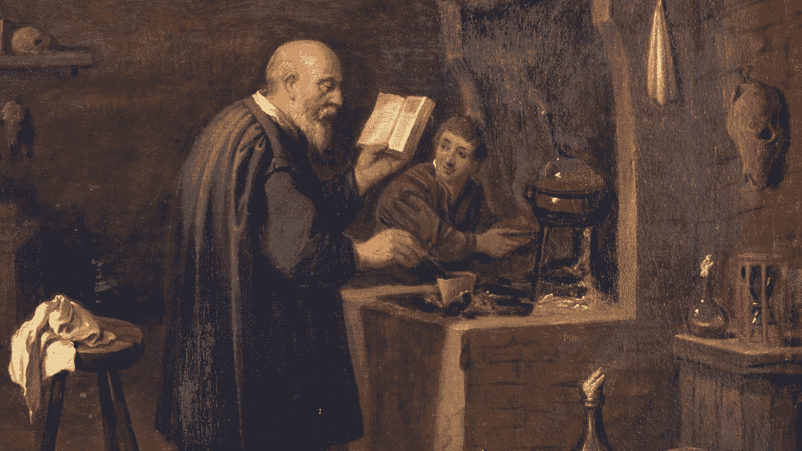
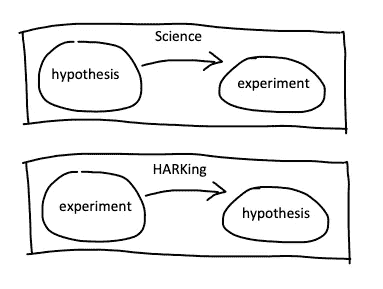
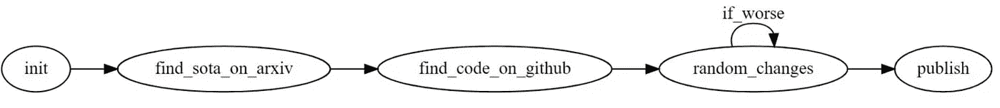

# 机器学习:科学还是炼金术？

> 原文：<https://towardsdatascience.com/machine-learning-science-or-alchemy-655bea25b227?source=collection_archive---------23----------------------->

## 经验领域的科学严谨性始于假设

图片来源:[科学史研究所](https://www.sciencehistory.org/distillations/the-secrets-of-alchemy)

人们越来越担心机器学习研究的科学严谨性。在 2017 年在 NIPS 大会上的一次[演讲](http://www.argmin.net/2017/12/05/kitchen-sinks/)中，当时在谷歌人工智能的阿里·拉希米和本·雷希特认为，人工智能已经成为炼金术，指的是实践者使用的方法在实践中效果很好，但在理论层面上却很少被理解。同样，著名的 Keras 深度学习图书馆的作者 Francois Chollet 将今天的 ML 从业者比作“[货物邪教](https://www.sciencemag.org/news/2018/05/ai-researchers-allege-machine-learning-alchemy)”，在那里人们依靠“民间传说和魔咒”。

炼金术，货物崇拜，魔法咒语。这是一个值得注意的批评，因为这个领域发展如此迅速，在现实世界中的应用越来越广泛。正是这种广泛的使用让拉希米和雷希特担心:

> “如果你正在建立照片共享服务，炼金术是好的。但是我们现在正在建立管理医疗保健和我们参与公民辩论的系统。我希望生活在一个系统建立在严谨、可靠、可验证的知识之上，而不是建立在炼金术之上的世界里。”

ML 是一个经验领域:我们根本没有一个理论来解释为什么某些方法有效而其他方法无效，甚至不清楚这样的理论是否会存在。但理论本身的缺失其实并不是主要问题。即使在一个实证研究领域，也可以通过科学严谨的方式取得进展。

我认为，科学和炼金术之间的关键区别始于从业者赋予科学假说的角色。

## 先假设

ML 从业者面临着巨大的复杂性，从数据集采样和清理到特征工程，再到模型选择和超参数调整。通常在测试集上，修补这些组件，看看什么效果最好，已经成为一种规范。

但是仅仅修补并不能成为一门科学。最根本的区别是科学假设的作用:科学家首先制定一个假设，然后设计一个实验来检验这个假设。这个假设要么被拒绝，要么被接受，不管怎样，我们都产生了新的知识。科学方法对实验结果是不可知的。

另一方面，修修补补不是由假设驱动的，更多的是由‘直觉’驱动的。如果目标仅仅是探索一种现象，这是可以的。但是当修补被伪装成科学，被倾听，也就是在结果已知后制定一个符合结果的假设时，事情就变得危险了。

听是误导，因为它不仅愚弄了研究者，也愚弄了整个社区。在最糟糕的情况下，研究人员可能会用一种算法的不同变体进行大量实验，选择实现预期结果的版本，这在实践中意味着它击败了最新的最先进的基准，并应用 HARKing 来证明这一选择。这也就是俗称的 **SOTA 黑客**。

当然，运行的随机实验越多，就越有可能只是偶然地击败任何给定的基准:这也被称为[看向别处效应](/the-statistics-of-the-improbable-cec9a754e0ff)。更糟糕的是，SOTA 黑客行为占用了本可用于实际创新的资源。脸书工程师 Mark Saroufim 在 [*《机器学习:大停滞》*](https://marksaroufim.substack.com/p/machine-learning-the-great-stagnation) 中写道:

> 随着国家艺术(SOTA)的追逐，我们奖励和赞扬增量研究人员作为创新者，增加他们的预算，以便他们可以做更多的增量研究平行于尽可能多的员工或研究生向他们报告。

SOTA 黑客(来源:[马克·萨鲁菲姆](https://marksaroufim.substack.com/p/machine-learning-the-great-stagnation)

在进行实验之前，制定一个科学假设*是抵御哈金和 SOTA 黑客攻击的最佳保护机制。在他们的论文'[*HARK side of Deep Learning*](https://arxiv.org/abs/1904.07633)'中，数据科学家 Oguzhan Gencoglu 和他的同事甚至倡导一种“结果盲”的 ML 研究论文提交流程:让科学家提交他们的科学假设和实验设计。接受后，他们可以继续进行实验，条件是他们必须公布结果，不管结果是证实了还是排除了假设。这是一个激烈的、不切实际的、可能不切实际的解决方案，但它肯定会消除 SOTA 黑客攻击。*

## ML 能从物理学中学到什么

随着 ML 研究的发展，我相信它可以从借鉴物理学中获益。物理学的一个基本思想是考虑一个小的**玩具问题**，它更容易解决，并且可以在更大、更复杂的问题的背景下给出有价值的见解。

这并不是说这些物理学风格的实验没有被做，但它们是少数。在 NLP 的背景下，值得注意的例子是揭示著名的 BERT 语言模型对[转喻](https://aclanthology.org/2020.coling-main.602.pdf)、[多义词](https://aclanthology.org/2020.blackboxnlp-1.15.pdf)，或者简单地[输入序列的顺序](https://arxiv.org/abs/2012.15180)的敏感性的研究。例如，后一项研究发现，当在 GLUE benchmark 任务上训练时，BERT 对词序相对鲁棒，这表明大部分信号不是来自上下文，而是来自其他线索，如关键词。

除了玩具问题之外，另一个强大的实证方法是**消融研究**，这是一种故意一次忽略解决方案的一个组成部分，以区分关键部分和没有实际影响的“华而不实”的做法。在 NLP 的背景下，一个很好的例子是众所周知的 2017 年论文' [*注意力是你所需要的全部*](https://arxiv.org/abs/1706.03762) '，该论文表明，在存在注意力机制的情况下，语言模型中的递归变得多余。另一个很好的例子是 2017 年关于文本预处理在神经网络架构中的作用的论文'[*'*](https://arxiv.org/abs/1707.01780)'，该论文表明，除了小写，常见的文本预处理技术(文本清理、词干化、词条化)在下游 ML 模型性能方面没有提供可测量的改进。

## 从炼金术到科学

今天的许多 ML 实践感觉像炼金术，但是，正如在我简要提到的例子中，即使在没有理论的情况下，也可以进行某些实验来更深入地了解 ML 的内部工作，并将该领域置于更严格的科学基础上。特别是，以下是我对 ML 从业者的三点建议:

*   在任何实验之前，明确你的假设。避免哈克和 SOTA 黑客的诱惑。
*   要有创造性:想一些特殊的**玩具问题**，这些问题可以证实或者排除一个已经在社区内提出的假设(含蓄地或者明确地)。
*   使用**消融研究**来识别关键部分，并消除您的 ML 解决方案中的“花里胡哨”。

最后，我的希望是，随着 ML 研究的发展，它将从目前关注的打破性能基准转向更基本的理解。科学毕竟是追求知识，而不是取胜。我同意(并结束)Rahimi 和 Recht 的观点，他们写道:

> 想想你在过去的一年里做了多少实验来破解一个体育数据集，或者看看一项技术是否会给你带来提升。现在想想你所做的实验，这些实验帮助你为你观察到的一个令人困惑的现象找到一个解释。我们做了很多前者。我们可以更多地使用后者。