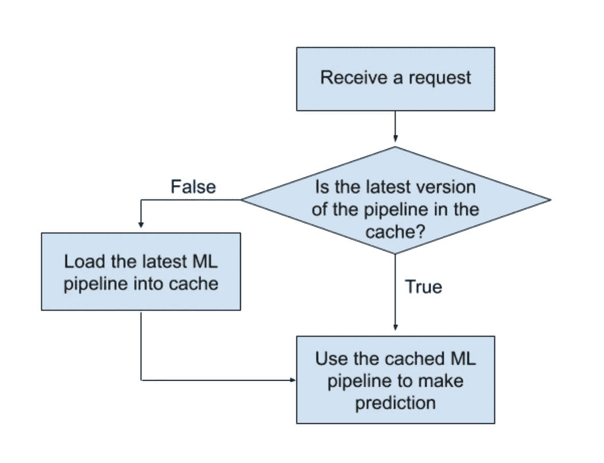

# 用于实时预测的机器学习服务

> 原文：<https://towardsdatascience.com/machine-learning-service-for-real-time-prediction-9f18d585a5e0?source=collection_archive---------6----------------------->

## 使用 FastAPI 为实时预测构建生产就绪的机器学习服务

在 [Unsplash](https://unsplash.com/?utm_source=unsplash&utm_medium=referral&utm_content=creditCopyText) 上由 [Aron 视觉](https://unsplash.com/@aronvisuals?utm_source=unsplash&utm_medium=referral&utm_content=creditCopyText)拍摄的照片

# 目录:

1.  [简介](#6e40)
2.  [机器学习模型](#97d6)
3.  [REST API](#f15f)
4.  [预测终点](#a204)
5.  [本地开发与生产](#66b0)

# 1.介绍

在生产环境中使用机器学习(ML)模型有多种模式，如离线、实时和流式。在本文中，我们将详细了解如何使用 ML 模型进行在线预测。

你可以找到十几篇关于“如何为 ML 构建 REST API”的文章。问题是几乎所有的都把这个话题描述的很肤浅。在本文中，我们将仔细研究本地环境和生产环境之间的区别，如何在不重新部署的情况下更新模型，以及安全性问题。

对于实时预测，通常使用 REST API，这种服务根据需要进行预测，通常通过 HTTP 调用[ [1](https://en.wikipedia.org/wiki/Representational_state_transfer) ]进行。为了构建 REST 服务，我们将使用 FastAPI 框架。FastAPI 是一个现代的、高性能的、内置电池的 Python web 框架，非常适合构建 RESTful APIs。它可以处理同步和异步请求，并内置了对数据验证、JSON 序列化[ [2](https://fastapi.tiangolo.com/) ]的支持。

整个项目是有文档记录的，可以在 GitHub 上的[**DanilBaibak/real-time-ml-prediction**](https://github.com/DanilBaibak/real-time-ml-prediction)资源库中找到。您可以随意使用它，并直接研究代码。

# 2.机器学习模型

在开始讨论 REST API 之前，我们需要一个 ML 模型。在本文中，我们将使用 sklearn 数据集[ [3](https://scikit-learn.org/stable/datasets/toy_dataset.html#boston-house-prices-dataset) ]中的波士顿房价数据集。它包含 506 个实例和 13 个数字和分类特征。我们需要解决一个回归问题——根据房产预测房价。

ML 管道将是非常标准的:

*   数字特征将使用[标准缩放器](https://scikit-learn.org/stable/modules/generated/sklearn.preprocessing.StandardScaler.html)进行缩放；
*   分类特征将使用 [OneHotEncoder](https://scikit-learn.org/stable/modules/generated/sklearn.preprocessing.OneHotEncoder.html) 进行编码；

我们将使用岭回归[ [4](https://scikit-learn.org/stable/modules/generated/sklearn.linear_model.Ridge.html) ]作为我们的 ML 模型。重要注意事项—记住修复随机状态，以便能够重现您的结果。

现在，如果我们开始讨论一个真正的应用程序，我们仅仅训练模型并将其保存在文件夹中是不够的。我们还需要:

1.  跟踪模型的版本。理想情况下，我们需要在数据库中有一个模型训练历史。
2.  在每次训练之后保存模型元数据也是一个很好的实践。从长远来看，这些信息可以让您有机会看到模型生命周期中的一些关键点。我们已经在另一篇文章中讨论了监控模型元数据的想法。[ [5](/machine-learning-in-production-using-apache-airflow-91d25a4d8152#ba74) ]

# 3.REST API

一旦你准备了一个 ML 模型，你就可以开始构建服务了。如前所述，我们将使用 FastAPI 框架构建一个 REST API。

## 3.1 项目结构

*   *server.py* 文件是 REST API 服务的入口点。
*   我们将把 ML 工件保存在 *ml_pipelines* 文件夹中。
*   *models* 文件夹用于存储 Pydantic 模式。它定义了验证某些数据的属性和类型[ [6](https://pydantic-docs.helpmanual.io/usage/models/) ]。
*   脚本 *scripts/train.py* 训练 ML 模型。

## 3.2 API 端点

通常，ML REST 服务有一个端点:“*发布/预测*”。它接收一个项目的特性列表，并返回一个预测。我们将进一步更详细地研究这个方法。

一个更有用的端点可以是:" *GET /health* "。这背后的想法来自微服务的最佳实践——快速返回服务的运行状态，并指示其连接到下游依赖项的能力[ [7](https://www.ibm.com/garage/method/practices/manage/health-check-apis/) ]。作为运行状况检查输出的一部分，模型版本可能是有用的信息:

*   检查 ML 管线的最新版本是否存在；
*   如果您的团队中有 QA 工程师，他们可以通过模型版本的链接来报告问题；

# 4.预测终点

现在我们来看主要部分——预测终点。通用算法非常简单，您可以在许多文章中找到它:

1.  接收请求；
2.  加载模型；
3.  做一个预测；
4.  发送响应；

这种方法能否奏效取决于交通流量。让我们看看如何改进它。

## 4.1 模型缓存

REST 服务的一个重要需求是延迟。为每个请求加载模型非常耗时。我们可以引入一个本地缓存——这允许我们一次性加载模型。下一个请求将使用缓存的模型。这将加快响应时间。

## 4.2 加载模型的新版本

对于生产应用程序，我们需要在某个时候重新训练 ML 管道。理想情况下，它应该自动发生。您设置了一个 cron 作业来训练您的模型。然后 REST 服务一准备好就加载最新的 ML 管道。

我们已经准备了一个单独的表来存储 ML 管道版本和本地缓存——这应该足以实现模型最新版本的加载逻辑。我们需要通过以下方式更新预测端点:

一旦新的 ML 管道被训练、存储并且最新版本被保存在数据库中，API 将使用最新的模型。如果你有多个带有负载均衡器[ [8](https://en.wikipedia.org/wiki/Load_balancing_(computing)) ]的服务，这种方法也可以。

## 4.3 存储预测

就生产 ML 应用而言，仅仅做出预测是不够的。两个重要的问题仍然存在:

1.  你将如何跟踪预测的质量？
2.  你是如何组织未来模特训练的数据收集的？

要回答这两个问题，您需要开始存储预测。但是，如果我们只是添加逻辑来保存每个请求的预测，这将影响延迟。FastAPI 将帮助我们解决这个问题。FastAPI 最令人兴奋的特性之一是，它使用 Python *async/await* 关键字[ [9](https://fastapi.tiangolo.com/async/) ]支持开箱即用的异步代码。

我们需要将 *async* 关键字添加到将数据保存到 DB 和终结点函数的函数中。然后在将预测保存到 DB 时添加*等待*关键字。现在，我们可以在不影响延迟的情况下存储历史数据。

预测端点的最终版本如下所示:

# 5.地方发展与生产

为了将我们的服务部署到生产中，我们需要将代码归档。理论上，我们需要根据文档[ [10](https://fastapi.tiangolo.com/deployment/docker/) ]在 Docker 中包装我们的应用程序，我们就完成了。但仍有几个要点需要注意。

## 5.1 地方发展

即使在部署之后，您仍然需要继续进行项目。大家还记得，我们使用数据库来存储 ML 管道的版本和预测。我们将使用 Docker Compose 来设置数据库并应用迁移。

对于本地开发，我们还将在调试模式下使用 FastAPI 每次更改代码时，服务器都将自动重新启动。为此，我们需要以稍微不同的方式启动应用程序。

请注意，我们使用单独的 Dockerfile。您还可以有一个单独的 *requirements.txt* 文件用于本地开发。这让您有一个动手的工作环境，而不是超负荷的生产码头工人形象。

## 5.2 API 文档

FastAPI 提供了一个现成的 API 文档引擎。如果您访问 *http://localhost/docs* ，您将看到自动交互 API 文档(由 swag UI 提供)【 [11](https://fastapi.tiangolo.com/#interactive-api-docs) 。这对于本地或分段环境非常有用。但是，根据您的项目，您可能不希望在生产中有一个开放的文档终结点。很容易实现:

更改文档的默认 URL 也是一个好主意。

## 5.3 安全要求

我想再一次提醒大家，对于本地或分段环境有用的信息在生产中可能是危险的。如果我们回到运行状况检查端点，显示模型版本对于 bug 跟踪会非常有帮助，但对于生产而言是不可接受的。根据项目的不同，您可能更喜欢隐藏此信息。

# 摘要

1.  延迟是 REST 服务的重要要求之一。缓存 ML 管道并尽可能使用异步代码。
2.  ML 管道版本的适当组织的存储是在不重新部署的情况下组织管道更新的关键。
3.  将 ML 管道的版本显示为运行状况检查终结点的一部分对于开发期间的错误跟踪非常有用。
4.  构建安全的应用程序！阻止访问敏感信息。
5.  使用 *docker-compose* ，一个单独的*Docker 文件*甚至一个单独的 *requirements.txt* 文件允许动手进行本地开发，而不会使生产 *Docker* 映像过载。

您可以在资源库[**DanilBaibak/real-time-ml-prediction**](https://github.com/DanilBaibak/real-time-ml-prediction)**中找到完整的项目，以及如何设置和使用它的说明。**

# **参考资料:**

1.  **[表象状态转移](https://en.wikipedia.org/wiki/Representational_state_transfer)**
2.  **[FastAPI](https://fastapi.tiangolo.com/)**
3.  **[波士顿房价数据集](https://scikit-learn.org/stable/datasets/toy_dataset.html#boston-house-prices-dataset)**
4.  **[sklearn.linear_model。山脊](https://scikit-learn.org/stable/modules/generated/sklearn.linear_model.Ridge.html)**
5.  **[在生产中使用 Apache Airflow 进行机器学习](/machine-learning-in-production-using-apache-airflow-91d25a4d8152#ba74)**
6.  **[肥胖模型](https://pydantic-docs.helpmanual.io/usage/models/)**
7.  **[为微服务实现健康检查 API](https://www.ibm.com/garage/method/practices/manage/health-check-apis/)**
8.  **[负载均衡](https://en.wikipedia.org/wiki/Load_balancing_(computing))**
9.  **[并发和异步/等待](https://fastapi.tiangolo.com/async/)**
10.  **[使用 Docker 部署 FastAPI】](https://fastapi.tiangolo.com/deployment/docker/)**
11.  **[FastAPI 交互 API 文档](https://fastapi.tiangolo.com/#interactive-api-docs)**