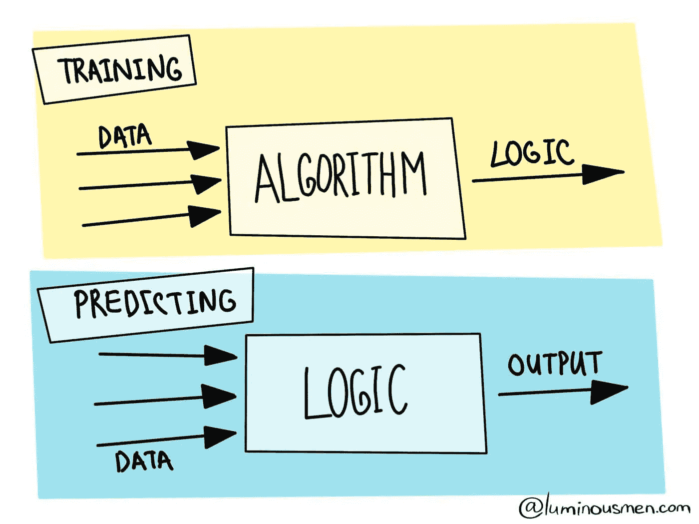
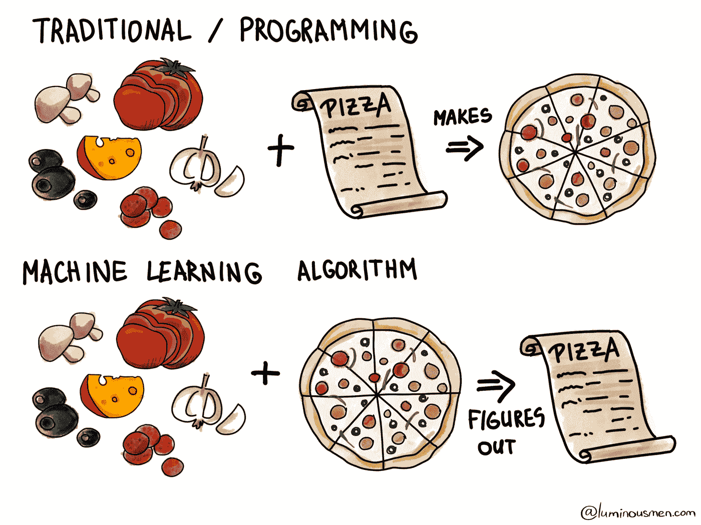

# 机器学习——简化定义

> 原文：<https://towardsdatascience.com/machine-learning-simplified-definition-4bdaa21a2b42?source=collection_archive---------28----------------------->

## 机器学习不仅仅是美化了的统计学

作者图片

> 人们担心计算机会变得太聪明并接管世界，但真正的问题是它们太笨了，它们已经接管了世界。佩德罗·多明戈斯

感觉就像谷歌或脸书每周发布一项新的人工智能技术，以加快或改善用户体验。在本文中，我们将介绍什么是机器学习，以及机器学习的类型。

# 什么是机器学习

机器学习(ML)是一种数据分析方法，允许系统在没有显式编程的情况下进行学习。或者用 Tom Mitchell 的话来说，*“一个计算机程序被认为在某类任务 T 和性能测量 P 方面从经验 E 中学习，如果它在 T 中的任务的性能，如 P 所测量的，随着经验 E 而提高”*。

机器学习基于这样一种想法，即分析系统可以学习使用统计学、线性代数和数值优化来识别模式并在最少人工参与的情况下做出决策。

我喜欢将机器学习视为一种编写程序的方式，其业务逻辑是从输入数据中生成的。我们向算法提供数据，程序执行的结果将成为处理新数据的逻辑。这是一种新的编写软件的方式，与传统的开发过程有所不同。

# 直觉理解

为了更好地说明这一点，让我们转到更熟悉的准备晚餐的动作。让我们想象一下，我们想做一个意大利香肠比萨饼。披萨……终极的开放式三明治。

我们有配料和食谱——这些将是我们的投入。我们按照食谱，按照正确的步骤，我们最终得到了一个即食比萨饼。*这是传统的编程。为了得到正确的结果，我们需要配方。我们可以自己写，也可以让妈妈给我们写。*

作者图片

有了机器学习，就有点不同了——我们不知道食谱，我们不想写或者不知道，但我们仍然想要披萨。我们有一堆配料和一些比萨饼的概念。当然，在我们的例子中，这是棒约翰的广告——以奶酪和意大利香肠为主题的史诗般的硬皮披萨。Yammy。我们不知道如何制作，但我们可以邀请我们的朋友过来，从他们的反馈中看到我们制作的披萨接近我们想要的那种披萨，甚至可能是美味的披萨！

一些愤怒的评论之后，我们意识到上面的面团不是真正的披萨。当我们在几个月甚至几年的时间里继续分析比萨饼的“标准”以确定哪些因素影响了最终产品的外观、味道和质量时。在某种程度上，我们最终理解了我们的朋友所说的真正的意大利香肠比萨饼。我们把步骤顺序写在食谱上。我们的算法准备好了！

[这不完全是虚构的故事](https://ai.dodopizza.com)

# 输入数据

强调 ML 的数据驱动本质是很重要的。这看起来微不足道，但令人惊讶的是 ML 工程师经常忘记这一点。他们专注于构建一个更好的模型，而不是改进模型所基于的数据。这使得收集代表性数据的任务对于机器学习的成功至关重要。

我们应该根据正确表示模型在真实世界中工作的条件的数据来训练我们的模型。如果我们想识别垃圾邮件，我们需要垃圾邮件的例子。如果我们想预测股票价格，我们需要价格的历史。如果我们想知道用户的兴趣，我们需要用户的点击历史。数据以任何可能的方式收集。有些人手动操作，耗时更长，通常产生的数据更少，但错误也更少。人们确实在寻找好的数据集。大公司有时会披露他们的算法，但很少披露数据。

## 推荐书籍

*   [机器学习设计模式](https://amzn.to/39Fg0RU)
*   [机器学习工程](https://amzn.to/3iyanJq)
*   [百页机器学习书](https://amzn.to/38W66fJ)

**感谢您的阅读！**

有什么问题吗？请在下面留下您的评论，开始精彩的讨论！

查看我的博客或者来打个招呼👋在 [Twitter](https://twitter.com/luminousmen) 或订阅[我的电报频道](https://t.me/iamluminousmen)。规划好自己！